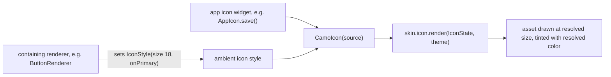
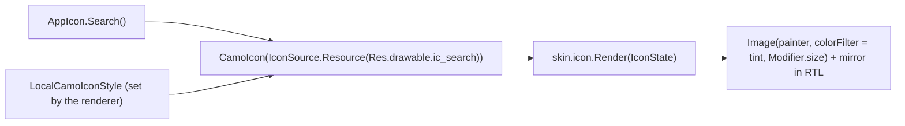
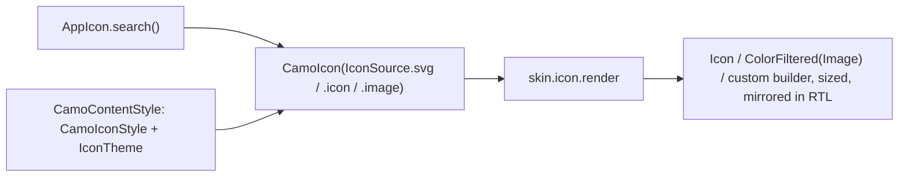

{/* Generated by docs/scripts/sync_vault.py from the Camouflage design notes. Edit the notes and re-run the script; changes made here are overwritten. */}

# CamoIcon

## Concept {#concept}

### 1. Why

Icons are passed into buttons, icon buttons, text fields and top bars **as widgets**. The usual pattern is an app-level icon widget per asset (`AppIcon.search()`), and the containing component decides how big and what color the icon is. `CamoIcon` makes that work: it draws an icon asset and, when the caller doesn't say otherwise, takes its **size and color from the ambient icon style** the surrounding component set. Pass `AppIcon.save()` into a Solid button and it comes out `onPrimary` at the button's icon size, with no parameters.

It also forces a decision on every standalone icon: is it **meaningful** (needs a label) or **decorative** (hidden from screen readers)?

### 2. Shape



**Resolution order** (for size and tint separately):
1. the `CamoIcon` parameter, if given;
2. the ambient `IconStyle` from the nearest component that set one;
3. the provider's root style, from the `icon` component theme (Material default: size 24, color `onSurface`).

**App-level icon widgets** are the recommended way to use icons. Define one per asset, either by wrapping `CamoIcon` or by reading the ambient style yourself:

```kotlin
// pseudocode: one entry per asset in your project
AppIcon.search(size = null, color = null) = CamoIcon(IconSource(asset = "icons/search"), size = size, tint = color)
AppIcon.back(...)   = CamoIcon(IconSource(asset = "icons/back", autoMirror = true), ...)
```

**Material mapping preview:** it draws the vector at the resolved size and tint. See [Material Skin](/guide/skins/material-skin).

### 3. API

#### Contract

```kotlin
fun CamoIcon(
    source: IconSource,                  // the asset
    contentDescription: String? = null,  // null = decorative
    size: Dp? = null,                    // null → ambient IconStyle.size
    tint: Color? = null,                 // null → ambient IconStyle.color
)

data class IconSource(
    val asset: PlatformAsset,            // vector/drawable/SVG/IconData, per platform
    val autoMirror: Boolean = false,     // flip in RTL (back arrow, chevron)
    val original: Boolean = false,       // multicolor asset: never tint
)

data class IconStyle(val size: Dp, val color: Color)   // ambient, set by renderers
```

| Name | What it's for |
|---|---|
| `CamoIcon` | draws one icon asset, following the ambient style |
| `IconSource` | a thin wrapper over the platform asset type, plus mirroring and no-tint flags |
| `IconStyle` | what a containing renderer sets around its icon widgets |
| `Camouflage.iconStyle` | read the current ambient style (for custom icon widgets that don't wrap `CamoIcon`) |

`tint` takes a resolved `Color`, not a role, so an app icon widget can forward its own `color` parameter unchanged. Use `Camouflage.colors.x` to stay on theme.

**State → renderer:** `IconState(source, resolvedSize, resolvedColor, contentDescription)`. **Slots:** none.

#### Tokens used

- `IconStyle` from the context, which the renderers derive from `colors` roles and their own size rules.

#### Component theme

`theme.components.icon: IconTheme?`. Every field is nullable in the theme. The skin's `defaults(theme)` fills whatever isn't set (Material defaults shown). See [Theme](/guide/foundations/theme) §3.10.

| Field | Type | Material default | What it's for |
|---|---|---|---|
| `size` | Dp | 24 | default icon size outside any component (the provider's root icon style) |
| `color` | Color | `colors.onSurface` | default icon color outside any component |

#### Accessibility

- Non-null `contentDescription`: exposed as an image with that label.
- Null: excluded from the semantics tree. This is the right choice for **every icon passed into a component**, because the component carries the label (a button's `text`, an icon button's `contentDescription`).

### 4. Build steps

1. Define `IconSource`, `IconStyle`, and the ambient icon-style key with the provider default (24, `onSurface`).
2. Implement `CamoIcon` in core: resolve size and tint with the order above, apply semantics, call `skin.icon.render`.
3. `DebugSkin` icon renderer: draw the asset at the resolved size and tint.
4. Sample:
   - an `AppIcon` set of three assets;
   - one used standalone with a label;
   - one placed inside a `CamoSurface` where the test sets an ambient style of 32 in `primary`;
   - one multicolor logo with `original = true`.
5. Tests:
   - with no parameters, the icon follows the ambient style;
   - parameters override the ambient style;
   - a decorative icon has no semantics node;
   - `original` ignores the tint;
   - `autoMirror` flips it in RTL only.

**Done when**
- [ ] An app icon widget passed into a container picks up the container's size and color with no parameters.
- [ ] A screen reader reads labelled standalone icons and skips decorative ones.

### 5. Edge cases

| Case | Decided behavior |
|---|---|
| Directional icons in RTL | `IconSource(autoMirror = true)`. The default is false, because most icons (search, settings) must not flip. |
| Font scale 200% | Icons don't scale with text (platform convention). Components grow around their text, not their icons. |
| An app icon widget that ignores the ambient style (hard-coded color) | It draws what it says. That's the app's choice, but it won't follow skins or themes. The recommended wrapper pattern avoids it. |
| A platform-native icon widget (Flutter `Icon`, Compose `Icon`) passed instead of `CamoIcon` | The renderer also sets the platform's own ambient icon theme where one exists (Flutter `IconTheme`), so native icons follow too. Compose's `Icon` reads `LocalContentColor`, which the Kotlin renderer also sets. See the platform notes. |
| Missing or broken asset | Platform behavior (an empty box of `size`). No crash. |
| A multicolor icon | `original = true`, never tinted. |

## Implementation {#implementation}

<KotlinOnly>

### 1. Why {#kotlin-1-why}

`CamoIcon` draws an icon asset at the size and color the surrounding component set, through `LocalCamoIconStyle`. In Kotlin the assets usually come from **Compose Multiplatform Resources** (`Res.drawable.ic_search`, common to every target) or `ImageVector`s. The app wraps each one in its own `AppIcon` composable.

### 2. Shape {#kotlin-2-shape}



### 3. API {#kotlin-3-api}

```kotlin
@Immutable
public sealed interface IconSource {
    public val autoMirror: Boolean
    public val original: Boolean
    public data class Vector(val image: ImageVector, override val autoMirror: Boolean = image.autoMirror,
                             override val original: Boolean = false) : IconSource
    public data class Resource(val drawable: DrawableResource, override val autoMirror: Boolean = false,
                               override val original: Boolean = false) : IconSource
    public data class Paint(val painter: Painter, override val autoMirror: Boolean = false,
                            override val original: Boolean = false) : IconSource
}

@Immutable public data class IconStyle(val size: Dp, val color: Color)          // ambient; also the resolved icon theme
@Immutable public data class IconTheme(val size: Dp? = null, val color: Color? = null) {
    // IconStyle.merge(IconTheme?) keeps non-null overrides
}

@Composable
public fun CamoIcon(
    source: IconSource,
    contentDescription: String?,
    modifier: Modifier = Modifier,
    size: Dp = Dp.Unspecified,             // Unspecified → Camouflage.iconStyle.size
    tint: Color = Color.Unspecified,       // Unspecified → Camouflage.iconStyle.color
)
```

**The `AppIcon` pattern (app side):**

```kotlin
public object AppIcon {
    @Composable fun Search(modifier: Modifier = Modifier, size: Dp = Dp.Unspecified, tint: Color = Color.Unspecified) =
        CamoIcon(IconSource.Resource(Res.drawable.ic_search), contentDescription = null, modifier, size, tint)
    @Composable fun Back(modifier: Modifier = Modifier) =
        CamoIcon(IconSource.Resource(Res.drawable.ic_back, autoMirror = true), contentDescription = null, modifier)
}
// used as a slot:  CamoButton(text = "Search", onClick = …, prefixIcon = { AppIcon.Search() })
```

`contentDescription = null` is the right default for icons passed into components, because the component carries the label.

**Renderer (DebugSkin and Material are the same):**

```kotlin
val painter = when (s) { is Vector -> rememberVectorPainter(s.image); is Resource -> painterResource(s.drawable); is Paint -> s.painter }
val mirror = s.autoMirror && LocalLayoutDirection.current == LayoutDirection.Rtl
Image(painter, contentDescription = state.contentDescription,
      modifier = modifier.size(state.size).graphicsLayer { if (mirror) scaleX = -1f },
      colorFilter = if (s.original) null else ColorFilter.tint(state.color))
```

**Compose's own `Icon`:** renderers also provide `LocalContentColor` where available. But `LocalContentColor` belongs to `material`/`material3`, which core doesn't depend on, so a Material `Icon` placed in a slot keeps its own default color. Use `CamoIcon`-based `AppIcon`s inside Camouflage components.

### 4. Build steps {#kotlin-4-build-steps}

1. `IconSource`, `IconStyle`, `IconTheme` + `merge`.
2. `CamoIcon`: resolve size and tint from `LocalCamoIconStyle`, set `contentDescription` semantics (or `invisibleToUser()` when null), call `skin.icon.Render`.
3. The `IconRenderer` with `defaults(theme) = IconStyle(24.dp, theme.colors.onSurface)`.
4. The sample `AppIcon` object with 5 icons from Compose Resources.
5. `commonTest`: an icon with no params inside `ProvideContentStyle(…, IconStyle(32.dp, Red))` measures 32 dp; a decorative icon has no semantics node; `autoMirror` flips only in RTL.

**Done when**
- [ ] `AppIcon.X()` passed into a container takes the container's size and color with no parameters, on all four platforms.

### 5. Edge cases {#kotlin-5-edge-cases}

| Case | Decided behavior |
|---|---|
| Material `Icon` inside a Camouflage slot | Doesn't follow the icon style, because core has no Material dependency (see above). Documented. Use `CamoIcon`. |
| SVG assets | Compose Resources support Android vector XML on all targets. Convert SVGs to vector XML at import (Android Studio / Valkyrie plugin). |
| `ImageVector.autoMirror` already set | `IconSource.Vector` defaults `autoMirror` to the vector's own flag. |
| Tint on a multicolor logo | `original = true` → no `ColorFilter`. |

</KotlinOnly>

<DartOnly>

### 1. Why {#dart-1-why}

`CamoIcon` draws an icon at the size and color the surrounding component set. This is also the pattern you already use in Flutter: an app-level `AppIcon` widget per asset, which picks up the component's icon theme. Because renderers set **both** Camouflage's icon style **and** Flutter's `IconTheme`, even a plain `Icon(Icons.search)` inside a Camouflage button follows the style. Kotlin can't match that without a Material dependency.

### 2. Shape {#dart-2-shape}



### 3. API {#dart-3-api}

```dart
@immutable
sealed class IconSource {
  const IconSource({this.autoMirror = false, this.original = false});
  final bool autoMirror, original;
  const factory IconSource.icon(IconData data, {bool autoMirror, bool original}) = _GlyphIconSource;
  const factory IconSource.image(ImageProvider provider, {bool autoMirror, bool original}) = _ImageIconSource;
  const factory IconSource.builder(Widget Function(double size, Color? color) build,
      {bool autoMirror, bool original}) = _BuilderIconSource;          // SVG etc. without a core dependency
}

@immutable class CamoIconStyle { const CamoIconStyle({required this.size, required this.color}); /* … */ }
@immutable class CamoIconTheme { const CamoIconTheme({this.size, this.color}); }

class CamoIcon extends StatelessWidget {
  const CamoIcon(this.source, {super.key, this.semanticLabel, this.size, this.color});
  final IconSource source;
  final String? semanticLabel;      // base: contentDescription; null = decorative
  final double? size;               // null → Camouflage.iconStyleOf(context).size
  final Color? color;               // null → Camouflage.iconStyleOf(context).color
}
```

**Your `AppIcon` pattern, as-is:**

```dart
class AppIcon extends StatelessWidget {
  const AppIcon.search({super.key, this.size, this.color}) : _asset = 'assets/icons/search.svg', _mirror = false;
  const AppIcon.back({super.key, this.size, this.color}) : _asset = 'assets/icons/back.svg', _mirror = true;
  final String _asset; final bool _mirror; final double? size; final Color? color;

  @override
  Widget build(BuildContext context) => CamoIcon(
      IconSource.builder((s, c) => SvgPicture.asset(_asset, width: s, height: s,
          colorFilter: c == null ? null : ColorFilter.mode(c, BlendMode.srcIn)), autoMirror: _mirror),
      size: size, color: color);
}
// CamoButton(text: 'Search', onPressed: …, prefixIcon: const AppIcon.search())
```

`flutter_svg` is an **app** dependency, and core stays free of it through `IconSource.builder`.

### 4. Build steps {#dart-4-build-steps}

1. `IconSource` (3 kinds), `CamoIconStyle`, `CamoIconTheme` + merge.
2. `CamoIcon` + `CamoIconRenderer` (defaults: size 24, color `onSurface`). Semantics: `Semantics(label:)` or `ExcludeSemantics`.
3. The example `AppIcon` with SVG assets.
4. Widget tests:
   - inside `CamoContentStyle(iconStyle: 32/red)`, an `AppIcon` renders at 32 in red;
   - a plain `Icon` there also renders at 32 in red;
   - decorative → excluded from semantics;
   - RTL mirrors only `autoMirror` sources.

**Done when**
- [ ] `AppIcon.x()` (SVG), `Icon(Icons.x)` and image icons all follow a container's icon style on all six platforms.

### 5. Edge cases {#dart-5-edge-cases}

| Case | Decided behavior |
|---|---|
| **Native `Icon` follows the style (Flutter only)** | Because `IconTheme` lives in `widgets`. Kotlin's native `Icon` doesn't follow (it's Material-owned). |
| SVG color | `BlendMode.srcIn` tints single-color SVGs. Multicolor SVGs use `original: true`. |
| Icon fonts (`IconData`) and `fontFamily` packages | Work through `IconSource.icon`. Tree-shaking of icon fonts is the app's build concern. |

</DartOnly>
