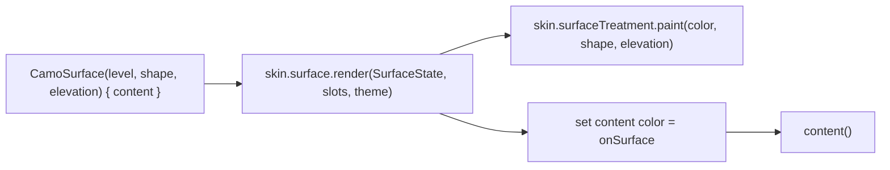
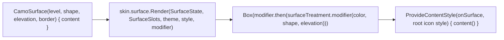
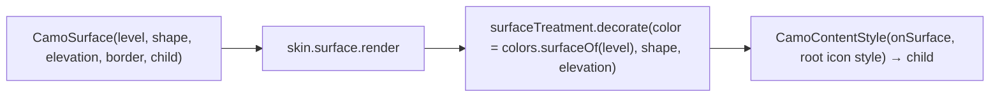

{/* Generated by docs/scripts/sync_vault.py from the Camouflage design notes. Edit the notes and re-run the script; changes made here are overwritten. */}

# CamoSurface

## Concept {#concept}

### 1. Why

`CamoSurface` is the most basic container: a region with a background, a shape and a depth. It is the component through which the skin's **surface treatment** shows up. On the Material skin it's paper with a shadow; on a later glass skin the same call becomes a blurred pane. It also sets the **content color** for everything inside, which is how text on a colored panel stays readable.

### 2. Shape



**Level → colors**

| `SurfaceLevel` | Background | Content color |
|---|---|---|
| `Surface` (default) | `surface` | `onSurface` |
| `Lowest` | `surfaceContainerLowest` | `onSurface` |
| `Low` | `surfaceContainerLow` | `onSurface` |
| `Container` | `surfaceContainer` | `onSurface` |
| `High` | `surfaceContainerHigh` | `onSurface` |
| `Highest` | `surfaceContainerHighest` | `onSurface` |

Levels say how separated a region is from the background: Apple's grouped backgrounds, Fluent's neutral backgrounds 1–6 and Carbon's layers all map onto them (see [Theme](/guide/foundations/theme) §3.3).

**Material mapping preview:** Paper, where elevation is a shadow, and separation comes from the surface level. See [Material Skin](/guide/skins/material-skin).

### 3. API

#### Contract

```kotlin
fun CamoSurface(
    level: SurfaceLevel = Surface,
    shape: ShapeRole = None,
    elevation: ElevationLevel = Level0,
    border: Boolean = false,               // a hairline outline for panels (from SurfaceTheme)
    content: Slot,
)
```

| Parameter | What it's for |
|---|---|
| `level` | which surface role to paint |
| `shape` | corner radius role, and clipping of content to that shape |
| `elevation` | semantic depth. The skin decides how it looks. |
| `border` | draws an outline around the shape: panels separated by a hairline, Minimal's standard look. Cards keep `CamoCard(appearance = Outline)`. |
| `content` | anything |

**State → renderer:** `SurfaceState(level, shape, elevation, border)`. **Slots:** `SurfaceSlots(content)`.

#### Tokens used

- `colors.surface`, the five `surfaceContainer*` roles, and `onSurface`
- `shapes.<shape>`
- `elevation.<level>`
- `colors.outlineVariant` (border)

#### Component theme

`theme.components.surface: SurfaceTheme?`. Every field is nullable in the theme. The skin's `defaults(theme)` fills whatever isn't set.

| Field | Type | Default (Minimal) | What it's for |
|---|---|---|---|
| `borderWidth` | Dp | 1 (one logical px) | the outline when `border = true` |
| `borderColor` | Color | `outlineVariant` | the outline color |

#### Accessibility

- Not focusable, with no role. It's a pure container.
- Its content keeps its own semantics.
- A surface does **not** block touches to content underneath unless the platform requires it (a dialog's scrim is a different component).

### 4. Build steps

1. Implement `CamoSurface` in core: build the state and slots, call `skin.surface.render`.
2. `DebugSkin` surface renderer: a flat colored box, clipped to the shape, that sets the content color.
3. Sample: one surface per level, with a `CamoText` inside each, in light and dark.
4. Test:
   - a `CamoText` inside any level has the color `onSurface`, and each level paints its own role;
   - the content is clipped to the shape;
   - `border = true` draws the outline in `borderColor` and doesn't change the content size;
   - `elevation` is passed through to the surface treatment (check with a spy treatment in the test).

**Done when**
- [ ] Each level paints its role and gives `onSurface` to text inside it.
- [ ] Swapping `DebugSkin` → `MinimalSkin` (in M3) changes the look with no call-site change.

### 5. Edge cases

| Case | Decided behavior |
|---|---|
| Nested surfaces (a `High` inside a `Surface`) | Each sets its own content color. The innermost wins. |
| Colored surfaces (a `primary` or `warning` panel) | Not a surface level. Use `CamoCard(appearance = Soft, tone = Warning)`, which uses the tone's container colors. This keeps `SurfaceLevel` neutral. |
| Elevation on a glass skin (Later) | Glass reads the same `ElevationLevel`. Its treatment decides the blur strength. Callers don't change anything. |
| RTL | No directional content. The shape is symmetric. |
| Shadow clipping by a parent | A platform concern: document padding in the platform note. |

## Implementation {#implementation}

<KotlinOnly>

### 1. Why {#kotlin-1-why}

This is the plain container that shows the skin's surface treatment, and resets the content color and icon style for its content. It's the first place where `SurfaceTreatment.modifier(...)` is used, so it's where Paper (and later Glass) is proven.

### 2. Shape {#kotlin-2-shape}



### 3. API {#kotlin-3-api}

```kotlin
@Composable
public fun CamoSurface(
    modifier: Modifier = Modifier,
    level: SurfaceLevel = SurfaceLevel.Surface,
    shape: ShapeRole = ShapeRole.None,
    elevation: ElevationLevel = ElevationLevel.Level0,
    border: Boolean = false,             // drawn by the renderer with Modifier.border(style.borderWidth, style.borderColor, shape)
    content: @Composable () -> Unit,
)

public fun CamoColors.surfaceOf(level: SurfaceLevel): Color = when (level) {
    SurfaceLevel.Surface -> surface
    SurfaceLevel.Lowest -> surfaceContainerLowest
    SurfaceLevel.Low -> surfaceContainerLow
    SurfaceLevel.Container -> surfaceContainer
    SurfaceLevel.High -> surfaceContainerHigh
    SurfaceLevel.Highest -> surfaceContainerHighest
}
```

`CamoSurface` has no behavior modifier (it isn't interactive), so `modifier` is passed through as given. Its only component theme is `SurfaceTheme` (`borderWidth`, `borderColor`), resolved to `SurfaceStyle`; everything else comes from roles.

**The renderer:**

```kotlin
@Composable override fun Render(state: SurfaceState, slots: SurfaceSlots, theme: CamoTheme, style: SurfaceStyle, modifier: Modifier) {
    val color = theme.colors.surfaceOf(state.level)
    val shape = theme.shapes.of(state.shape)
    Box(modifier
        .then(Camouflage.skin.surfaceTreatment.modifier(color, shape, theme.elevation.of(state.elevation), theme))
        .then(if (state.border) Modifier.border(style.borderWidth, style.borderColor, shape) else Modifier)) {
        ProvideContentStyle(theme.colors.onSurface, IconStyle(24.dp, theme.colors.onSurface)) { slots.content() }
    }
}
```

### 4. Build steps {#kotlin-4-build-steps}

1. `SurfaceLevel` → color mapping, `ShapeRole` → shape, `ElevationLevel` → dp.
2. `CamoSurface` + `SurfaceRenderer` in DebugSkin (flat color, clip).
3. `commonTest`: the background pixel color equals `surfaceOf(level)` (`captureToImage()` on jvm); text inside is `onSurface`; the content is clipped to the shape (a pixel at the corner is transparent).

**Done when**
- [ ] Six surfaces (one per level) render in light and dark.

### 5. Edge cases {#kotlin-5-edge-cases}

| Case | Decided behavior |
|---|---|
| Shadows clipped by a parent | `Modifier.shadow` draws outside the bounds. A parent with `clipToBounds` cuts it. Give the parent padding ≥ the elevation. |
| Shadows on web and iOS | Rendered by Skia on every non-Android target. They look almost the same as Android's `RenderNode` shadows, but not identically. Screenshot tests are per platform. |
| Touches pass through | `Box` doesn't consume pointer events, so content below still receives touches outside the content (the base rule). |

</KotlinOnly>

<DartOnly>

### 1. Why {#dart-1-why}

This is the basic container. It shows the skin's surface treatment and resets the content style for its child. Flutter's version is a thin `StatelessWidget` delegating to the renderer.

### 2. Shape {#dart-2-shape}



### 3. API {#dart-3-api}

```dart
class CamoSurface extends StatelessWidget {
  const CamoSurface({super.key, this.level = SurfaceLevel.surface, this.shape = ShapeRole.none,
                     this.elevation = ElevationLevel.level0, this.border = false, required this.child});
  final bool border;   // the renderer adds Border.all(width: style.borderWidth, color: style.borderColor) to the decoration
}

extension CamoSurfaceColors on CamoColors {
  Color surfaceOf(SurfaceLevel level) => switch (level) {
    SurfaceLevel.surface => surface,
    SurfaceLevel.lowest => surfaceContainerLowest,
    SurfaceLevel.low => surfaceContainerLow,
    SurfaceLevel.container => surfaceContainer,
    SurfaceLevel.high => surfaceContainerHigh,
    SurfaceLevel.highest => surfaceContainerHighest,
  };
}
```

Flutter uses `child` (a single widget) where the base says `content`, following the Flutter convention.

### 4. Build steps {#dart-4-build-steps}

1. The enum → value mappings, `CamoSurface`, `CamoSurfaceRenderer`, and the DebugSkin renderer.
2. Widget tests:
   - `find.byType(ColoredBox)` color equals `surfaceOf(level)`, or golden-check;
   - text inside is `onSurface`;
   - content is clipped (a golden with an overflowing child).

**Done when**
- [ ] Six levels render in light and dark in the example.

### 5. Edge cases {#dart-5-edge-cases}

| Case | Decided behavior |
|---|---|
| Shadows | `PhysicalShape` draws platform-consistent shadows through the engine (Impeller/Skia). Goldens are per platform. |
| Hit testing | `CamoSurface` doesn't absorb gestures (no `GestureDetector`), matching the base rule. |

</DartOnly>
