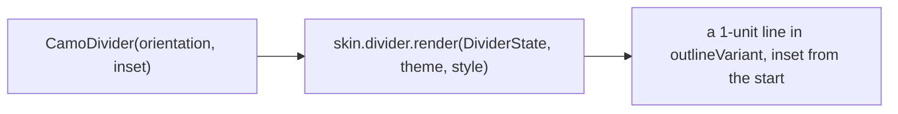
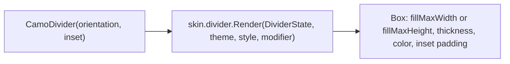
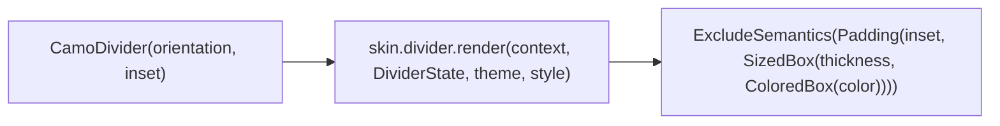

{/* Generated by docs/scripts/sync_vault.py from the Camouflage design notes. Edit the notes and re-run the script; changes made here are overwritten. */}

# CamoDivider

## Concept {#concept}

### 1. Why

A divider separates groups of content in lists, menus, sheets and toolbars. It's the smallest component, but it's still themed: its color, thickness and inset come from tokens, so a brand that wants no dividers (or bold ones) changes one component theme instead of every screen.

### 2. Shape



**Material mapping preview:** M3 Divider: 1 dp, `outlineVariant`. Full-width, inset (start 16), or middle-inset (16 on both sides).

### 3. API

#### Contract

```kotlin
fun CamoDivider(
    orientation: Orientation = Horizontal,   // Horizontal | Vertical
    inset: DividerInset = None,              // None | Start | Middle
)
```

**State → renderer:** `DividerState(orientation, inset)`. **Slots:** none.

#### Tokens used

- `colors.outlineVariant`
- `spacing.l` for insets

#### Component theme

`theme.components.divider: DividerTheme?`. Every field is nullable in the theme. The skin's `defaults(theme)` fills whatever isn't set (Material defaults shown). See [Theme](/guide/foundations/theme) §3.10.

| Field | Type | Material default | What it's for |
|---|---|---|---|
| `thickness` | Dp | 1 | line thickness |
| `color` | Color | `outlineVariant` | line color |
| `startInset` / `endInset` | Dp | 16 / 16 | the space used by `Start` and `Middle` insets |

#### Accessibility

- Decorative: hidden from screen readers. Grouping is conveyed by list sections and headings, not by dividers.

### 4. Build steps

1. `CamoDivider`, `DividerTheme`/`Style`, `DividerRenderer`, and the DebugSkin renderer.
2. Tests: no semantics node; thickness and color come from the style; a `Start` inset mirrors in RTL.

**Done when**
- [ ] Horizontal and vertical dividers with all insets render in the sample, in light and dark.

### 5. Edge cases

| Case | Decided behavior |
|---|---|
| RTL | `Start` inset is on the right. |
| A vertical divider in a row without a fixed height | It takes the row's height (Compose: `IntrinsicSize.Min`; Flutter: `IntrinsicHeight`). The platform note shows how. |
| A brand with no dividers | `DividerTheme(thickness = 0)` or `color = transparent`, set once. |

## Implementation {#implementation}

<KotlinOnly>

### 1. Why {#kotlin-1-why}

The smallest component, and the simplest Kotlin note: a line whose color, thickness and insets come from `DividerTheme`. The only Compose-specific points are drawing it at exactly one logical pixel and keeping it out of the semantics tree.

### 2. Shape {#kotlin-2-shape}



### 3. API {#kotlin-3-api}

```kotlin
@Composable
public fun CamoDivider(
    modifier: Modifier = Modifier,
    orientation: Orientation = Orientation.Horizontal,   // androidx.compose.foundation.gestures.Orientation
    inset: DividerInset = DividerInset.None,             // None | Start | Middle
)

@Immutable public data class DividerState(val orientation: Orientation, val inset: DividerInset)
```

**Rendering (DebugSkin and Minimal):**

```kotlin
@Composable override fun Render(state: DividerState, theme: CamoTheme, style: DividerStyle, modifier: Modifier) {
    val pad = when (state.inset) {
        DividerInset.None -> PaddingValues(0.dp)
        DividerInset.Start -> PaddingValues(start = style.insetStart)
        DividerInset.Middle -> PaddingValues(horizontal = style.insetStart)
    }
    val line = if (state.orientation == Orientation.Horizontal)
        Modifier.fillMaxWidth().height(style.thickness) else Modifier.fillMaxHeight().width(style.thickness)
    Box(modifier.padding(pad).then(line).background(style.color).clearAndSetSemantics {})
}
```

- `style.thickness` is `1.dp`, one logical pixel, which is what the base asks for (not `1.dp / density`, which would vanish on some desktop displays).
- `clearAndSetSemantics {}` keeps the line out of TalkBack/VoiceOver traversal.
- In a `Row` with `IntrinsicSize.Min`, a vertical divider takes the row's height.

### 4. Build steps {#kotlin-4-build-steps}

1. `DividerTheme` / `DividerStyle`, `DividerInset`, `CamoDivider`, the DebugSkin renderer.
2. `commonTest`: the three insets produce the right padding in both layout directions; no semantics node; the vertical divider fills an intrinsic-height row.

**Done when**
- [ ] Horizontal, inset and vertical dividers render with theme colors on every target, and never appear in screen-reader traversal.

### 5. Edge cases {#kotlin-5-edge-cases}

| Case | Decided behavior |
|---|---|
| RTL | `PaddingValues(start = …)` mirrors on its own. |
| Vertical divider in a `Row` without an intrinsic height | It collapses to 0 height (Compose rule). The sample shows `Row(Modifier.height(IntrinsicSize.Min))`. |

</KotlinOnly>

<DartOnly>

### 1. Why {#dart-1-why}

A themed line. In Flutter it's a `SizedBox` with a `ColoredBox`, excluded from semantics. Core imports only `widgets.dart`, so Material's `Divider` isn't used.

### 2. Shape {#dart-2-shape}



### 3. API {#dart-3-api}

```dart
class CamoDivider extends StatelessWidget {
  const CamoDivider({super.key, this.orientation = Axis.horizontal, this.inset = DividerInset.none});
  final Axis orientation;
  final DividerInset inset;          // none | start | middle
}
```

- Horizontal: `SizedBox(height: style.thickness, width: double.infinity)`; vertical: `SizedBox(width: style.thickness, height: double.infinity)` (needs a bounded height, e.g. `IntrinsicHeight` around a `Row`).
- Insets use `EdgeInsetsDirectional.only(start: style.insetStart)` (`middle` adds `end` too), so RTL mirrors.
- `thickness` is `1.0` logical pixel; `CamoDividerTheme` / `CamoDividerStyle` hold thickness, color and inset.

### 4. Build steps {#dart-4-build-steps}

1. Theme/style types, the widget, the DebugSkin renderer.
2. Widget tests: insets in LTR and RTL; no semantics node; the vertical divider in an `IntrinsicHeight` row.

**Done when**
- [ ] Horizontal, inset and vertical dividers render on all six platforms and never appear in semantics.

### 5. Edge cases {#dart-5-edge-cases}

| Case | Decided behavior |
|---|---|
| Vertical divider without a bounded height | Flutter throws an unbounded-height error; the example wraps the row in `IntrinsicHeight`. |

</DartOnly>
