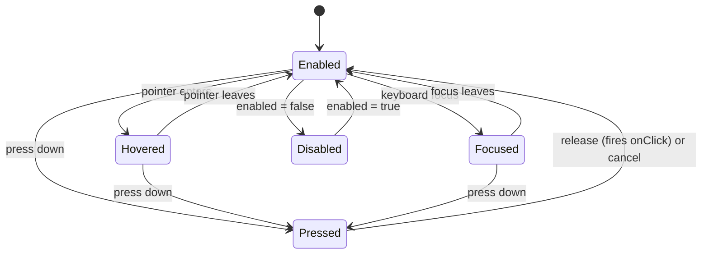
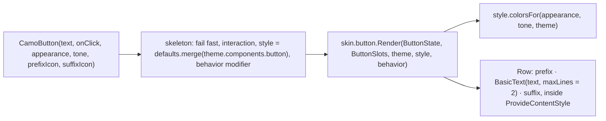
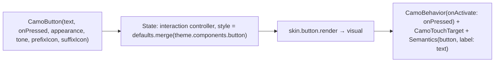

{/* Generated by docs/scripts/sync_vault.py from the Camouflage design notes. Edit the notes and re-run the script; changes made here are overwritten. */}

# CamoButton

## Concept {#concept}

### 1. Why

The button is the component most often rebuilt per project ("our primary button is a pill with a gradient"). It's also the first real test of the whole architecture:
- the **appearance** (solid, soft, raised, outline, ghost, link);
- the **tone** (default, or a status color such as a red destructive action);
- **interaction states** and **press feedback** from the skin;
- the **ambient icon style** that makes a plain `AppIcon.save()` look right inside it.

When `CamoButton` looks right on `MinimalSkin` (the v1 skin) and changes look with only a theme change, M3 ("Hello skin") is done. Appearance and tone are Camouflage's own vocabulary ([Design Language](/guide/foundations/design-language)).

### 2. Shape



`Hovered`, `Focused` and `Pressed` can overlap (focused *and* pressed). That's why they are three booleans in `InteractionState`, not one enum. `Disabled` overrides everything: no feedback and no focus.

**What the renderer does with the inputs**
1. Picks the container, content and border colors from the appearance (visual weight) and the tone (color family).
2. Draws `text` itself, in the button's text style with the content color (underlined for `Link`).
3. Sets the **ambient icon style** (size 18, content color) and places `prefixIcon` before the text and `suffixIcon` after it.

**Appearance → colors** (`f` = the tone's family; for `Default`, strong = `primary` and container = `secondaryContainer`, see [Theme](/guide/foundations/theme) §3.2):

| Appearance | Container | Content | Border | Depth | Material 3 |
|---|---|---|---|---|---|
| `Solid` (default) | `f.strong` | `f.onStrong` | – | – | Filled |
| `Soft` | `f.container` | `f.onContainer` | – | – | Filled tonal |
| `Raised` | `surfaceContainerLow` | `f.strong` | – | `level1` (`level2` on hover) | Elevated |
| `Outline` | transparent | `f.strong` | `outline` (`f.strong` for status tones) | – | Outlined |
| `Ghost` | transparent | `f.strong` | – | – | Text |
| `Link` | transparent, no container padding | `f.strong`, underlined | – | – | (Material has no link button; drawn as underlined text) |

Every appearance works with every tone: `Solid + Error` is the red destructive confirm, and `Outline + Warning` is an amber outlined button. Full Material details: [Material Skin](/guide/skins/material-skin).

### 3. API

#### Contract

```kotlin
fun CamoButton(
    text: String,
    onClick: () -> Unit,
    appearance: Appearance? = null,   // null → ButtonTheme.defaultAppearance (skin default: Solid)
    tone: Tone = Default,             // Error for destructive actions; Success / Warning / Info
    enabled: Boolean = true,
    loading: Boolean = false,         // shows a progress circle, ignores clicks, keeps its width
    prefixIcon: Widget? = null,       // usually an app icon widget, e.g. AppIcon.save()
    suffixIcon: Widget? = null,       // e.g. AppIcon.chevronRight()
)
```

| Parameter | What it's for |
|---|---|
| `text` | the label. It's a value: the renderer draws it with the skin's label style. |
| `onClick` | fired once per completed press (release inside bounds), or on keyboard Enter/Space |
| `appearance` | the visual weight. The usual mapping from action rank: main action → `Solid`, supporting → `Soft` or `Outline`, low-key → `Ghost`, inline navigation → `Link`. |
| `tone` | the color family. `Error` is the destructive action ("Delete account"); a future Cupertino skin maps it to iOS's destructive role. |
| `enabled` | `false` blocks clicks and focus, and shows the disabled look |
| `loading` | `true` shows a small `CamoProgressCircle` in place of the text (the width stays the same), ignores clicks, stays focusable, and is announced as busy. The colors don't change to the disabled look. |
| `prefixIcon`, `suffixIcon` | icon widgets before and after the text (the sides swap in RTL). They take size and color from the ambient icon style the renderer sets. |

`Widget` means the platform's UI unit: a Flutter `Widget`, or a `@Composable () -> Unit` lambda in Compose.

**State → renderer:** `ButtonState(text, enabled, loading, appearance, tone, interaction: InteractionState)`. **Slots:** `ButtonSlots(prefixIcon?, suffixIcon?)`.

#### Tokens used

| Token | Use |
|---|---|
| the tone's family: `strong`, `onStrong`, `container`, `onContainer` | containers and content per appearance |
| `colors.surfaceContainerLow`, `outline` | Raised container, Outline border |
| `colors.onSurface` at the skin's disabled alphas | disabled container and content |
| `elevation.level1` / `level2` | Raised depth |
| `shapes.full` | container shape (skin may choose another role) |
| `typography.labelLarge` | the text |
| `spacing.xl` horizontal (`spacing.l` on a side with an icon), `spacing.s` gap between icon and text | padding (Link: none beyond the touch target) |
| `motion.durationShort` | state-layer transitions |
| icon size 18 | the ambient `IconStyle` for prefix and suffix |

#### Component theme

`theme.components.button: ButtonTheme?`. Every field is nullable in the theme. The skin's `defaults(theme)` fills whatever isn't set (Material defaults shown). See [Theme](/guide/foundations/theme) §3.10.

| Field | Type | Material default | What it's for |
|---|---|---|---|
| `defaultAppearance` | Appearance | `Solid` | the appearance used when a call passes none (ADR-28: a brand's default variant) |
| `height` | Dp | 40 | container height (it grows with text at large font scale) |
| `minWidth` | Dp | 64 | keeps short labels ("OK") from making tiny buttons |
| `shape` | Shape | `shapes.full` | corner radius |
| `padding` | Padding | horizontal 24 | inner padding without icons |
| `paddingWithIcon` | Padding | 24 on the text side, 16 on the icon side | inner padding when a prefix or suffix icon is present |
| `textStyle` | CamoTextStyle | `typography.labelLarge` | the text |
| `iconSize` | Dp | 18 | the ambient icon size for prefix and suffix icons |
| `iconGap` | Dp | `spacing.s` (8) | space between an icon and the text |
| `borderWidth` | Dp | 1 | the Outline border |
| `raisedElevation` | ElevationLevel | `Level1` (hover `Level2`) | the Raised depth |
| `solidColors / softColors / raisedColors / outlineColors / ghostColors / linkColors` | ButtonColors(container, content, border?) | per the table in §2 | colors per appearance for `tone = Default`. Status tones always use their global family. |
| `disabledContainerAlpha / disabledContentAlpha` | Float | 0.12 / 0.38 (of `onSurface`) | disabled look |

**Example:** a Figma design with 48-tall buttons, radius 12, and semi-bold text:
```kotlin
components = CamoComponentThemes(button = ButtonTheme(
    height = 48, shape = RoundedCorner(12),
    textStyle = BrandType.labelLarge.copy(fontWeight = SemiBold), iconSize = 20))
```

#### Accessibility

- Role button, focusable, activated by Enter/Space. `Link` is still a **button** semantically (it performs an action). For navigation to a URL, use a `CamoText` link span instead.
- Minimum touch target 48 × 48, set by the component. A visually smaller button (40 tall, or a Link) gets an invisible touch margin.
- Accessible name = `text`. Prefix and suffix icons are decorative (their labels are ignored).
- Disabled buttons are announced as disabled, not hidden.
- A loading button keeps focus and is announced as busy ("Save, button, busy"). Screen readers get a polite announcement when loading ends only if the app shows a result.
- Visible focus indicator, drawn by the skin's feedback (WCAG 2.4.7).
- `Ghost` and `Link` rely on text color alone to look interactive. Their content color must meet 4.5:1 against the surface (checked by `validate()` through the tone's strong color).

### 4. Build steps

1. Core:
   1. track interaction (pressed/hovered/focused);
   2. build `ButtonState` / `ButtonSlots`;
   3. wrap it in a clickable with role, name, min size and the enabled gate;
   4. call `skin.button.render`.
2. `DebugSkin` button renderer: a box with the text and appearance name, icons placed before and after with a debug icon style, a border when focused, and darker when pressed.
3. Sample:
   - the six appearances × enabled/disabled;
   - `Solid + Error` and `Ghost + Error`;
   - one with `prefixIcon = AppIcon.save()`, and one with `suffixIcon = AppIcon.chevronRight()`;
   - a full-width submit button (the parent sets the width) that shows `loading` while a fake request runs.
4. Tests:
   - `onClick` fires once per tap, and not when disabled or loading;
   - `loading = true` keeps the button's width, shows the progress circle, keeps focus, and exposes busy semantics;
   - keyboard Enter activates it;
   - the semantics are role button with name = `text`;
   - the touch target is at least 48, including for `Link`;
   - `interaction.pressed` becomes true during the press;
   - **a prefix `AppIcon` with no parameters gets the icon style the renderer set**.
5. Once the Minimal skin exists (M3), a screenshot for each appearance × tone in light and dark.

**Done when**
- [ ] The six appearances are visually distinct on `MinimalSkin`, in light and dark.
- [ ] Changing the theme's `primary` recolors the Solid button and its icons with no call-site change.
- [ ] All tests pass, including the 48dp target, keyboard activation and icon-style inheritance.

### 5. Edge cases

| Case | Decided behavior |
|---|---|
| Long text at 200% font scale | The button grows in height and the text wraps to at most 2 lines, then ellipsizes. The width is never fixed by the renderer. Icons stay 18 and are centered vertically. |
| RTL | `prefixIcon` is at the start (the right in RTL) and `suffixIcon` at the end. Directional icons need `autoMirror`. |
| Icon only, no text | Use `CamoIconButton`, which requires a label. `text` is required and non-empty here. |
| Custom content (a badge, two lines of different styles) | Not supported by the value API, on purpose. Use a renderer override (`MinimalSkin.copy(button = …)`) or an app widget. This keeps every button on the design system. |
| Double tap / rapid taps | `onClick` fires for each completed press. Debouncing is app logic. |
| **Loading state** (settled 2026-09-27) | `loading = true`: the renderer measures the button as if it showed the text, then draws a small `CamoProgressCircle` (indeterminate, the content color, the icon size) centered in its place, so the width never jumps. Clicks are ignored (no double submit), focus stays, and the semantics say busy. It passes ADR-23 (Material progress in a button, Carbon inline loading, Fluent spinner, Cupertino activity indicator). |
| `loading` and `enabled = false` together | Disabled wins: the disabled look, no spinner. |
| **Full width** (settled 2026-09-27) | No parameter. The parent sets the width (Compose `Modifier.fillMaxWidth()`, Flutter `SizedBox(width: double.infinity, child: …)`). The renderer honors the incoming width, centers text and icons in it, and falls back to `minWidth` when unconstrained. |
| A `Link` inside a sentence | Not what `Link` is for (it's a standalone button with link styling). Inline links in text use `CamoText` spans. |
| Destructive action (red button) | `tone = Error`. Usually `Solid + Error` for the confirm in a delete dialog, and `Ghost + Error` for a low-key "Remove" in a list. |
| Disabled with a status tone | Disabled looks the same for every tone (`onSurface` alphas), so a disabled red button doesn't look like an error. |

## Implementation {#implementation}

<KotlinOnly>

### 1. Why {#kotlin-1-why}

`CamoButton` is the reference implementation of the component skeleton ([Components — Overview](/components#implementation)). This note adds the pieces specific to buttons:
- the appearance × tone color lookup;
- the `ButtonTheme`/`ButtonStyle` pair;
- keyboard activation;
- the text-wrapping rule at large font scale.

### 2. Shape {#kotlin-2-shape}



### 3. API {#kotlin-3-api}

The full signature is in the Overview skeleton. The public types in `com.srctool.camouflage.core.button`:

```kotlin
// in core/skin (shared vocabulary, base/01 - Foundations/01 - Design Language)
public enum class Appearance { Solid, Soft, Raised, Outline, Ghost, Link }

// in core/button
@Immutable public data class ButtonColors(val container: Color, val content: Color, val border: Color? = null)

@Immutable public data class ButtonTheme(/* nullable overrides, base table */)
@Immutable public data class ButtonStyle(/* resolved */) {
    public fun merge(overrides: ButtonTheme?): ButtonStyle
    public fun colorsFor(appearance: Appearance, tone: Tone, theme: CamoTheme): ButtonColors {
        if (tone == Tone.Default) return when (appearance) {
            Appearance.Solid -> solidColors;     Appearance.Soft -> softColors
            Appearance.Raised -> raisedColors;   Appearance.Outline -> outlineColors
            Appearance.Ghost -> ghostColors;     Appearance.Link -> linkColors
        }
        val f = theme.colors.family(tone)
        return when (appearance) {
            Appearance.Solid -> ButtonColors(f.strong, f.onStrong)
            Appearance.Soft -> ButtonColors(f.container, f.onContainer)
            Appearance.Raised -> ButtonColors(theme.colors.surfaceContainerLow, f.strong)
            Appearance.Outline -> ButtonColors(Color.Transparent, f.strong, border = f.strong)
            Appearance.Ghost, Appearance.Link -> ButtonColors(Color.Transparent, f.strong)
        }
    }
}

@Immutable public data class ButtonState(
    val text: String, val enabled: Boolean, val loading: Boolean, val appearance: Appearance, val tone: Tone,
    val interaction: InteractionState, val interactionSource: InteractionSource,
)
@Stable public class ButtonSlots(public val prefixIcon: (@Composable () -> Unit)?, public val suffixIcon: (@Composable () -> Unit)?)
```

**Keyboard:** `Modifier.clickable` already handles Enter, Space and the numpad Enter on desktop and web, and Android hardware keyboards and D-pad center. No extra code is needed.

**Disabled look:** the renderer uses `style.disabledContainerAlpha` / `disabledContentAlpha` on `theme.colors.onSurface` for every tone. `clickable(enabled = false)` removes focusability and click.

**Link:** the renderer drops the container padding and draws the text with `TextDecoration.Underline`. `minimumTouchTarget()` still guarantees 48 × 48. **Raised:** `Modifier.shadow` with `style.raisedElevation`, animated to `level2` on hover. **Outline:** `Modifier.border(style.borderWidth, colors.border, style.shape)`.

**Text:** `BasicText(state.text, style = style.textStyle.copy(color = colors.content), maxLines = 2, overflow = TextOverflow.Ellipsis)`. The container uses `heightIn(min = style.height)`, never a fixed `height`, so 200% font scale grows it.

### 4. Build steps {#kotlin-4-build-steps}

1. The types above in `core/button/`.
2. `CamoButton` following the skeleton.
3. `DebugSkin.button` (the reference renderer in [Skin Contract](/guide/architecture/skin-contract#implementation) §3.5).
4. `commonTest` (`runComposeUiTest`):
   - `onClick` count equals taps;
   - disabled: no click, and `assertIsNotEnabled()`;
   - `onNodeWithText("Save").assert(hasRole(Role.Button))`;
   - touch bounds ≥ 48 dp even with a 32 dp tall style;
   - a prefix `AppIcon` measures `style.iconSize` without parameters;
   - with `fontScale = 2f` (a `LocalDensity` override), height > `style.height`;
   - `ButtonStyle.merge(ButtonTheme(height = 56.dp)).height == 56.dp`;
   - `colorsFor(Outline, Error, theme).border == theme.colors.error`.
5. Desktop: the keyboard Tab focus ring is visible, and Enter activates.

**Done when**
- [ ] All tests pass on jvm + iOS simulator.
- [ ] The sample button gallery (appearances × tones × enabled) renders on all four platforms with DebugSkin, and (at M3) with MinimalSkin.

### 5. Edge cases {#kotlin-5-edge-cases}

| Case | Decided behavior |
|---|---|
| Hoisted `interactionSource` | Supported (the Compose convention), so apps can observe presses or share one source between two elements. |
| Rapid double taps | Each completed tap fires. Debouncing is app logic. |
| `text` is blank | Debug builds fail with `require(text.isNotBlank())`; release builds render it and log once (server text or a missing translation mustn't crash production). An icon-only button must be `CamoIconButton`. |
| Long text in RTL | `Row` follows `LocalLayoutDirection`, so the prefix goes on the right automatically. |
| Loading state | `loading = true` (base settled). The renderer keeps the text in layout with `Modifier.alpha(0f)` and draws `CamoProgressCircle` in a `Box` on top, so the width is the text's. The component sets `clickable(onClick = {}, …)` no-op while loading and `semantics { stateDescription = "Busy" }` (plus `progressBarRangeInfo = Indeterminate` on the circle). |
| Full width | `CamoButton(…, modifier = Modifier.fillMaxWidth())`. The renderer centers its row content. |

</KotlinOnly>

<DartOnly>

### 1. Why {#dart-1-why}

This is the reference implementation of the Flutter component skeleton ([Components — Overview](/components#implementation)). Button-specific parts: the appearance × tone color lookup, `CamoButtonTheme`/`CamoButtonStyle`, and keyboard activation through Flutter's `Actions`/`Shortcuts`.

### 2. Shape {#dart-2-shape}



### 3. API {#dart-3-api}

The full constructor is in the Overview skeleton. The public types:

```dart
// src/skin/appearance.dart (shared vocabulary, base/01 - Foundations/01 - Design Language)
enum Appearance { solid, soft, raised, outline, ghost, link }

@immutable class ButtonColors { const ButtonColors({required this.container, required this.content, this.border}); }

@immutable class CamoButtonTheme { /* nullable overrides, base table */ }
@immutable class CamoButtonStyle {
  /* resolved */
  CamoButtonStyle merge(CamoButtonTheme? o);
  ButtonColors colorsFor(Appearance a, Tone tone, CamoTheme theme) {
    if (tone == Tone.defaultTone) {
      return switch (a) {
        Appearance.solid => solidColors,
        Appearance.soft => softColors,
        Appearance.raised => raisedColors,
        Appearance.outline => outlineColors,
        Appearance.ghost => ghostColors,
        Appearance.link => linkColors,
      };
    }
    final f = theme.colors.family(tone);
    const clear = Color(0x00000000);
    return switch (a) {
      Appearance.solid => ButtonColors(container: f.strong, content: f.onStrong),
      Appearance.soft => ButtonColors(container: f.container, content: f.onContainer),
      Appearance.raised => ButtonColors(container: theme.colors.surfaceContainerLow, content: f.strong),
      Appearance.outline => ButtonColors(container: clear, content: f.strong, border: f.strong),
      Appearance.ghost || Appearance.link => ButtonColors(container: clear, content: f.strong),
    };
  }
}
```

**Keyboard:** `FocusableActionDetector` maps Enter, Space and numpad Enter to `ActivateIntent` by default (the `WidgetsApp` default shortcuts). No extra shortcuts are needed.

**Disabled:** `onPressed: null` sets `FocusableActionDetector(enabled: false)`, which isn't focusable, and `GestureDetector` callbacks are null. `Semantics(enabled: false)` is announced as disabled.

**Link:** no container padding, and the text gets `TextDecoration.underline`. `CamoTouchTarget` still guarantees 48 × 48. **Raised:** `PhysicalShape(elevation: style.raisedElevation)`, raised a level on hover. **Outline:** a `Border.all(width: style.borderWidth, color: colors.border!)` in the `ShapeDecoration`.

**Text at large scale:** `Text(maxLines: 2, overflow: ellipsis)` inside `ConstrainedBox(minHeight: style.height)`, never a fixed height.

### 4. Build steps {#dart-4-build-steps}

1. Types in `src/button/`, the component, and the DebugSkin renderer ([Skin Contract](/guide/architecture/skin-contract#implementation) §3.5).
2. Widget tests:
   - tap count;
   - disabled → no call;
   - `tester.sendKeyEvent(LogicalKeyboardKey.enter)` while focused → fires;
   - `meetsGuideline(androidTapTargetGuideline)` and `iOSTapTargetGuideline` with a 32-tall style;
   - `meetsGuideline(labeledTapTargetGuideline)`;
   - prefix `AppIcon` size equals `style.iconSize`;
   - `MediaQuery(textScaler: TextScaler.linear(2))` → height > `style.height`;
   - `colorsFor(Appearance.outline, Tone.error, theme).border == theme.colors.error`;
   - a `link` button still meets the tap-target guidelines.

**Done when**
- [ ] Tests pass. The button gallery renders on all six platforms with DebugSkin, and with MinimalSkin at M3.

### 5. Edge cases {#dart-5-edge-cases}

| Case | Decided behavior |
|---|---|
| **`onPressed` vs base `onClick`** | Flutter naming, the same meaning. |
| **`Tone.defaultTone`** | `default` is reserved in Dart. |
| **`onPressed: null` = disabled** (settled 2026-09-27) | The Flutter convention. The Flutter API has **no `enabled`** parameter (a platform difference from the base contract); `ButtonState.enabled` is derived from `onPressed != null`. `onPressed` is required-nullable, so a disabled button is written on purpose. |
| `focusNode` hoisting | Supported (Flutter convention), so apps can move focus to a button. |
| Blank `text` | `assert(text.trim().isNotEmpty)` (debug only); release renders it and logs once. |

</DartOnly>
