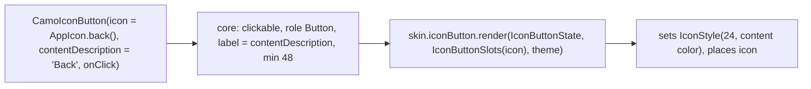
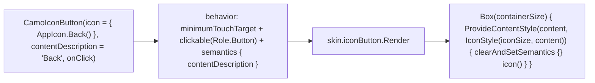
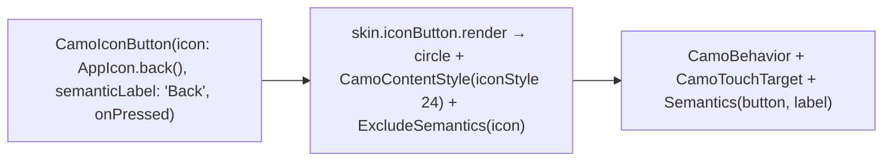

{/* Generated by docs/scripts/sync_vault.py from the Camouflage design notes. Edit the notes and re-run the script; changes made here are overwritten. */}

# CamoIconButton

## Concept {#concept}

### 1. Why

Icon-only actions (back, close, more, favorite) are everywhere in top bars and cards, and they're the most common accessibility failure: a tappable icon with no label. `CamoIconButton` makes the label **required**, takes the icon as a **widget** (your `AppIcon.back()`), and applies the same appearance, tone and feedback model as `CamoButton` in a compact, usually circular shape.

### 2. Shape



**Material mapping preview**

| Appearance | Material 3 icon button | Container | Icon |
|---|---|---|---|
| `Solid` | Filled | `f.strong` | `f.onStrong` |
| `Soft` | Filled tonal | `f.container` | `f.onContainer` |
| `Outline` | Outlined | transparent + `outline` border | `onSurfaceVariant` (`f.strong` for status tones) |
| `Ghost` (default) | Standard | transparent | `onSurfaceVariant` (`f.strong` for status tones) |

`Raised` falls back to `Soft`, and `Link` to `Ghost` ([Design Language](/guide/foundations/design-language) §3.3).

### 3. API

#### Contract

```kotlin
fun CamoIconButton(
    icon: Widget,                      // usually an app icon widget
    contentDescription: String,        // required, non-null: describes the action
    onClick: () -> Unit,
    appearance: Appearance? = null,   // null → IconButtonTheme.defaultAppearance (skin default: Ghost)
    tone: Tone = Default,              // e.g. Error for a delete icon
    enabled: Boolean = true,
    checked: Boolean? = null,          // non-null → a toggle button (favorite, bookmark): toggle role + selected look
    loading: Boolean = false,          // a progress circle replaces the icon
    tooltip: String? = null,           // a CamoTooltip on hover / focus / long-press (see Overlays › CamoTooltip)
)
```

The default appearance is `Ghost`, because most icon buttons sit in bars and should stay quiet. `tone` works as it does on [CamoButton](/components/actions/camo-button) (a red trash icon is `tone = Error`).

**State → renderer:** `IconButtonState(enabled, checked?, loading, appearance, tone, interaction)`. **Slots:** `IconButtonSlots(icon)`. Core marks the icon's own semantics as hidden, because the button carries the label.

#### Tokens used

- the colors in the mapping table, and the disabled alphas on `onSurface`
- `shapes.full`
- the ambient icon style size 24, inside a 40 visual container; the touch target is 48

#### Component theme

`theme.components.iconButton: IconButtonTheme?`. Every field is nullable in the theme. The skin's `defaults(theme)` fills whatever isn't set (Material defaults shown). See [Theme](/guide/foundations/theme) §3.10.

| Field | Type | Material default | What it's for |
|---|---|---|---|
| `defaultAppearance` | Appearance | `Ghost` | the appearance used when a call passes none (ADR-28: a brand's default variant) |
| `containerSize` | Dp | 40 | visual size of the container (the touch target stays at least 48) |
| `shape` | Shape | `shapes.full` | container shape |
| `iconSize` | Dp | 24 | the ambient icon size for `icon` |
| `solidColors / softColors / outlineColors / ghostColors` | IconButtonColors(container, content, border?) | per the table above | colors per appearance for `tone = Default` |
| `checkedColors` | IconButtonColors | Material: `f.strong` / `f.onStrong` (selected filled); Minimal: `surfaceContainerHigh` / ink | the look when `checked = true` |

#### Accessibility

- Role button, with the label `contentDescription`. With `checked` non-null: a **toggle button** with an on/off state ("Favorite, toggle button, on").
- `loading`: busy semantics, focus kept, clicks ignored (as on `CamoButton`).
- The 48 × 48 touch target is enforced even though the visual container is 40.
- The label describes the **action** ("Close", "Add to favorites"), not the icon ("X", "Heart").

### 4. Build steps

1. Core: the same interaction and clickable wiring as `CamoButton`, with the label from `contentDescription`. Clear the icon's own semantics.
2. `DebugSkin` renderer: a circle; set an icon style; place the icon.
3. Sample: a top-bar-style row of three icon buttons (one per appearance) using `AppIcon`s, one of them disabled.
4. Tests: the toggle role and on/off state when `checked` is set; `loading` swaps the icon for a progress circle and ignores clicks; the label is exposed; the target is at least 48; the icon has no own semantics node; an `AppIcon` with no parameters takes size 24 and the appearance's content color; disabled blocks the click.

**Done when**
- [ ] Every icon button in the sample is announced by its action label.
- [ ] Appearances are distinct on `MinimalSkin`, and the icons follow them with no parameters.

### 5. Edge cases

| Case | Decided behavior |
|---|---|
| **A toggle icon button** (settled 2026-09-27) | `checked = true/false`. The app still passes the icon for the state (outline heart / filled heart), matching the icon-widget pattern, and keeps `onClick` as the only callback (it flips its own state). The skin draws `checkedColors`. It passes ADR-23 (Fluent ToggleButton, Carbon selected icon button, Apple toggle buttons). |
| `contentDescription` of a toggle | Describes the action, and stays the same in both states ("Favorite"); the toggle state is announced separately. |
| Directional icons (back) in RTL | The app icon uses `IconSource(autoMirror = true)`. |
| Font scale 200% | The icon doesn't scale. The target stays 48. |
| Something other than an icon passed as `icon` (an avatar image) | It's allowed and gets the 24 box. Colors are the app's responsibility. |
| Several icon buttons tightly packed | The platform resolves the nearest target. The design guideline is `spacing.s` between them. |

## Implementation {#implementation}

<KotlinOnly>

### 1. Why {#kotlin-1-why}

This is the icon-only action. It's the button skeleton with a **required label**, a small visual container (40 dp) inside a 48 dp touch target, and the icon slot's own semantics cleared, because the button speaks for it.

### 2. Shape {#kotlin-2-shape}



### 3. API {#kotlin-3-api}

```kotlin
@Composable
public fun CamoIconButton(
    icon: @Composable () -> Unit,
    contentDescription: String,
    onClick: () -> Unit,
    modifier: Modifier = Modifier,
    appearance: Appearance? = null,      // null → IconButtonTheme.defaultAppearance
    tone: Tone = Tone.Default,
    enabled: Boolean = true,
    checked: Boolean? = null,            // non-null → a toggle button (toggleableState semantics, see §5)
    loading: Boolean = false,
    tooltip: String? = null,             // CamoTooltip: hover/focus on desktop and web, long-press on touch
    interactionSource: MutableInteractionSource? = null,
)
```

`IconButtonTheme` / `IconButtonStyle` are `containerSize`, `shape`, `iconSize`, `borderWidth` and per-appearance `IconButtonColors` (Solid, Soft, Outline, Ghost), with the same `colorsFor(appearance, tone, theme)` logic as buttons (Ghost + Default → `onSurfaceVariant` content). Core applies the fallbacks first: `Raised` → `Soft`, `Link` → `Ghost`.

The icon is wrapped in `Modifier.clearAndSetSemantics {}` inside the renderer's slot container. That guarantees one announcement ("Back, button") even if the app's icon composable sets its own description.

### 4. Build steps {#kotlin-4-build-steps}

1. Types in `core/iconbutton/`, the component, and the DebugSkin renderer.
2. `commonTest`:
   - `onNodeWithContentDescription("Back")` has `Role.Button`;
   - there's exactly one node with that description;
   - the touch bounds are 48 × 48 while the visual box is 40;
   - the icon takes `iconSize` and the appearance's content color without parameters.

**Done when**
- [ ] A top-bar-like row of three icon buttons works with touch, mouse, Tab + Enter, and a screen reader.

### 5. Edge cases {#kotlin-5-edge-cases}

| Case | Decided behavior |
|---|---|
| An app icon composable with its own `contentDescription` | Cleared by the slot wrapper, so there's no double announcement. |
| Tooltip | `tooltip` in v1 on every target (base decision): core's `CamoTooltip`, not Material's `TooltipBox`. |
| `checked` semantics | `Modifier.semantics { role = Role.Button; toggleableState = ToggleableState(checked) }` so TalkBack/VoiceOver announce "toggle button, on". |
| `containerSize` > 48 in the theme | The touch target grows with it (`minimumTouchTarget` is a minimum). |

</KotlinOnly>

<DartOnly>

### 1. Why {#dart-1-why}

This is the icon-only action. It's the button skeleton with a required `semanticLabel`, a 40 visual container inside a 48 touch target, and the icon's own semantics excluded.

### 2. Shape {#dart-2-shape}



### 3. API {#dart-3-api}

```dart
class CamoIconButton extends StatefulWidget {
  const CamoIconButton({super.key, required this.icon, required this.semanticLabel, required this.onPressed,   // VoidCallback?; null = disabled
      this.appearance, this.tone = Tone.defaultTone,
      this.checked, this.loading = false, this.tooltip, this.focusNode});
  final bool? checked;              // non-null → Semantics(toggled: checked) + the skin's checked look
  final bool loading;
  final Widget icon;
  final String semanticLabel;       // base: contentDescription
  final String? tooltip;            // platform extra: shows on long-press / hover
}
```

`tooltip` uses the `widgets`-level overlay (a small `CamoTooltip` in core, which draws with the skin's inverse colors), not Material's `Tooltip`. It defaults to `null`, so there's no tooltip unless it's asked for.

### 4. Build steps {#dart-4-build-steps}

1. Types, the component, `CamoTooltip` (minimal), and the DebugSkin renderer.
2. Widget tests:
   - one semantics node labelled "Back" with the button flag;
   - tap target guidelines pass;
   - the icon inherits size 24 and the appearance's color;
   - the tooltip shows on hover (desktop) and long-press (mobile).

**Done when**
- [ ] A top-bar row of icon buttons works with touch, mouse, keyboard and a screen reader.

### 5. Edge cases {#dart-5-edge-cases}

| Case | Decided behavior |
|---|---|
| **`semanticLabel` vs base `contentDescription`** | Flutter naming (`Icon.semanticLabel`). |
| Tooltip | `tooltip` in v1 on both platforms (base decision). |

</DartOnly>
