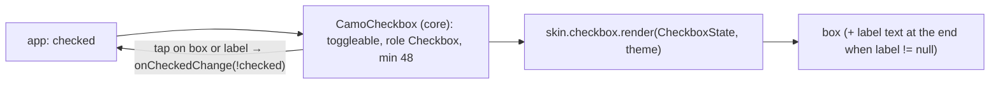
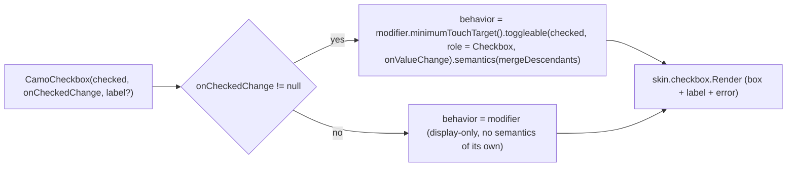
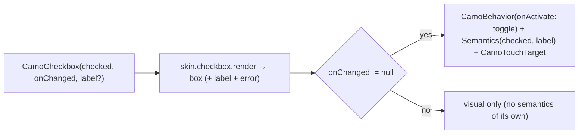

{/* Generated by docs/scripts/sync_vault.py from the Camouflage design notes. Edit the notes and re-run the script; changes made here are overwritten. */}

# CamoCheckbox

## Concept {#concept}

### 1. Why

A checkbox is the simplest controlled input: one boolean in, one callback out. In real screens a checkbox almost always has a **label**, and the whole row should be tappable. So `CamoCheckbox` takes an optional `label` value. With a label, the component builds the full tappable row. Without one, it's a bare box (for tables and custom rows).

### 2. Shape



**Material mapping preview**

| State | Box | Mark |
|---|---|---|
| unchecked | `outline` border, 2dp, transparent fill | none |
| checked | `primary` fill | `onPrimary` check mark |
| disabled | `onSurface` at the disabled alpha | the same, dimmed |

The label is `bodyLarge` in `onSurface`. The tick animates with `motion.durationShort`. See [Material Skin](/guide/skins/material-skin).

### 3. API

#### Contract

```kotlin
fun CamoCheckbox(
    checked: Boolean,
    onCheckedChange: ((Boolean) -> Unit)?,   // null → display-only: no click, no focus
    label: String? = null,                   // non-null → the whole row (box + label) is the target
    labelSpans: List<CamoSpan>? = null,      // rich label (links, bold); use instead of label
    description: String? = null,             // a second line under the label
    error: String? = null,                   // shown below the row; marks the checkbox invalid
    enabled: Boolean = true,
)
// inside a form: CamoCheckboxFormField(key = "consent", rules = …, labelSpans = …)
```

**State → renderer:** `CheckboxState(checked, label: String or List<CamoSpan>?, description?, error?, enabled, interaction)`. **Slots:** none. The renderer lays out the box and the label, and draws the label text itself.

#### Tokens used

- `colors.primary`, `onPrimary`, `outline`, `onSurface` (label and disabled)
- `shapes.extraSmall` (a skin may use its own corner)
- a visual box of 18, inside a 48 target
- `typography.bodyLarge` (label), `spacing.m` between the box and the label
- `motion.durationShort`

#### Component theme

`theme.components.checkbox: CheckboxTheme?`. Every field is nullable in the theme. The skin's `defaults(theme)` fills whatever isn't set (Material defaults shown). See [Theme](/guide/foundations/theme) §3.10.

| Field | Type | Material default | What it's for |
|---|---|---|---|
| `boxSize` | Dp | 18 | the visual box |
| `shape` | Shape | corner 2 | box corners |
| `borderWidth` | Dp | 2 | unchecked border |
| `labelStyle` | CamoTextStyle | `typography.bodyLarge` | the label |
| `labelPosition` | LabelPosition (`Start` \| `End`) | `End` (the label after the box) | which side of the box the label sits on (ADR-28: brand designs set it in the theme). Cupertino's default is `Start` (checkmark at the end of the row). |
| `labelGap` | Dp | `spacing.m` (12) | space between box and label |
| `descriptionStyle` | CamoTextStyle | `typography.bodyMedium` in `onSurfaceVariant` | the description line |
| `colors` | CheckboxColors(checkedBox, checkmark, uncheckedBorder, label) | `primary`, `onPrimary`, `outline`, `onSurface` | every color the checkbox uses |

#### Accessibility

- Role checkbox, with checked/unchecked announced. With a label, it's announced as one element: "Remember me, checkbox, not checked".
- `onCheckedChange = null`: no semantics or focus of its own (a parent handles them).
- The minimum 48 target applies to the box; with a label, the whole row is the target.
- Space toggles it when focused.
- `description` is announced as the element's description, not part of its name.

### 4. Build steps

1. Core: toggleable wiring over the box, or the whole row when `label != null`; role, name = `label`; the 48 target; interaction tracking; `skin.checkbox.render`.
2. `DebugSkin` renderer: a square, filled when checked, with the label text next to it.
3. Sample: "Remember me" (labelled), a bare checkbox in a table-like row, and a disabled checked one.
4. Tests:
   - tapping the label toggles it;
   - the labelled checkbox announces label + state as one node;
   - display-only is not clickable or focusable;
   - no toggle when disabled.

**Done when**
- [ ] The labelled and bare forms both toggle and announce correctly.
- [ ] The checked, unchecked and disabled looks are correct in light and dark.

### 5. Edge cases

| Case | Decided behavior |
|---|---|
| **Tri-state** (indeterminate "select all") | **Not in v1.** It changes the state type to a three-value enum. It can be added later as a non-breaking overload. |
| Long label at 200% font scale | The label wraps. The box stays aligned to the first line. |
| RTL | The row mirrors: the box goes at the start (right) and the label after it. The check mark isn't mirrored. |
| The app doesn't update `checked` | The box stays unchanged (controlled). |
| Error state (a required consent box) | `error` shows below the row in `error` color with `supportingTextStyle`, and the box border turns `error`. It's usually produced by `CamoRules.requiredTrue` ([CamoForm](/components/inputs/camo-form)). |
| A label with a link ("I agree to the Terms") | Pass `labelSpans` ([CamoText](/components/primitives/camo-text) spans). Tapping the link fires the link. Tapping anywhere else on the row toggles the box. The link is its own focusable element after the checkbox. |

## Implementation {#implementation}

<KotlinOnly>

### 1. Why {#kotlin-1-why}

This is a controlled boolean. With a `label`, the whole row becomes one toggleable element. In Compose that's `Modifier.toggleable(role = Role.Checkbox)` on the row, with `mergeDescendants` so screen readers read the label and the state together.

### 2. Shape {#kotlin-2-shape}



### 3. API {#kotlin-3-api}

```kotlin
@Composable
public fun CamoCheckbox(
    checked: Boolean,
    onCheckedChange: ((Boolean) -> Unit)?,
    modifier: Modifier = Modifier,
    label: String? = null,
    labelSpans: List<CamoSpan>? = null,
    description: String? = null,
    error: String? = null,
    enabled: Boolean = true,
    interactionSource: MutableInteractionSource? = null,
)
```

- `CheckboxTheme` / `CheckboxStyle` follow the base table.
- The check mark is a `Canvas` path, animated with `animateFloatAsState(if (checked) 1f else 0f, tween(motion.durationShort))` (0 ms under reduced motion).
- `labelSpans`: the row's `toggleable` would swallow link taps, so when spans contain a link, the label is rendered with `the spans `CamoText``. `LinkAnnotation` handles its own pointer input, so a link tap wins and a tap elsewhere toggles. The link stays a separate focusable node after the checkbox.
- `error`: shown below the row with the text-field supporting style in `error`, plus `Modifier.camoError(error)`.

**Label side and description:** the row reads `style.labelPosition` (`End` default | `Start`) to order the box and the label; `description` renders under the label with `style.descriptionStyle` and is merged into the row's announcement after the checked state.

### 4. Build steps {#kotlin-4-build-steps}

1. Types, the component, and the DebugSkin renderer.
2. `commonTest`:
   - tapping the label toggles it;
   - `assertIsOff()` / `assertIsOn()`;
   - the labelled row is one node with the checkbox role;
   - display-only has no toggle action;
   - a link in `labelSpans` fires its callback and does **not** toggle;
   - `error` sets error semantics.

**Done when**
- [ ] "Remember me" and "I agree to the Terms" (with a link) work by touch, Space on desktop, and a screen reader.

### 5. Edge cases {#kotlin-5-edge-cases}

| Case | Decided behavior |
|---|---|
| Link inside a toggleable row | Link taps win (their own pointer input). Verified by test on each platform, because the pointer-event order is a Compose implementation detail worth guarding. |
| Tri-state | Not in v1. Compose's `triStateToggleable` exists for later. |
| Space key toggling | `toggleable` handles it on desktop and web when focused. |

</KotlinOnly>

<DartOnly>

### 1. Why {#dart-1-why}

This is a controlled boolean. With a label, the whole row is one tappable, focusable element. Flutter expresses the state with `Semantics(checked: …)`, and the behavior with `CamoBehavior` wrapped around the whole row.

### 2. Shape {#dart-2-shape}



### 3. API {#dart-3-api}

```dart
class CamoCheckbox extends StatefulWidget {
  const CamoCheckbox({super.key, required this.checked, required this.onChanged,
      this.label, this.labelSpans, this.description, this.error, this.enabled = true, this.focusNode});
  final bool checked;
  final ValueChanged<bool>? onChanged;      // base: onCheckedChange
  final String? label;
  final List<CamoSpan>? labelSpans;
  final String? error;
}
```

- The check mark is a `CustomPainter`, animated with `TweenAnimationBuilder<double>` (duration `motion.durationShort`, 0 under reduced motion).
- **Links in `labelSpans`:** the link spans' `TapGestureRecognizer`s win the gesture arena over the row's `GestureDetector`, so a link tap opens the link and a tap elsewhere toggles. The label is excluded from the row's merged semantics except for its text, and the links keep their own nodes.

**Label side and description:** `style.labelPosition` (`end` default | `start`) orders the box and the label; `description` renders under the label with `style.descriptionStyle` and is merged into the row's semantics after the checked state.

### 4. Build steps {#dart-4-build-steps}

1. Types, the component, the painter, and the DebugSkin renderer.
2. Widget tests:
   - tapping the label toggles it;
   - `tester.getSemantics` has `isChecked` and the label;
   - display-only has no tap action;
   - tapping the "Terms" span fires the link and doesn't toggle;
   - `error` → invalid semantics + the text shown.

**Done when**
- [ ] "Remember me" and the consent checkbox with a link work by touch, Space and a screen reader.

### 5. Edge cases {#dart-5-edge-cases}

| Case | Decided behavior |
|---|---|
| Gesture arena: link vs row | The recognizer on the link is deeper, so it wins. Covered by a test on each platform. |
| Tri-state | Not in v1. `Semantics(mixed: true)` exists for later. |

</DartOnly>
