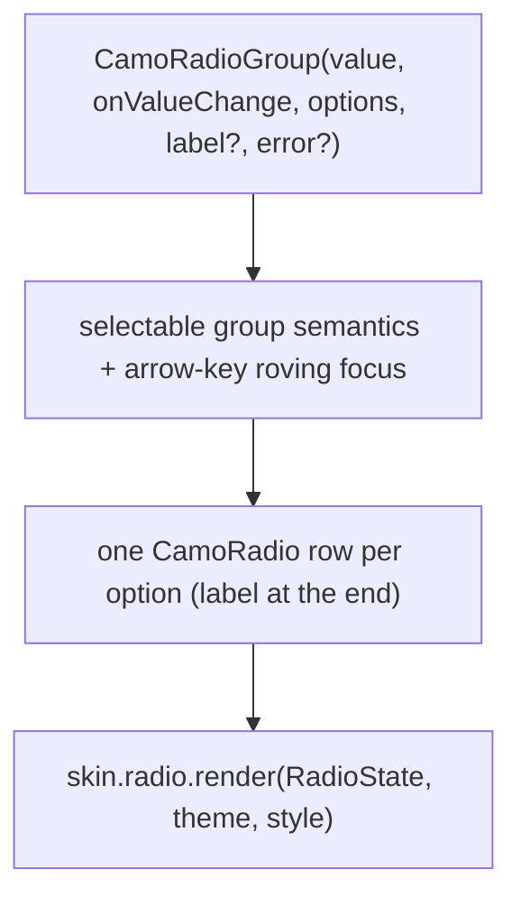
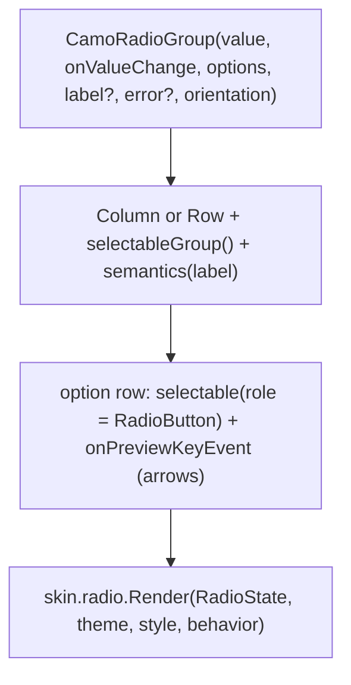
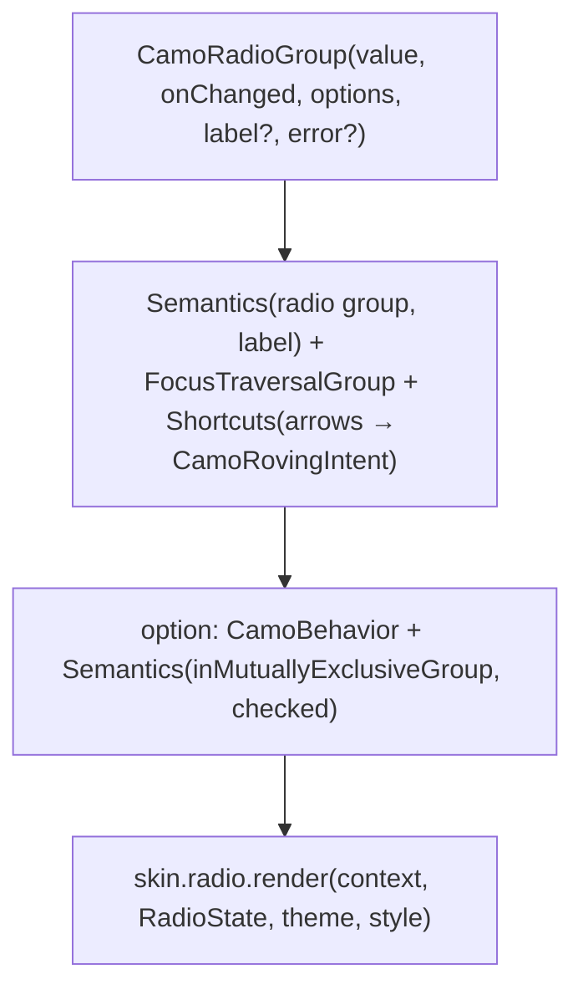

{/* Generated by docs/scripts/sync_vault.py from the Camouflage design notes. Edit the notes and re-run the script; changes made here are overwritten. */}

# CamoRadio

## Concept {#concept}

### 1. Why

Radio buttons choose **exactly one** option from a small visible set (2–5 options). Camouflage offers two levels:
- **`CamoRadioGroup`**: the usual way. It takes a list of options and a selected value, handles keyboard navigation between options, and announces "2 of 3" to screen readers.
- **`CamoRadio`**: a single radio, for custom layouts (a radio inside a card).

### 2. Shape



**Material mapping preview:** the M3 radio button.
- A 20 dp circle, with an `onSurfaceVariant` outline when unselected.
- Selected: a `primary` ring with an inner dot.
- The label is `bodyLarge` in `onSurface`.
- Error: `error` ring.

### 3. API

#### Contract

```kotlin
fun <T> CamoRadioGroup(
    value: T?,                                // null = nothing selected yet
    onValueChange: (T) -> Unit,
    options: List<RadioOption<T>>,
    label: String? = null,                    // group label, announced with the group
    error: String? = null,                    // shown below the group
    orientation: Orientation = Vertical,
    enabled: Boolean = true,
)
data class RadioOption<T>(val value: T, val label: String, val description: String? = null, val enabled: Boolean = true)

fun CamoRadio(
    selected: Boolean,
    onClick: (() -> Unit)?,                   // null → display-only (a parent row handles it)
    label: String? = null,
    labelSpans: List<CamoSpan>? = null,
    enabled: Boolean = true,
)

// inside a form: CamoRadioGroupFormField<T>(key, initialValue, rules, options, …)
```

**State → renderer:** `RadioState(selected, label?, enabled, error: Boolean, interaction)`. **Slots:** none. The group layout (column or row, the group label, the error text) is drawn by core with the skin's text styles.

#### Tokens used

- `colors.primary` (selected), `onSurfaceVariant` (unselected), `error`, `onSurface` (label and disabled)
- `typography.bodyLarge` (option label), `bodyMedium` (description), `labelLarge` (group label)
- `spacing.m` between the radio and its label

#### Component theme

`theme.components.radio: RadioTheme?`. Every field is nullable in the theme. The skin's `defaults(theme)` fills whatever isn't set (Material defaults shown). See [Theme](/guide/foundations/theme) §3.10.

| Field | Type | Material default | What it's for |
|---|---|---|---|
| `size` | Dp | 20 | the visual circle |
| `dotSize` | Dp | 10 | the inner dot when selected |
| `borderWidth` | Dp | 2 | ring thickness |
| `labelStyle` / `descriptionStyle` | CamoTextStyle | `bodyLarge` / `bodyMedium` | option texts |
| `labelPosition` | LabelPosition (`Start` \| `End`) | `End` | which side of the circle the option label sits on (ADR-28) |
| `labelGap` | Dp | `spacing.m` (12) | space between radio and label |
| `colors` | RadioColors(selected, unselected, error, label) | `primary`, `onSurfaceVariant`, `error`, `onSurface` | every color the radio uses |

#### Accessibility

- The group is a selectable group with its label. Each option is a radio announced as "Label, radio button, 2 of 3, selected".
- **Keyboard:** Tab enters the group at the selected option (or the first one). Arrow keys move **and select**. Tab leaves the group. This is the standard radio-group pattern (roving focus).
- Each option row is the touch target (48 minimum height).
- The group error is linked to the group and announced when it appears.

### 4. Build steps

1. `CamoRadio` + `RadioRenderer` (the circle, selected animation with `motion.durationShort`).
2. `CamoRadioGroup`: the row layout, group semantics, roving focus with arrow keys, and error text.
3. `CamoRadioGroupFormField` (the [CamoForm](/components/inputs/camo-form) pattern).
4. Tests:
   - tapping a row selects its value;
   - Down arrow moves and selects;
   - Tab leaves the group;
   - the announcement includes "n of m";
   - a disabled option is skipped by the arrows;
   - `error` sets invalid semantics.

**Done when**
- [ ] A "delivery method" group works by touch, keyboard and screen reader, and inside a `CamoForm` with a `required` rule.

### 5. Edge cases

| Case | Decided behavior |
|---|---|
| Nothing selected initially | Allowed (`value = null`). Tab focuses the first enabled option without selecting it. |
| More than ~5 options | Guidance: use `CamoSelect` instead ([CamoSelect](/components/inputs/camo-select)). |
| Horizontal orientation with long labels | The row wraps (flow layout). It never truncates labels. |
| RTL | The radio is at the start (right), and Left/Right arrows follow the reading direction. |

## Implementation {#implementation}

<KotlinOnly>

### 1. Why {#kotlin-1-why}

Compose gives single selection through `Modifier.selectable` and `Modifier.selectableGroup()`, but **no arrow-key navigation between radios**. The Kotlin work is that keyboard behavior, the group semantics, the horizontal and vertical layouts, and the form field.

### 2. Shape {#kotlin-2-shape}



### 3. API {#kotlin-3-api}

```kotlin
@Composable
public fun <T> CamoRadioGroup(
    value: T?,
    onValueChange: (T) -> Unit,
    options: List<RadioOption<T>>,
    modifier: Modifier = Modifier,
    label: String? = null,
    error: String? = null,
    orientation: Orientation = Orientation.Vertical,
    enabled: Boolean = true,
)

@Composable
public fun CamoRadio(
    selected: Boolean,
    onClick: (() -> Unit)?,               // null → display-only (a parent row handles it)
    modifier: Modifier = Modifier,
    label: String? = null,
    labelSpans: List<CamoSpan>? = null,
    enabled: Boolean = true,
    interactionSource: MutableInteractionSource? = null,
)

@Composable
public fun <T> CamoRadioGroupFormField(key: String, options: List<RadioOption<T>>, initialValue: T? = null,
    rules: List<CamoRule<T?>> = emptyList(), label: String? = null, orientation: Orientation = Orientation.Vertical)
```

**Keyboard (the part Compose doesn't give):** each option gets a `FocusRequester`. `onPreviewKeyEvent` on an option handles `Key.DirectionDown/Right` (next) and `Key.DirectionUp/Left` (previous, mirrored in RTL for Left/Right): it moves focus **and selects** (`onValueChange`), like a native radio group. Tab enters the group on the selected option (or the first one when nothing is selected) and leaves it with the next Tab: options other than the focus target get `Modifier.focusProperties { canFocus = … }` so the group is one Tab stop.

**Semantics:** the group has `selectableGroup()` plus `semantics { contentDescription = label }` when labelled; each row is `selectable(selected, role = Role.RadioButton, onClick)` with `mergeDescendants`, which announces "Weekly, radio button, 2 of 3, selected" (collection position from `selectableGroup`).

**Label position:** the row reads `style.labelPosition` (`Start` | `End`, ADR-28) and swaps the circle and the text with `Arrangement` order; the whole row is the target either way.

### 4. Build steps {#kotlin-4-build-steps}

1. `RadioTheme` / `RadioStyle`, `RadioOption`, `CamoRadio`, `CamoRadioGroup` (layout, group label, error text with the skin's styles).
2. The focus logic (one Tab stop, arrows select) as an internal `rememberRovingFocus(count)` helper, reused by the segmented control and chip group.
3. `CamoRadioGroupFormField` on the form's entry API ([CamoForm](/components/inputs/camo-form#implementation)).
4. `commonTest`: tap selects; arrows move and select (and mirror in RTL); Tab enters on the selected option; the error text appears and the group is announced invalid; display-only `CamoRadio(onClick = null)` has no own node.

**Done when**
- [ ] A shipping-speed group and a plan picker in a form work by touch, keyboard (desktop and web) and screen reader.

### 5. Edge cases {#kotlin-5-edge-cases}

| Case | Decided behavior |
|---|---|
| `value` not among the options | Nothing is selected; a debug log names the value. |
| Horizontal group that doesn't fit | `FlowRow` wraps it. Guidance: more than 3 horizontal options → vertical. |
| Disabled option | Skipped by arrow keys, still announced as dimmed ("unavailable"). |

</KotlinOnly>

<DartOnly>

### 1. Why {#dart-1-why}

Radio buttons in Flutter without Material: `CamoBehavior` per option, group semantics (`Semantics(role: SemanticsRole.radioGroup)` and `inMutuallyExclusiveGroup` + `checked` per option), one Tab stop for the group, and arrow keys that move and select through a `Shortcuts`/`Actions` pair.

### 2. Shape {#dart-2-shape}



### 3. API {#dart-3-api}

```dart
class CamoRadioGroup<T> extends StatelessWidget {
  const CamoRadioGroup({super.key, required this.value, required this.onChanged, required this.options,
      this.label, this.error, this.direction = Axis.vertical, this.enabled = true});
}
class CamoRadio extends StatelessWidget {
  const CamoRadio({super.key, required this.selected, required this.onChanged,   // VoidCallback?; null → display-only
      this.label, this.labelSpans, this.enabled = true, this.focusNode});
}
class CamoRadioGroupFormField<T> extends StatelessWidget { /* fieldKey, options, initialValue, rules, label, direction */ }
```

- **Roving focus (`CamoRovingFocus`, a core widget reused by segments, tabs and chip groups):** only the selected option (or the first) has `canRequestFocus: true`, so Tab enters once; `Shortcuts` maps arrow keys to `CamoRovingIntent(next/previous)` (Left/Right mirrored in RTL), and the `Action` moves focus **and selects**.
- **Semantics:** each option is `Semantics(inMutuallyExclusiveGroup: true, checked: selected, label: …)`; the group has `Semantics(role: SemanticsRole.radioGroup, label: label)` (the `SemanticsRole` API, Flutter 3.32+).
- **Label side:** `style.labelPosition` orders the circle and the text; the whole row is the target.
- **Error:** `CamoErrorSemantics` below the group announces the error.

### 4. Build steps {#dart-4-build-steps}

1. Types, `CamoRovingFocus`, `CamoRadio`, `CamoRadioGroup`, the DebugSkin renderer.
2. `CamoRadioGroupFormField` on the form entry API.
3. Widget tests: tap selects; arrows move and select (RTL mirrored); one Tab stop; error semantics; display-only has no own node.

**Done when**
- [ ] A shipping group and a plan picker in a form work by touch, keyboard and screen reader on every platform.

### 5. Edge cases {#dart-5-edge-cases}

| Case | Decided behavior |
|---|---|
| Horizontal group too wide | `Wrap` instead of `Row`. |
| Disabled option | Skipped by arrows; announced as disabled. |

</DartOnly>
