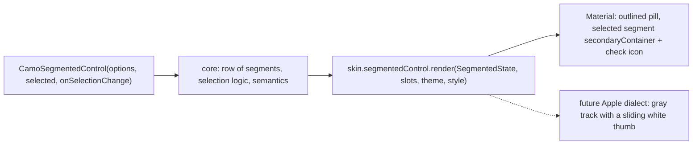
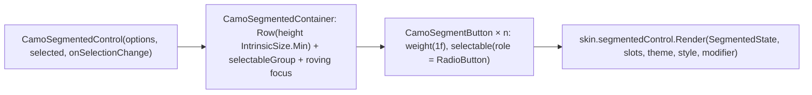
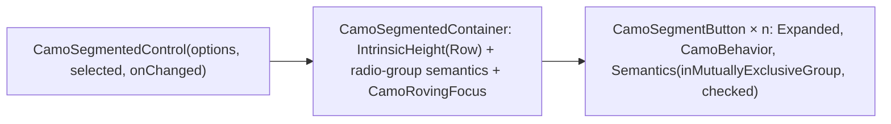

{/* Generated by docs/scripts/sync_vault.py from the Camouflage design notes. Edit the notes and re-run the script; changes made here are overwritten. */}

# CamoSegmentedControl

## Concept {#concept}

### 1. Why

A segmented control switches between 2–5 closely related options in a compact row: "Day / Week / Month", "List / Grid", or a filter set. Material calls it *segmented buttons*, and Apple *segmented control*. It supports **single selection** (like a compact radio group) and **multi-selection** (like a row of toggle buttons).

### 2. Shape



**Material mapping preview:** M3 segmented buttons.
- Height 40, with an `outline` border and `shapes.full` ends.
- The selected segment is `secondaryContainer` / `onSecondaryContainer`, with a check icon (for single selection only when there's no icon).

### 3. API

#### Contract

```kotlin
fun <T> CamoSegmentedControl(
    options: List<Segment<T>>,
    selected: T,                               // single selection
    onSelectionChange: (T) -> Unit,
    enabled: Boolean = true,
)
data class Segment<T>(val value: T, val label: String? = null, val icon: Widget? = null,
                      val contentDescription: String? = null, val enabled: Boolean = true)
```

A segment needs a `label` or an `icon`. Icon-only segments need a `contentDescription`.

**Building blocks (ADR-30):** `CamoSegmentedContainer(content: Slot)` (the track, outer shape and radio-group semantics) and `CamoSegmentButton(segment, selected, onClick, position)` (one skin-styled segment with its radio semantics). They let a design put custom content in segments (an icon with a count, two-line segments) without losing the look or keyboard behavior.

**State → renderer:** `SegmentedState(count, selectedIndex, enabled, interactions)`. **Slots:** one `SegmentSlot(label?, icon?)` per option.

#### Tokens used

- `colors.outline`, `secondaryContainer`, `onSecondaryContainer`, `onSurface`
- `shapes.full`, `typography.labelLarge`
- `motion.durationShort` (selection change; the Apple dialect slides its thumb)

#### Component theme

`theme.components.segmentedControl: SegmentedControlTheme?`. Every field is nullable in the theme. The skin's `defaults(theme)` fills whatever isn't set (Material defaults shown). See [Theme](/guide/foundations/theme) §3.10.

| Field | Type | Material default | What it's for |
|---|---|---|---|
| `height` | Dp | 40 | control height |
| `shape` | Shape | `shapes.full` | outer corners |
| `borderWidth` | Dp | 1 | outline and dividers |
| `textStyle` | CamoTextStyle | `labelLarge` | segment labels |
| `iconSize` | Dp | 18 | segment icons |
| `showCheckIcon` | Boolean | true | Material's check mark on selected segments |
| `colors` | SegmentedColors(border, selectedContainer, selectedContent, content) | `outline`, `secondaryContainer`, `onSecondaryContainer`, `onSurface` | every color it uses |

#### Accessibility

- Single selection: a radio group, with each segment a radio ("Week, 2 of 3, selected"). Arrow keys move and select.
- Each segment has a 48 minimum touch target, and the control grows vertically if needed.

### 4. Build steps

1. `Segment`, `CamoSegmentedControl`, and the selection logic.
2. `SegmentedControlRenderer`, and the DebugSkin renderer.
3. Tests:
   - a tap selects one;
   - arrow keys move and select;
   - the announcements;
   - an icon-only segment without a description fails a debug assertion.

**Done when**
- [ ] "Day / Week / Month" works by touch, keyboard and screen reader.

### 5. Edge cases

| Case | Decided behavior |
|---|---|
| More than 5 segments, or long labels | Guidance: use `CamoTabs` or `CamoSelect`. Labels ellipsize after one line, and every segment takes an equal width. |
| **Multi-selection** | Not a segmented control (ADR-23): Apple's iOS segmented control and Carbon's content switcher are single-select only. Use a row of filter chips, `CamoChip(selected = …)`, which every dialect draws. |
| Font scale 200% | The height grows. The labels still get one line with an ellipsis, and the full label is in semantics. |
| RTL | The segment order mirrors. |
| **Custom segments** | `CamoSegmentedContainer` + `CamoSegmentButton` (ADR-30). The container keeps arrow-key navigation across its buttons. |

## Implementation {#implementation}

<KotlinOnly>

### 1. Why {#kotlin-1-why}

A single-choice row of equal segments (ADR-23 removed multi-select). In Compose it's a `Row` of `selectable` segments with equal widths, the roving focus from [CamoRadio](/components/inputs/camo-radio#implementation), and public building blocks for custom segments (ADR-30).

### 2. Shape {#kotlin-2-shape}



### 3. API {#kotlin-3-api}

```kotlin
@Composable
public fun <T> CamoSegmentedControl(
    options: List<Segment<T>>,
    selected: T,
    onSelectionChange: (T) -> Unit,
    modifier: Modifier = Modifier,
    enabled: Boolean = true,
)

// building blocks (ADR-30)
@Composable public fun CamoSegmentedContainer(modifier: Modifier = Modifier, content: @Composable RowScope.() -> Unit)
@Composable public fun <T> RowScope.CamoSegmentButton(
    segment: Segment<T>, selected: Boolean, onClick: () -> Unit, position: ItemPosition,
    modifier: Modifier = Modifier, content: (@Composable () -> Unit)? = null,   // null → the segment's label/icon
)
```

- **Equal widths:** each `CamoSegmentButton` applies `Modifier.weight(1f)`; the container uses `Modifier.height(IntrinsicSize.Min)` so dividers and the selected fill span the full height.
- **Selection animation:** the renderer draws the selected background as one moving element (`animateDpAsState` over the measured segment offsets), so skins like Cupertino get the sliding thumb; Minimal fades instead.
- **Semantics:** container `selectableGroup()`; each button `selectable(selected, role = Role.RadioButton)` with `ItemPosition(index, count)` exposed through `collectionItemInfo`.
- **Keyboard:** the container installs the roving focus helper (one Tab stop, arrows move and select).

### 4. Build steps {#kotlin-4-build-steps}

1. `Segment`, `SegmentedControlTheme` / `Style`, the building blocks, then `CamoSegmentedControl` built from them.
2. The DebugSkin renderer (bordered boxes, the selected one filled).
3. `commonTest`: equal widths with uneven labels; tap selects; arrows select; icon-only segment without `contentDescription` asserts; a custom-content segment keeps radio semantics.

**Done when**
- [ ] "Day / Week / Month" and a custom segment row (icon + count) work by touch, keyboard and screen reader.

### 5. Edge cases {#kotlin-5-edge-cases}

| Case | Decided behavior |
|---|---|
| Labels too long for equal widths | One line with an ellipsis; the full label stays in semantics. |
| Font scale 200% | The row grows in height (intrinsic measurement), labels still single-line. |
| `selected` not in `options` | Nothing selected, debug log. |

</KotlinOnly>

<DartOnly>

### 1. Why {#dart-1-why}

A single-choice row of equal segments, built from the public building blocks `CamoSegmentedContainer` and `CamoSegmentButton` (ADR-30), with the roving focus from [CamoRadio](/components/inputs/camo-radio#implementation).

### 2. Shape {#dart-2-shape}



### 3. API {#dart-3-api}

```dart
class CamoSegmentedControl<T> extends StatelessWidget {
  const CamoSegmentedControl({super.key, required this.options, required this.selected, required this.onChanged, this.enabled = true});
}
// building blocks (ADR-30)
class CamoSegmentedContainer extends StatelessWidget { const CamoSegmentedContainer({super.key, required this.children}); }
class CamoSegmentButton<T> extends StatelessWidget {
  const CamoSegmentButton({super.key, required this.segment, required this.selected, required this.onPressed,
      required this.position, this.child});     // child null → the segment's label/icon
}
```

- **Equal widths:** each button is `Expanded`; the container wraps the `Row` in `IntrinsicHeight` so the selected fill and dividers span the height.
- **Selection animation:** the renderer draws one selected background moved with `AnimatedPositioned` inside a `Stack` over the measured segments (a `LayoutBuilder` divides the width), so dialects can slide or fade it.
- **Semantics:** container `Semantics(role: SemanticsRole.radioGroup)`; buttons `Semantics(inMutuallyExclusiveGroup: true, checked: selected)`.

### 4. Build steps {#dart-4-build-steps}

1. Types, the building blocks, the control built from them, the DebugSkin renderer.
2. Widget tests: equal widths with uneven labels; tap and arrows select; an icon-only segment without a label asserts; a custom-child segment keeps its semantics.

**Done when**
- [ ] "Day / Week / Month" and a custom segment row work by touch, keyboard and screen reader.

### 5. Edge cases {#dart-5-edge-cases}

| Case | Decided behavior |
|---|---|
| Long labels | One line, ellipsis; full label in semantics. |

</DartOnly>
