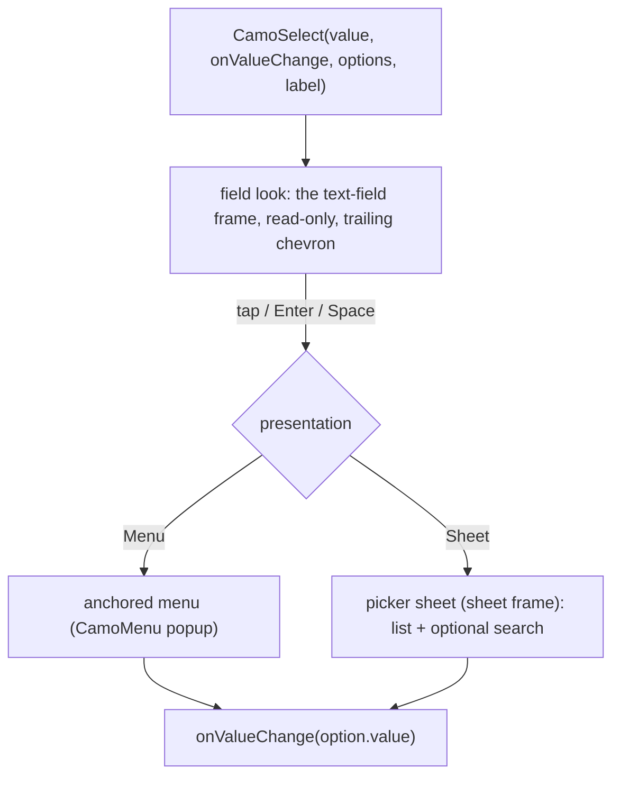
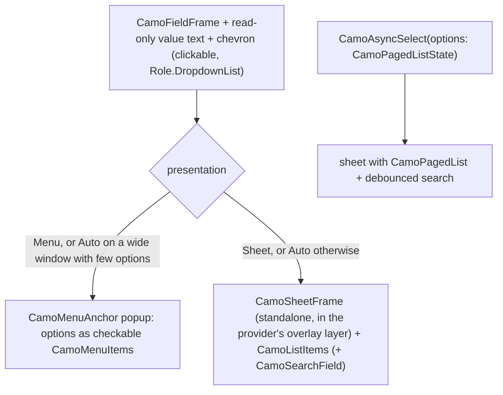
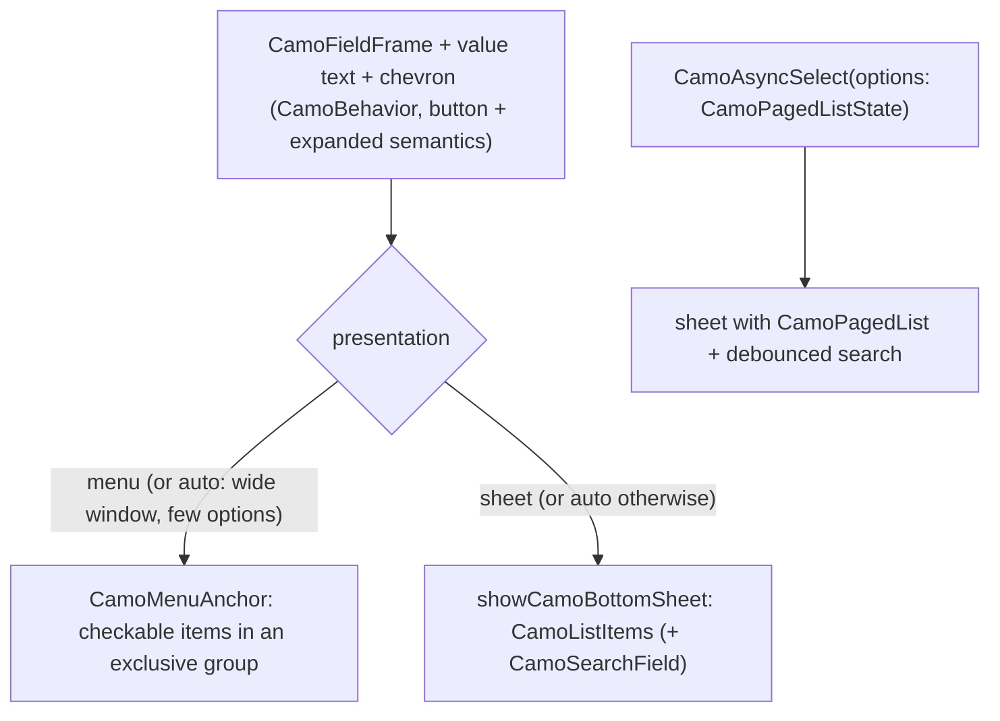

{/* Generated by docs/scripts/sync_vault.py from the Camouflage design notes. Edit the notes and re-run the script; changes made here are overwritten. */}

# CamoSelect

## Concept {#concept}

### 1. Why

A select lets the user pick one value from a list: a country, a category, a payment method. It **looks like a text field** (label, value, supporting/error text) and **opens a picker**. Your Flutter convention already names the right shape: never `DropdownButton`, but a select field that opens a **picker sheet**, with async variants for options loaded from an API. `CamoSelect` makes that the standard, and adds a compact **menu** presentation for short lists on wide windows.

### 2. Shape



**`SelectPresentation.Auto`** (the default) chooses:
- a **Menu** when there are 7 or fewer options on a wide window (at least 600) or with a pointer;
- a **Sheet** otherwise (phones, long lists, searchable, async).

**Material mapping preview:** M3 exposed dropdown menu. The field is the outlined text field with a trailing `▾` in `onSurfaceVariant`. The menu matches `CamoMenu`, and the sheet matches `CamoBottomSheet` with `CamoListItem` rows.

### 3. API

#### Contract

```kotlin
fun <T> CamoSelect(
    value: T?,
    onValueChange: (T) -> Unit,
    options: List<SelectOption<T>>,
    label: String? = null,
    placeholder: String? = null,
    supportingText: String? = null,
    error: String? = null,
    presentation: SelectPresentation = Auto,   // Auto | Menu | Sheet
    searchable: Boolean = false,               // a search field at the top of the sheet
    prefixIcon: Widget? = null,
    enabled: Boolean = true,
)
data class SelectOption<T>(val value: T, val label: String, val supporting: String? = null,
                           val leading: Widget? = null, val enabled: Boolean = true)

// async: options from an API, controlled like CamoPagedList (ADR-29)
fun <T> CamoAsyncSelect(
    value: T?, onValueChange: (T) -> Unit,
    options: CamoPagedListState<SelectOption<T>>,   // the same state type as CamoPagedList
    onOpen: () -> Unit,                         // load the first page when the picker opens
    onQueryChange: (String) -> Unit,            // debounced by the component (SelectTheme.searchDebounce)
    onLoadMore: () -> Unit, onRetry: () -> Unit,
    onRefresh: (() -> Unit)? = null,
    selectedLabel: String?,                    // the label for the current value (options may not be loaded yet)
    label: String? = null, /* … same field parameters … */
)

// inside a form: CamoSelectFormField<T>(key, initialValue, rules, options, …)
```

**State → renderer:** the field reuses the text-field renderer (`TextFieldState` with a read-only value and a chevron suffix), the menu reuses `MenuRenderer`, and the sheet reuses `BottomSheetRenderer` + `ListItemRenderer`. There's **no separate select renderer**, so a skin gets `CamoSelect` for free.

#### Tokens used

It uses the tokens of the text field, menu, bottom sheet and list item. `SelectTheme` only adds presentation rules.

#### Component theme

`theme.components.select: SelectTheme?`. Every field is nullable in the theme. The skin's `defaults(theme)` fills whatever isn't set (Material defaults shown). See [Theme](/guide/foundations/theme) §3.10.

| Field | Type | Material default | What it's for |
|---|---|---|---|
| `autoMenuMaxOptions` | Int | 7 | the largest list shown as a menu in `Auto` |
| `autoMenuMinWidth` | Dp | 600 | the window width from which `Auto` may use a menu |
| `showCheckOnSelected` | Boolean | true | a check mark on the current option in the picker |
| `searchDebounce` | Duration | 500 ms | the delay before `onQueryChange` fires (async select) |

#### Accessibility

- The field is announced as a combo box / pop-up button: "Country, Indonesia, pop-up button, collapsed".
- The opened menu or sheet follows those components' accessibility. The current option is marked selected.
- Keyboard: Enter/Space/Down opens it. In the menu, type-ahead jumps to options. Esc closes without changing.
- `error` is linked and announced as on the text field.

### 4. Build steps

1. `CamoSelect` field (read-only text-field frame + chevron, open/close, semantics).
2. Menu presentation (the `CamoMenu` popup) and sheet presentation (the sheet frame + list + optional `CamoSearchField`).
3. `Auto` rules from `SelectTheme`.
4. `CamoAsyncSelect`: the sheet's list is a `CamoPagedList` fed by `options`; the component only debounces the query and forwards callbacks. It never fetches (the author's `CoreAsyncSelectDelegate` pattern).
5. `CamoSelectFormField`.
6. Sample: country (searchable sheet), sort order (menu), a city from an API (async).
7. Tests:
   - picking sets the value;
   - `Auto` chooses menu vs sheet by width and count;
   - search filters;
   - async: `onOpen` fires on open, the query is debounced, and loading, next-page and error states come from `options`;
   - Esc keeps the old value;
   - announcements.

**Done when**
- [ ] All three samples work on phones (sheet) and desktop (menu), by touch, keyboard and screen reader.

### 5. Edge cases

| Case | Decided behavior |
|---|---|
| `value` not in `options` | The field shows `value.toString()` (or `selectedLabel` for async). A debug warning is logged. |
| Multi-select | Not in v1. It would be a later `CamoMultiSelect`, with chips in the field. |
| Async errors | Rendered by the picker's `CamoPagedList` (first-page error with Retry, or a retry row). The field keeps its value. |
| Very long option labels | They wrap in the sheet, and ellipsize in the field (the full value is in semantics). |

## Implementation {#implementation}

<KotlinOnly>

### 1. Why {#kotlin-1-why}

`CamoSelect` has no renderer of its own: it composes core pieces. Kotlin's job is the wiring: a read-only field built on the text-field frame, the `Auto` choice between a menu and a sheet from the window size, and `CamoAsyncSelect` driven by a controlled `CamoPagedListState` (ADR-29), with the query debounced in the component.

### 2. Shape {#kotlin-2-shape}



### 3. API {#kotlin-3-api}

```kotlin
@Composable
public fun <T> CamoSelect(
    value: T?,
    onValueChange: (T) -> Unit,
    options: List<SelectOption<T>>,
    modifier: Modifier = Modifier,
    label: String? = null, placeholder: String? = null,
    supportingText: String? = null, error: String? = null,
    presentation: SelectPresentation = SelectPresentation.Auto,
    searchable: Boolean = false,
    prefixIcon: (@Composable () -> Unit)? = null,
    enabled: Boolean = true,
)

@Composable
public fun <T> CamoAsyncSelect(
    value: T?,
    onValueChange: (T) -> Unit,
    options: CamoPagedListState<SelectOption<T>>,
    onOpen: () -> Unit,
    onQueryChange: (String) -> Unit,
    onLoadMore: () -> Unit,
    onRetry: () -> Unit,
    selectedLabel: String?,
    modifier: Modifier = Modifier,
    onRefresh: (() -> Unit)? = null,
    label: String? = null, /* … the same field parameters … */
)

@Composable public fun <T> CamoSelectFormField(key: String, options: List<SelectOption<T>>, initialValue: T? = null,
    rules: List<CamoRule<T?>> = emptyList(), label: String? = null /* … */)
```

- **The field:** `CamoFieldFrame(label, supportingText, error, prefixIcon, suffixIcon = chevron, focused = open || hasFocus, isEmpty = value == null)` around a `CamoText` of the selected label. The whole field is `clickable(role = Role.DropdownList)` with `semantics { stateDescription = if (open) "expanded" else "collapsed" }`.
- **Auto:** `LocalWindowInfo.current.containerSize` converted with `LocalDensity`; a menu when the width is at least `style.autoMenuMinWidth` and `options.size <= style.autoMenuMaxOptions`, otherwise a sheet.
- **Menu:** `CamoMenuAnchor(items = options.map { CamoMenuItem(it.label, checked = it.value == value, …) })` inside an exclusive `CamoMenuGroup`, so the current option is announced as selected.
- **Sheet:** a standalone `CamoSheetFrame` (open state is internal to the select), title = `label`, `searchable` adds a `CamoSearchField` filtering by label (case- and accent-insensitive via `Normalizer`-free folding of the common Latin accents).
- **Async:** `LaunchedEffect(open) { if (open) onOpen() }`; the search text is debounced with `snapshotFlow { query }.debounce(style.searchDebounce).collect(onQueryChange)`; the sheet's list is a `CamoPagedList` over `options`.
- **Keyboard:** Enter, Space or Down on the field opens; the menu or sheet handles its own keys; closing returns focus to the field.

### 4. Build steps {#kotlin-4-build-steps}

1. The field on `CamoFieldFrame`, open state, and `SelectTheme` / `SelectStyle`.
2. Menu and sheet presentations, `Auto`.
3. `CamoAsyncSelect` with debounce and `CamoPagedList`; `CamoSelectFormField`.
4. `commonTest`: picking sets the value and closes; `Auto` chooses by width and count (a fake `WindowInfo`); search filters; async calls `onOpen` once per open and debounces `onQueryChange`; Esc keeps the old value; focus returns to the field.

**Done when**
- [ ] Country (searchable sheet), sort order (menu on desktop), and a city from a fake paged API (async) work on every target by touch, keyboard and screen reader.

### 5. Edge cases {#kotlin-5-edge-cases}

| Case | Decided behavior |
|---|---|
| Window resized while open | The current presentation stays until it closes; the next open re-evaluates `Auto`. |
| Configuration change on Android | `open` and the search text use `rememberSaveable`; the sheet reopens after rotation. |
| Async `selectedLabel` missing while options load | The field shows `value.toString()` and logs once in debug. |

</KotlinOnly>

<DartOnly>

### 1. Why {#dart-1-why}

Your Flutter convention, as a Camouflage component: a read-only field with a chevron that opens a picker sheet, and async variants for API-backed options. It composes core pieces (no renderer of its own): `CamoFieldFrame`, the anchored menu for wide windows, `showCamoBottomSheet` for the sheet, and `CamoPagedList` for async options (ADR-29).

### 2. Shape {#dart-2-shape}



### 3. API {#dart-3-api}

```dart
class CamoSelect<T> extends StatefulWidget {
  const CamoSelect({super.key, required this.value, required this.onChanged, required this.options,
      this.label, this.placeholder, this.supportingText, this.error,
      this.presentation = SelectPresentation.auto, this.searchable = false, this.prefixIcon, this.enabled = true});
}

class CamoAsyncSelect<T> extends StatefulWidget {
  const CamoAsyncSelect({super.key, required this.value, required this.onChanged, required this.options,
      required this.onOpen, required this.onQueryChanged, required this.onLoadMore, required this.onRetry,
      required this.selectedLabel, this.onRefresh, this.label /* … the same field parameters … */});
  final CamoPagedListState<SelectOption<T>> options;
}

class CamoSelectFormField<T> extends StatelessWidget { /* fieldKey, options, initialValue, rules, label … */ }
```

- **Sheet:** `showCamoBottomSheet<T>(context: context, builder: …)` awaited for the picked value; the field keeps focus afterwards. Because it's a route, the page behind stays visible under the scrim and back closes it.
- **Auto:** `MediaQuery.sizeOf(context).width >= style.autoMenuMinWidth && options.length <= style.autoMenuMaxOptions` → menu.
- **Async:** `onOpen` once per open; the search text is debounced with a `Timer(style.searchDebounce)` before `onQueryChanged`; the sheet listens to `options` through the widget's rebuilds (the app's notifier drives it, like your `CoreAsyncSelectDelegate`).
- **Semantics:** the field is `Semantics(button: true, expanded: open, label: label, value: selectedLabel)`.

### 4. Build steps {#dart-4-build-steps}

1. The field on `CamoFieldFrame`, `CamoSelectTheme` / `Style`.
2. Menu and sheet presentations, `auto`.
3. `CamoAsyncSelect` with debounce and `CamoPagedList`; `CamoSelectFormField`.
4. Widget tests: picking sets the value; `auto` by width and count (`MediaQuery` override); search filters; `onOpen` once per open; debounce with `fakeAsync`; Esc keeps the old value.

**Done when**
- [ ] Country (searchable sheet), sort order (menu on desktop) and a city from a fake paged repository work on all six platforms.

### 5. Edge cases {#dart-5-edge-cases}

| Case | Decided behavior |
|---|---|
| Opening from GoRouter pages | The sheet is a `PopupRoute` on the nearest `Navigator`, so it works inside a `ShellRoute` without router changes. |
| `selectedLabel` missing while loading | The field shows `value.toString()` and asserts once in debug. |

</DartOnly>
