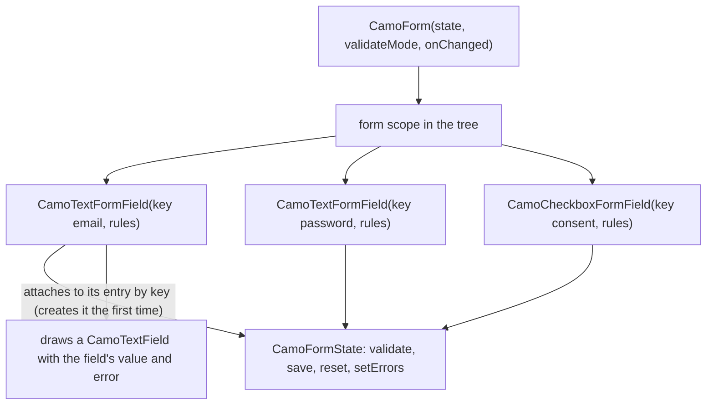
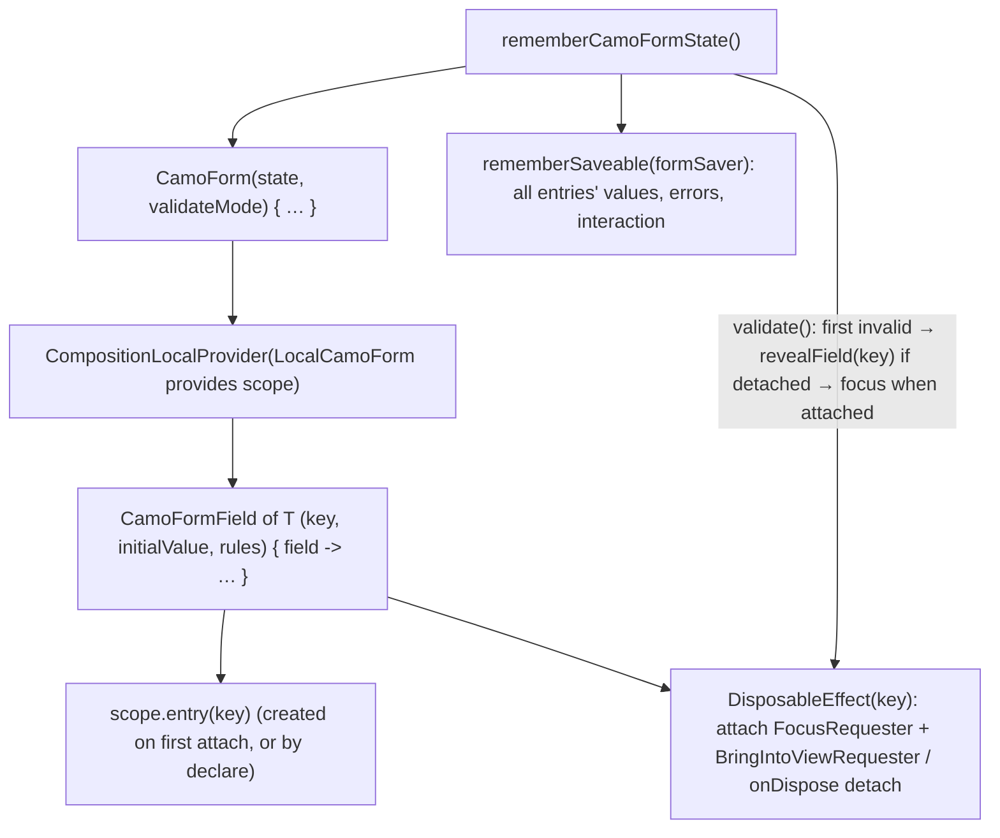
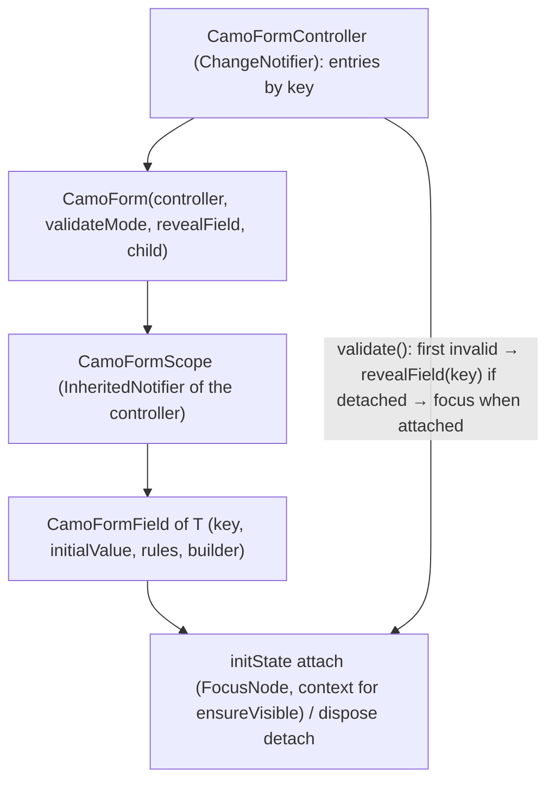

{/* Generated by docs/scripts/sync_vault.py from the Camouflage design notes. Edit the notes and re-run the script; changes made here are overwritten. */}

# CamoForm

## Concept {#concept}

### 1. Why

Every app rewrites the same form plumbing:
- "required" and "min 8 characters" checks;
- when to show an error;
- showing a server error on the right field;
- validating everything on submit.

Flutter solves this well with `Form` + `FormField` + `validator` + `AutovalidateMode`: fields register themselves with the nearest form, and `formKey.currentState.validate()` checks them all. Jetpack Compose has **no equivalent**.

`CamoForm` recreates Flutter's model as Camouflage components on **both** platforms. Validation checks are **rule objects** (`CamoRule`): reusable constants or custom classes, passed to fields like Flutter validators.

:::info[Not in core: rules from JSON]

Building rules (and whole screens) from JSON belongs to **Camouflage Blueprint**, a separate package for server-driven UI (Later). Blueprint will map `{"type": "required", "message": "…"}` onto these same `CamoRule` objects. Core has no registry and no JSON.

:::

### 2. Shape



**How it maps to Flutter:**

| Flutter | Camouflage | Notes |
|---|---|---|
| `Form(key, autovalidateMode, onChanged, child)` | `CamoForm(state, validateMode, onChanged, content)` | provides the form scope |
| `GlobalKey<FormState>` → `currentState` | `CamoFormState` (Compose: `rememberCamoFormState()`, Flutter: a `GlobalKey<CamoFormState>` or a controller) | the handle the app calls |
| `FormField<T>(validator, onSaved, initialValue, autovalidateMode, builder, forceErrorText)` | `CamoFormField<T>(key, rules, onSaved, initialValue, validateMode, forceError, builder)` | generic field for anything (a date picker, a custom widget) |
| `TextFormField` | `CamoTextFormField` | `CamoFormField<String>` + `CamoTextField` |
| (none) | `CamoCheckboxFormField`, `CamoSwitchFormField` | `CamoFormField<Boolean>` + the toggle |
| `validator: (T?) → String?` | `rules: List<CamoRule<T>>` | rule objects; a lambda works too (`CamoRule { … }`) |
| `AutovalidateMode` | `ValidateMode` | same four values, same meaning |

**Where state lives (a deliberate exception to "controlled").** Unlike Flutter, where each `FormField` keeps its own state, **the form owns every field's state, stored in `CamoFormState` by field `key`**. A form field on screen is a *view* over its entry: it attaches when it enters the tree and detaches when it leaves, but **the entry stays**. So a field scrolled out of a lazy list (`LazyColumn`, `ListView.builder`) still has its value, is still validated, and is still saved. The app reads the values on save (`onSaved`), or reads them from the form state. That's what makes forms short to write. For fully controlled inputs, use the plain `CamoTextField` / `CamoCheckbox` with `error` instead. Both paths draw with the same renderers, so the skin can't tell the difference.

### 3. API

#### 3.1 Rules

```kotlin
fun interface CamoRule<T> {
    fun validate(value: T?): String?          // null = valid, otherwise the message to show
}
```

Built-ins (messages are always passed in, for localization):

| Rule | Checks |
|---|---|
| `CamoRules.required(message)` | not null, and not blank for strings |
| `CamoRules.requiredTrue(message)` | a boolean is true (consent checkbox) |
| `CamoRules.minLength(n, message)` / `maxLength(n, message)` | string length |
| `CamoRules.min(n, message)` / `max(n, message)` | numeric value (it parses the raw string) |
| `CamoRules.pattern(regex, message)` | the whole value matches a regex |
| `CamoRules.email(message)` | a practical email shape (not full RFC 5322) |
| `CamoRules.matches(fieldKey, message)` | equals another field's value in the same form (confirm password) |

Custom rules are constants or classes, the same idea as a `Validator` subclass:

```kotlin
val PasswordRules = listOf(
    CamoRules.required("Password is required"),
    CamoRules.minLength(8, "Use at least 8 characters"),
)

class NikRule(private val message: String) : CamoRule<String> {      // Indonesian ID number
    override fun validate(value: String?) =
        if (value != null && value.length == 16 && value.all(Char::isDigit)) null else message
}

val PromoCodeRule = CamoRule<String> { v -> if (v.isNullOrEmpty() || v.startsWith("CAMO")) null else "Invalid code" }
```

Rules run in list order, and **the first failure wins**.

#### 3.2 `CamoForm`

```kotlin
fun CamoForm(
    state: CamoFormState,                     // Compose: rememberCamoFormState(); Flutter: key or controller
    validateMode: ValidateMode = Disabled,    // default for fields that don't set their own
    onChanged: (() -> Unit)? = null,          // any field changed
    revealField: (suspend (key: String) -> Unit)? = null,   // lazy lists: scroll the item for `key` into the tree
    content: Slot,
)

class CamoFormState {
    fun validate(): Boolean                   // every entry that is visible + enabled, on screen or not; reveals, focuses + announces the first invalid
    fun remove(key: String)                   // drop an entry for good (e.g. a removed list row)
    fun <T> declare(key: String, initialValue: T?, rules: List<CamoRule<T>>)   // create an entry before its field is ever shown
    fun save()                                // calls every field's onSaved with its current value
    fun reset()                               // every field back to initialValue, errors cleared
    fun setErrors(errors: Map<String, String>)   // server errors by field key
    val isValid: Boolean                      // from the last validation
    val isDirty: Boolean                      // any registered field's value differs from its initialValue
    fun isDirty(key: String): Boolean         // one field's value differs from its initialValue (highlight changed fields)
    fun <T> value(key: String): T?            // read one field's current value
}

enum class ValidateMode { Disabled, Always, OnUserInteraction, OnUnfocus }
```

| `ValidateMode` | When a field validates (Flutter semantics) |
|---|---|
| `Disabled` (default) | only when `formState.validate()` is called, usually on submit |
| `Always` | on every build/recomposition, including before any edit |
| `OnUserInteraction` | on every change, after the user's first edit of that field |
| `OnUnfocus` | when the field loses focus |

A field's own `validateMode` overrides the form's.

#### 3.3 `CamoFormField<T>` (generic)

```kotlin
fun <T> CamoFormField(
    key: String? = null,                      // REQUIRED inside a CamoForm: the entry's identity; also for setErrors, matches(), value(key)
    visible: Boolean = true,                  // false → entry kept, but skipped by validate() and save() (conditionally hidden sections)
    initialValue: T? = null,
    rules: List<CamoRule<T>> = emptyList(),
    onSaved: ((T?) -> Unit)? = null,
    validateMode: ValidateMode? = null,       // null → the form's mode
    enabled: Boolean = true,                  // disabled fields aren't validated
    forceError: String? = null,               // like Flutter forceErrorText: shown instead of rule results
    builder: (field: CamoFormFieldState<T>) -> Widget,
)

class CamoFormFieldState<T> {
    val value: T?
    val error: String?
    val hasInteracted: Boolean
    fun didChange(value: T?)                  // wire to the input's change callback
    fun onFocusChanged(focused: Boolean)      // wire to the input's focus callback (for OnUnfocus)
    fun validate(): Boolean
}
```

Use it to put any input into a form:

```kotlin
CamoFormField<LocalDate>(key = "birthDate", rules = listOf(CamoRules.required("Pick a date")),
    onSaved = { draft.birthDate = it }) { field ->
    AppDatePicker(value = field.value, onChange = field::didChange, error = field.error)
}
```

#### 3.4 Ready-made form fields

```kotlin
fun CamoTextFormField(
    key: String? = null, initialValue: String = "", rules: List<CamoRule<String>> = emptyList(),
    onSaved: ((String) -> Unit)? = null, validateMode: ValidateMode? = null, forceError: String? = null,
    // everything CamoTextField takes, except value / onValueChange / error:
    label: String? = null, placeholder: String? = null, supportingText: String? = null,
    prefixIcon: Widget? = null, suffixIcon: Widget? = null, enabled: Boolean = true,
    singleLine: Boolean = true, secure: Boolean = false,
    inputFilter: CamoInputFilter? = null, displayFormat: CamoDisplayFormat? = null,
)
fun CamoCheckboxFormField(key, initialValue = false, rules, onSaved, validateMode, forceError,
                          label, labelSpans, enabled)
fun CamoSwitchFormField(key, initialValue = false, rules, onSaved, validateMode, forceError,
                        label, labelSpans, enabled)
```

Each one is a `CamoFormField` whose builder draws the plain component (`CamoTextField(value = field.value, onValueChange = field::didChange, onFocusChanged = field::onFocusChanged, error = field.error, …)`). Rules see the **raw** value, even when `displayFormat` shows dashes.

#### 3.5 A complete form

```kotlin
val form = rememberCamoFormState()
CamoForm(state = form, validateMode = OnUserInteraction) {
    CamoTextFormField(key = "email", label = "Email", prefixIcon = AppIcon.mail(),
        rules = EmailRules, onSaved = { draft.email = it })
    CamoTextFormField(key = "password", label = "Password", secure = true,
        rules = PasswordRules, onSaved = { draft.password = it })
    CamoTextFormField(key = "confirm", label = "Confirm password", secure = true,
        rules = listOf(CamoRules.matches("password", "Passwords don't match")))
    CamoCheckboxFormField(key = "consent", labelSpans = termsSpans,
        rules = listOf(CamoRules.requiredTrue("Please accept the terms")))
    CamoButton(text = "Create account", onClick = {
        if (form.validate()) { form.save(); submit(draft, onServerErrors = form::setErrors) }
    })
}
```

#### Tokens used

None of its own. `CamoForm` and `CamoFormField` draw nothing, and the fields use their components' tokens.

#### Accessibility

- `validate()` moves focus to the first invalid field (scrolling it into view), and the screen reader announces its error.
- Errors are announced when they appear, through the input components.
- Messages should say how to fix the problem ("Use at least 8 characters"), not just "Invalid".

### 4. Build steps

1. `CamoRule` (a `fun interface`) and the `CamoRules` built-ins, with unit tests.
2. `CamoFormState` holding **field entries by key** (value, rules, mode, error, interaction, initial value), and the form scope (Compose `LocalCamoForm` / Flutter `InheritedWidget`). Fields attach to and detach from entries.
3. `CamoFormField<T>` and `CamoFormFieldState<T>`: value, interaction, focus, the four modes, `forceError`, `visible`, and attach to the form's entry on enter / detach on leave (the entry stays).
4. `CamoTextFormField`, `CamoCheckboxFormField`, `CamoSwitchFormField` on top of the plain components. This needs `onFocusChanged` on `CamoTextField` and `error` on `CamoCheckbox`/`CamoSwitch`.
5. `validate`, `save`, `reset`, `setErrors`, `value(key)`, `isDirty`, and `matches` resolved by key. Focus and announce the first invalid field.
6. State restoration (Compose `rememberSaveable`, Flutter `RestorationMixin`) for values, errors and interaction.
7. Sample: the sign-up form above, and a custom `CamoFormField` around a date picker.

**Done when**
- [ ] Each `ValidateMode` behaves as in the table (tests per mode).
- [ ] Submit validates every field, focuses and announces the first invalid one, and `save()` delivers every value.
- [ ] Server errors from `setErrors` land on the right fields, and clear on the next edit of that field.
- [ ] In a 50-field lazy list, submit validates **all** fields, and `revealField` + focus lands on an invalid field that was scrolled off screen.
- [ ] A field with `visible = false` is skipped by validate and save, and keeps its value if shown again.
- [ ] `isDirty` turns true on a change, false after changing back or `reset()`; `isDirty(key)` does the same for one field.

### 5. Edge cases

| Case | Decided behavior |
|---|---|
| A field outside any `CamoForm` | Works as a standalone field (its own rules and mode). `setErrors` and `matches` aren't available. |
| **Forms in lazy lists** | Supported: entries live in the form, so off-screen fields are validated and saved. On submit, the first invalid field is revealed through `revealField(key)` (the app scrolls its list to that item), then focused when it attaches. Without `revealField`, validation still works; focus just can't move off screen. |
| Conditionally shown fields | Pass `visible = false`. The entry is kept (the value returns when shown again), but it's skipped by `validate()`/`save()`. Leaving the tree alone does **not** remove an entry, because in a lazy list it's normal. |
| Removed rows (a deleted item in a dynamic list) | Call `formState.remove(key)`. Otherwise the entry would still be validated. |
| A form field without a `key` inside a `CamoForm` | Debug error: without a key the entry can't be found again after scrolling. |
| Validating a field that has never been on screen | It has no entry yet (entries are created on first attach), so it isn't validated. For lazy forms that must check every row, register entries up front with `formState.declare(key, initialValue, rules)`. |
| Disabled fields | Skipped by `validate()`. Their error is cleared. |
| `matches` when the other field changes | Re-validated when the form validates, and on the confirm field's next change in `OnUserInteraction` mode. |
| Server error then edit | `setErrors` shows the message via the field's forced error. The next user change clears it, and the rules take over. |
| Async checks ("username taken") | App-side in v1: call the server, then `setErrors`. |
| Skin or theme switch mid-form | Nothing is lost: field states live in the form scope, above the renderers. |
| `isDirty` after the user changes a value and changes it back | `false`. It compares against `initialValue`, not "was ever edited". `reset()` also makes it `false`. |
| "Discard changes?" on back | `if (form.isDirty) showDiscardDialog() else goBack()`. Also useful to keep Save disabled until `isDirty`. |
| Nested forms | Not supported in v1. A field attaches to the nearest form only. |
| JSON-defined forms | Camouflage Blueprint (separate package), which builds these same components and rules from data. |

## Implementation {#implementation}

<KotlinOnly>

### 1. Why {#kotlin-1-why}

Compose has no `Form`/`FormField`. This note builds Flutter's model in Compose terms:
- a `CompositionLocal` for the form scope;
- **field entries owned by `CamoFormState`, keyed by `key`**, so fields in a `LazyColumn` keep their state when scrolled away (base ADR-17);
- a `DisposableEffect` so an on-screen field attaches its `FocusRequester` to its entry, and detaches it on leave;
- one `rememberSaveable` for the whole form, so values survive configuration changes and process death;
- `revealField` + a pending-focus key, so `validate()` can reach an invalid field that's off screen.

### 2. Shape {#kotlin-2-shape}



### 3. API {#kotlin-3-api}

```kotlin
public fun interface CamoRule<T> { public fun validate(value: T?): String? }
public object CamoRules {
    public fun required(message: String): CamoRule<Any?>
    public fun requiredTrue(message: String): CamoRule<Boolean>
    public fun minLength(n: Int, message: String): CamoRule<String>
    public fun maxLength(n: Int, message: String): CamoRule<String>
    public fun min(n: Double, message: String): CamoRule<String>
    public fun max(n: Double, message: String): CamoRule<String>
    public fun pattern(regex: Regex, message: String): CamoRule<String>
    public fun email(message: String): CamoRule<String>
    public fun matches(fieldKey: String, message: String): CamoRule<String>   // resolved through the form
}

public enum class ValidateMode { Disabled, Always, OnUserInteraction, OnUnfocus }

@Stable public class CamoFormState internal constructor() {
    public fun validate(): Boolean
    public fun save()
    public fun reset()
    public fun setErrors(errors: Map<String, String>)
    public val isValid: Boolean
    public val isDirty: Boolean                       // derivedStateOf over registered fields
    public fun isDirty(key: String): Boolean          // one field (base isDirty(key))
    public fun <T> value(key: String): T?
    public fun remove(key: String)
    public fun <T> declare(key: String, initialValue: T?, rules: List<CamoRule<in T>>, saver: Saver<T?, out Any> = autoSaver())
}
@Composable public fun rememberCamoFormState(): CamoFormState      // rememberSaveable(saver = CamoFormState.Saver)

@Composable public fun CamoForm(
    state: CamoFormState,
    modifier: Modifier = Modifier,
    validateMode: ValidateMode = ValidateMode.Disabled,
    onChanged: (() -> Unit)? = null,
    revealField: (suspend (key: String) -> Unit)? = null,     // e.g. { key -> listState.animateScrollToItem(indexOf(key)) }
    // convenience overload for the common case:
    // CamoForm(state, lazyListState = listState, indexOfKey = { key -> … }) { … }  → revealField = animateScrollToItem
    content: @Composable () -> Unit,
)

@Stable public class CamoFormFieldState<T> internal constructor(/* … */) {
    public val value: T?
    public val error: String?
    public val hasInteracted: Boolean
    public val isDirty: Boolean
    public fun didChange(value: T?)
    public fun onFocusChanged(focused: Boolean)
    public fun validate(): Boolean
}

@Composable public fun <T> CamoFormField(
    key: String? = null,                     // required inside a CamoForm (debug error otherwise)
    initialValue: T? = null,
    rules: List<CamoRule<in T>> = emptyList(),
    onSaved: ((T?) -> Unit)? = null,
    validateMode: ValidateMode? = null,
    enabled: Boolean = true,
    visible: Boolean = true,
    forceError: String? = null,
    saver: Saver<T?, out Any> = autoSaver(),
    builder: @Composable (CamoFormFieldState<T>) -> Unit,
)

@Composable public fun CamoTextFormField(/* CamoTextField params minus value/onValueChange/error, plus key, initialValue, rules, onSaved, validateMode, forceError */)
@Composable public fun CamoCheckboxFormField(/* … */)
@Composable public fun CamoSwitchFormField(/* … */)
```

**Why `rules: List<CamoRule<in T>>`:** contravariance lets `CamoRules.required` (a `CamoRule<Any?>`) sit in a `List<CamoRule<in String>>` next to `minLength` without casts.

**Mode logic (inside `CamoFormFieldState`):**

| Mode | Hook |
|---|---|
| `Always` | `validate()` in a `LaunchedEffect(value)` from the start |
| `OnUserInteraction` | `didChange` sets `hasInteracted = true` and validates |
| `OnUnfocus` | `onFocusChanged(false)` validates |
| `Disabled` | only `formState.validate()` |

**Focus on submit:** `validate()` checks **every entry** (visible + enabled), whether on screen or not, in **entry creation order** (the first-attach order, which is top-to-bottom for normal and lazy lists). For the first invalid entry:
- if its field is **attached**: `bringIntoView()`, then `requestFocus()`;
- if it's **detached** (scrolled out of a lazy list): the form stores it as the *pending focus key* and calls `revealField(key)`. When the field attaches, it sees the pending key and focuses itself.

The field's `camoError` live region then announces the message.

**Lazy list usage:**
```kotlin
val listState = rememberLazyListState()
CamoForm(state = form, revealField = { key -> listState.animateScrollToItem(rows.indexOfFirst { it.key == key }) }) {
    LazyColumn(state = listState) {
        items(rows, key = { it.key }) { row -> CamoTextFormField(key = row.key, label = row.label, rules = row.rules) }
    }
}
```

**Saving state:** the **form** is saved as a whole (`rememberCamoFormState()` uses `rememberSaveable` with a saver that writes each entry's value through that field's `saver`, plus its error and interaction flags). `String` and `Boolean` work with `autoSaver()`. A custom `T` (e.g. `LocalDate`) needs a `saver`, or the value is lost after process death (debug builds warn).

### 4. Build steps {#kotlin-4-build-steps}

1. `CamoRule`, `CamoRules` + unit tests (plain `kotlin.test`, no UI).
2. `CamoFormState`, `LocalCamoForm`, `CamoForm`.
3. Field entries in `CamoFormState` (`entry(key)`, `declare`, `remove`), `CamoFormFieldState` as a view over an entry, and `CamoFormField` (attach/detach, modes, `forceError`, `visible`).
4. The three ready-made form fields, wiring `onFocusChanged` and `error` into the plain components.
5. `validate()` focus + bring-into-view. `setErrors`, `isDirty`, `value(key)`, `matches`.
6. `commonTest` (`runComposeUiTest`):
   - each mode's timing;
   - `validate()` focuses the first invalid field;
   - `setErrors(mapOf("email" to "taken"))` shows on the email field and clears on the next input;
   - in a 50-row `LazyColumn`, `validate()` flags an off-screen row, calls `revealField`, and focuses it once it attaches;
   - scrolling a filled field away and back keeps its value;
   - `visible = false` skips validation and keeps the value;
   - `isDirty` true → false after reverting;
   - `StateRestorationTester` keeps values and errors.

**Done when**
- [ ] The sign-up sample from the base note runs on all four platforms, including submit → focus the first invalid field.
- [ ] State restoration passes on Android (rotation and process death via `StateRestorationTester`).

### 5. Edge cases {#kotlin-5-edge-cases}

| Case | Decided behavior |
|---|---|
| Two fields with the same `key` | A debug `error(...)`. Keys must be unique per form. |
| A field whose `key` changes | It detaches from the old entry and attaches to the new one (the `DisposableEffect(key)` key). The old entry stays until `remove(oldKey)`. |
| Lazy lists (`LazyColumn`) | Supported: entries stay in the form when rows scroll away. Give every field a `key`, and pass `revealField` so submit can scroll to an off-screen error. |
| Rows removed from a dynamic list | Call `formState.remove(row.key)` in the same place you remove the row. |
| `matches` referencing a missing key | The rule returns null (valid), and debug logs it. |
| Registration order ≠ visual order (custom layouts) | Rare. An optional `focusOrder: Int` parameter can be added later. |

</KotlinOnly>

<DartOnly>

### 1. Why {#dart-1-why}

Flutter already has `Form` and `FormField` (in `widgets`), but each `FormFieldState` lives **inside its field's element**. So a field scrolled out of a `ListView.builder` loses its state, and `Form.validate()` can't see it. Camouflage's form owns field state **by key** (base ADR-17), so it's its own implementation: the same concepts and names as Flutter, with a controller that outlives the widgets.

### 2. Shape {#dart-2-shape}



### 3. API {#dart-3-api}

```dart
abstract interface class CamoRule<T> {
  String? validate(T? value);
  const factory CamoRule.from(String? Function(T? value) check) = _FnRule<T>;   // lambda rules
}
abstract final class CamoRules {
  static CamoRule<T> required<T>(String message);        // generic: Dart generics are covariant, so T is inferred from the list
  static CamoRule<bool> requiredTrue(String message);
  static CamoRule<String> minLength(int n, String message);
  // maxLength, min, max, pattern(RegExp), email, matches(String fieldKey, String message)
}

enum ValidateMode { disabled, always, onUserInteraction, onUnfocus }   // = Flutter's AutovalidateMode

class CamoFormController extends ChangeNotifier {
  bool validate();
  void save();
  void reset();
  void setErrors(Map<String, String> errors);
  void remove(String key);
  void declare<T>(String key, {T? initialValue, List<CamoRule<T>> rules = const []});
  T? value<T>(String key);
  bool get isValid;
  bool get isDirty;
  bool isFieldDirty(String key);         // base isDirty(key); Dart can't overload a getter name
  Map<String, Object?> toMap();          // for RestorationMixin / saving drafts
  void restore(Map<String, Object?> data);
}

class CamoForm extends StatefulWidget {
  const CamoForm({super.key, required this.controller, this.validateMode = ValidateMode.disabled,
      this.onChanged, this.revealField, required this.child});
  final Future<void> Function(String key)? revealField;   // e.g. scroll a ListView to the item
}

class CamoFormField<T> extends StatefulWidget {
  const CamoFormField({super.key, this.fieldKey, this.initialValue, this.rules = const [], this.onSaved,
      this.validateMode, this.enabled = true, this.visible = true, this.forceError, required this.builder});
  final String? fieldKey;                               // base `key` (Flutter's `key` is taken by Widget)
  final Widget Function(BuildContext, CamoFormFieldState<T>) builder;
}

// ready-made: CamoTextFormField, CamoCheckboxFormField, CamoSwitchFormField
```

**The controller is app state.** Create it in a `State` or a hook (`useMemoized(CamoFormController.new)` with `useEffect` dispose), or hold it in your page notifier if the form must survive page rebuilds. `AutofillGroup` wraps `CamoForm`'s child automatically, so password managers see the fields together.

**Focus on submit:**
1. `validate()` checks every visible and enabled entry.
2. For the first invalid one:
   - if it's **attached**: `Scrollable.ensureVisible(context)`, then `focusNode.requestFocus()`;
   - if it's **detached**: store a pending focus key and call `revealField(key)`. The field focuses itself in `initState` when it sees the pending key.
3. `SemanticsService.announce(error)` for screen readers.

**Restoration:** `CamoForm` can mix in `RestorationMixin` and save `controller.toMap()` (values must be restorable primitives, or have a codec), the same way your `SDFieldItemState` restores its error and interaction flags.

**Lazy-list convenience:** `CamoForm.list(controller:, scrollController:, indexOfKey:, itemExtent:)` builds `revealField` by animating the `ScrollController` to the item (`indexOfKey(key) * itemExtent`, or `Scrollable.ensureVisible` once it's attached); the general `revealField` stays for other layouts.

### 4. Build steps {#dart-4-build-steps}

1. `CamoRule`, `CamoRules`, and unit tests (`test` only, no widgets).
2. `CamoFormController` with entries (`declare`, `remove`, `validate`, `save`, `reset`, `setErrors`, `isDirty`, `toMap`/`restore`).
3. `CamoForm` + `CamoFormScope` (`InheritedNotifier`).
4. `CamoFormField` (attach/detach, modes, `forceError`, `visible`) + the three ready-made fields.
5. Focus, reveal and announce on submit.
6. Widget tests:
   - each mode's timing;
   - in a 50-row `ListView.builder`, `validate()` flags an off-screen row, `revealField` is called, and focus lands after scrolling;
   - scrolling a filled field away and back keeps its value;
   - `setErrors` shows and clears on the next edit;
   - `visible: false` is skipped;
   - `isDirty` true → false after reverting.

**Done when**
- [ ] The sign-up sample and a 50-row lazy form work on all six platforms, including submit → reveal → focus.

### 5. Edge cases {#dart-5-edge-cases}

| Case | Decided behavior |
|---|---|
| **Why not reuse Flutter's `Form`** | Its field state dies with the element, so lazy lists break. That's the reason the Camouflage form owns entries (ADR-17). |
| **`fieldKey` vs base `key`** | `key` is already the `Widget.key` parameter in Flutter. |
| Duplicate `fieldKey` | A debug assertion. |
| Controller disposed while fields are attached | An assertion in debug. Dispose the controller after the form's subtree. |
| Kotlin difference | Kotlin saves the form with `rememberSaveable`. Flutter uses `RestorationMixin` + `toMap`. The same entries model. |

</DartOnly>
