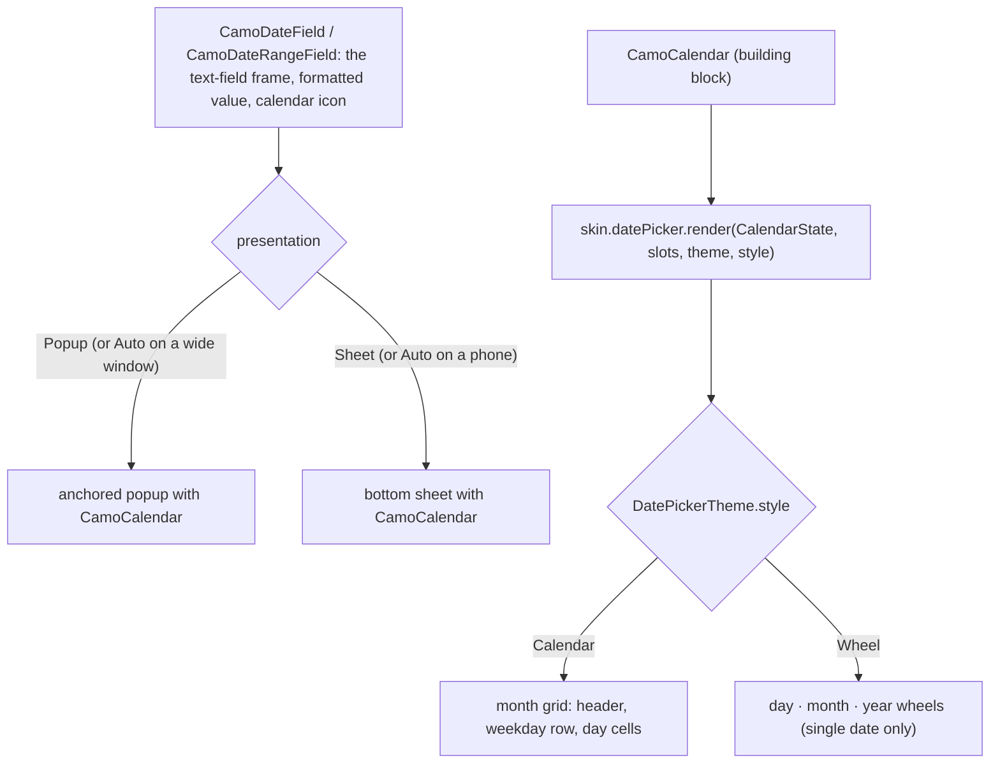
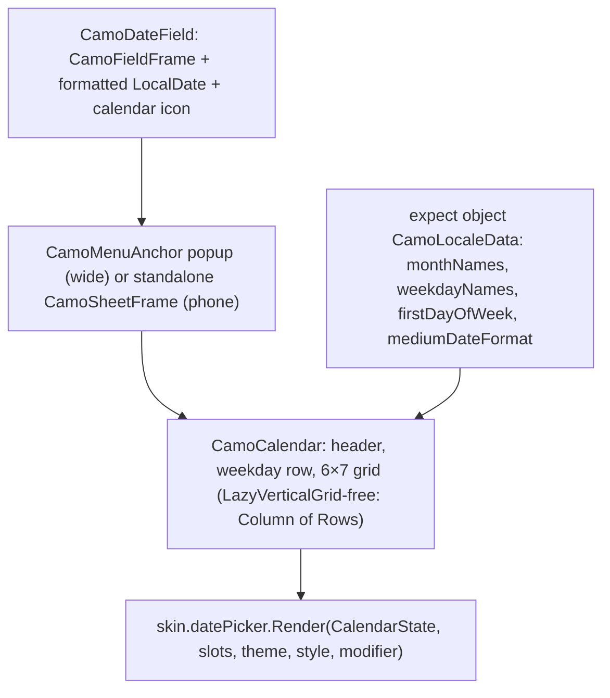
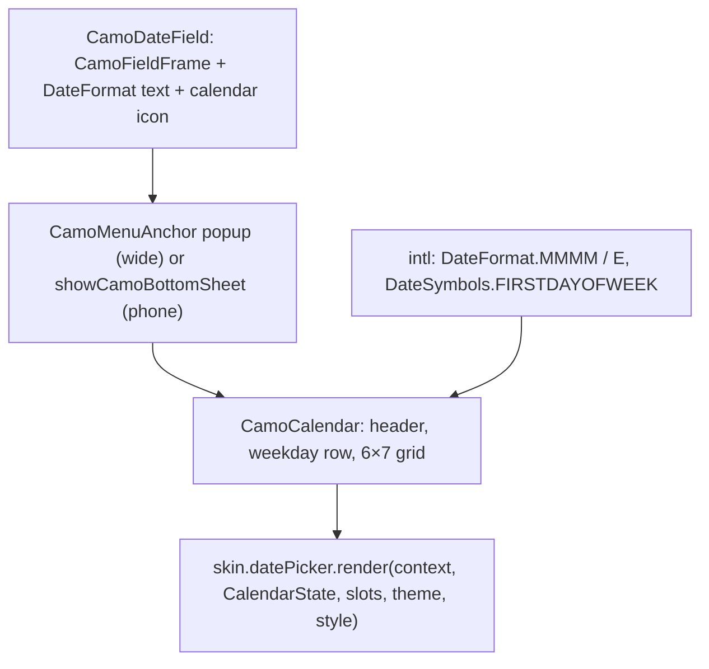

{/* Generated by docs/scripts/sync_vault.py from the Camouflage design notes. Edit the notes and re-run the script; changes made here are overwritten. */}

# CamoDatePicker

## Concept {#concept}

### 1. Why

Birth dates, bookings, delivery slots and date filters appear in almost every product, and a date picker is the first component apps borrow from Material. Camouflage builds it (ADR-35), following the pattern already used by [CamoSelect](/components/inputs/camo-select): a **field** that shows the chosen date and opens a **calendar**, in a sheet on phones and a popup on wide windows. It covers a single date and a date range, and exposes the calendar as a building block (ADR-30) for inline use.

### 2. Shape



**Material mapping preview:** the M3 docked date picker on wide windows and the modal date picker on phones: a month header with previous/next buttons, a weekday row, circular day cells with `primary` for the selected day and an outlined circle for today; the range shows a `primaryContainer` band. See [Material Skin](/guide/skins/material-skin).

### 3. API

#### Contract

```kotlin
fun CamoDateField(
    value: CamoDate?,                         // a calendar date, no time or time zone
    onValueChange: (CamoDate) -> Unit,
    label: String? = null,
    placeholder: String? = null,
    supportingText: String? = null,
    error: String? = null,
    minDate: CamoDate? = null,
    maxDate: CamoDate? = null,
    isSelectable: ((CamoDate) -> Boolean)? = null,   // e.g. no weekends, no holidays
    presentation: PickerPresentation = Auto,         // Auto | Popup | Sheet
    enabled: Boolean = true,
)

fun CamoDateRangeField(
    value: CamoDateRange?,                    // start..end, inclusive
    onValueChange: (CamoDateRange) -> Unit,
    /* … the same field parameters … */
    maxLength: Int? = null,                   // e.g. at most 14 nights
)

// building block (ADR-30): an inline calendar, for booking screens and custom pickers
fun CamoCalendar(
    selection: CalendarSelection,             // Single(date?) | Range(start?, end?)
    onSelectionChange: (CalendarSelection) -> Unit,
    visibleMonth: CamoYearMonth,
    onVisibleMonthChange: (CamoYearMonth) -> Unit,
    minDate: CamoDate? = null, maxDate: CamoDate? = null,
    isSelectable: ((CamoDate) -> Boolean)? = null,
)

// inside a form: CamoDateFormField(key, initialValue, rules, …) and CamoDateRangeFormField
```

| Parameter | What it's for |
|---|---|
| `value` | the chosen date. `CamoDate` is a plain calendar date (year, month, day), so there are no time-zone surprises. Platforms map it to their own type (Kotlin `LocalDate`, Dart a date-only `DateTime`). |
| `minDate`, `maxDate`, `isSelectable` | limits. Days outside are shown but disabled and announced as unavailable. |
| `presentation` | `Auto` picks a popup on wide windows (the select's rule, from `DatePickerTheme.autoPopupMinWidth`) and a sheet otherwise. |
| `maxLength` (range) | the longest allowed range; days beyond it disable once a start is picked. |
| `visibleMonth` (calendar) | controlled like everything else, so a booking screen can show two months side by side. |

**Selection flow:**
- Single date: tapping a day selects it; **Cancel/OK confirm it** (`DatePickerTheme.confirmButton`, default true, the same rule as the time picker). With `confirmButton = false`, a tap selects and closes.
- Range: the first tap sets the start, the second the end; a **Done** button confirms, and **Clear** resets. Tapping before the start restarts the range.

**The field's text** is `DatePickerTheme.displayFormat` (a pattern like `"d MMM yyyy"`), or the locale's medium date format when null. **Typing:** on desktop and web (a hardware keyboard and a pointer), the field is editable: a masked input in the locale's short date pattern (`dd/MM/yyyy`, `MM/dd/yyyy`, …), with the calendar icon still opening the picker. On touch devices it stays read-only and opens the picker. `DatePickerTheme.allowTyping` (`Auto` \| `Always` \| `Never`) changes this. A typed date that's incomplete or invalid doesn't call `onValueChange`; the field shows "Enter a valid date" (localizable) until it's fixed, and outside `minDate`/`maxDate` it says so.

**State → renderer:** `CalendarState(visibleMonth, days: List<CalendarDay>, weekdayLabels, firstDayOfWeek, selection, today, canGoPrevious, canGoNext)`, with `CalendarDay(date, inMonth, enabled, selected, rangePosition: None | Start | Middle | End, isToday)`. **Slots:** `CalendarSlots(previous, next, header)` (core-built buttons and the month/year header, which opens a year list). The field reuses the text-field renderer, the popup the anchored popup, the sheet the bottom-sheet renderer.

#### Tokens used

- `colors.primary` / `onPrimary` (selected day), `primaryContainer` / `onPrimaryContainer` (range band), `outline` (today), `onSurface` / `onSurfaceVariant` (days, weekday labels), disabled alphas on `onSurface`
- `typography.titleMedium` (month header), `labelMedium` (weekday row), `bodyMedium` (days)
- `shapes.full` (day cells), `spacing.s` / `spacing.m`
- `motion.durationMedium` (month slide)

#### Component theme

`theme.components.datePicker: DatePickerTheme?`. Every field is nullable in the theme. The skin's `defaults(theme)` fills whatever isn't set (Material defaults shown). See [Theme](/guide/foundations/theme) §3.10.

| Field | Type | Material default | What it's for |
|---|---|---|---|
| `style` | `Calendar` \| `Wheel` | `Calendar` | the picker's form (ADR-28; Cupertino: `Wheel` for single dates). A range always uses `Calendar`. |
| `firstDayOfWeek` | DayOfWeek? | null (the locale's) | a brand or market override |
| `displayFormat` | String? | null (the locale's medium format) | the field's date text |
| `confirmButton` | Boolean | true | Cancel/OK for single dates (a range always has Done); `false` selects and closes on tap |
| `allowTyping` | `Auto` \| `Always` \| `Never` | `Auto` | typing in the field: `Auto` = desktop and web |
| `showOutsideDays` | Boolean | false | show the previous/next month's days in the grid (dimmed) |
| `daySize` | Dp | 40 | day cell size (the touch target stays 48) |
| `autoPopupMinWidth` | Dp | 600 | the window width from which `Auto` uses a popup |
| `colors` | DatePickerColors(selected, onSelected, range, onRange, today, day, weekday, disabled) | as in Tokens used | every color it uses |

#### Accessibility

- The field is announced like a select: "Birth date, 14 October 2026, pop-up button".
- The calendar is a grid. Each day is a button with its **full date** and state: "Tuesday, 14 October 2026, selected", "…, today", "…, unavailable". Range ends are announced ("start of range", "end of range").
- **Keyboard:** arrows move by day, PageUp/PageDown by month, Shift+PageUp/PageDown by year, Home/End to the week's start and end, Enter selects, Esc closes and returns focus to the field.
- Month changes are announced ("November 2026").
- Screen readers get the same **Wheel** fallback rule: a wheel is an adjustable control (swipe up/down).

### 4. Build steps

1. `CamoDate`, `CamoYearMonth`, `CamoDateRange` and the calendar math in core (days of a month, first weekday, clamping), fully unit-tested.
2. `CamoCalendar` (grid, header, year list, keyboard), `DatePickerRenderer`, the DebugSkin renderer (a table of numbers).
3. `CamoDateField` (popup and sheet), `CamoDateRangeField`, the form fields.
4. The wheel style.
5. Sample: a birth date (with `maxDate = today`), a delivery date that skips weekends (`isSelectable`), a hotel booking range with `maxLength = 14`, an inline two-month `CamoCalendar`.
6. Tests: month math across leap years; selection flows; min/max/isSelectable disable days; keyboard navigation; the announcements; RTL (the grid mirrors, "previous" points right).

**Done when**
- [ ] The four samples work by touch, keyboard and screen reader on every platform, in two locales with different first days of the week.

### 5. Edge cases

| Case | Decided behavior |
|---|---|
| Time zones | Not involved: `CamoDate` has no time. Apps convert to and from instants in their own layer. |
| Locales | Month and weekday names and the first day of the week come from the platform's locale data. Non-Gregorian calendars are Later. |
| `value` outside `minDate`/`maxDate` | Shown as is (the app's data wins); the calendar opens on that month with the day marked invalid. |
| Typing a date | On desktop and web by default (`allowTyping = Auto`); the mask follows the locale's short pattern, and two-digit years aren't accepted. |
| Range across months | The calendar scrolls or pages between months; the band continues. |
| Very old dates (birth years) | The header opens a year list; the sheet starts on the month of `value`, else `maxDate`, else today. |

## Implementation {#implementation}

<KotlinOnly>

### 1. Why {#kotlin-1-why}

The Kotlin date picker on **`kotlinx-datetime`** (`LocalDate`, core's first non-UI dependency, ADR-35). The Kotlin-specific parts: localized month and weekday names and the first day of the week, which `kotlinx-datetime` doesn't provide (its names are English only), so they come from a small `expect`/`actual` locale layer; and a keyboard-navigable grid in Compose.

### 2. Shape {#kotlin-2-shape}



### 3. API {#kotlin-3-api}

```kotlin
public typealias CamoDate = kotlinx.datetime.LocalDate
@Immutable public data class CamoYearMonth(val year: Int, val month: Month)
@Immutable public data class CamoDateRange(val start: LocalDate, val endInclusive: LocalDate)

@Composable
public fun CamoDateField(
    value: LocalDate?, onValueChange: (LocalDate) -> Unit, modifier: Modifier = Modifier,
    label: String? = null, placeholder: String? = null, supportingText: String? = null, error: String? = null,
    minDate: LocalDate? = null, maxDate: LocalDate? = null, isSelectable: ((LocalDate) -> Boolean)? = null,
    presentation: PickerPresentation = PickerPresentation.Auto, enabled: Boolean = true,
)
@Composable public fun CamoDateRangeField(value: CamoDateRange?, onValueChange: (CamoDateRange) -> Unit, /* … */ maxLength: Int? = null)
@Composable public fun CamoCalendar(selection: CalendarSelection, onSelectionChange: (CalendarSelection) -> Unit,
    visibleMonth: CamoYearMonth, onVisibleMonthChange: (CamoYearMonth) -> Unit, modifier: Modifier = Modifier,
    minDate: LocalDate? = null, maxDate: LocalDate? = null, isSelectable: ((LocalDate) -> Boolean)? = null)

internal expect object CamoLocaleData {
    fun monthNames(locale: String): List<String>          // Android/JVM: java.time TextStyle.FULL; iOS: NSDateFormatter.standaloneMonthSymbols; web: Intl.DateTimeFormat
    fun weekdayNarrowNames(locale: String): List<String>
    fun firstDayOfWeek(locale: String): DayOfWeek         // java.time WeekFields; NSCalendar.firstWeekday; Intl.Locale.getWeekInfo()
    fun formatMedium(date: LocalDate, locale: String): String
}
```

- **Locale:** `Locale.current.toLanguageTag()` (Compose's multiplatform `androidx.compose.ui.text.intl.Locale`) feeds `CamoLocaleData`; `style.firstDayOfWeek` / `style.displayFormat` override it.
- **Today:** `Clock.System.todayIn(TimeZone.currentSystemDefault())`, read once per open.
- **Grid:** six `Row`s of seven day cells (a fixed grid keeps the height stable across months). Each cell is `Modifier.selectable(role = Role.Button)` with `semantics { contentDescription = fullDate; selected = …; stateDescription = "today" / "start of range" }`; the grid has `collectionInfo(rows = 6, columns = 7)`.
- **Keyboard:** the focused day is state; `onPreviewKeyEvent` maps arrows (±1 / ±7 days, mirrored in RTL), PageUp/PageDown (month), Shift+Page (year), Home/End (week), Enter (select); moving past the month changes `visibleMonth`.
- **Month change:** `AnimatedContent` slides the grid (direction from the change); `LiveRegionMode.Polite` announces the new month.
- **Wheel style:** three `LazyColumn`s with `rememberSnapFlingBehavior`, each an adjustable control (`setProgress`).

**Confirm and typing:**
- Single dates confirm with Cancel/OK by default (`style.confirmButton`); a range always has Done.
- `allowTyping = Auto` resolves through `internal expect val camoPrefersTyping: Boolean` (true on `jvm` desktop and `wasmJs`, false on Android and iOS). The editable field is a `BasicTextField` with a `CamoDisplayFormat.pattern` built from the locale's short date pattern (`CamoLocaleData.shortDatePattern(locale)`); a complete input is parsed with `LocalDate.Format { … }` built from the same pattern. Incomplete or invalid input keeps `value` unchanged and shows the "Enter a valid date" supporting text via `Modifier.camoError`.

### 4. Build steps {#kotlin-4-build-steps}

1. `CamoYearMonth`, range types, calendar math (`commonTest` across leap years and every first weekday).
2. `CamoLocaleData` actuals for android, jvm, ios, wasmJs; tests per target with two locales.
3. `CamoCalendar`, `DatePickerTheme` / `Style`, the DebugSkin renderer; the fields; the wheel style; form fields.
4. UI tests: selection flows, disabled days, keyboard, announcements, RTL.

**Done when**
- [ ] The four base samples run on Android, iOS, desktop and web in `en-US` (Sunday first) and `id-ID` (Monday first) with localized names.

### 5. Edge cases {#kotlin-5-edge-cases}

| Case | Decided behavior |
|---|---|
| Web month names | `Intl` via `kotlinx.browser`/`js()` interop in the wasmJs actual. |
| Process death with the sheet open | `visibleMonth` and the focused day are `rememberSaveable`; the field reopens on the same month. |
| Apps on `java.time` (Android only) | Convert with `toJavaLocalDate()` / `toKotlinLocalDate()` (kotlinx-datetime's converters). |

</KotlinOnly>

<DartOnly>

### 1. Why {#dart-1-why}

The Flutter date picker without Material's `showDatePicker`. Dates are date-only `DateTime`s (normalized to midnight), and localized names and the first day of the week come from **`intl`** (`DateFormat`, `DateSymbols`), core's first non-Flutter dependency (ADR-35).

### 2. Shape {#dart-2-shape}



### 3. API {#dart-3-api}

```dart
class CamoDateField extends StatefulWidget {
  const CamoDateField({super.key, required this.value, required this.onChanged, this.label, this.placeholder,
      this.supportingText, this.error, this.firstDate, this.lastDate, this.selectableDayPredicate,
      this.presentation = PickerPresentation.auto, this.enabled = true});
  final DateTime? value;     // date-only: DateTime(y, m, d)
}
class CamoDateRangeField extends StatefulWidget { /* value: CamoDateRange?, onChanged, …, maxLength */ }
class CamoCalendar extends StatelessWidget {
  const CamoCalendar({super.key, required this.selection, required this.onSelectionChanged,
      required this.visibleMonth, required this.onVisibleMonthChanged, this.firstDate, this.lastDate, this.selectableDayPredicate});
}
```

- Flutter naming (like `showDatePicker`): `firstDate`/`lastDate`/`selectableDayPredicate` for the base's `minDate`/`maxDate`/`isSelectable`. Flutter's `DateTimeRange` lives in `material`, so core defines its own **`CamoDateRange`** and stays Material-free.
- **Locale:** `Localizations.localeOf(context)`; `DateFormat.yMMMd(locale)` for the field unless `style.displayFormat`; weekday labels from `DateFormat.E`; `firstDayOfWeek` from `DateSymbols` unless overridden. `intl`'s locale data is initialized by `CamouflageApp` (`initializeDateFormatting`) or by the app.
- **Normalization:** every incoming `DateTime` is reduced with a `dateOnly` helper, and comparisons use year/month/day, so DST and time zones can't shift a day.
- **Grid semantics:** each day is `Semantics(button: true, selected: …, label: DateFormat.yMMMMEEEEd(locale).format(day))`; the grid is a `FocusTraversalGroup` with arrow-key `Shortcuts` (±1/±7 days, RTL-mirrored), PageUp/Down months, Shift for years.
- **Month change:** `AnimatedSwitcher` slide; `SemanticsService.announce(monthLabel, textDirection)`.
- **Wheel style:** `ListWheelScrollView` (widgets library) per part, each with adjustable semantics (`onIncrease`/`onDecrease`).

**Confirm and typing:**
- Single dates confirm with Cancel/OK by default (`style.confirmButton`); a range always has Done.
- `allowTyping: auto` means `kIsWeb || {TargetPlatform.macOS, .windows, .linux}.contains(defaultTargetPlatform)`. The field then becomes an `EditableText` with a mask from `DateFormat.yMd(locale).pattern` (normalized to two-digit day and month, four-digit year), parsed with `DateFormat.parseStrict`; invalid input keeps `value` and shows "Enter a valid date" through `CamoErrorSemantics`.

### 4. Build steps {#dart-4-build-steps}

1. `dateOnly`, month math, `CamoDateRange` (unit tests incl. DST days).
2. `CamoCalendar`, theme/style, the DebugSkin renderer; the fields; the wheel style; form fields.
3. Widget tests: selection flows, disabled days, keyboard, semantics labels in `en_US` and `id_ID`, RTL.

**Done when**
- [ ] The four base samples run on all six platforms in two locales with different first weekdays.

### 5. Edge cases {#dart-5-edge-cases}

| Case | Decided behavior |
|---|---|
| A `DateTime` with a time part | Normalized to its date; the time is dropped (documented). |
| `intl` not initialized for the locale | Falls back to `en` names and logs once in debug. |

</DartOnly>
