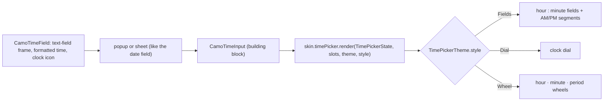
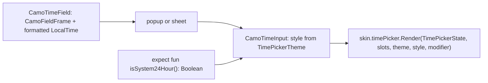
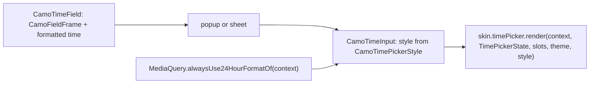

{/* Generated by docs/scripts/sync_vault.py from the Camouflage design notes. Edit the notes and re-run the script; changes made here are overwritten. */}

# CamoTimePicker

## Concept {#concept}

### 1. Why

Appointments, reminders and delivery slots need a time. Like the date picker (ADR-35), it's a field that opens a picker, with the picker's form chosen by the theme: typed fields (Minimal), a dial (Material) or wheels (Cupertino). Every dialect can draw all three, so the form is a theme choice (ADR-28), not a skin rule.

### 2. Shape



**Material mapping preview:** the M3 time picker dial with the hour/minute boxes above it and an AM/PM toggle. See [Material Skin](/guide/skins/material-skin).

### 3. API

#### Contract

```kotlin
fun CamoTimeField(
    value: CamoTime?,                          // hour + minute, no date or time zone
    onValueChange: (CamoTime) -> Unit,
    label: String? = null, placeholder: String? = null,
    supportingText: String? = null, error: String? = null,
    minuteStep: Int = 1,                       // 5, 15, 30 for slot pickers
    use24Hour: Boolean? = null,                // null → the device setting
    minTime: CamoTime? = null, maxTime: CamoTime? = null,
    presentation: PickerPresentation = Auto,
    enabled: Boolean = true,
)

// building block (ADR-30): the inline time input
fun CamoTimeInput(value: CamoTime?, onValueChange: (CamoTime) -> Unit, minuteStep: Int = 1, use24Hour: Boolean? = null)

// inside a form: CamoTimeFormField(key, initialValue, rules, …)
```

- `use24Hour = null` follows the device (the user's 12/24-hour setting), so the same app shows "14:30" or "2:30 PM" as the user expects.
- `minuteStep` limits minutes to multiples; a value off the step is shown as is but the picker snaps when changed.
- The field's text uses the locale's short time format.

**State → renderer:** `TimePickerState(hour, minute, is24Hour, period: Am | Pm, activePart: Hour | Minute, minuteStep, interaction)`. **Slots:** core-built input fields (for `Fields`), and the confirm buttons when the theme asks for them.

#### Tokens used

- `colors.primary` (active part, dial hand), `primaryContainer` (the selected part's box), `surfaceContainerHighest` (dial face, field boxes), `onSurface` / `onSurfaceVariant`
- `typography.displayMedium` (time digits in `Fields` and `Dial`), `bodyLarge` (wheel items)
- `shapes.small`, `motion.durationShort`

#### Component theme

`theme.components.timePicker: TimePickerTheme?`. Every field is nullable in the theme. The skin's `defaults(theme)` fills whatever isn't set (Material defaults shown).

| Field | Type | Material default | What it's for |
|---|---|---|---|
| `style` | `Fields` \| `Dial` \| `Wheel` | `Dial` | the picker's form (ADR-28; Minimal `Fields`, Cupertino `Wheel`) |
| `confirmButton` | Boolean | true | Cancel/OK buttons (a time has two parts, so it confirms by default) |
| `digitStyle` | CamoTextStyle | `displayMedium` | the big hour and minute digits |
| `colors` | TimePickerColors(active, activeContainer, face, digits, period) | as in Tokens used | every color it uses |

#### Accessibility

- The field is announced like a select: "Pickup time, 2:30 PM, pop-up button".
- `Fields`: two adjustable number fields ("Hour, 2", "Minute, 30") and a two-segment period control. Up/Down (keys and screen-reader swipes) change the value by 1 hour or by `minuteStep`.
- `Dial`: the dial is adjustable; screen readers get the same hour/minute adjustable controls as `Fields` (a dial isn't operable by swiping otherwise).
- `Wheel`: each wheel is an adjustable control.

### 4. Build steps

1. `CamoTime`, 12/24-hour conversion, step snapping (unit tests).
2. `CamoTimeInput` with the three styles, `TimePickerRenderer`, the DebugSkin renderer (two number fields).
3. `CamoTimeField` (popup and sheet), `CamoTimeFormField`.
4. Sample: a reminder (free time), a pickup slot (`minuteStep = 15`, `minTime`/`maxTime`), in 12- and 24-hour device settings.
5. Tests: conversion and snapping; each style changes the value by touch and keyboard; the device setting is followed; announcements.

**Done when**
- [ ] Both samples work in all three styles, both hour formats, on every platform.

### 5. Edge cases

| Case | Decided behavior |
|---|---|
| Time zones and dates | Not involved: `CamoTime` is a wall-clock time. Combining with a date is the app's job. |
| `minTime` > `maxTime` (an overnight window) | Allowed: the valid range wraps past midnight. |
| Seconds | Not in v1. |

## Implementation {#implementation}

<KotlinOnly>

### 1. Why {#kotlin-1-why}

The time picker on `kotlinx.datetime.LocalTime`, with the device's 12/24-hour setting read through a small `expect`/`actual`, and the three styles (`Fields`, `Dial`, `Wheel`) drawn by the skin.

### 2. Shape {#kotlin-2-shape}



### 3. API {#kotlin-3-api}

```kotlin
public typealias CamoTime = kotlinx.datetime.LocalTime

@Composable
public fun CamoTimeField(
    value: LocalTime?, onValueChange: (LocalTime) -> Unit, modifier: Modifier = Modifier,
    label: String? = null, placeholder: String? = null, supportingText: String? = null, error: String? = null,
    minuteStep: Int = 1, use24Hour: Boolean? = null, minTime: LocalTime? = null, maxTime: LocalTime? = null,
    presentation: PickerPresentation = PickerPresentation.Auto, enabled: Boolean = true,
)
@Composable public fun CamoTimeInput(value: LocalTime?, onValueChange: (LocalTime) -> Unit, modifier: Modifier = Modifier,
    minuteStep: Int = 1, use24Hour: Boolean? = null)

@Composable internal expect fun isSystem24Hour(): Boolean
// android: DateFormat.is24HourFormat(LocalContext.current); ios: the "j" skeleton of NSDateFormatter has no "a";
// jvm: DateTimeFormatterBuilder.getLocalizedDateTimePattern(...) has no "a"; wasmJs: Intl hourCycle is h23/h24
```

- **Fields:** two digits-only `BasicTextField`s (hour, minute) with `semantics { setProgress { … } }` so screen readers adjust them, plus a two-option `CamoSegmentedControl` for AM/PM.
- **Dial:** a `Canvas` face with 12 (or 24) positions; `pointerInput` drag maps the angle to the value; for screen readers the same two adjustable nodes as `Fields` are exposed (the dial itself is `clearAndSetSemantics`).
- **Wheel:** `LazyColumn`s with snap fling, each adjustable.
- The field text uses `CamoLocaleData.formatShortTime(time, locale, use24Hour)`.

### 4. Build steps {#kotlin-4-build-steps}

1. `isSystem24Hour` actuals, 12/24 conversion and step snapping (`commonTest`).
2. The three styles, `TimePickerTheme` / `Style`, the DebugSkin renderer; `CamoTimeField`, the form field.
3. UI tests: each style by touch and keyboard; the device setting; adjustable semantics.

**Done when**
- [ ] The reminder and pickup-slot samples work in all styles and both hour formats on all four targets.

### 5. Edge cases {#kotlin-5-edge-cases}

| Case | Decided behavior |
|---|---|
| The 24-hour setting changes while open (Android) | Read on each open; the open picker keeps its format. |
| Overnight windows | `minTime > maxTime` wraps past midnight (base). |

</KotlinOnly>

<DartOnly>

### 1. Why {#dart-1-why}

The time picker without Material's `showTimePicker`. Flutter gives the device's 12/24-hour preference directly (`MediaQuery.alwaysUse24HourFormatOf`), so no platform channel is needed; the three styles are drawn by the skin.

### 2. Shape {#dart-2-shape}



### 3. API {#dart-3-api}

```dart
@immutable class CamoTime { const CamoTime({required this.hour, required this.minute}); }   // core's own (TimeOfDay is Material)

class CamoTimeField extends StatefulWidget {
  const CamoTimeField({super.key, required this.value, required this.onChanged, this.label, this.placeholder,
      this.supportingText, this.error, this.minuteStep = 1, this.use24Hour, this.minTime, this.maxTime,
      this.presentation = PickerPresentation.auto, this.enabled = true});
}
class CamoTimeInput extends StatelessWidget { /* value, onChanged, minuteStep, use24Hour */ }
```

- `TimeOfDay` lives in `material`, so core defines **`CamoTime`** (with `fromDateTime`, `format(context)`).
- **Fields:** two digits-only `EditableText`s with `Semantics(value:, increasedValue:, decreasedValue:, onIncrease:, onDecrease:)`, and a two-segment `CamoSegmentedControl` for AM/PM.
- **Dial:** `CustomPaint` + `GestureDetector` (angle → value); for screen readers the dial is `ExcludeSemantics` and the two adjustable fields are exposed instead.
- **Wheel:** `ListWheelScrollView.useDelegate` with looping, each adjustable.
- Text: `DateFormat.jm(locale)` or `DateFormat.Hm(locale)` per the resolved hour format.

### 4. Build steps {#dart-4-build-steps}

1. `CamoTime`, conversion, snapping (unit tests).
2. The three styles, theme/style, the DebugSkin renderer; the field and form field.
3. Widget tests: each style; `MediaQuery(alwaysUse24HourFormat: true)` switches; adjustable semantics.

**Done when**
- [ ] Reminder and pickup-slot samples work in all styles and hour formats on six platforms.

### 5. Edge cases {#dart-5-edge-cases}

| Case | Decided behavior |
|---|---|
| Apps using `TimeOfDay` | `CamoTime.fromTimeOfDay` / `toTimeOfDay` live in the app (core can't import Material). |

</DartOnly>
