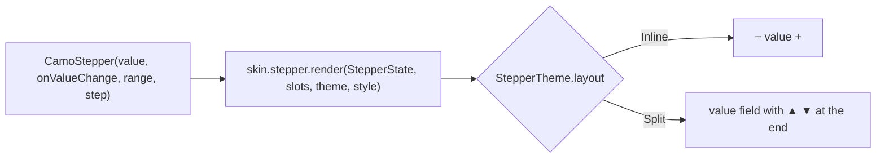
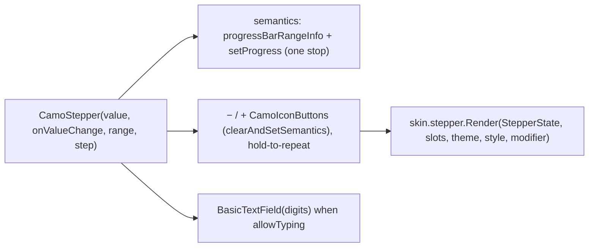
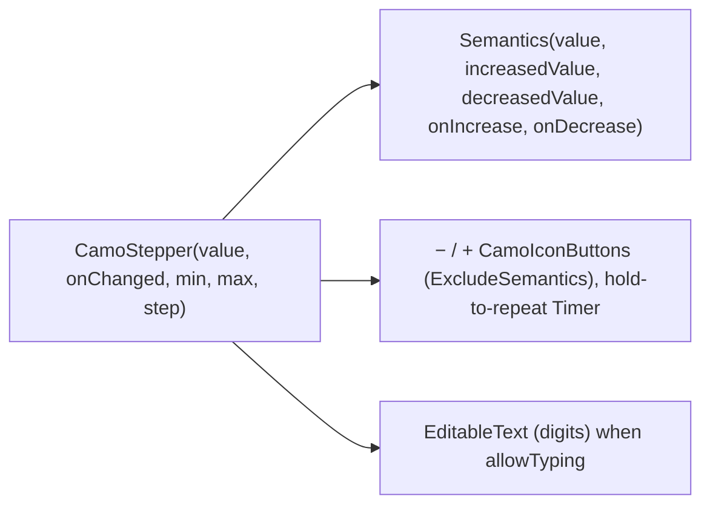

{/* Generated by docs/scripts/sync_vault.py from the Camouflage design notes. Edit the notes and re-run the script; changes made here are overwritten. */}

# CamoStepper

## Concept {#concept}

### 1. Why

A number input with − and + buttons: cart quantities, guest counts, passengers. Apple has a Stepper, Fluent a SpinButton, Carbon a number input; Material has none, so apps build it by hand. Camouflage makes it one controlled component (ADR-35).

### 2. Shape



**Material mapping preview:** Material has no stepper; the Material skin draws `Inline` with outlined icon buttons around a `titleMedium` value. See [Material Skin](/guide/skins/material-skin).

### 3. API

#### Contract

```kotlin
fun CamoStepper(
    value: Int,                                // whole numbers; the decimal overload is below
    onValueChange: (Int) -> Unit,
    range: IntRange = 0..Int.MAX_VALUE,
    step: Int = 1,
    label: String? = null,                     // accessible name ("Quantity"), shown if the skin draws labels
    allowTyping: Boolean = true,               // the value is an editable number field
    valueText: ((Int) -> String)? = null,      // e.g. { "$it nights" }
    error: String? = null,
    enabled: Boolean = true,
)
// decimals: weights, prices, doses
fun CamoStepper(
    value: CamoDecimal,                        // fixed-point, never a binary float (see §5)
    onValueChange: (CamoDecimal) -> Unit,
    range: ClosedRange<CamoDecimal>,
    step: CamoDecimal,                         // e.g. CamoDecimal("0.5"), CamoDecimal("0.25")
    decimals: Int,                             // shown and typed digits after the separator
    /* … the same other parameters … */
)
// inside a form: CamoStepperFormField(key, initialValue, rules, …)
```

- The − button disables at `range.first`, the + button at `range.last`.
- **Press and hold** repeats: after 400 ms, then faster, up to 10 changes per second.
- With `allowTyping`, the value is a digits-only text field; the typed value is clamped to `range` and snapped to `step` when focus leaves.

**State → renderer:** `StepperState(valueText, canDecrease, canIncrease, enabled, error: Boolean, interaction)`. **Slots:** `StepperSlots(decrease, increase, input)`: core-built icon buttons and the editable field.

#### Tokens used

- `colors.outline` (buttons, field), `onSurface`, the disabled alphas, `error`
- `typography.titleMedium` (value), `shapes.small`, `spacing.s`

#### Component theme

`theme.components.stepper: StepperTheme?`. Every field is nullable in the theme (Material defaults shown).

| Field | Type | Material default | What it's for |
|---|---|---|---|
| `layout` | `Inline` \| `Split` | `Inline` | − value + in a row, or a field with ▲▼ at the end (ADR-28; Fluent and Carbon: `Split`) |
| `buttonAppearance` | Appearance | `Outline` | the − and + buttons |
| `valueMinWidth` | Dp | 40 | keeps the layout from jumping between 9 and 10 |
| `decreaseIcon` / `increaseIcon` | IconSource? | the skin's − / + | a brand's own icons |
| `colors` | StepperColors(button, value, field, error) | as in Tokens used | every color it uses |

#### Accessibility

- **Three stops**: a "Decrease quantity" button, the value ("Quantity, 2", an editable field when `allowTyping`), and an "Increase quantity" button. Each change is announced politely ("3"). Buttons at a limit are announced as dimmed.
- On the focused value, keyboard Up/Down change it by `step`, PageUp/PageDown by 10 steps, Home/End to the ends.
- Value changes are announced politely.

### 4. Build steps

1. `CamoStepper` with clamping, stepping, hold-to-repeat, typing, `StepperRenderer`, the DebugSkin renderer.
2. `CamoStepperFormField`.
3. Sample: a cart line, a guest counter with `valueText`, a `Split` stepper in a form.
4. Tests: limits disable buttons; hold repeats; typing clamps and snaps on blur; the three screen-reader stops and the change announcement; decimal steps never drift (0.1 × 3 is exactly 0.3).

**Done when**
- [ ] The three samples work by touch, keyboard and screen reader on every platform.

### 5. Edge cases

| Case | Decided behavior |
|---|---|
| **Decimal values** | `CamoDecimal` is core's small **fixed-point** type on both platforms: an integer of units plus a `scale` (`12.50` = 1250 with scale 2), with parsing, formatting, add/subtract and compare. No dependency, and steps never drift. Apps convert to their own money or quantity types at the edge. The value is shown with the locale's decimal separator; typing accepts both `.` and `,`. |
| Typed value empty on blur | Restores the last valid value. |
| `range` changes so `value` is outside | The component shows the value and flags it as out of range (`error` semantics); the app decides whether to clamp. |

## Implementation {#implementation}

<KotlinOnly>

### 1. Why {#kotlin-1-why}

A quantity control. Compose specifics: hold-to-repeat with a coroutine, one adjustable semantics node (the buttons hidden from traversal), and an optional digits-only field that clamps on blur.

### 2. Shape {#kotlin-2-shape}



### 3. API {#kotlin-3-api}

```kotlin
@Composable
public fun CamoStepper(
    value: Int, onValueChange: (Int) -> Unit, modifier: Modifier = Modifier,
    range: IntRange = 0..Int.MAX_VALUE, step: Int = 1, label: String? = null,
    allowTyping: Boolean = true, valueText: ((Int) -> String)? = null, error: String? = null, enabled: Boolean = true,
)
@Composable
public fun CamoStepper(                                      // decimals
    value: CamoDecimal, onValueChange: (CamoDecimal) -> Unit, range: ClosedRange<CamoDecimal>, step: CamoDecimal,
    decimals: Int, modifier: Modifier = Modifier, /* … the same other parameters … */
)

@Immutable public data class CamoDecimal(val unscaled: Long, val scale: Int) : Comparable<CamoDecimal> {
    public constructor(text: String)                          // "12.50" → (1250, 2)
    public operator fun plus(o: CamoDecimal): CamoDecimal; public operator fun minus(o: CamoDecimal): CamoDecimal
    public fun format(locale: String): String                 // locale decimal separator
}
```

- **Hold to repeat:** `pointerInput { awaitEachGesture { … } }` on each button: after the first change, a `coroutineScope.launch` waits 400 ms, then repeats with a delay that shrinks to 100 ms, until release; each tick calls `onValueChange` with the **latest** value (`rememberUpdatedState`).
- **Semantics: three stops.** The − and + `CamoIconButton`s are normal buttons ("Decrease quantity" / "Increase quantity", disabled at the limits); the value is a text node (or the editable field) with `contentDescription = label` and `liveRegion = LiveRegionMode.Polite`, so each change is announced. Keyboard Up/Down/PageUp/PageDown/Home/End work on the focused value.
- **Typing:** a digits-only `BasicTextField` for `Int` (a digits + one separator filter for `CamoDecimal`, accepting `.` and `,`); on focus loss the text is parsed, clamped to `range`, snapped to `step`, and `onValueChange` is called if it differs.

### 4. Build steps {#kotlin-4-build-steps}

1. `CamoStepper`, `StepperTheme` / `Style`, the DebugSkin renderer, the form field.
2. UI tests: limits disable; hold repeats and stops on release; typing clamps on blur; three semantics stops with the value announced; decimal steps never drift.

**Done when**
- [ ] Cart, guest-counter and split samples work on all four targets.

### 5. Edge cases {#kotlin-5-edge-cases}

| Case | Decided behavior |
|---|---|
| Recomposition during hold | The repeat reads the latest value through `rememberUpdatedState`, so a controlled value that the app clamps stops the repeat. |

</KotlinOnly>

<DartOnly>

### 1. Why {#dart-1-why}

A quantity control in Flutter: hold-to-repeat with a `Timer`, three semantics stops with the value announced; decimal steps never drift, and an optional digits-only field that clamps when it loses focus.

### 2. Shape {#dart-2-shape}



### 3. API {#dart-3-api}

```dart
class CamoStepper extends StatefulWidget {
  const CamoStepper({super.key, required this.value, required this.onChanged,   // ValueChanged<int>?; null = disabled
      this.min = 0, this.max, this.step = 1, this.semanticLabel, this.allowTyping = true, this.valueText, this.error});
  const CamoStepper.decimal({super.key, required CamoDecimal value, required ValueChanged<CamoDecimal>? onChanged,
      required CamoDecimal min, CamoDecimal? max, required CamoDecimal step, required int decimals /* … */});
}
@immutable class CamoDecimal implements Comparable<CamoDecimal> {
  const CamoDecimal(this.unscaled, this.scale);      // 12.50 = CamoDecimal(1250, 2); no dependency
  factory CamoDecimal.parse(String text);
  CamoDecimal operator +(CamoDecimal other); CamoDecimal operator -(CamoDecimal other);
  String format(Locale locale);
}
```

- Flutter naming: `min`/`max` for the base's `range`; `onChanged: null` disables (the Flutter convention).
- **Hold to repeat:** `onLongPressStart` starts a `Timer` (400 ms, then shortening to 100 ms); `onLongPressEnd`/cancel stops it; each tick reads the widget's latest `value`.
- **Semantics: three stops.** The − and + `CamoIconButton`s are normal buttons ("Decrease quantity" / "Increase quantity"); the value is `Semantics(label: semanticLabel, value: …, liveRegion: true)` (or the editable field), announced on each change. Keyboard via `CallbackShortcuts` on the focused value.
- **Typing:** `FilteringTextInputFormatter.digitsOnly` for `int`, a digits + one separator formatter for `decimal` (`.` or `,`); clamp and snap on focus loss.

### 4. Build steps {#dart-4-build-steps}

1. The widget, theme/style, the DebugSkin renderer, the form field.
2. Widget tests with `fakeAsync`: limits; hold repeats and stops; typing clamps on blur; three semantics stops with the value announced; decimal steps never drift.

**Done when**
- [ ] Cart, guest-counter and split samples work on six platforms.

### 5. Edge cases {#dart-5-edge-cases}

| Case | Decided behavior |
|---|---|
| `max` null | No upper limit (`+` never disables). |

</DartOnly>
