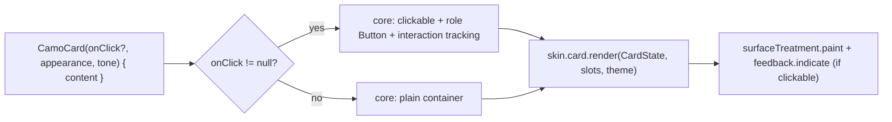
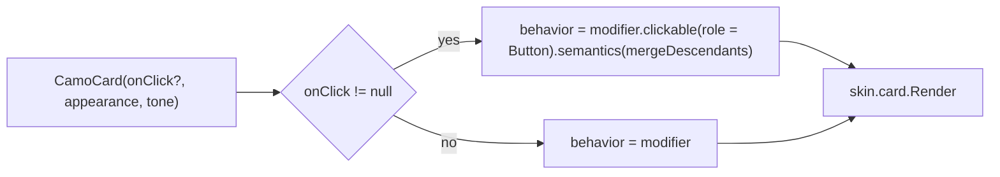
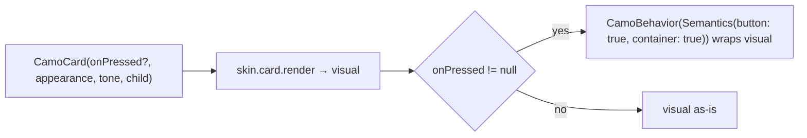

{/* Generated by docs/scripts/sync_vault.py from the Camouflage design notes. Edit the notes and re-run the script; changes made here are overwritten. */}

# CamoCard

## Concept {#concept}

### 1. Why

A card groups related content (a product, an article, a setting) into one visual unit, and is often tappable as a whole. `CamoCard` is a `CamoSurface` with three extra concerns: an **appearance** (solid, soft, raised or outline), a **tone** (default, or a status color for status panels), and **optional clickability** with press feedback. It reuses the surface treatment, so it looks right on every skin.

### 2. Shape



**Material mapping preview**

| Appearance | `tone = Default` | Material 3 | With a status `tone` (e.g. `Warning`) |
|---|---|---|---|
| `Solid` | `primary` fill, `onPrimary` content (a hero or highlight card) | – (Camouflage addition) | `warning` fill, `onWarning` content |
| `Soft` | `surfaceContainerHighest` fill, `onSurface` content | Filled card | `warningContainer` fill, `onWarningContainer` content |
| `Raised` (default) | `surfaceContainerLow` + `level1` | Elevated card | the same, plus a `warning` start border (4dp) |
| `Outline` | `surface` + `outlineVariant` border | Outlined card | `warning` border |

`Ghost` and `Link` fall back to `Outline` ([Design Language](/guide/foundations/design-language) §3.3).

See [Material Skin](/guide/skins/material-skin).

### 3. API

#### Contract

```kotlin
fun CamoCard(
    onClick: (() -> Unit)? = null,     // null → not clickable, no feedback, no role
    appearance: Appearance? = null,   // null → CardTheme.defaultAppearance (skin default: Raised)
    tone: Tone = Default,              // Error / Success / Warning / Info → status panel
    enabled: Boolean = true,           // only meaningful when clickable
    selected: Boolean? = null,         // non-null → a selectable card (plan, payment method, address pickers)
    content: Slot,
)
```

**State → renderer:** `CardState(appearance, tone, clickable = onClick != null, enabled, selected?, interaction: InteractionState)`. **Slots:** `CardSlots(content)`.

#### Tokens used

- `colors.primary`/`onPrimary`, `surfaceContainerHighest`, `surfaceContainerLow`, `surface`, `outlineVariant`, `onSurface`
- the tone's color family (`xContainer`, `onXContainer`, `x`) when `tone != Default`
- `shapes.medium`
- `elevation.level1` (resting) and `level2` (hover, clickable only)
- `spacing` for inner padding: **none by default**. The caller pads the content, because cards often hold edge-to-edge images.

#### Component theme

`theme.components.card: CardTheme?`. Every field is nullable in the theme. The skin's `defaults(theme)` fills whatever isn't set (Material defaults shown). See [Theme](/guide/foundations/theme) §3.10.

| Field | Type | Material default | What it's for |
|---|---|---|---|
| `defaultAppearance` | Appearance | `Raised` | the appearance used when a call passes none (ADR-28: a brand's default variant) |
| `shape` | Shape | `shapes.medium` | card corners |
| `contentPadding` | Padding | 0 | padding inside the card (0, because cards often hold edge-to-edge images) |
| `solidColors / softColors / raisedColors / outlineColors` | CardColors(container, content, border?) | per the table above | colors per appearance for `tone = Default` |
| `raisedElevation` | ElevationLevel | `Level1` (hover `Level2`) | depth of the Raised appearance |
| `borderWidth` | Dp | 1 | the Outline border |
| `selectedBorderColor` / `selectedBorderWidth` | Color / Dp | `primary` / 2 | the border of a selected card (a brand choice, ADR-28) |
| `showSelectedCheck` | Boolean | false | a check badge in the top-end corner of a selected card |

#### Accessibility

- Clickable: the role is button, and it's focusable. Its accessible name is the merged text of its content, unless the app sets one. There's a 48dp minimum, which a card nearly always exceeds.
- Not clickable: no role, and the content keeps its own semantics.
- Selectable (`selected` non-null): announced with its selected state ("Pro plan, selected"), and its content is merged into its label. In a single-choice group, the app wraps the cards in a container with radio-group semantics (see the recipe in §5).
- **No nested clickables inside a clickable card**. Screen readers can't reach them reliably. Documented as a usage rule, and flagged in debug builds when detected.

### 4. Build steps

1. Implement `CamoCard` in core. Wrap it in the platform's clickable plus interaction tracking only when `onClick != null`. Merge semantics when clickable.
2. `DebugSkin` card renderer: reuse its surface renderer with a border for `Outline`.
3. Sample: four cards (Solid/Soft/Raised/Outline), a `Soft + Warning` status panel, and one clickable card that navigates.
4. Test:
   - a non-clickable card has no click semantics;
   - a clickable card fires `onClick` once per tap;
   - `enabled = false` blocks clicks and shows the disabled look;
   - the appearance reaches the renderer.

**Done when**
- [ ] All four appearances render distinctly in light and dark.
- [ ] Press feedback appears only on clickable cards.
- [ ] A screen reader reads a clickable card as one button with its content as the name.

### 5. Edge cases

| Case | Decided behavior |
|---|---|
| A button inside a clickable card | Discouraged (see Accessibility). If it's really needed, make the card non-clickable and add an explicit "Open" button. |
| Long content at 200% font scale | The card grows vertically. It never has a fixed height. |
| A card in a horizontal carousel | The width comes from the parent. The card has no intrinsic width. |
| Disabled, non-clickable card | `enabled` is ignored (nothing to disable). The renderer draws the normal look. |
| RTL | No directional parts. The content mirrors on its own. The selected check moves to the top-left. |
| **Selectable cards** (settled 2026-09-27) | `selected = true/false` with `onClick`. The skin draws the selected border (and the check when `showSelectedCheck`). It passes ADR-23 (Fluent selectable Card, Carbon selectable tile, Material checkable card, Cupertino accent border + checkmark). |
| **Pick one of several cards** | A recipe, not a component: the app keeps the selected value and sets `selected = (plan == chosen)` on each card; `Modifier.selectableGroup()` (Compose) / `Semantics(inMutuallyExclusiveGroup)` (Flutter) around them. |
| `selected` without `onClick` | Display-only selection (a summary screen). No role or focus. |

## Implementation {#implementation}

<KotlinOnly>

### 1. Why {#kotlin-1-why}

A card is a surface with an appearance, a tone, and **optional** clickability. The Kotlin-specific question is how to add the behavior modifier only when `onClick != null`, so a non-clickable card has no role, no focus stop, and no feedback.

### 2. Shape {#kotlin-2-shape}



### 3. API {#kotlin-3-api}

```kotlin
@Composable
public fun CamoCard(
    modifier: Modifier = Modifier,
    onClick: (() -> Unit)? = null,
    appearance: Appearance? = null,      // null → CardTheme.defaultAppearance
    tone: Tone = Tone.Default,
    enabled: Boolean = true,
    selected: Boolean? = null,           // non-null → Modifier.selectable / semantics { selected = … }
    interactionSource: MutableInteractionSource? = null,
    content: @Composable () -> Unit,
)
```

- `CardTheme` / `CardStyle` have the fields from the base *Component theme* table: `shape`, `contentPadding`, `solidColors`, `softColors`, `raisedColors`, `outlineColors`, `raisedElevation`, `borderWidth`.
- `CardColors(container: Color, content: Color, border: Color?)`.
- The resolved `CardStyle.colorsFor(appearance, tone, theme)` follows the base table (Solid → strong fill, Soft → container fill, Raised → surface + depth, Outline → border). Core applies the fallbacks first: `Ghost`/`Link` → `Outline`.

**Behavior only when clickable:**

```kotlin
val behavior = if (onClick != null) modifier
    .clickable(source, indication = null, enabled = enabled, role = Role.Button, onClick = onClick)
    .semantics(mergeDescendants = true) {}
  else modifier
```

The renderer draws the feedback only when `state.clickable`. Hover elevation (`level1` → `level2` for Raised) is animated with `animateDpAsState(… , tween(theme.motion.durationShort))`.

### 4. Build steps {#kotlin-4-build-steps}

1. `CardTheme`, `CardStyle`, `CardColors`, `colorsFor`.
2. `CamoCard` with conditional behavior; `CardRenderer` in DebugSkin.
3. `commonTest`:
   - no `onClick` → no `Role.Button` in semantics, and not focusable;
   - with `onClick` → one merged node, and a click fires once;
   - `enabled = false` → the click is ignored;
   - `tone = Warning` + `Soft` → container equals `warningContainer`.

**Done when**
- [ ] Four appearances × two tones render in the sample. Only clickable cards show feedback and receive focus.

### 5. Edge cases {#kotlin-5-edge-cases}

| Case | Decided behavior |
|---|---|
| Nested clickable inside a clickable card | Compose delivers the tap to the innermost clickable. Semantics merging hides the inner one from screen readers, which is why the base discourages it. A debug check logs a warning when a clickable card's merged tree contains another click action. **On by default in debug builds**; `CamouflageDebug.nestedClickableWarnings = false` turns it off. |
| Hover on touch-only devices | `collectIsHoveredAsState` stays false. No special case needed. |
| Desktop right-click / context menu | Wrap the card in `CamoContextMenuArea` ([CamoMenu](/components/overlays/camo-menu#implementation)). |

</KotlinOnly>

<DartOnly>

### 1. Why {#dart-1-why}

A card is a surface with an appearance, a tone, and **optional** clickability. In Flutter the component wraps the renderer in `CamoBehavior` only when `onPressed != null`, so a plain card has no focus stop, no button semantics and no feedback.

### 2. Shape {#dart-2-shape}



### 3. API {#dart-3-api}

```dart
class CamoCard extends StatefulWidget {
  const CamoCard({super.key, this.onPressed, this.appearance, this.tone = Tone.defaultTone,
                  this.enabled = true, this.selected, required this.child});   // selected: bool? → Semantics(selected: …)
}
```

- `CamoCardTheme` / `CamoCardStyle` follow the base table.
- `CardColors(container, content, border)`.
- `style.colorsFor(appearance, tone, theme)` works like Kotlin's. The fallbacks (`ghost`/`link` → `outline`) are applied first.
- The hover elevation is animated with `TweenAnimationBuilder<double>` over `motion.durationShort`.

### 4. Build steps {#dart-4-build-steps}

1. Types, the component, and the DebugSkin renderer.
2. Widget tests:
   - no `onPressed` → no button semantics and not in focus traversal (`FocusTraversalGroup` order check);
   - with `onPressed` → a tap fires once, and it's one merged semantics node;
   - `enabled: false` → no fire;
   - `tone: warning` + `soft` → container is `warningContainer`.

**Done when**
- [ ] Four appearances × two tones in the example. Only clickable cards show feedback and focus.

### 5. Edge cases {#dart-5-edge-cases}

| Case | Decided behavior |
|---|---|
| A nested button inside a clickable card | The gesture arena gives the tap to the inner button. Semantics merging would hide it, so it's discouraged (base). A debug assertion warns when a clickable card's subtree contains another `CamoBehavior`. On by default in debug; `CamouflageDebug.nestedClickableWarnings = false` turns it off. |
| Long-press or secondary click | Wrap the card in `CamoContextMenuArea` ([CamoMenu](/components/overlays/camo-menu#implementation)). |

</DartOnly>
