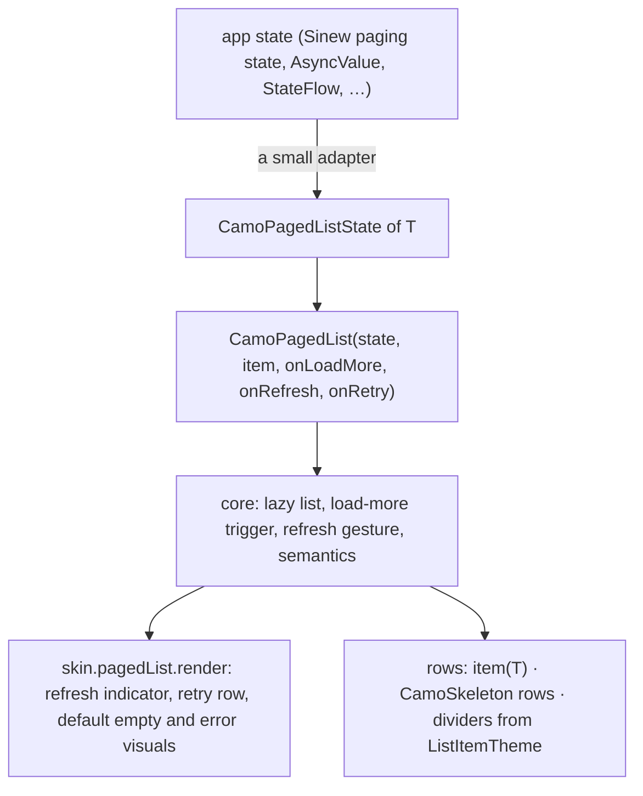
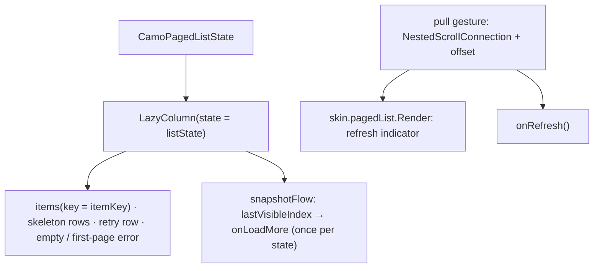
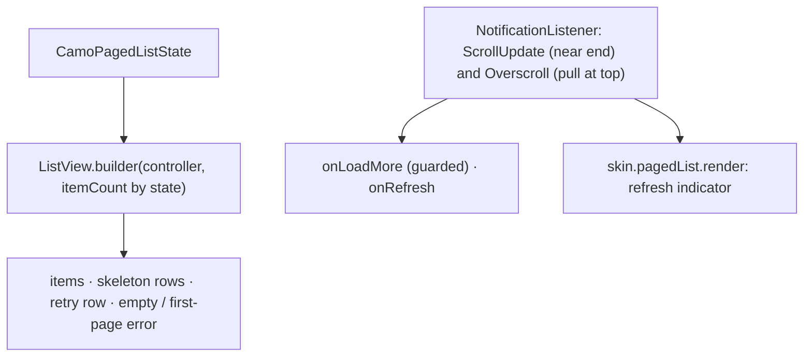

{/* Generated by docs/scripts/sync_vault.py from the Camouflage design notes. Edit the notes and re-run the script; changes made here are overwritten. */}

# CamoPagedList

## Concept {#concept}

### 1. Why

Almost every app has a list screen that loads from an API: pull to refresh, the next page when the user nears the end, skeleton rows while loading, an empty state, and a retry when something fails. Without a component, every app rebuilds this. `CamoPagedList` makes it one component.

It stays a **controlled UI component**: the app (or Sinew, or Paging 3, or a hand-written ViewModel) owns the data and passes a plain `CamoPagedListState` in. The list never fetches, never parses, and knows nothing about pages, cursors or responses (ADR-29).

### 2. Shape



**What the list shows, by state** (the author's rule: only the page being loaded shows skeletons, except refresh and search):

| `state.loading` | Items | What's drawn |
|---|---|---|
| `Initial` (first load, or a new search) | ignored | `initialSkeletonCount` skeleton rows |
| `Refresh` | ignored (default) | skeleton rows, plus the refresh indicator when started by the pull gesture. With `PagedListTheme.refreshKeepsItems = true`, the items stay and only the indicator shows. |
| `More` | shown | the items, then `moreSkeletonCount` skeleton rows at the end |
| `None` | shown | the items; the empty state when there are none; the first-page error when `error.scope = FirstPage`; the items plus a retry row when `error.scope = NextPage` |

**Material mapping preview:** a `LazyColumn` / `ListView` of list items with the M3 pull-to-refresh spinner, shimmer skeletons, and a centered empty state. See [Material Skin](/guide/skins/material-skin).

### 3. API

#### Contract

```kotlin
data class CamoPagedListState<T>(
    val items: List<T> = emptyList(),
    val loading: PagedLoad = PagedLoad.None,     // None | Initial | Refresh | More
    val endReached: Boolean = false,             // no more pages: onLoadMore is never called
    val error: PagedError? = null,               // PagedError(message: String, scope: FirstPage | NextPage)
)

fun <T> CamoPagedList(
    state: CamoPagedListState<T>,
    itemKey: (T) -> Any,                          // stable key per item (keeps scroll and animations right)
    onLoadMore: () -> Unit,                       // called when the user nears the end
    onRetry: () -> Unit,                          // the retry row and the first-page error's button
    item: (item: T, index: Int) -> Widget,        // usually a CamoListItem or a CamoCard
    onRefresh: (() -> Unit)? = null,              // null → no pull to refresh
    skeleton: Widget? = null,                     // one skeleton row; null → CamoSkeleton.listItem()
    empty: Widget? = null,                        // null → the skin's default empty state
    firstPageError: ((message: String) -> Widget)? = null,   // null → the skin's default error with a Retry button
    header: Widget? = null,                       // scrolls with the list (a search field, a summary)
    separator: ((index: Int) -> Widget)? = null,  // null → ListItemTheme.dividers
    // platform extras: modifier / scroll state (Compose LazyListState, Flutter ScrollController), content padding
)
```

| Parameter | What it's for |
|---|---|
| `state` | everything the list needs to know. The app builds it; `CamoPagedList` only reads it. |
| `itemKey` | a stable identity per item, so a refresh or a new page doesn't reset scroll or re-animate rows |
| `onLoadMore` | fired once when the last visible index reaches `items.size - prefetchDistance`, only when `loading = None`, `!endReached` and there's no `NextPage` error. It fires again only after the state changes. |
| `onRetry` | the user asked to retry the failed page (first or next). The app decides what to reload. |
| `onRefresh` | the pull gesture on touch devices. On desktop and web there's no gesture: the app offers a refresh action (a top-bar button) that calls its own refresh. |
| `skeleton`, `empty`, `firstPageError` | slots, because each product designs its own. The defaults come from the skin. |
| `separator` | a one-off override. Normally dividers come from the brand-wide `ListItemTheme.dividers` (ADR-28). |

**State → renderer:** `PagedListState(loading, endReached, errorScope?, isEmpty, refreshing)`, where `refreshing` is true while an `onRefresh` started by the pull gesture hasn't finished (the list tracks its own gesture, so an adapter may report a refresh as either `Initial` or `Refresh`). **Slots:** `PagedListSlots(retryRow, emptyDefault, errorDefault, refreshIndicator)`. The lazy list, the trigger and the row placement live in core; the renderer only draws the refresh indicator, the retry row and the default empty/error visuals.

**Adapters, outside Camouflage** (ADR-27: the app or a layer-3 glue module):

```kotlin
// Sinew (sinew_camouflage): PagingState<T> → CamoPagedListState<T>
//   Sinew's ViewState is Loading | Done | Failed (no Idle), and a PagingState starts as Loading + Initial,
//   so the list shows its skeleton from the first frame.
//   Loading: loadType maps directly (Initial / Refresh → no items, More → the previous items)
//   Done → None, endReached = !canLoadMore (the pager normalizes "has a next page" for every paging strategy)
//   Failed on Initial/Refresh → error FirstPage, on More → error NextPage with the previous items
//   The error text is rendered at conversion time with the app's localizer (backend text as sent, local keys translated),
//   so PagedError.message follows the current language.
fun <T> PagingState<T>.toCamo(localizer: Localizer?): CamoPagedListState<T>
// Riverpod AsyncValue<List<T>>: the same convention (loading with no value → Initial, with a value → More)
fun <T> AsyncValue<List<T>>.toCamo(endReached: Boolean): CamoPagedListState<T>
```

#### Tokens used

- the list item and divider tokens (rows are the app's own `CamoListItem`s)
- `colors.primary` (refresh indicator), `onSurfaceVariant` (empty and error text), the Error tone (the error icon)
- `typography.titleMedium` (empty/error title), `bodyMedium` (their message)
- `spacing.xl` around the empty and error states
- `motion.durationMedium` for items replacing skeletons

#### Component theme

`theme.components.pagedList: PagedListTheme?`. Every field is nullable in the theme. The skin's `defaults(theme)` fills whatever isn't set (Material defaults shown). See [Theme](/guide/foundations/theme) §3.10.

| Field | Type | Material default | What it's for |
|---|---|---|---|
| `initialSkeletonCount` | Int | 10 | skeleton rows for `Initial` and `Refresh` |
| `moreSkeletonCount` | Int | 3 | skeleton rows appended for `More` |
| `prefetchDistance` | Int | 5 | how many items before the end `onLoadMore` fires |
| `refreshKeepsItems` | Boolean | false | `true`: a refresh keeps the items and shows only the indicator (ADR-28: a product choice) |
| `emptyTitle / emptyMessage` | String | "Nothing here yet" / "" | the default empty state's text (localized by the app's theme) |
| `errorTitle / retryLabel` | String | "Something went wrong" / "Retry" | the default error texts |
| `itemFadeIn` | Boolean | true | items fade in when they replace skeletons |

#### Accessibility

- The list is exposed as a list (collection info when the platform supports it). Items keep their own semantics.
- **Skeletons are hidden from screen readers.** While `Initial`/`Refresh`, the list exposes one "Loading" live region instead. `More` announces "Loading more" politely, once.
- The retry row is a button ("Couldn't load more. Retry"). The first-page error's Retry button gets focus when the error appears.
- The empty state is plain text, read in order.
- Pull to refresh is never the only way to refresh on devices with a keyboard or screen reader: the app provides a refresh action (a guideline, checked in the sample).

### 4. Build steps

1. `CamoPagedListState`, `PagedLoad`, `PagedError` in core (shared with [CamoAsyncSelect](/components/inputs/camo-select)).
2. `CamoPagedList` in core: the lazy list with keys, the state → rows table from §2, the load-more trigger (once per state change), the pull gesture, header, separators from `ListItemTheme.dividers`.
3. `PagedListRenderer` and the DebugSkin renderer (a text refresh marker, a plain retry row, plain empty/error texts).
4. Sample: a product list on a fake paged API with a 1 s delay and a toggle to fail the next page, with a search field in `header` (a new query sets `Initial`).
5. Tests:
   - each row of the §2 table draws what it says;
   - `onLoadMore` fires once near the end, never while loading, after `endReached`, or with a `NextPage` error;
   - retry calls `onRetry`;
   - `refreshKeepsItems` switches the refresh look;
   - skeletons are hidden from semantics and "Loading" is announced;
   - scroll position survives a `More` load and a configuration change.

**Done when**
- [ ] The sample scrolls through 5 pages, fails and retries page 3, refreshes, and searches, matching the §2 table on every platform.
- [ ] A Sinew paging state and a Riverpod `AsyncValue` both drive it through a two-line adapter.

### 5. Edge cases

| Case | Decided behavior |
|---|---|
| **Refresh vs load more** | Sources should say which load is running. Sinew's `PagingState` has an explicit `loadType`, so its adapter maps it directly. Sinew drops the items on refresh, so `refreshKeepsItems = true` isn't supported through Sinew's glue. For a source without one (Riverpod `AsyncValue`), the convention works: loading with no data → `Initial`, loading with data → `More`. The pull indicator comes from the list's own gesture tracking. Only `refreshKeepsItems = true` needs a source that keeps data on refresh **and** reports `Refresh`. |
| A search while a page is loading | The app sets `Initial` for the new query. Dropping the stale response is the data layer's job (Sinew's `Pager` drops it by request order, and cancels the older fetch on Kotlin). The list just renders the state it gets. |
| Duplicate items across pages | `itemKey` must be unique. A debug warning names the duplicate key. |
| The first page is shorter than the screen | `onLoadMore` fires right away (the end is visible), until the screen is full or `endReached`. |
| Refresh while scrolled down | After the refresh completes, the list scrolls to the top. |
| Pull to refresh on desktop and web | No gesture. The skin draws no indicator unless `loading = Refresh`. |
| Grid layouts, sticky section headers | Not in v1 (`CamoPagedGrid`, sections: Later). |
| A `CamoListSection` around the list | Not supported (the list scrolls itself). Use `header` for a title, and `ListItemTheme.dividers` for separators. |

## Implementation {#implementation}

<KotlinOnly>

### 1. Why {#kotlin-1-why}

`CamoPagedList` is a controlled `LazyColumn`: it renders a `CamoPagedListState`, fires `onLoadMore` near the end, and offers pull to refresh. Compose's pull-to-refresh lives in Material 3, so core implements the gesture with a `NestedScrollConnection` and lets the skin draw the indicator. It never fetches (ADR-29).

### 2. Shape {#kotlin-2-shape}



### 3. API {#kotlin-3-api}

```kotlin
@Immutable public data class CamoPagedListState<T>(
    val items: List<T> = emptyList(),
    val loading: PagedLoad = PagedLoad.None,
    val endReached: Boolean = false,
    val error: PagedError? = null,
)

@Composable
public fun <T> CamoPagedList(
    state: CamoPagedListState<T>,
    itemKey: (T) -> Any,
    onLoadMore: () -> Unit,
    onRetry: () -> Unit,
    item: @Composable LazyItemScope.(item: T, index: Int) -> Unit,
    modifier: Modifier = Modifier,
    listState: LazyListState = rememberLazyListState(),
    onRefresh: (() -> Unit)? = null,
    skeleton: (@Composable () -> Unit)? = null,
    empty: (@Composable () -> Unit)? = null,
    firstPageError: (@Composable (message: String) -> Unit)? = null,
    header: (@Composable () -> Unit)? = null,
    separator: (@Composable (index: Int) -> Unit)? = null,
    contentPadding: PaddingValues = PaddingValues(0.dp),
)
```

**Load-more trigger:**
```kotlin
val latestState by rememberUpdatedState(state)
LaunchedEffect(listState) {
    snapshotFlow { listState.layoutInfo.visibleItemsInfo.lastOrNull()?.index ?: -1 }
        .map { last -> last >= latestState.items.size - style.prefetchDistance }
        .distinctUntilChanged()
        .filter { it }
        .collect {
            val s = latestState
            if (s.loading == PagedLoad.None && !s.endReached && s.error?.scope != PagedErrorScope.NextPage) onLoadMore()
        }
}
```
A short first page makes the end visible immediately, so `onLoadMore` fires until the screen fills or `endReached`. The trigger re-arms when `state` changes (the flag above flips back to false as new items arrive).

**Pull to refresh:** a `NestedScrollConnection` on the list collects overscroll at the top into `pullOffset` (with resistance), releasing past `style.refreshThreshold` calls `onRefresh()` and sets an internal `refreshing = true` until `state.loading` returns to `None`. The renderer draws the indicator from `PagedListState(refreshing, pullFraction)`. On desktop and web the connection sees no touch overscroll, so there's no gesture (by design).

**Rows by state:** a `when` over the §2 table of the base note: skeleton items (`key = "skeleton-$i"`), `items(state.items, key = { itemKey(it) })`, the retry row (`key = "retry"`), or a full-height `empty` / `firstPageError` item using `Modifier.fillParentMaxSize()`. Skeleton rows share one `CamoSkeletonGroup` for a synced shimmer. Dividers between item rows come from `ListItemTheme.dividers` unless `separator` is given.

**Semantics:** skeleton rows use `clearAndSetSemantics {}`; a hidden live-region node announces "Loading" (`Initial`/`Refresh`) or "Loading more" (`More`) with `LiveRegionMode.Polite`; the first-page error's Retry gets focus with a `FocusRequester` when it appears.

### 4. Build steps {#kotlin-4-build-steps}

1. The state types, `PagedListTheme` / `Style`, `CamoPagedList` rows by state.
2. The load-more trigger, then the pull-to-refresh connection; the DebugSkin renderer.
3. The sample on a fake paged repository with delays and a failure toggle, plus the Sinew adapter example (`state.products.toCamo()`, the `@Composable` overload that remembers Sinew's localizer).
4. `commonTest` + UI tests: every state row; `onLoadMore` once near the end and never while loading, after `endReached` or with a next-page error; pull past the threshold calls `onRefresh` once; scroll position survives a `More` load; items fade in (`Modifier.animateItem()`).

**Done when**
- [ ] The sample pages through 5 pages, fails and retries page 3, refreshes by pull on touch devices, and searches, on all four targets.

### 5. Edge cases {#kotlin-5-edge-cases}

| Case | Decided behavior |
|---|---|
| Keys | `itemKey` must be unique and stable; a duplicate key would crash `LazyColumn`, so core checks in debug and reports the key before Compose does. |
| Process death / rotation | The app's state survives in its view model; `listState` survives through `rememberLazyListState` (saveable). |
| Refresh while scrolled down | After the refresh finishes, `listState.animateScrollToItem(0)`. |
| Nested inside another vertical scroll | Not supported (a lazy list needs bounded height); a debug error explains it. |

</KotlinOnly>

<DartOnly>

### 1. Why {#dart-1-why}

A controlled `ListView.builder` that renders a `CamoPagedListState`, calls `onLoadMore` near the end, and supports pull to refresh. `RefreshIndicator` is Material, so core implements the pull gesture with scroll notifications and lets the skin draw the indicator. It never fetches (ADR-29).

### 2. Shape {#dart-2-shape}



### 3. API {#dart-3-api}

```dart
@immutable
class CamoPagedListState<T> {
  const CamoPagedListState({this.items = const [], this.loading = PagedLoad.none, this.endReached = false, this.error});
}

class CamoPagedList<T> extends StatefulWidget {
  const CamoPagedList({super.key, required this.state, required this.itemKey, required this.onLoadMore,
      required this.onRetry, required this.itemBuilder, this.controller, this.onRefresh, this.skeleton,
      this.empty, this.firstPageError, this.header, this.separatorBuilder, this.padding});
  final Widget Function(BuildContext context, T item, int index) itemBuilder;
  final Future<void> Function()? onRefresh;         // the indicator stays until the future completes
}
```

- **Load-more trigger:** a `NotificationListener<ScrollUpdateNotification>` checks `metrics.extentAfter < style.prefetchExtent`; the call is guarded (`loading == none`, `!endReached`, no next-page error) and re-armed when `state` changes (`didUpdateWidget`). After the first frame, a post-frame check calls it when the content doesn't fill the viewport.
- **Pull to refresh:** an `OverscrollNotification` / negative `pixels` at the top (with `AlwaysScrollableScrollPhysics`) accumulates `pullExtent`; releasing past `style.refreshThreshold` calls `onRefresh()` and shows the indicator until its `Future` completes **and** `state.loading` is back to `none`. On desktop and web mouse scrolling doesn't overscroll, so there's no gesture there.
- **Rows by state:** `itemCount` and the builder follow the base table; skeleton rows share one `CamoSkeletonGroup`; items use `ValueKey(itemKey(item))`; the empty and first-page error states use `SliverFillRemaining` semantics (a `LayoutBuilder` + `ConstrainedBox(minHeight: viewport)` inside a scrollable, so pull still works).
- **Semantics:** skeletons `ExcludeSemantics`; `SemanticsService.announce('Loading more', …)` once for `more`; the Retry button is focused when the first-page error appears.
- `onRefresh` returns a `Future` (the Flutter idiom); the base's plain callback maps to it.

### 4. Build steps {#dart-4-build-steps}

1. State types, `CamoPagedListTheme` / `Style`, rows by state.
2. The trigger, the pull gesture, the DebugSkin renderer.
3. The example on a fake paged repository with your page/event/effect notifier and the Sinew adapter (`state.products.toCamoOf(context)`, which reads Sinew's localizer from the context).
4. Widget tests: each state; `onLoadMore` once near the end (not while loading, after `endReached` or with a next-page error); pull past the threshold calls `onRefresh`; a short first page triggers load more.

**Done when**
- [ ] The example pages, fails and retries page 3, refreshes by pull on touch, and searches, on all six platforms.

### 5. Edge cases {#dart-5-edge-cases}

| Case | Decided behavior |
|---|---|
| Inside a `CustomScrollView` | v1 is a box widget; a sliver version (`SliverCamoPagedList`) is Later. |
| Refresh while scrolled down | After it completes, `controller.animateTo(0)`. |
| iOS bouncing physics | The pull uses the bounce overscroll directly; Android's clamping physics uses `OverscrollNotification`. Both reach the same threshold logic. |

</DartOnly>
