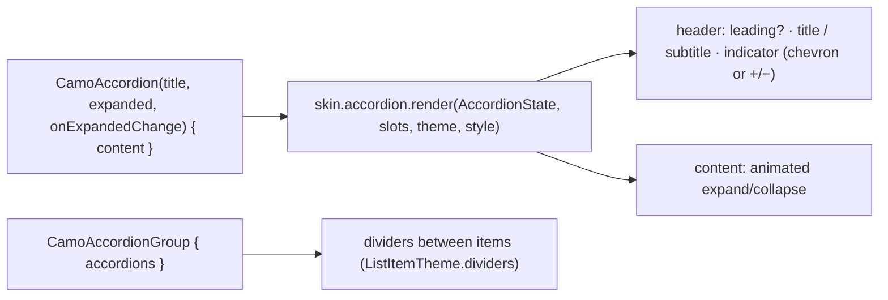
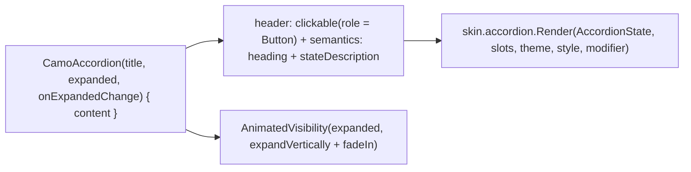
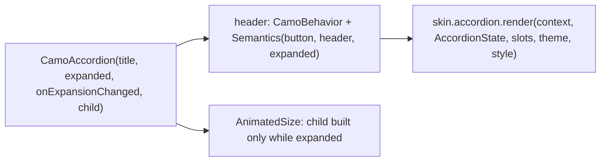

{/* Generated by docs/scripts/sync_vault.py from the Camouflage design notes. Edit the notes and re-run the script; changes made here are overwritten. */}

# CamoAccordion

## Concept {#concept}

### 1. Why

Expandable sections: FAQs, "Details" and "Shipping" panels on a product page, advanced settings. Apple has disclosure controls, Fluent and Carbon an Accordion; Material has no clean equivalent, so apps hand-roll it. Camouflage makes it a controlled component (ADR-35).

### 2. Shape



**Material mapping preview:** a list-item-like header (56 tall, `bodyLarge` title) with a trailing chevron that rotates 180°, and the content below with 16 padding. See [Material Skin](/guide/skins/material-skin).

### 3. API

#### Contract

```kotlin
fun CamoAccordion(
    title: String,
    expanded: Boolean,
    onExpandedChange: (Boolean) -> Unit,
    subtitle: String? = null,
    leading: Widget? = null,                   // an icon
    enabled: Boolean = true,
    content: Slot,
)

// a group with the one-open-at-a-time rule built in
fun <K> CamoAccordionGroup(
    expanded: Set<K>,                          // the open items' keys (controlled)
    onExpandedChange: (Set<K>) -> Unit,
    singleExpand: Boolean = false,             // true → opening one closes the others (FAQ)
    items: List<CamoAccordionItem<K>>,         // CamoAccordionItem(key, title, subtitle?, leading?, enabled, content)
)
```

- **Controlled:** the app owns `expanded` (a single accordion) or the set of open keys (a group). The group applies `singleExpand` itself: opening one item reports a set with only that key.
- Collapsed content **stays alive but hidden**: it keeps its state (a half-filled form, a scroll position), and while collapsed it's hidden from screen readers, not focusable and takes no space. Very heavy content can be loaded by the app only after the first expand.

**State → renderer:** `AccordionState(title, subtitle?, expanded, enabled, interaction)`. **Slots:** `AccordionSlots(leading?, content)`.

#### Tokens used

- `colors.onSurface` (title), `onSurfaceVariant` (subtitle, indicator), `outlineVariant` (dividers)
- `typography.bodyLarge` (title), `bodyMedium` (subtitle)
- `spacing.l` (padding), `motion.durationMedium` + `easingStandard` (expand)

#### Component theme

`theme.components.accordion: AccordionTheme?`. Every field is nullable in the theme (Material defaults shown).

| Field | Type | Material default | What it's for |
|---|---|---|---|
| `indicator` | `Chevron` \| `PlusMinus` | `Chevron` | the expand icon (ADR-28) |
| `indicatorPosition` | `End` \| `Start` | `End` | where the icon sits (Carbon: `End`, Apple disclosure: `Start`) |
| `headerMinHeight` | Dp | 56 | header row height |
| `contentPadding` | Padding | horizontal 16, bottom 16 | around the content |
| `titleStyle` / `subtitleStyle` | CamoTextStyle | `bodyLarge` / `bodyMedium` | texts |
| `expandedContainer` | Color? | null | an optional fill for an open section |

#### Accessibility

- The header is a button with an expanded/collapsed state: "Shipping, collapsed, button". Enter/Space toggles.
- The title is also exposed as a heading, so screen-reader users can jump between sections.
- Expanding moves nothing: focus stays on the header; the content follows in reading order.
- Reduced motion: expand and collapse are instant.

### 4. Build steps

1. `CamoAccordion`, `CamoAccordionGroup`, `AccordionRenderer`, the DebugSkin renderer (a header row and the content).
2. Sample: an FAQ with `singleExpand = true`, a product page with "Details" and "Shipping", a section with a form that keeps its input when collapsed.
3. Tests: toggling; `singleExpand` closes the others; collapsed content keeps its state but isn't focusable or announced; expanded/collapsed semantics and heading; dividers in a group; reduced motion.

**Done when**
- [ ] The FAQ and product-page samples work by touch, keyboard and screen reader on every platform.

### 5. Edge cases

| Case | Decided behavior |
|---|---|
| Very long content | It expands to its full height; the page scrolls, not the accordion. |
| Nested accordions | Allowed; each has its own header and heading level. |
| Deep links to a section ("#shipping") | The app sets `expanded = true` and scrolls to it; nothing special in the component. |

## Implementation {#implementation}

<KotlinOnly>

### 1. Why {#kotlin-1-why}

An expandable section. Compose specifics: `AnimatedVisibility` for the content (which also keeps collapsed content out of composition), the header's expanded state in semantics, and `CamoAccordionGroup` reusing the list section's divider layout.

### 2. Shape {#kotlin-2-shape}



### 3. API {#kotlin-3-api}

```kotlin
@Composable
public fun CamoAccordion(
    title: String, expanded: Boolean, onExpandedChange: (Boolean) -> Unit, modifier: Modifier = Modifier,
    subtitle: String? = null, leading: (@Composable () -> Unit)? = null, enabled: Boolean = true,
    interactionSource: MutableInteractionSource? = null,
    content: @Composable ColumnScope.() -> Unit,
)
@Composable public fun <K> CamoAccordionGroup(
    expanded: Set<K>, onExpandedChange: (Set<K>) -> Unit, items: List<CamoAccordionItem<K>>,
    modifier: Modifier = Modifier, singleExpand: Boolean = false,
)
public class CamoAccordionItem<K>(val key: K, val title: String, val subtitle: String? = null,
    val leading: (@Composable () -> Unit)? = null, val enabled: Boolean = true, val content: @Composable ColumnScope.() -> Unit)
```

- **Header semantics:** `semantics(mergeDescendants = true) { heading(); role = Role.Button; stateDescription = if (expanded) "expanded" else "collapsed"; onClick(label = if (expanded) "collapse" else "expand") { … } }`.
- **Content stays alive:** the content is always composed; a custom `Layout` animates its measured height between 0 and full (`animateFloatAsState` of the fraction) and clips it. While collapsed: `focusProperties { canFocus = false }` on the subtree and `clearAndSetSemantics {}`, so it's neither focusable nor announced, but its state (text fields, scroll) survives.
- **Indicator:** the renderer rotates the chevron with `animateFloatAsState(if (expanded) 180f else 0f)` or swaps +/−.
- **Group:** items keyed by `key`; `singleExpand` makes opening one report `setOf(key)`. Dividers come from `ListItemTheme.dividers`, with the same `Layout` as `CamoListSection`.

### 4. Build steps {#kotlin-4-build-steps}

1. `CamoAccordion`, `CamoAccordionGroup`, `AccordionTheme` / `Style`, the DebugSkin renderer.
2. UI tests: toggling; collapsed content keeps its state and isn't focusable or announced; `singleExpand`; heading + state semantics; dividers; reduced motion.

**Done when**
- [ ] The FAQ (`singleExpand`) and product-page samples work on all four targets.

### 5. Edge cases {#kotlin-5-edge-cases}

| Case | Decided behavior |
|---|---|
| Inside a `LazyColumn` | Each accordion is an item; expanding animates the item height (`Modifier.animateItem()`). |

</KotlinOnly>

<DartOnly>

### 1. Why {#dart-1-why}

An expandable section in Flutter: `AnimatedSize` + `ClipRect` for the content, which is only built while expanded, and header semantics with an expanded state and heading.

### 2. Shape {#dart-2-shape}



### 3. API {#dart-3-api}

```dart
class CamoAccordion extends StatelessWidget {
  const CamoAccordion({super.key, required this.title, required this.expanded, required this.onExpansionChanged,
      this.subtitle, this.leading, this.enabled = true, required this.child});
}
class CamoAccordionGroup<K> extends StatelessWidget {
  const CamoAccordionGroup({super.key, required this.expanded, required this.onExpandedChanged,
      required this.items, this.singleExpand = false});
}
class CamoAccordionItem<K> { const CamoAccordionItem({required this.key, required this.title, this.subtitle, this.leading, this.enabled = true, required this.child}); }
```

- Flutter naming: `onExpansionChanged` (like `ExpansionTile`, which is Material and not used).
- **Header semantics:** `Semantics(button: true, header: true, expanded: expanded, label: title)` (the `expanded` flag, Flutter 3.29+).
- **Content stays alive:** `AnimatedSize` around `Visibility(visible: expanded, maintainState: true, maintainAnimation: true)`, so collapsed content keeps its state, takes no space, and is excluded from focus and semantics.
- **Group:** items keyed by `key`; `singleExpand` makes opening one report `{key}`; `CamoDivider`s between items by `CamoListItemStyle.dividers`.

### 4. Build steps {#dart-4-build-steps}

1. The widgets, theme/style, the DebugSkin renderer.
2. Widget tests: toggling; collapsed child keeps its state and is excluded from semantics; `singleExpand`; semantics flags; dividers; reduced motion.

**Done when**
- [ ] FAQ and product-page samples work on six platforms.

### 5. Edge cases {#dart-5-edge-cases}

| Case | Decided behavior |
|---|---|
| In a `ListView.builder` | Works; the item's height animates with `AnimatedSize`. |

</DartOnly>
