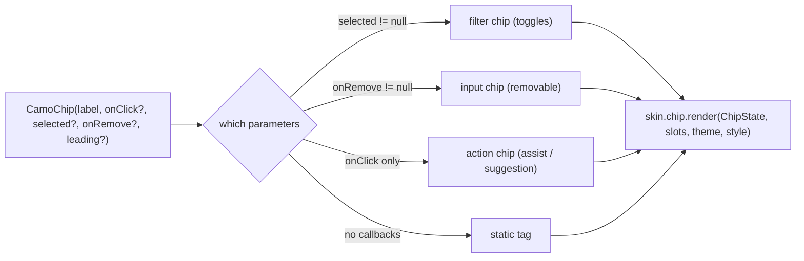
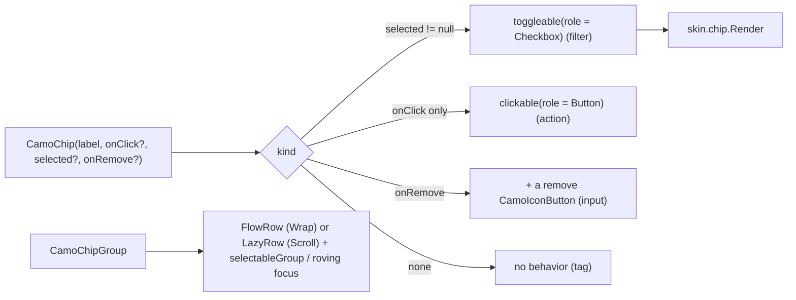
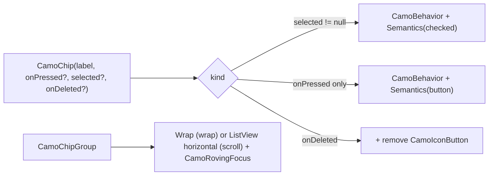

{/* Generated by docs/scripts/sync_vault.py from the Camouflage design notes. Edit the notes and re-run the script; changes made here are overwritten. */}

# CamoChip

## Concept {#concept}

### 1. Why

Chips are compact elements for filters ("Open now"), entered values (email recipients, tags), quick actions ("Add to calendar") and suggestions. Material has four chip types, Fluent has tags, and Carbon has tags. Camouflage uses **one component whose parameters decide the kind**. It reuses Appearance and Tone, so a "Warning" tag or an outlined filter needs no new vocabulary.

### 2. Shape



**Material mapping preview:** M3 chips.
- Height 32, `shapes.small`.
- `Outline` → `outline` border; `Soft` → `secondaryContainer` fill.
- A selected filter chip gets a `secondaryContainer` fill and a leading check.
- Input chips have a trailing ✕ (18).

### 3. API

#### Contract

```kotlin
fun CamoChip(
    label: String,
    onClick: (() -> Unit)? = null,
    selected: Boolean? = null,            // non-null → filter chip (toggle)
    onRemove: (() -> Unit)? = null,       // non-null → input chip with a remove button
    leading: Widget? = null,              // icon or small CamoAvatar
    appearance: Appearance? = null,   // null → ChipTheme.defaultAppearance (skin default: Outline); Outline | Soft | Solid (others fall back to Outline)
    tone: Tone = Default,
    enabled: Boolean = true,
)
```

**Chip groups:**

```kotlin
fun <T> CamoChipGroup(
    options: List<ChipOption<T>>,          // ChipOption(value, label, leading?, enabled)
    selected: Set<T>,
    onSelectionChange: (Set<T>) -> Unit,
    multiSelect: Boolean = true,           // false → single choice
    layout: ChipLayout = Wrap,             // Wrap (flow rows) | Scroll (one horizontal row, e.g. under a search bar)
    required: Boolean = false,             // single choice: the last selected chip can't be deselected
)
```

It draws filter chips (`selected` set per option) with `ChipTheme.groupSpacing` gaps, and gives the group the right semantics. It's the multi-select replacement for the segmented control (ADR-23). Plain `CamoChip`s in your own `FlowRow` / `Wrap` still work for anything custom (input chips, mixed kinds).

**State → renderer:** `ChipState(label, kind, selected, appearance, tone, enabled, interaction)`. **Slots:** `ChipSlots(leading?, remove?)`. The remove button is a small core-built icon button.

#### Tokens used

- the tone family, `outline`, `onSurfaceVariant`
- `shapes.small`, `typography.labelLarge`
- icons 18, `spacing.s` inner gaps

#### Component theme

`theme.components.chip: ChipTheme?`. Every field is nullable in the theme. The skin's `defaults(theme)` fills whatever isn't set (Material defaults shown). See [Theme](/guide/foundations/theme) §3.10.

| Field | Type | Material default | What it's for |
|---|---|---|---|
| `defaultAppearance` | Appearance | `Outline` | the appearance used when a call passes none (ADR-28: a brand's default variant) |
| `height` | Dp | 32 | chip height (the touch target stays 48) |
| `shape` | Shape | `shapes.small` | corners |
| `padding` | Padding | horizontal 16 (12 beside an icon) | inner padding |
| `textStyle` | CamoTextStyle | `labelLarge` | label |
| `iconSize` | Dp | 18 | leading and remove icons |
| `showCheckWhenSelected` | Boolean | true | a leading check on selected filter chips |
| `outlineColors / softColors / solidColors / selectedColors` | ChipColors(container, content, border?) | M3 values | colors per appearance and for the selected state |
| `groupSpacing` | Dp | `spacing.s` (8) | gaps between chips in `CamoChipGroup` (horizontal and between rows) |

#### Accessibility

- Filter chip: a toggle ("Open now, toggle, on").
- Action chip: a button.
- Input chip: its label, plus a separate "Remove *label*" button. Backspace/Delete removes it when the chip is focused.
- Static tag: text only.
- Touch targets are 48 even though the chip is 32 tall.
- `CamoChipGroup`: single choice is a radio group (each chip a radio, "Open now, 2 of 5, selected"); multi-select is a group of toggle buttons. The group label comes from the surrounding heading or an app-set semantics label. In `Scroll` layout, a focused chip scrolls into view.

### 4. Build steps

1. `CamoChip` with the kind derivation, the remove button, semantics per kind, and appearance fallbacks.
1a. `CamoChipGroup`: selection logic (single, multi, `required`), `Wrap` / `Scroll` layout, group semantics.
2. `ChipRenderer`, and the DebugSkin renderer.
3. Sample: a filter row (multi-select; this replaces a multi-select segmented control, ADR-23), recipient input chips, a suggestion row, and status tags (`Soft + Success` "Paid", `Soft + Warning` "Pending").
4. Tests: kind detection; toggle semantics; remove by button and by Delete key; the 48 target; `CamoChipGroup` single vs multi selection, `required`, radio-group semantics, and scroll-into-view on focus.

**Done when**
- [ ] All four kinds work and announce correctly. The status tags follow tone colors.

### 5. Edge cases

| Case | Decided behavior |
|---|---|
| `selected` and `onRemove` both set | Allowed (a removable filter). The toggle is the main action, and remove is separate. |
| Long labels | One line with an ellipsis, and the full label in semantics. |
| `CamoChipGroup` with `multiSelect = false` and `required = false` | Tapping the selected chip deselects it (an empty set). With `required = true`, it stays selected. |
| Status badge vs chip | Counts and dots are `CamoBadge`. Words with a status color are a static `CamoChip` (a tag). |

## Implementation {#implementation}

<KotlinOnly>

### 1. Why {#kotlin-1-why}

One composable covers four chip kinds (action, filter, input, static tag), chosen from which callbacks are set. Kotlin maps each kind to the right Compose modifier (`clickable`, `toggleable`, none) and builds `CamoChipGroup` on `FlowRow` / `LazyRow` with group semantics.

### 2. Shape {#kotlin-2-shape}



### 3. API {#kotlin-3-api}

```kotlin
@Composable
public fun CamoChip(
    label: String,
    modifier: Modifier = Modifier,
    onClick: (() -> Unit)? = null,
    selected: Boolean? = null,
    onRemove: (() -> Unit)? = null,
    leading: (@Composable () -> Unit)? = null,
    appearance: Appearance? = null,
    tone: Tone = Tone.Default,
    enabled: Boolean = true,
    interactionSource: MutableInteractionSource? = null,
)

@Composable
public fun <T> CamoChipGroup(
    options: List<ChipOption<T>>,
    selected: Set<T>,
    onSelectionChange: (Set<T>) -> Unit,
    modifier: Modifier = Modifier,
    multiSelect: Boolean = true,
    layout: ChipLayout = ChipLayout.Wrap,
    required: Boolean = false,
)
```

- **Filter chips:** `Modifier.toggleable(value = selected, role = Role.Checkbox, onValueChange = …)` announces "Open now, checkbox, checked". In a single-choice group each chip uses `selectable(role = Role.RadioButton)` instead, under `selectableGroup()`.
- **Input chips:** the remove button is a separate focusable node after the chip (`CamoIconButton(contentDescription = "Remove $label")`); `onKeyEvent` on the focused chip maps Backspace/Delete to `onRemove`.
- **Group layout:** `Wrap` = `FlowRow(horizontalArrangement = spacedBy(style.groupSpacing), verticalArrangement = spacedBy(style.groupSpacing))`; `Scroll` = `LazyRow` with the same spacing, and `bringIntoViewRequester` scrolls a focused chip into view. The roving focus helper from CamoRadio gives one Tab stop with arrow navigation.
- **Selection logic:** multi toggles membership; single replaces the set; `required = true` ignores deselecting the last chosen value.

### 4. Build steps {#kotlin-4-build-steps}

1. `ChipTheme` / `Style`, `CamoChip` with kind detection, the remove button, the DebugSkin renderer.
2. `CamoChipGroup` (Wrap and Scroll, single/multi, `required`).
3. `commonTest`: kinds and roles; Delete removes; group single vs multi vs required; the focused chip is brought into view in Scroll layout.

**Done when**
- [ ] A filter row (multi), a sort row (single, required, Scroll), recipient chips (input) and status tags render and announce correctly on every target.

### 5. Edge cases {#kotlin-5-edge-cases}

| Case | Decided behavior |
|---|---|
| `selected` and `onRemove` both set | The chip toggles on tap; remove is its own button. |
| Very many chips in `Scroll` | `LazyRow` only composes the visible ones. |

</KotlinOnly>

<DartOnly>

### 1. Why {#dart-1-why}

Four chip kinds from one widget, chosen by which callbacks are set, and `CamoChipGroup` built on `Wrap` or a horizontal `ListView`, with group semantics and the roving focus.

### 2. Shape {#dart-2-shape}



### 3. API {#dart-3-api}

```dart
class CamoChip extends StatefulWidget {
  const CamoChip({super.key, required this.label, this.onPressed, this.selected, this.onDeleted,
      this.leading, this.appearance, this.tone = Tone.defaultTone, this.enabled = true, this.focusNode});
}
class CamoChipGroup<T> extends StatelessWidget {
  const CamoChipGroup({super.key, required this.options, required this.selected, required this.onChanged,
      this.multiSelect = true, this.layout = ChipLayout.wrap, this.required = false});
  final ValueChanged<Set<T>> onChanged;
}
```

- Flutter naming: `onDeleted` (like Material's `InputChip`) for the base's `onRemove`.
- **Semantics:** filter chips `Semantics(checked: selected)`; in a single-choice group `inMutuallyExclusiveGroup: true` under `Semantics(role: SemanticsRole.radioGroup)`. The remove button is a separate focusable node; Backspace/Delete on a focused input chip calls `onDeleted` (`CallbackShortcuts`).
- **Layout:** `wrap` → `Wrap(spacing: style.groupSpacing, runSpacing: style.groupSpacing)`; `scroll` → `ListView(scrollDirection: Axis.horizontal)` with `Scrollable.ensureVisible` on focus.

### 4. Build steps {#dart-4-build-steps}

1. Types, the chip with kind detection, the group, the DebugSkin renderer.
2. Widget tests: kinds and semantics; Delete removes; single/multi/required; ensure-visible on focus.

**Done when**
- [ ] Filter row, sort row (single, required, scroll), recipient chips and status tags work on all platforms.

### 5. Edge cases {#dart-5-edge-cases}

| Case | Decided behavior |
|---|---|
| `selected` and `onDeleted` both set | Toggles on tap; remove is its own button. |

</DartOnly>
