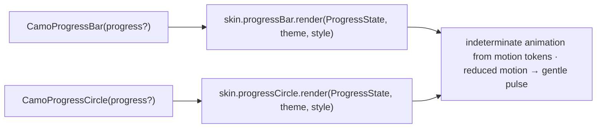
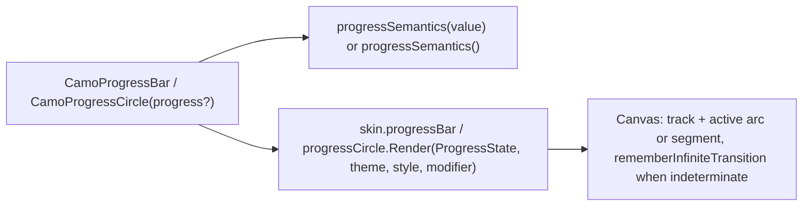
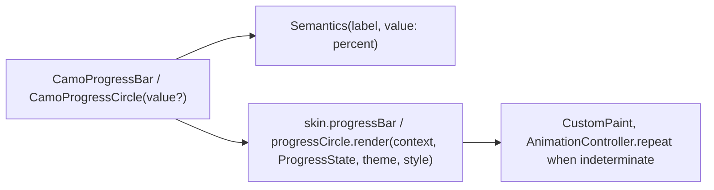

{/* Generated by docs/scripts/sync_vault.py from the Camouflage design notes. Edit the notes and re-run the script; changes made here are overwritten. */}

# CamoProgress

## Concept {#concept}

### 1. Why

Progress indicators show that work is happening: **determinate** when the fraction is known (an upload at 40%), **indeterminate** when it isn't (loading). There are two shapes, a **bar** and a **circle**. Every system has both, so Camouflage gives both, with tone support (a red failing upload).

### 2. Shape



**Material mapping preview:** M3 progress indicators (2024 update).
- Bar: 4 dp track, with an active `primary` part and a gap before the `secondaryContainer` track, plus a stop dot at the end.
- Circle: 48 diameter, stroke 4.

(The M3 Expressive "wavy" style is a skin option, `MaterialSkin(expressiveProgress = true)`, Later.)

### 3. API

#### Contract

```kotlin
fun CamoProgressBar(
    progress: Float? = null,          // null = indeterminate; 0f..1f = determinate
    tone: Tone = Default,
    label: String? = null,            // accessible name ("Uploading photo")
)
fun CamoProgressCircle(
    progress: Float? = null,
    tone: Tone = Default,
    size: ProgressSize = Medium,      // Small 24 | Medium 48 | Large 64
    label: String? = null,
)
```

**State → renderer:** `ProgressState(progress?, tone)`. **Slots:** none.

#### Tokens used

- the tone's strong color (active part), `secondaryContainer` / the tone's container (track)
- `motion.durationLong` + `easingStandard` for indeterminate cycles, and `durationMedium` for determinate changes

#### Component theme

`theme.components.progress: ProgressTheme?`. Every field is nullable in the theme. The skin's `defaults(theme)` fills whatever isn't set (Material defaults shown). See [Theme](/guide/foundations/theme) §3.10.

| Field | Type | Material default | What it's for |
|---|---|---|---|
| `barHeight` | Dp | 4 | bar thickness |
| `circleStroke` | Dp | 4 | circle stroke |
| `circleSizeSmall / Medium / Large` | Dp | 24 / 48 / 64 | circle sizes |
| `trackGap` | Dp | 4 | the gap between active and track (M3 2024 look) |
| `showStopIndicator` | Boolean | true | end dot on determinate bars |
| `colors` | ProgressColors(active, track) | the tone's strong, `secondaryContainer` | colors for `tone = Default` |

#### Accessibility

- A progress bar role with name = `label`, and value = percentage (determinate) or "in progress" (indeterminate).
- Determinate value changes are not announced continuously. Apps announce milestones ("Upload complete").
- **Reduced motion:** indeterminate indicators switch to a slow opacity pulse instead of sweeping movement.

### 4. Build steps

1. `CamoProgressBar`, `CamoProgressCircle`, and their renderers (indeterminate animations driven by motion tokens).
2. Tests:
   - determinate draws the fraction;
   - `null` animates;
   - reduced motion uses the pulse;
   - the semantics value;
   - tone colors.

**Done when**
- [ ] Upload (determinate bar), page loading (indeterminate circle), and a failed upload (`tone = Error`) render on every platform, with and without reduced motion.

### 5. Edge cases

| Case | Decided behavior |
|---|---|
| `progress` outside 0..1 | Clamped. |
| Switching from indeterminate to determinate | Animates from the current sweep position to the value. |
| RTL | Bars fill from the right. |
| A loading button | `CamoButton(loading = true)`: the button draws a small `CamoProgressCircle` itself and keeps its width (see [CamoButton](/components/actions/camo-button) §5). |

## Implementation {#implementation}

<KotlinOnly>

### 1. Why {#kotlin-1-why}

Bars and circles, determinate or indeterminate, drawn on a `Canvas` (Material's indicators aren't a v1 dependency). The Kotlin points: an infinite transition for indeterminate motion, the reduced-motion pulse, and `progressSemantics`.

### 2. Shape {#kotlin-2-shape}



### 3. API {#kotlin-3-api}

```kotlin
@Composable public fun CamoProgressBar(modifier: Modifier = Modifier, progress: Float? = null, tone: Tone = Tone.Default, label: String? = null)
@Composable public fun CamoProgressCircle(modifier: Modifier = Modifier, progress: Float? = null, tone: Tone = Tone.Default,
    size: ProgressSize = ProgressSize.Medium, label: String? = null)
```

- **Semantics:** `Modifier.progressSemantics(value = progress.coerceIn(0f, 1f))` for determinate, `progressSemantics()` for indeterminate, plus `contentDescription = label`.
- **Determinate changes** animate with `animateFloatAsState(progress, tween(theme.motion.durationMedium))`.
- **Indeterminate:** `rememberInfiniteTransition()` drives the sweep (circle: rotation + arc length; bar: a moving segment) with `theme.motion.durationLong`-based cycles. When the provider's motion is reduced, the renderer switches to a slow alpha pulse (`animateFloat(0.4f → 1f)`) instead of movement.
- Drawing uses `drawArc` / `drawLine` with `StrokeCap.Round` per the style; the bar respects RTL by flipping with `scale(-1f, 1f)` when `LocalLayoutDirection` is RTL.

### 4. Build steps {#kotlin-4-build-steps}

1. `ProgressTheme` / `Style`, both composables, the DebugSkin renderers.
2. `commonTest`: determinate draws the fraction (screenshot); `null` animates; reduced motion pulses; semantics range info; clamping.

**Done when**
- [ ] Upload, page loading and a failed upload (Error tone) render on all targets, with and without reduced motion.

### 5. Edge cases {#kotlin-5-edge-cases}

| Case | Decided behavior |
|---|---|
| Many indeterminate indicators on screen | Each has its own transition; acceptable (they're rarely many). Skeletons, which are, share one clock. |
| Loading buttons | `CamoButton(loading = true)` uses `CamoProgressCircle(size = Small)` internally. |

</KotlinOnly>

<DartOnly>

### 1. Why {#dart-1-why}

Bars and circles drawn with `CustomPaint` (Material's indicators aren't in core), animated by a repeating `AnimationController` when indeterminate, with a reduced-motion pulse and progress semantics.

### 2. Shape {#dart-2-shape}



### 3. API {#dart-3-api}

```dart
class CamoProgressBar extends StatelessWidget { const CamoProgressBar({super.key, this.value, this.tone = Tone.defaultTone, this.semanticLabel}); }
class CamoProgressCircle extends StatelessWidget {
  const CamoProgressCircle({super.key, this.value, this.tone = Tone.defaultTone, this.size = ProgressSize.medium, this.semanticLabel});
}
```

- Flutter naming: `value` (like `LinearProgressIndicator.value`) for the base's `progress`.
- **Indeterminate:** the renderer owns a `SingleTickerProviderStateMixin` controller with `repeat()`; under reduced motion (`MediaQuery.disableAnimationsOf` through the provider's reduced `CamoMotion`) it animates only opacity.
- **Determinate:** `TweenAnimationBuilder<double>` over `motion.durationMedium`.
- **Semantics:** `Semantics(label: semanticLabel, value: value == null ? null : '${(value! * 100).round()}%')`; RTL flips the bar with `Directionality`.

### 4. Build steps {#dart-4-build-steps}

1. Types, both widgets, the DebugSkin renderers.
2. Widget and golden tests: fraction drawn; indeterminate ticks; reduced motion pulses; semantics value; clamping.

**Done when**
- [ ] Upload, loading and failed-upload indicators render on all platforms, with and without reduced motion.

### 5. Edge cases {#dart-5-edge-cases}

| Case | Decided behavior |
|---|---|
| Tickers in tests | `pumpAndSettle` never settles with an indeterminate indicator; tests use `pump(duration)`. |

</DartOnly>
