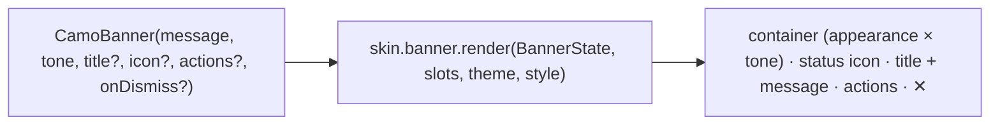
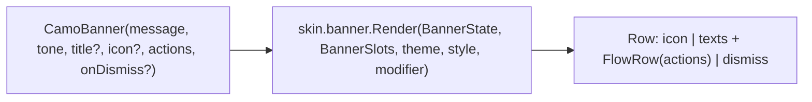
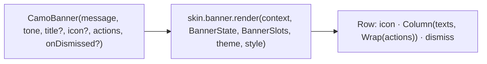

{/* Generated by docs/scripts/sync_vault.py from the Camouflage design notes. Edit the notes and re-run the script; changes made here are overwritten. */}

# CamoBanner

## Concept {#concept}

### 1. Why

A banner is an **inline** message that stays in the layout until it's resolved: "Your trial ends in 3 days · Upgrade", "Couldn't sync · Retry", a form-level error summary. Fluent calls it MessageBar, and Carbon inline notification. Material dropped banners in M3, but apps still need them. Unlike a snackbar, it's placed in the page, not shown. It's the clearest showcase of **Tone**.

### 2. Shape



**Material mapping preview:** there's no M3 component. The Material skin draws it like a `Soft` card:
- the tone's container color and a default status icon per tone (info ⓘ, success ✓, warning ⚠, error ⨯);
- actions as `Ghost` buttons in the tone's strong color;
- `shapes.medium`.

### 3. API

#### Contract

```kotlin
fun CamoBanner(
    message: String,
    tone: Tone = Info,
    title: String? = null,
    icon: Widget? = null,                 // null → the skin's default icon for the tone; pass an empty widget for none
    actions: List<Widget> = emptyList(),  // usually CamoButtons (appearance = Ghost)
    onDismiss: (() -> Unit)? = null,      // non-null → a ✕ button
    appearance: Appearance? = null,   // null → BannerTheme.defaultAppearance (skin default: Soft); Soft | Solid | Outline
)
```

**State → renderer:** `BannerState(title?, message, tone, appearance, dismissible)`. **Slots:** `BannerSlots(icon?, actions, dismiss?)`.

#### Tokens used

- the tone family (container, on-container, strong)
- `typography.titleSmall` (title), `bodyMedium` (message)
- `shapes.medium`, `spacing.l` padding

#### Component theme

`theme.components.banner: BannerTheme?`. Every field is nullable in the theme. The skin's `defaults(theme)` fills whatever isn't set (Material defaults shown). See [Theme](/guide/foundations/theme) §3.10.

| Field | Type | Material default | What it's for |
|---|---|---|---|
| `defaultAppearance` | Appearance | `Soft` | the appearance used when a call passes none (ADR-28: a brand's default variant) |
| `shape` | Shape | `shapes.medium` | corners |
| `padding` | Padding | 16 | inner padding |
| `titleStyle` / `messageStyle` | CamoTextStyle | `titleSmall` / `bodyMedium` | texts |
| `iconSize` | Dp | 24 | status icon |
| `accentBorder` | Boolean | false | a start border in the tone's strong color (Carbon style) |
| `toneIcons` | ToneIcons(info, success, warning, error: IconSource) | the skin's icons | the default status icons, so a brand can use its own icon set (ADR-28). `CamoSnackbar` uses the same icons when `showToneIcon` is on. |

#### Accessibility

- Role status (`Info`/`Success`), or alert (`Warning`/`Error`) when the banner **appears** after the page loaded, so it's announced. A banner present from the start isn't announced; it's read in order.
- Tone must not be conveyed by color alone: the default icon and the title/message carry it too (WCAG 1.4.1).
- The ✕ is a `CamoIconButton` labelled "Dismiss".

### 4. Build steps

1. `CamoBanner`, `BannerRenderer` (default icons per tone), and the DebugSkin renderer.
2. Sample: the four tones, with and without title, actions and dismiss. A form-error summary above a `CamoForm`.
3. Tests: an alert role for errors that appear later; the dismiss button; the default icon per tone.

**Done when**
- [ ] All four tones in three appearances render in light and dark, and are announced correctly.

### 5. Edge cases

| Case | Decided behavior |
|---|---|
| Long messages at 200% | The text wraps, and the actions move below the text. |
| Many actions | Up to two recommended. More wrap to a second row. |
| Sticky banners (top of the screen, global) | App layout: place the banner above the content in the page. It's not an overlay. |

## Implementation {#implementation}

<KotlinOnly>

### 1. Why {#kotlin-1-why}

An inline message with a tone, an optional title, actions and a dismiss button. Kotlin's specifics: the actions wrap below the text when space runs out (`FlowRow`), and a banner that **appears later** (a sync error) is announced with a live region.

### 2. Shape {#kotlin-2-shape}



### 3. API {#kotlin-3-api}

```kotlin
@Composable
public fun CamoBanner(
    message: String,
    modifier: Modifier = Modifier,
    tone: Tone = Tone.Info,
    title: String? = null,
    icon: (@Composable () -> Unit)? = null,       // null → BannerTheme.toneIcons for the tone
    actions: @Composable RowScope.() -> Unit = {},
    onDismiss: (() -> Unit)? = null,
    appearance: Appearance? = null,
)
```

- **Icon:** `style.toneIcons` gives an `IconSource` per tone, drawn with `CamoIcon`; passing `icon = {}` shows none.
- **Actions:** laid out in a `FlowRow` below the texts; at wide widths the renderer may place them at the end of the row (a skin choice). Buttons inherit the tone's content color through `ProvideContentStyle`.
- **Semantics:** the banner merges its texts; for `Tone.Error` / `Tone.Warning` it sets `liveRegion = LiveRegionMode.Polite` so a banner inserted after first composition is read. The dismiss button is `CamoIconButton(contentDescription = "Dismiss")`.
- **Accent border:** `style.accentBorder` draws a start-edge bar with `drawBehind`, mirrored in RTL.

### 4. Build steps {#kotlin-4-build-steps}

1. `BannerTheme` / `Style` (with `toneIcons`), `CamoBanner`, the DebugSkin renderer.
2. `commonTest`: default icon per tone; `icon = {}` hides it; actions wrap at 200% font scale; the live region on a late Error banner; dismiss calls back.

**Done when**
- [ ] Trial, sync-error and form-summary banners render in each tone and appearance, and a late error banner is announced.

### 5. Edge cases {#kotlin-5-edge-cases}

| Case | Decided behavior |
|---|---|
| Banner shown from the first frame | Not announced as an alert (it's part of the page); it's read in reading order. |
| Many actions | Wrap to more rows; guidance stays two. |

</KotlinOnly>

<DartOnly>

### 1. Why {#dart-1-why}

An inline message with a tone, actions and an optional dismiss. Flutter specifics: actions in a `Wrap` below the text, and a live region for banners that appear after the page first builds.

### 2. Shape {#dart-2-shape}



### 3. API {#dart-3-api}

```dart
class CamoBanner extends StatelessWidget {
  const CamoBanner({super.key, required this.message, this.tone = Tone.info, this.title, this.icon,
      this.actions = const [], this.onDismissed, this.appearance});
}
```

- **Icon:** `icon == null` → `style.toneIcons` for the tone; pass `const SizedBox.shrink()` for none.
- **Semantics:** `Semantics(container: true, liveRegion: tone == Tone.error || tone == Tone.warning)`; the dismiss button is `CamoIconButton(semanticLabel: 'Dismiss')`.
- **Accent border:** `style.accentBorder` adds a `BorderDirectional(start: …)`, so RTL mirrors.

### 4. Build steps {#dart-4-build-steps}

1. Types (with `toneIcons`), the widget, the DebugSkin renderer.
2. Widget tests: default icons; `SizedBox.shrink()` hides; actions wrap at 200% text scale; live region on error; dismiss.

**Done when**
- [ ] Trial, sync-error and form-summary banners render in each tone and appearance.

### 5. Edge cases {#dart-5-edge-cases}

| Case | Decided behavior |
|---|---|
| Banner present from the first frame | Read in order, not as an alert (live regions only announce changes). |

</DartOnly>
