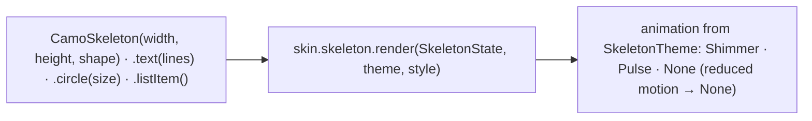
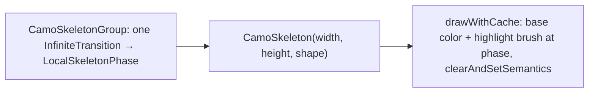
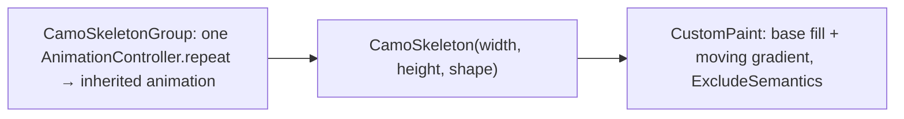

{/* Generated by docs/scripts/sync_vault.py from the Camouflage design notes. Edit the notes and re-run the script; changes made here are overwritten. */}

# CamoSkeleton

## Concept {#concept}

### 1. Why

A skeleton is a gray placeholder in the shape of content that hasn't loaded yet: text lines, an avatar circle, an image block. It tells the user what's coming and keeps the layout from jumping. [CamoPagedList](/components/containers-and-lists/camo-paged-list) uses it for loading rows, and apps use it on any loading screen. It replaces the hand-written shimmer widgets each app carries today.

### 2. Shape



**Material mapping preview:** Material has no skeleton component. The Material skin uses `surfaceContainerHighest` blocks with a sweeping `surfaceContainerLow` highlight. See [Material Skin](/guide/skins/material-skin).

### 3. API

#### Contract

```kotlin
fun CamoSkeleton(
    width: Dp? = null,                 // null → fill the available width
    height: Dp,
    shape: ShapeRole = Small,
)
fun CamoSkeleton.text(lines: Int = 1, style: CamoTextStyle = typography.bodyMedium, lastLineFraction: Float = 0.6f)
fun CamoSkeleton.circle(size: Dp)
fun CamoSkeleton.listItem(lines: Int = 2, leading: SkeletonLeading = Circle)   // Circle | Square | None; matches CamoListItem proportions

fun CamoSkeletonGroup(content: Slot)   // one shared animation phase for all skeletons inside
```

| Function | What it's for |
|---|---|
| `CamoSkeleton` | a block (an image, a button, a card) |
| `.text` | text lines at the height of a text style, the last line shorter |
| `.circle` | an avatar |
| `.listItem` | a whole list row, sized from `ListItemTheme`, so it lines up with the real rows |
| `CamoSkeletonGroup` | keeps the shimmer in sync across a screen (otherwise each block would animate on its own) |

**State → renderer:** `SkeletonState(shape, animationPhase)`. **Slots:** none.

#### Tokens used

- `colors.surfaceContainerHigh` (base), `surfaceContainerLowest` (highlight)
- `shapes.<shape>`, `shapes.full` (circle)
- `motion.durationLong` × 3 for one shimmer cycle

#### Component theme

`theme.components.skeleton: SkeletonTheme?`. Every field is nullable in the theme. The skin's `defaults(theme)` fills whatever isn't set (Material defaults shown). See [Theme](/guide/foundations/theme) §3.10.

| Field | Type | Material default | What it's for |
|---|---|---|---|
| `animation` | SkeletonAnimation (`Shimmer` \| `Pulse` \| `None`) | `Shimmer` | how placeholders move (ADR-28: a brand choice) |
| `baseColor / highlightColor` | Color | `surfaceContainerHighest` / `surfaceContainerLow` | the block and the moving highlight |
| `cycleDuration` | Duration | 1500 ms | one shimmer or pulse cycle |
| `textLineGap` | Dp | 8 | space between text lines |

#### Accessibility

- Skeletons are **hidden from screen readers**. The container that shows them exposes one "Loading" state (a live region), as `CamoPagedList` does.
- **Reduced motion:** the animation becomes `None` (static blocks).
- The contrast between blocks and background is low on purpose. Skeletons are decoration, not content.

### 4. Build steps

1. `CamoSkeleton` and its helpers in core, the shared phase in `CamoSkeletonGroup`, and `SkeletonRenderer` (DebugSkin: plain gray blocks).
2. `.listItem()` reads `ListItemTheme` heights and paddings.
3. Tests:
   - sizes and shapes;
   - `.text(3)` draws 3 lines with a shorter last line;
   - reduced motion is static;
   - no semantics nodes;
   - blocks in a group share one phase.

**Done when**
- [ ] A skeleton list and a skeleton profile header render in light and dark, animated and with reduced motion, and line up with the real content that replaces them.

### 5. Edge cases

| Case | Decided behavior |
|---|---|
| Many skeletons on screen | One animation clock per `CamoSkeletonGroup` (and one implicit group per `CamoPagedList`), not one per block. |
| Dark theme | The same roles give a subtle dark shimmer. No separate colors. |
| Font scale 200% | `.text` lines grow with the style's line height, like the real text will. |
| RTL | The shimmer sweeps from right to left. |

## Implementation {#implementation}

<KotlinOnly>

### 1. Why {#kotlin-1-why}

Skeleton placeholders need a cheap shared animation. In Compose that's one `InfiniteTransition` per `CamoSkeletonGroup`, a `Brush.linearGradient` moved by it, and `drawWithCache` so blocks don't allocate per frame.

### 2. Shape {#kotlin-2-shape}



### 3. API {#kotlin-3-api}

```kotlin
@Composable public fun CamoSkeleton(height: Dp, modifier: Modifier = Modifier, width: Dp? = null, shape: ShapeRole = ShapeRole.Small)
@Composable public fun CamoSkeletonText(modifier: Modifier = Modifier, lines: Int = 1,
    style: TextStyle = Camouflage.typography.bodyMedium, lastLineFraction: Float = 0.6f)
@Composable public fun CamoSkeletonCircle(size: Dp, modifier: Modifier = Modifier)
@Composable public fun CamoSkeletonListItem(modifier: Modifier = Modifier, lines: Int = 2, leading: SkeletonLeading = SkeletonLeading.Circle)
@Composable public fun CamoSkeletonGroup(content: @Composable () -> Unit)
```

(Kotlin names the base's `CamoSkeleton.text/.circle/.listItem` as top-level functions, the Compose convention.)

- **Phase:** `CamoSkeletonGroup` provides `LocalSkeletonPhase` from `rememberInfiniteTransition().animateFloat(0f, 1f, infiniteRepeatable(tween(style.cycleDuration)))`. A skeleton outside a group creates its own.
- **Drawing:** `Shimmer` → `drawWithCache { onDrawBehind { drawRect(base); drawRect(brush translated by phase * width) } }` clipped to the shape; `Pulse` → alpha between 0.5 and 1; `None` → a static block. Reduced motion forces `None`.
- **Text lines:** each line's height is the style's `lineHeight` converted with `LocalDensity`, so lines match the real text at any font scale.
- `clearAndSetSemantics {}` on every block.

### 4. Build steps {#kotlin-4-build-steps}

1. `SkeletonTheme` / `Style`, the composables, the DebugSkin renderer (static gray).
2. `commonTest`: sizes; `lines = 3` with a shorter last line; reduced motion is static; no semantics; blocks in a group read the same phase.

**Done when**
- [ ] A skeleton list and profile header match the real layout on every target, animated and with reduced motion.

### 5. Edge cases {#kotlin-5-edge-cases}

| Case | Decided behavior |
|---|---|
| A skeleton in a `LazyColumn` item | The list's group phase is shared across items (the provider sits outside the list). |
| RTL | The brush moves right to left. |

</KotlinOnly>

<DartOnly>

### 1. Why {#dart-1-why}

Shimmering placeholders with one shared animation per group. In Flutter: an `InheritedWidget` carrying an `Animation<double>` from one controller, and a `ShaderMask`/`CustomPaint` gradient moved by it.

### 2. Shape {#dart-2-shape}



### 3. API {#dart-3-api}

```dart
class CamoSkeleton extends StatelessWidget {
  const CamoSkeleton({super.key, required this.height, this.width, this.shape = ShapeRole.small});
  const CamoSkeleton.text({super.key, this.lines = 1, this.style, this.lastLineFraction = 0.6});
  const CamoSkeleton.circle({super.key, required double size});
  const CamoSkeleton.listItem({super.key, this.lines = 2, this.leading = SkeletonLeading.circle});
}
class CamoSkeletonGroup extends StatefulWidget { const CamoSkeletonGroup({super.key, required this.child}); }
```

(Flutter keeps the base's `.text` / `.circle` / `.listItem` as named constructors.)

- **Animation:** `style.animation`: `shimmer` paints a `LinearGradient` translated by the group's value; `pulse` animates opacity; `none` is static and is forced when animations are disabled.
- **Text lines:** each line's height is the style's `fontSize * height` scaled by `MediaQuery.textScalerOf(context)`.
- `ExcludeSemantics` on every block.

### 4. Build steps {#dart-4-build-steps}

1. Types, the widget and group, the DebugSkin renderer.
2. Widget tests: sizes; three lines with a shorter last; reduced motion static; no semantics; blocks in a group share one value.

**Done when**
- [ ] A skeleton list and profile header line up with the real content on all platforms.

### 5. Edge cases {#dart-5-edge-cases}

| Case | Decided behavior |
|---|---|
| A skeleton outside a group | It creates its own controller. |
| RTL | The gradient moves right to left. |

</DartOnly>
