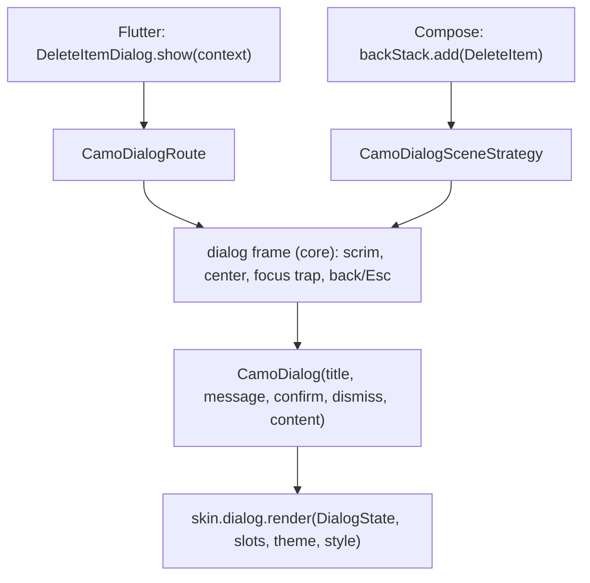
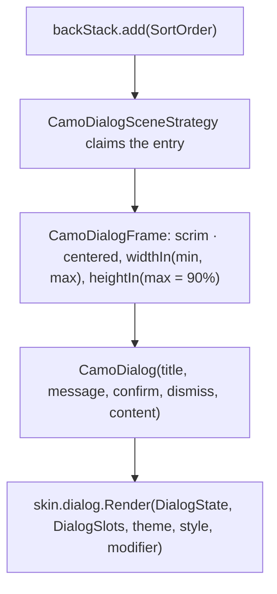
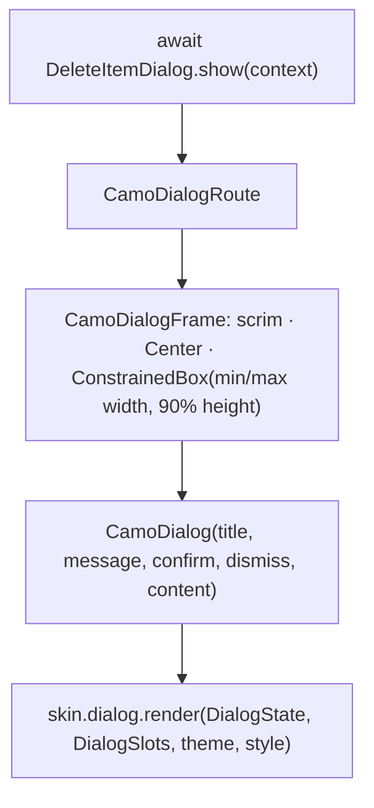

{/* Generated by docs/scripts/sync_vault.py from the Camouflage design notes. Edit the notes and re-run the script; changes made here are overwritten. */}

# CamoDialog

## Concept {#concept}

### 1. Why

A dialog interrupts the user to confirm or inform. It opens through the **platform's navigator**: `showCamoDialog` in Flutter, and a Navigation 3 entry registered with Camouflage dialog metadata in Compose (see [Overlays](/components/overlays/overlays)). `CamoDialog` is the **content component**: title, message, actions, optional custom content. The **dialog frame** around it (scrim, centering, focus trap, back/Esc) comes from core, and is placed by the navigator integration.

The title and message are **values**. The actions are **`CamoButton` widgets**, so button appearances, tones and any button renderer override apply inside dialogs too.

### 2. Shape



**Written like a page, in its own file:**

```dart
// Flutter: delete_item_dialog.dart
class DeleteItemDialog extends StatelessWidget {
  const DeleteItemDialog({super.key});
  static Future<bool?> show(BuildContext context) =>
      showCamoDialog<bool>(context: context, builder: (_) => const DeleteItemDialog());
  @override
  Widget build(BuildContext context) => CamoDialog(
        title: 'Delete item?', message: "This can't be undone.",
        confirm: CamoButton(text: 'Delete', tone: Tone.error, onPressed: () => Navigator.pop(context, true)),
        dismiss: CamoButton(text: 'Cancel', appearance: Appearance.ghost, onPressed: () => Navigator.pop(context, false)),
      );
}
// screen: if (await DeleteItemDialog.show(context) == true) notifier.onEvent(DeleteRequested(item));
```

```kotlin
// Compose: DeleteItemDialog.kt: a registered route
@Serializable data class DeleteItem(val id: String) : NavKey

fun EntryProviderScope<NavKey>.deleteItemDialog(backStack: NavBackStack, results: CamoNavResults) =
    entry<DeleteItem>(metadata = CamoDialogSceneStrategy.dialog()) { key ->
        CamoDialog(
            title = "Delete item?", message = "This can't be undone.",
            confirm = { CamoButton(text = "Delete", tone = Tone.Error, onClick = { results.set(key, true); backStack.removeLastOrNull() }) },
            dismiss = { CamoButton(text = "Cancel", appearance = Appearance.Ghost, onClick = { backStack.removeLastOrNull() }) },
        )
    }
// screen: backStack.add(DeleteItem(item.id)); results.consume<Boolean>(DeleteItem(item.id)) { if (it) viewModel.delete(item) }
```

**Material mapping preview:** the M3 Basic dialog.
- Container: `surfaceContainerHigh`, `shapes.extraLarge`, `level5`.
- Title: `headlineSmall`.
- Message: `bodyMedium` in `onSurfaceVariant`.
- Actions: end-aligned, with `dismiss` to the start of `confirm`.
- Scrim: `scrim` at 32%.

See [Material Skin](/guide/skins/material-skin).

### 3. API

#### Contract

```kotlin
fun CamoDialog(
    message: String,
    confirm: Widget,                    // usually CamoButton(…) that closes with a result
    title: String? = null,
    dismiss: Widget? = null,            // usually CamoButton(appearance = Ghost) that closes without one
    content: Slot? = null,              // optional custom content below the message (a list, a form)
)
```

| Parameter | What it's for |
|---|---|
| `message` | the main text. It's a value, drawn by the renderer in the skin's body style. |
| `title` | optional heading. It's also the dialog's accessible name. |
| `confirm`, `dismiss` | action widgets. They close the dialog through the navigator: `Navigator.pop(context, result)` in Flutter, or set a result + remove the entry in Compose. |
| `content` | layout content for richer dialogs (a radio list, a small form). It's a slot, because it's layout, not text. |

Dismissal (scrim tap, back, Esc) is handled by the **dialog frame**, and closes the dialog without a result. To stop it (for example while saving), use `PopScope` (Flutter) or `OnDismissRequest { … }` (Compose), or open it with `dismissible = false`.

**State → renderer:** `DialogState(title?, message, dismissible, onDismissRequest)` (the last two from the frame; a skin with a ✕ uses them). **Slots:** `DialogSlots(confirm, dismiss?, content?)`.

#### Tokens used

- `colors.surfaceContainerHigh`, `onSurface`, `onSurfaceVariant`, `scrim`
- `shapes.extraLarge`, `elevation.level5`
- `typography.headlineSmall` (title), `bodyMedium` (message)
- `spacing.xl` padding, `spacing.s` between actions, `spacing.l` between title, message and content
- `motion.durationMedium` + `easingEmphasized` for enter; `durationShort` for exit

#### Component theme

`theme.components.dialog: DialogTheme?`. Every field is nullable in the theme. The skin's `defaults(theme)` fills whatever isn't set (Material defaults shown). See [Theme](/guide/foundations/theme) §3.10.

| Field | Type | Material default | What it's for |
|---|---|---|---|
| `shape` | Shape | `shapes.extraLarge` | container corners |
| `minWidth / maxWidth` | Dp | 280 / 560 | width bounds |
| `padding` | Padding | `spacing.xl` (24) | inner padding |
| `titleStyle / messageStyle` | CamoTextStyle | `headlineSmall` / `bodyMedium` | text styles |
| `titleAlign` | `Start` \| `Center` | `Start` | title and message alignment (ADR-28) |
| `actionsLayout` | `End` \| `Center` \| `FullWidthRow` \| `Stacked` | `End` | how `confirm` and `dismiss` are arranged (ADR-28). `Stacked` puts `confirm` on top, full width. |
| `showCloseButton` | Boolean | false | a ✕ at the top end, shown only when the dialog is `dismissible` (ADR-25) |
| `elevation` | ElevationLevel | `Level5` | depth |
| `scrimAlpha` | Float | 0.32 | scrim opacity over `colors.scrim` (used by the dialog frame) |
| `stackedScrim` | `Each` \| `TopOnly` | `Each` | when opened above another overlay: add its own scrim or share one |
| `colors` | DialogColors(container, title, message) | `surfaceContainerHigh`, `onSurface`, `onSurfaceVariant` | every color the dialog uses |

#### Accessibility

- Role dialog (modal). The title is its accessible name (or the message if there's no title). The screen reader is confined to the dialog while it's open.
- **Focus moves into the dialog** when it opens, **is trapped** while it's open, and **returns** to the opener on close (the overlay frame does this).
- Escape and system back are dismissal requests.
- The scrim isn't focusable.

### 4. Build steps

1. The dialog frame in core, and the navigator integration ([Overlays](/components/overlays/overlays) build steps).
2. `CamoDialog` + `DialogRenderer`. The DebugSkin renderer is a centered box with the title, message, content, and a row of actions.
3. Sample:
   - `DeleteItemDialog` (destructive confirm with `tone = Error`) returning `Boolean`;
   - `SortOrderDialog` with a `content` radio list, returning the chosen order;
   - a dialog opened from inside a nested promo-theme section, which must show the promo theme.
4. Tests:
   - the caller receives the result (Flutter `Future`, Compose `CamoNavResults`);
   - a scrim tap, back and Esc close without a result;
   - `PopScope` / `OnDismissRequest` can veto dismissal;
   - the nested theme is used;
   - focus returns to the opener;
   - the title is the accessible name.

**Done when**
- [ ] A screen opens a dialog with one line (Flutter `show`, Compose `backStack.add`) and gets a typed result.
- [ ] The dialog from the nested section shows the nested theme.
- [ ] Focus is trapped while open and restored on close.

### 5. Edge cases

| Case | Decided behavior |
|---|---|
| **Opened from a nested provider** | Flutter: `showCamoDialog` captures the skin and theme at the call site. Compose: the entry renders inside the `NavDisplay`'s provider tree (see [Overlays](/components/overlays/overlays) §5). |
| **Skin switch while open** | It stays open and re-renders with the new skin. |
| Blocking dismissal while saving | `PopScope(canPop: !saving)` (Flutter) / `OnDismissRequest { !saving }` (Compose), or `dismissible = false`. |
| Long message at 200% font scale | The message and content scroll inside the dialog. The title and actions stay visible. Max height is 90% of the window. |
| Small window / landscape | Width is min(560, window width − 48). There's no full-screen dialog in v1. |
| RTL | The action order mirrors (`confirm` stays at the end). |
| A dialog whose visibility is app state (Compose without Navigation 3) | Use the frame directly: `if (show) CamoDialogFrame(onDismissRequest = { show = false }) { CamoDialog(…) }`. |
| Stacked dialogs | Allowed (LIFO). Guidance: avoid them. |
| **Action arrangement** (ADR-23, ADR-28) | `confirm` and `dismiss` are separate slots, arranged by `DialogTheme.actionsLayout`, whose default comes from the skin: Minimal, Material and Fluent end-aligned side by side; Cupertino side by side, stacked vertically when a label doesn't fit half the width; Carbon a full-width row with equal halves. The contract stays the same. |
| More than two actions, or custom layout | Put them in `content`: the developer owns that layout. |
| A hero icon above the title (Material only) | Not in core (ADR-23). Put an icon at the top of `content`, or a future Material skin can offer it as a `DialogTheme` field. |

## Implementation {#implementation}

<KotlinOnly>

### 1. Why {#kotlin-1-why}

`CamoDialog` is the **content** of a dialog. In Compose, a dialog is a Navigation 3 entry registered with `CamoDialogSceneStrategy.dialog()` metadata, drawn inside core's `CamoDialogFrame` ([Overlays](/components/overlays/overlays#implementation)). This note covers the content component and the frame's dialog layout.

### 2. Shape {#kotlin-2-shape}



### 3. API {#kotlin-3-api}

```kotlin
@Composable
public fun CamoDialog(
    message: String,
    confirm: @Composable () -> Unit,
    modifier: Modifier = Modifier,
    title: String? = null,
    dismiss: (@Composable () -> Unit)? = null,
    content: (@Composable ColumnScope.() -> Unit)? = null,
)
```

**A dialog as a registered route, in its own file:**

```kotlin
@Serializable data object SortOrderPicker : NavKey

fun EntryProviderScope<NavKey>.sortOrderDialog(backStack: NavBackStack<NavKey>, results: CamoNavResults) =
    entry<SortOrderPicker>(metadata = CamoDialogSceneStrategy.dialog()) {
        var selected by rememberSaveable { mutableStateOf(SortOrder.Newest) }
        CamoDialog(
            title = "Sort by", message = "Choose how items are ordered.",
            confirm = { CamoButton(text = "Apply", onClick = { results.set(SortOrderPicker, selected); backStack.removeLastOrNull() }) },
            dismiss = { CamoButton(text = "Cancel", appearance = Appearance.Ghost, onClick = { backStack.removeLastOrNull() }) },
        ) { SortOrder.entries.forEach { SortRow(it, it == selected) { selected = it } } }
    }
```

- Semantics: `paneTitle = title ?: message` on the container.
- Long content: the message + `content` are in a `Column(Modifier.weight(1f, fill = false).verticalScroll(...))`. The title and actions stay outside it.

**Layout choices (ADR-28):** the renderer reads `style.titleAlign` (`Start` | `Center`) and `style.actionsLayout`:
- `End` / `Center`: a `Row(horizontalArrangement = Arrangement.End / Center, spacedBy(spacing.s))` with `dismiss` before `confirm`;
- `FullWidthRow`: a `Row` with each action in `Modifier.weight(1f)`;
- `Stacked`: a `Column` with `confirm` first, each `fillMaxWidth()`.

`style.showCloseButton` adds a `CamoIconButton(contentDescription = "Close")` at the top end, shown only when `state.dismissible`; it calls `state.onDismissRequest`, which goes through the frame's veto (`OnDismissRequest`).

### 4. Build steps {#kotlin-4-build-steps}

1. The dialog layout inside `CamoDialogFrame` (centering, width and height limits).
2. `CamoDialog`, `DialogTheme`/`Style`, and the DebugSkin renderer.
3. The samples: `DeleteItem` (`Boolean` result, `tone = Error`) and `SortOrderPicker` (radio content), both registered entries. Plus one standalone `CamoDialogFrame` usage.
4. `commonTest` with a real `NavDisplay`:
   - results arrive once;
   - a scrim click and Esc pop the entry;
   - `OnDismissRequest { false }` keeps it;
   - focus is on the first action after open, and back on the opener after close.

**Done when**
- [ ] Both sample dialogs work as routes on all four targets, and deliver their results.

### 5. Edge cases {#kotlin-5-edge-cases}

| Case | Decided behavior |
|---|---|
| **Replaced designs** | Earlier drafts used `androidx.compose.ui.window.Dialog` (with Android dim clearing), then a custom `show` host. Both were replaced by core frames + Navigation 3 scenes (ADR-19). |
| Dialog from a sheet | Stacked entries. Back pops the dialog first. |
| Very small windows | Width is min(`style.maxWidth`, window − 48 dp). |

</KotlinOnly>

<DartOnly>

### 1. Why {#dart-1-why}

`CamoDialog` is the **content** of a dialog opened with `showCamoDialog` ([Overlays](/components/overlays/overlays#implementation)). The route + `CamoDialogFrame` provide the scrim, centering, focus trap, back/Esc and the captured theme. This note covers the content component and the dialog layout.

### 2. Shape {#dart-2-shape}



### 3. API {#dart-3-api}

```dart
class CamoDialog extends StatelessWidget {
  const CamoDialog({super.key, required this.message, required this.confirm,
      this.title, this.dismiss, this.content});
  final String message;
  final Widget confirm;
  final String? title;
  final Widget? dismiss;
  final Widget? content;
}
```

**A dialog in its own file:**

```dart
class SortOrderDialog extends HookWidget {
  const SortOrderDialog({super.key});
  static Future<SortOrder?> show(BuildContext context) =>
      showCamoDialog<SortOrder>(context: context, builder: (_) => const SortOrderDialog());

  @override
  Widget build(BuildContext context) {
    final selected = useState(SortOrder.newest);
    return CamoDialog(
      title: 'Sort by', message: 'Choose how items are ordered.',
      confirm: CamoButton(text: 'Apply', onPressed: () => Navigator.pop(context, selected.value)),
      dismiss: CamoButton(text: 'Cancel', appearance: Appearance.ghost, onPressed: () => Navigator.pop(context)),
      content: Column(children: [for (final o in SortOrder.values) SortRow(o, o == selected.value, () => selected.value = o)]),
    );
  }
}
```

- Long content: the message + `content` sit in a `Flexible(child: SingleChildScrollView(...))`. The title and actions stay fixed.
- Semantics: `Semantics(scopesRoute: true, namesRoute: true, explicitChildNodes: true, label: title ?? message)`.

**Layout choices (ADR-28):** `style.titleAlign` and `style.actionsLayout`: `end`/`center` → a `Row` with `dismiss` before `confirm`; `fullWidthRow` → `Expanded` actions; `stacked` → a `Column` with `confirm` first at full width. `style.showCloseButton` adds a close `CamoIconButton` at the top end when `state.dismissible`; it calls `state.onDismissRequest`, which goes through `Navigator.maybePop`, so `PopScope` can veto.

### 4. Build steps {#dart-4-build-steps}

1. The dialog layout in `CamoDialogFrame`.
2. `CamoDialog`, `CamoDialogTheme`/`Style`, and the DebugSkin renderer.
3. Samples: `DeleteItemDialog` (`bool`, `tone: Tone.error`) and `SortOrderDialog` (radio content). They're the same content as the Kotlin sample.
4. Widget tests:
   - the popped values;
   - scrim and back → `null`;
   - `PopScope(canPop: false)` keeps it open;
   - a nested-provider theme is inside;
   - focus returns to the opener.

**Done when**
- [ ] Both sample dialogs work on all six platforms.

### 5. Edge cases {#dart-5-edge-cases}

| Case | Decided behavior |
|---|---|
| **Replaced design** | An earlier draft had a declarative `CamoDialogPresenter` and an `onDismissRequest` parameter. With ADR-19, dismissal goes through `Navigator.maybePop` + `PopScope`, the Flutter way. |
| Dialog from a sheet | A route above a route. Back pops the dialog first. |

</DartOnly>
