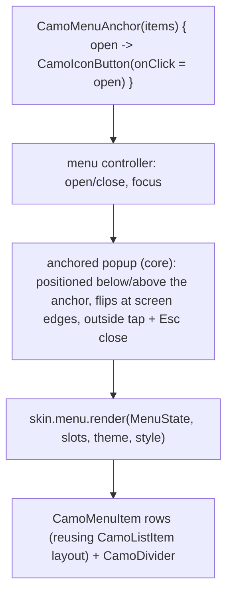
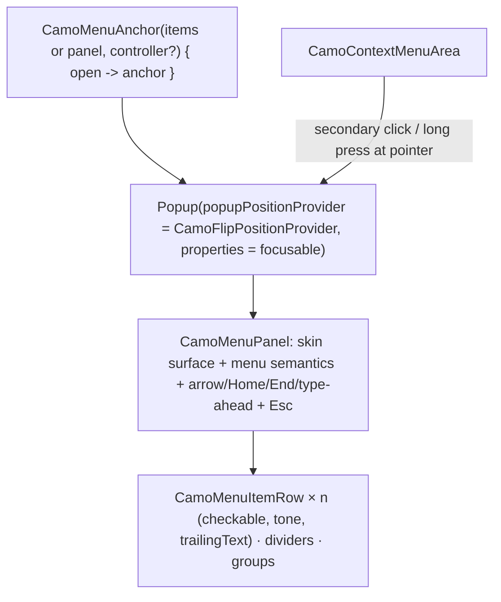
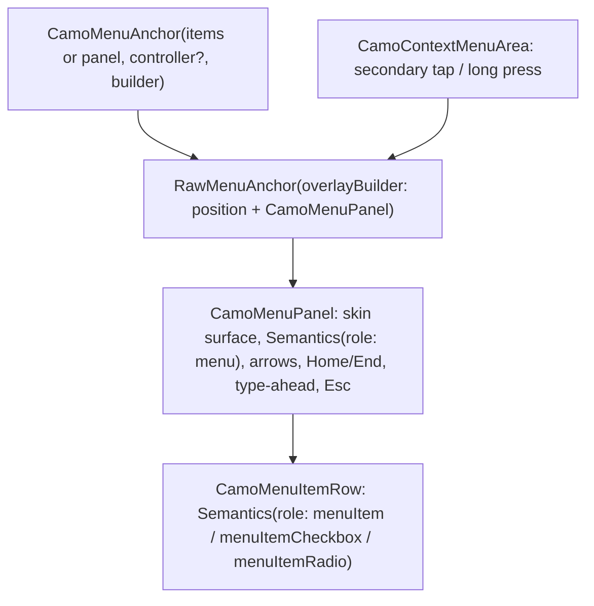

{/* Generated by docs/scripts/sync_vault.py from the Camouflage design notes. Edit the notes and re-run the script; changes made here are overwritten. */}

# CamoMenu

## Concept {#concept}

### 1. Why

Menus show a short list of actions anchored to the element that opened them: an overflow "⋮" button, a right-click context menu, a split button's arrow. Unlike dialogs and sheets, a menu is an **anchored popup**, not a navigation entry. It opens next to its anchor, and closes on selection, outside tap or Esc, on both platforms, with no router involved.

### 2. Shape



**Material mapping preview:** M3 menus.
- Container: `surfaceContainer`, `shapes.extraSmall`, `level2`. Width 112–280.
- Items 48 tall, with `labelLarge` text and a leading icon 24 in `onSurfaceVariant`.
- Keyboard-shortcut text trails in `onSurfaceVariant`.

### 3. API

#### Contract

```kotlin
fun CamoMenuAnchor(
    items: List<CamoMenuEntry> = emptyList(),
    panel: Widget? = null,                      // custom content in a CamoMenuPanel, instead of items (ADR-30)
    controller: CamoMenuController? = null,     // optional: open/close from outside
    anchor: Widget (open: () -> Unit),          // the element the menu attaches to
)

sealed interface CamoMenuEntry
data class CamoMenuItem(
    val text: String,
    val onClick: () -> Unit,
    val leadingIcon: Widget? = null,
    val trailingText: String? = null,          // e.g. a keyboard shortcut "⌘C"
    val tone: Tone = Default,                  // Error for destructive items ("Delete")
    val enabled: Boolean = true,
    val checked: Boolean? = null,              // non-null → a checkable item (a checkmark when true)
) : CamoMenuEntry
data object CamoMenuDivider : CamoMenuEntry
data class CamoMenuGroup(val items: List<CamoMenuItem>, val exclusive: Boolean = false) : CamoMenuEntry
// exclusive = true → the checked items are announced as radio items ("Sort by: Newest")

fun CamoContextMenuArea(items: List<CamoMenuEntry>, content: Slot)   // right-click / long-press menu
```

Selecting an item runs `onClick` and closes the menu, checkable items included (the app flips `checked`). Submenus are Later.

**Building block (ADR-30): `CamoMenuPanel(content: Slot)`** is the menu's skin surface with menu semantics, arrow-key focus movement between its focusable children, and Esc to close. It's for menus with custom rows (a color picker, an account switcher), opened from a `CamoMenuAnchor(panel = …)` instead of `items`. Standard rows can mix in with `CamoMenuItemRow(item)`.

**State → renderer:** `MenuState(expanded, highlightedIndex)`. **Slots:** `MenuSlots(entries)`. Core positions the popup and handles focus and keys. The renderer draws the container and rows.

#### Tokens used

- `colors.surfaceContainer`, `onSurface`, `onSurfaceVariant`, the tone family for destructive items
- `shapes.extraSmall`, `elevation.level2`, `typography.labelLarge`
- `motion.durationShort` (scale + fade in from the anchor side)

#### Component theme

`theme.components.menu: MenuTheme?`. Every field is nullable in the theme. The skin's `defaults(theme)` fills whatever isn't set (Material defaults shown). See [Theme](/guide/foundations/theme) §3.10.

| Field | Type | Material default | What it's for |
|---|---|---|---|
| `shape` | Shape | `shapes.extraSmall` | container corners |
| `minWidth` / `maxWidth` | Dp | 112 / 280 | width bounds |
| `itemHeight` | Dp | 48 | row height |
| `contentPadding` | Padding | vertical 8 | container padding |
| `textStyle` | CamoTextStyle | `labelLarge` | item text |
| `iconSize` | Dp | 24 | leading icons |
| `elevation` | ElevationLevel | `Level2` | depth |
| `checkPosition` | `Leading` \| `Trailing` | `Trailing` | where the checkmark of a checked item sits (ADR-28; Apple and Fluent: `Leading`) |
| `colors` | MenuColors(container, text, icon, trailingText) | `surfaceContainer`, `onSurface`, `onSurfaceVariant`, `onSurfaceVariant` | every color it uses |

#### Accessibility

- The anchor announces "has popup" and expanded/collapsed.
- The menu has role menu, and items role menuitem ("Delete, menu item, 3 of 4"). A checkable item is a menu item checkbox ("Show hidden files, checked"); in an exclusive `CamoMenuGroup` it's a menu item radio ("Newest, selected, 1 of 3").
- **Keyboard:** Enter/Space/Down on the anchor opens it and focuses the first item. Up/Down move, Home/End jump, Enter selects, Esc closes and returns focus to the anchor. Typing a letter jumps to the next item starting with it.
- The screen reader stays inside the open menu. An outside tap or a screen-reader "dismiss" closes it.

### 4. Build steps

1. The anchored-popup primitive in core (positioning with edge flipping, outside tap, Esc, focus in and back). `CamoSelect` and `CamoTooltip` reuse it.
2. `CamoMenuAnchor`, `CamoMenuController`, entries, `CamoContextMenuArea` (right-click on desktop/web, long-press on touch).
3. `MenuRenderer`, and the DebugSkin renderer.
4. Sample: an overflow menu in the top bar (Share, Edit, divider, Delete in `Error` tone), and a context menu on a list row.
5. Tests:
   - opens below the anchor and flips above near the bottom edge;
   - selecting runs the action and closes;
   - checked items draw the check at `checkPosition` and announce checkbox or radio semantics;
   - Esc returns focus to the anchor;
   - arrow keys and type-ahead;
   - announcements.

**Done when**
- [ ] The overflow menu and the context menu work by touch, mouse, keyboard and screen reader on every platform.

### 5. Edge cases

| Case | Decided behavior |
|---|---|
| Menu near a screen edge | Flips to the other side, or shifts inward. It never overflows the window. |
| Long lists of items | The menu scrolls after its max height (the space to the window edge). More than ~8 items suggests a sheet or `CamoSelect` instead. |
| Opening a dialog from a menu item | The menu closes first, then the action runs, so the dialog isn't stacked over a closing menu. |
| **Checkable items** (settled 2026-09-27) | `checked: Boolean?` on `CamoMenuItem`; `CamoMenuGroup(exclusive = true)` for single choice (sort order). Items with and without checks in the same menu keep their text aligned (a reserved check column when `checkPosition = Leading`). |
| Submenus | Not in v1. |
| **Custom menu content** | `CamoMenuPanel` (ADR-30). Custom rows must be focusable and have a label; the panel moves focus with the arrow keys and closes on Esc or an outside tap. |

## Implementation {#implementation}

<KotlinOnly>

### 1. Why {#kotlin-1-why}

Menus are the core **anchored popup**, reused by `CamoSelect` and `CamoTooltip`. Compose Multiplatform's `Popup` gives a separate layer on every target; core adds the positioning that flips at window edges, focus in and back out, arrow keys and type-ahead, checkable items, context menus (right-click and long-press), and the `CamoMenuPanel` building block (ADR-30).

### 2. Shape {#kotlin-2-shape}



### 3. API {#kotlin-3-api}

```kotlin
@Composable
public fun CamoMenuAnchor(
    modifier: Modifier = Modifier,
    items: List<CamoMenuEntry> = emptyList(),
    panel: (@Composable () -> Unit)? = null,          // custom content inside a CamoMenuPanel (ADR-30)
    controller: CamoMenuController? = null,
    anchor: @Composable (open: () -> Unit) -> Unit,
)

public sealed interface CamoMenuEntry
public data class CamoMenuItem(val text: String, val onClick: () -> Unit, val leadingIcon: (@Composable () -> Unit)? = null,
    val trailingText: String? = null, val tone: Tone = Tone.Default, val enabled: Boolean = true,
    val checked: Boolean? = null) : CamoMenuEntry
public data object CamoMenuDivider : CamoMenuEntry
public data class CamoMenuGroup(val items: List<CamoMenuItem>, val exclusive: Boolean = false) : CamoMenuEntry

@Composable public fun CamoMenuPanel(modifier: Modifier = Modifier, onClose: () -> Unit, content: @Composable ColumnScope.() -> Unit)
@Composable public fun CamoMenuItemRow(item: CamoMenuItem, onSelected: () -> Unit, modifier: Modifier = Modifier)
@Composable public fun CamoContextMenuArea(items: List<CamoMenuEntry>, modifier: Modifier = Modifier, content: @Composable () -> Unit)
public class CamoMenuController { public fun open(); public fun close(); public val isOpen: Boolean }
```

- **Positioning:** `CamoFlipPositionProvider : PopupPositionProvider` places the menu below the anchor's start edge; if it doesn't fit below it goes above; horizontally it shifts inward to stay in the window (RTL-aware). The height is capped to the available space, and the panel scrolls.
- **Focus:** `Popup(properties = PopupProperties(focusable = true))`; the first enabled row gets focus via a `FocusRequester` when opened by keyboard (touch opening doesn't show a focus ring). On close, focus returns to the anchor (`anchorFocusRequester.requestFocus()`).
- **Keys** (`onPreviewKeyEvent` on the panel): Up/Down move, Home/End jump, Enter/Space select, Esc closes, printable keys jump to the next row whose text starts with the typed prefix (500 ms buffer).
- **Semantics:** Compose has no menu roles, so rows use `Role.Button` (plain), `Role.Checkbox` with `toggleableState` (checkable), or `Role.RadioButton` with `selected` inside `selectableGroup()` (exclusive group); the panel sets `paneTitle` and `collectionInfo`.
- **Context menus:** `pointerInput` detects a secondary-button press (desktop, web) and `detectTapGestures(onLongPress = …)` (touch), opening at the pointer offset. On Android and iOS a long press doesn't also trigger the content's click.
- **Close then act:** selecting closes the popup first, then runs `onClick` in the next frame, so an action that opens a dialog doesn't stack over a closing menu.

### 4. Build steps {#kotlin-4-build-steps}

1. `CamoFlipPositionProvider`, the popup plumbing, `CamoMenuPanel` (shared with `CamoSelect`).
2. `CamoMenuAnchor`, entries, `CamoMenuItemRow`, `CamoMenuController`, `CamoContextMenuArea`; `MenuTheme` / `Style` (with `checkPosition`); the DebugSkin renderer.
3. `commonTest` / UI tests: flips near the bottom edge; selecting runs and closes; Esc returns focus; arrows and type-ahead; checkable and exclusive semantics; a custom panel keeps arrow navigation.

**Done when**
- [ ] The overflow menu, a "Sort by" exclusive group, a context menu on a list row and a custom-panel account switcher work by touch, mouse, keyboard and screen reader on all targets.

### 5. Edge cases {#kotlin-5-edge-cases}

| Case | Decided behavior |
|---|---|
| Web (`wasmJs`) right-click | Core prevents the browser's context menu only inside `CamoContextMenuArea`. |
| iOS popups | CMP renders the popup in the same UIKit view; focus and VoiceOver move into it via `paneTitle`. |
| Window resized while open | The position provider re-runs; if the anchor leaves the window, the menu closes. |

</KotlinOnly>

<DartOnly>

### 1. Why {#dart-1-why}

The anchored popup, reused by `CamoSelect` and `CamoTooltip`. Material's `MenuAnchor` isn't in core; the widgets library's **`RawMenuAnchor`** (plus `OverlayPortal`) gives an unstyled anchored menu with focus and dismissal, and core adds the skin, flipping, keys, checkable items with the menu semantics roles, context menus and the `CamoMenuPanel` building block (ADR-30).

### 2. Shape {#dart-2-shape}



### 3. API {#dart-3-api}

```dart
class CamoMenuAnchor extends StatefulWidget {
  const CamoMenuAnchor({super.key, this.items = const [], this.panel, this.controller, required this.builder});
  final Widget Function(BuildContext context, VoidCallback open) builder;
}
sealed class CamoMenuEntry {}
class CamoMenuItem extends CamoMenuEntry {
  CamoMenuItem({required this.text, required this.onPressed, this.leadingIcon, this.trailingText,
      this.tone = Tone.defaultTone, this.enabled = true, this.checked});
}
class CamoMenuDivider extends CamoMenuEntry {}
class CamoMenuGroup extends CamoMenuEntry { CamoMenuGroup({required this.items, this.exclusive = false}); }

class CamoMenuPanel extends StatelessWidget { const CamoMenuPanel({super.key, required this.children, required this.onClose}); }
class CamoMenuItemRow extends StatelessWidget { const CamoMenuItemRow({super.key, required this.item, required this.onSelected}); }
class CamoContextMenuArea extends StatelessWidget { const CamoContextMenuArea({super.key, required this.items, required this.child}); }
```

- **Positioning:** in `overlayBuilder`, the anchor rect (from `RawMenuOverlayInfo`) and the overlay size give the position: below-start, flipped above when it doesn't fit, shifted inward horizontally (`Directionality`-aware), height capped and scrollable.
- **Semantics roles:** Flutter's `SemanticsRole` (3.32+) has `menu`, `menuItem`, `menuItemCheckbox`, `menuItemRadio`, so checkable items are announced properly on web and supporting platforms; `checked` is set for checkable items.
- **Keys:** `Shortcuts` + `Actions` in the panel: arrows, Home/End, Enter/Space, Esc (closes and returns focus to the anchor), printable keys for type-ahead.
- **Context menus:** `GestureDetector(onSecondaryTapUp: …, onLongPressStart: …)` opens at the pointer position; on web, core calls `BrowserContextMenu.disableContextMenu()` only while the area is hovered.
- **Close then act:** the menu closes, then `onPressed` runs in a post-frame callback.

### 4. Build steps {#dart-4-build-steps}

1. The positioning helper and `CamoMenuPanel` (shared with the select).
2. `CamoMenuAnchor`, entries, `CamoMenuItemRow`, `CamoMenuController`, `CamoContextMenuArea`; theme/style (`checkPosition`); the DebugSkin renderer.
3. Widget tests: flips near the bottom; select runs and closes; Esc returns focus; arrows and type-ahead; checkable and exclusive roles; a custom panel keeps arrow navigation.

**Done when**
- [ ] Overflow, "Sort by", context and custom-panel menus work by touch, mouse, keyboard and screen reader on all platforms.

### 5. Edge cases {#dart-5-edge-cases}

| Case | Decided behavior |
|---|---|
| `RawMenuAnchor` availability | It's in the widgets library in the pinned Flutter version (3.47). If an API detail differs at M6, the fallback is `OverlayPortal` + `CompositedTransformFollower`, with the same public API. |
| Nested menus | Submenus are Later. |

</DartOnly>
