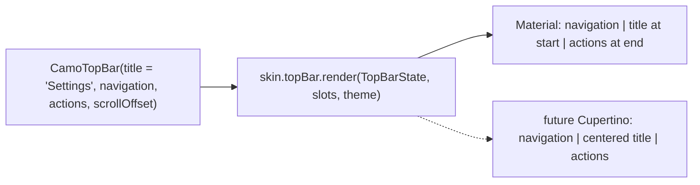
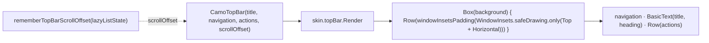
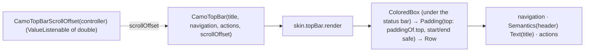

{/* Generated by docs/scripts/sync_vault.py from the Camouflage design notes. Edit the notes and re-run the script; changes made here are overwritten. */}

# CamoTopBar

## Concept {#concept}

### 1. Why

Almost every screen has a top bar: a title, a way back, and a few actions. Design languages arrange it differently: Material puts the title at the start next to the navigation icon, and iOS centers it. `CamoTopBar` takes the **title as a value** and the navigation and actions as **icon-button widgets**, and the skin decides where they go. It also reacts to scrolling (`scrollOffset`), which is how bars separate from content, and how collapsing bars (Material's large bar, Apple's large title) shrink.

### 2. Shape



**Material mapping preview:** the M3 Small top app bar.
- Height 64.
- Resting: `surface`.
- Scrolled: `surfaceContainer`.
- Title: `titleLarge`, one line with ellipsis.
- Navigation and actions: `onSurface` / `onSurfaceVariant`.

See [Material Skin](/guide/skins/material-skin).

### 3. API

#### Contract

```kotlin
fun CamoTopBar(
    title: String,
    navigation: Widget? = null,          // usually CamoIconButton(icon = AppIcon.back(), "Back", onBack)
    actions: List<Widget> = emptyList(), // usually CamoIconButtons
    scrollOffset: Dp = 0.dp,             // how far content has scrolled under the bar (0 = at the top)
    titleContent: Widget? = null,        // replaces the drawn title, e.g. a CamoSearchField or a logo
    visible: Boolean = true,             // false → slides up out of view (hide on scroll, ADR-30)
)
```

- `scrollOffset` is **passed in**, not detected, which keeps the component controlled. Platform notes provide a helper that derives it from a scroll state.
- It's a distance, not a Boolean (ADR-23): flat dialects only check `scrollOffset > 0` (a tint or hairline), while collapsing dialects use the value to shrink a large title. When the exact distance is unknown (the first item scrolled away), helpers report `Dp.Infinity`, which means "fully scrolled".
- `titleContent` replaces the **drawn** title. `title` stays required: it's still the bar's heading for screen readers ("Search", "Home"), so the screen keeps a name when the visible title is a search field or a logo.
- In Compose, `actions` is a `@Composable RowScope.() -> Unit` lambda (the idiomatic way to pass several widgets). In Flutter it's a `List<Widget>`. The meaning is the same.

**Building block (ADR-30): `CamoTopBarContainer(scrollOffset, content: Slot)`** gives a custom header (a profile hero, a big search header) the bar's surface, status-bar insets, scrolled tint and divider, and the header-region semantics. The content places its own title (mark it as a heading) and buttons. **Hide on scroll:** `visible = rememberHideOnScroll(listState)`, the same helper as the navigation bar.

**State → renderer:** `TopBarState(title, scrollOffset, visible)` (with a convenience `scrolled = scrollOffset > 0`). **Slots:** `TopBarSlots(navigation?, actions, titleContent?)`. The renderer sets the ambient icon style (24, the skin's colors) around them, so a plain `AppIcon` inside a `CamoIconButton` needs no parameters.

#### Tokens used

- `colors.surface` → `surfaceContainer` (scrolled), `onSurface` (title, navigation), `onSurfaceVariant` (actions)
- `typography.titleLarge`
- `spacing.xs` between actions, `spacing.l` start padding when there's no navigation
- `motion.durationShort` for the scrolled color change

#### Component theme

`theme.components.topBar: TopBarTheme?`. Every field is nullable in the theme. The skin's `defaults(theme)` fills whatever isn't set (Material defaults shown). See [Theme](/guide/foundations/theme) §3.10.

| Field | Type | Material default | What it's for |
|---|---|---|---|
| `titleAlign` | `Start` \| `Center` | `Start` | title position (Cupertino: `Center`) |
| `divider` | `Never` \| `WhenScrolled` \| `Always` | `Never` (Material tints instead) | the line under the bar (Minimal: `WhenScrolled`) |
| `height` | Dp | 64 | bar height (it grows at large font scale) |
| `titleStyle` | CamoTextStyle | `typography.titleLarge` | the title |
| `iconSize` | Dp | 24 | the ambient icon size for navigation and actions |
| `colors` | TopBarColors(container, scrolledContainer, title, navigation, actions) | `surface`, `surfaceContainer`, `onSurface`, `onSurface`, `onSurfaceVariant` | every color the bar uses |

#### Accessibility

- The bar is exposed as a header region, and the title as a heading.
- Navigation and actions keep their own semantics (icon buttons with labels).
- Traversal order: navigation → title → actions, in reading direction.
- It respects the status bar and display cutout insets.

### 4. Build steps

1. Core: header and heading semantics, window-inset handling, build the state and slots, call `skin.topBar.render`.
2. `DebugSkin` renderer: a row with navigation, title and actions, with a border when `scrollOffset > 0`.
3. The platform scroll helper that produces `scrollOffset`.
4. Sample: a list screen with a back button, the title "Settings", a search action and a "More" overflow menu. Scrolling changes the bar tone. A second theme centers the title and always shows the divider.
5. Tests: the title is a heading; `scrollOffset` reaches the renderer (0, a small value, and `Infinity`); insets are applied; the traversal order; icons inherit the bar's icon style.

**Done when**
- [ ] The bar changes tone when the list scrolls.
- [ ] Screen-reader traversal is navigation → title → actions.
- [ ] Nothing is hidden under the status bar or a cutout.

### 5. Edge cases

| Case | Decided behavior |
|---|---|
| A long title | One line, ellipsis. Actions keep their space. |
| Too many actions | Extras go in an overflow menu: a "More" `CamoIconButton` wrapped in a `CamoMenuAnchor`, placed last in `actions`. |
| Font scale 200% | The bar grows with the title's line height (min 64) instead of clipping, then ellipsizes. |
| RTL | Navigation goes on the right and actions on the left. The back arrow uses `autoMirror`. |
| A custom title (logo, search field) | `titleContent` (settled 2026-09-27). It passes ADR-23: every dialect can host a widget in the title area. The renderer places it where it puts the title and gives it the remaining width between navigation and actions. |
| `titleContent` in a collapsing dialect | No large title is drawn and the bar doesn't collapse (Cupertino shows it in the compact bar, like a search-field navigation bar). `scrollOffset` still drives the scrolled tint. |
| `titleContent` semantics | The widget keeps its own semantics (a search field is a text input). The bar's heading is `title`, exposed as a heading that isn't drawn. |
| Large / collapsing top bars | The contract supports them through `scrollOffset`. Minimal (v1) doesn't collapse. A skin that does (Material large bar, Cupertino large title) decides the collapse distance itself. |
| **Title alignment and divider** (settled 2026-09-27) | `TopBarTheme.titleAlign` (`Start` \| `Center`) and `TopBarTheme.divider` (`Never` \| `WhenScrolled` \| `Always`), with skin defaults (ADR-28): a brand centers its titles without a renderer override. A centered title stays centered in the window, and shrinks (ellipsis) when navigation and actions take more space on one side. |
| **Custom headers** | `CamoTopBarContainer` (ADR-30). A hidden bar (`visible = false`) reappears when the screen reader moves focus into it. |

## Implementation {#implementation}

<KotlinOnly>

### 1. Why {#kotlin-1-why}

The top bar needs three Compose-specific things:
- **window insets**, so it draws under the status bar and display cutout on Android and iOS without overlapping them;
- **heading semantics** for the title;
- a small helper that turns a scroll state into `scrollOffset`.

### 2. Shape {#kotlin-2-shape}



### 3. API {#kotlin-3-api}

```kotlin
@Composable
public fun CamoTopBar(
    title: String,
    modifier: Modifier = Modifier,
    navigation: (@Composable () -> Unit)? = null,
    actions: @Composable RowScope.() -> Unit = {},
    scrollOffset: Dp = 0.dp,
    titleContent: (@Composable () -> Unit)? = null,
    visible: Boolean = true,              // false → slides up (hide on scroll, ADR-30)
    windowInsets: WindowInsets = WindowInsets.safeDrawing.only(WindowInsetsSides.Top + WindowInsetsSides.Horizontal),
)

@Composable public fun rememberTopBarScrollOffset(state: LazyListState): Dp {
    val density = LocalDensity.current
    return remember(state, density) { derivedStateOf {
        if (state.firstVisibleItemIndex > 0) Dp.Infinity          // exact distance unknown: fully scrolled
        else with(density) { state.firstVisibleItemScrollOffset.toDp() }
    } }.value
}
@Composable public fun rememberTopBarScrollOffset(state: ScrollState): Dp {
    val density = LocalDensity.current
    return remember(state, density) { derivedStateOf { with(density) { state.value.toDp() } } }.value
}
```

- `actions` is a `RowScope` lambda, the Compose form of the base `List<Widget>`.
- The **background extends behind the status bar**; only the content row is padded by `windowInsets`.
- `windowInsets` is a platform extra, so apps with their own inset handling can pass `WindowInsets(0)`.
- When `titleContent` is set, `title` isn't drawn. The bar gets `Modifier.semantics { heading(); contentDescription = title }` on an invisible node placed first in traversal, and the content keeps its own semantics.
- Semantics: `Modifier.semantics { heading() }` on the title, and `isTraversalGroup = true` on the bar so traversal stays navigation → title → actions.
- `TopBarTheme` / `TopBarStyle` follow the base table. The scrolled color change (`scrollOffset > 0.dp`) uses `animateColorAsState(tween(motion.durationShort))`.

**Layout choices (ADR-28):** the renderer reads `style.titleAlign` (`Start` | `Center`) and `style.divider` (`Never` | `WhenScrolled` | `Always`). A centered title is placed with a custom `Layout` that measures navigation and actions first, then centers the title in the window width, shrinking it only if one side would overlap.

**Hide on scroll:** `AnimatedVisibility(visible, enter = slideInVertically { -it }, exit = slideOutVertically { -it })`, with `visible = rememberHideOnScroll(listState)` (the helper shared with the navigation bar).

**Building block `CamoTopBarContainer` (ADR-30):**

```kotlin
@Composable
public fun CamoTopBarContainer(scrollOffset: Dp = 0.dp, modifier: Modifier = Modifier, visible: Boolean = true,
    content: @Composable BoxScope.() -> Unit)
```

It draws the bar's surface, the scrolled tint and divider, the status-bar insets and the header-region semantics (`isTraversalGroup`); the content places its own title (mark it with `Modifier.semantics { heading() }`) and buttons. For a profile hero or a big search header.

### 4. Build steps {#kotlin-4-build-steps}

1. The component, the style types, both `rememberTopBarScrollOffset` helpers, and the DebugSkin renderer.
2. The sample list screen: `CamoTopBar(title = "Settings", navigation = { CamoIconButton({ AppIcon.Back() }, "Back", onBack) }, actions = { … }, scrollOffset = rememberTopBarScrollOffset(listState))`.
3. `commonTest`: the title node has `heading()`; `scrollOffset` reaches the renderer (0 → no border; 8.dp and `Dp.Infinity` → DebugSkin draws a border); the traversal order index of navigation < title < actions.
4. Manual check on an Android device with a cutout, and on an iPhone with a Dynamic Island.

**Done when**
- [ ] No content is hidden under the status bar or cutout on Android and iOS.
- [ ] The bar tone changes on scroll.

### 5. Edge cases {#kotlin-5-edge-cases}

| Case | Decided behavior |
|---|---|
| Android edge-to-edge | Apps must call `enableEdgeToEdge()` (the default target behavior on Android 15+). Otherwise the insets are zero and the bar sits below a system-colored status bar. The sample does it. |
| Desktop and web | `WindowInsets.safeDrawing` is zero, so nothing changes. |
| Status bar icon color (light/dark) | The app's job (`enableEdgeToEdge` with `SystemBarStyle`), not the bar's. The sample derives it from the theme's `surface` luminance. |
| Collapsing bars / `nestedScroll` | The Minimal skin (v1) doesn't collapse. `scrollOffset` is enough for a later collapsing skin; no `nestedScroll` connection is needed. |
| Search in the bar | `titleContent = { CamoSearchField(query, onQueryChange, onSearch) }`. The search field's focus doesn't change the bar. |

</KotlinOnly>

<DartOnly>

### 1. Why {#dart-1-why}

The top bar has three Flutter-specific needs:
- the top system inset (`MediaQuery.paddingOf(context).top`), so it draws under the status bar and notch correctly;
- `Semantics(header: true)` on the title;
- a small helper that turns a `ScrollController` into `scrollOffset`.

It also implements `PreferredSizeWidget`, so apps can drop it into their own scaffold-like layouts.

### 2. Shape {#dart-2-shape}



### 3. API {#dart-3-api}

```dart
class CamoTopBar extends StatelessWidget implements PreferredSizeWidget {
  const CamoTopBar({super.key, required this.title, this.navigation, this.actions = const [], this.scrollOffset = 0, this.titleContent, this.visible = true});
  final Widget? titleContent;          // replaces the drawn title; `title` stays the semantic header
  final double scrollOffset;          // logical pixels scrolled under the bar; double.infinity = fully scrolled
  @override Size get preferredSize;   // style height + the top inset
}

/// Listens to a ScrollController and exposes how far content is scrolled under the bar.
class CamoTopBarScrollOffset extends ValueNotifier<double> {
  CamoTopBarScrollOffset(ScrollController controller);   // value = controller.offset clamped at 0
}
// usage: ValueListenableBuilder(valueListenable: offset, builder: (_, o, __) => CamoTopBar(title: 'Settings', scrollOffset: o, …))
```

- `CamoTopBarTheme` / `CamoTopBarStyle` follow the base table.
- The scrolled color change (`scrollOffset > 0`) uses `AnimatedContainer` / `TweenAnimationBuilder<Color?>` over `motion.durationShort`.
- The status-bar icon brightness is set by the app with `AnnotatedRegion<SystemUiOverlayStyle>` (the example derives it from `surface` luminance).

**Layout choices (ADR-28):** `style.titleAlign` (`start` | `center`; centered titles use a `CustomMultiChildLayout` that centers in the full width and shrinks only when a side would overlap) and `style.divider` (`never` | `whenScrolled` | `always`).

**Hide on scroll:** `AnimatedSlide(offset: visible ? Offset.zero : const Offset(0, -1))`, with `visible` from a `CamoHideOnScroll` notifier.

**Building block `CamoTopBarContainer` (ADR-30):** `CamoTopBarContainer({scrollOffset = 0, visible = true, required child})` draws the surface, scrolled tint, divider and status-bar padding with header semantics; the child places its own title (`Semantics(header: true)`) and buttons.

### 4. Build steps {#dart-4-build-steps}

1. The component, `CamoTopBarScrollOffset`, and the DebugSkin renderer.
2. The example list screen with back, title and two actions, and the tone change on scroll.
3. Widget tests:
   - the title semantics has `isHeader`;
   - `MediaQuery(padding: EdgeInsets.only(top: 44))` → the content starts at 44 while the background starts at 0;
   - scrolling a `ListView` by 120 sets `CamoTopBarScrollOffset.value` to 120, and the bar changes tone.

**Done when**
- [ ] No content is under the status bar, notch or Dynamic Island. The tone changes on scroll.

### 5. Edge cases {#dart-5-edge-cases}

| Case | Decided behavior |
|---|---|
| Desktop and web | The top inset is 0. It's the same widget. |
| `titleContent` set | `title` is exposed through `Semantics(header: true, label: title, child: ExcludeSemantics(...))` on an empty box first in order; the content keeps its own semantics. |
| Landscape notch (side insets) | `start`/`end` padding from `MediaQuery.paddingOf`. |
| Kotlin difference | Kotlin uses `WindowInsets` + a `LazyListState` helper. Flutter uses `MediaQuery` + a `ScrollController` notifier. The behavior is the same. |

</DartOnly>
