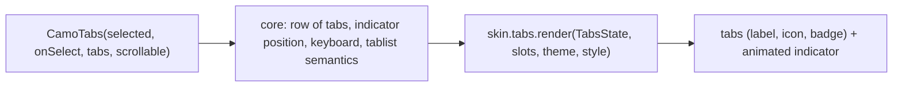
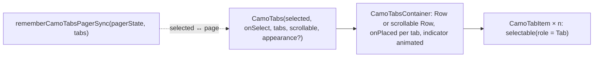
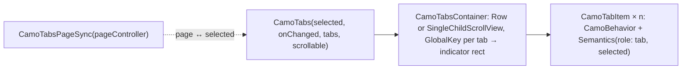

{/* Generated by docs/scripts/sync_vault.py from the Camouflage design notes. Edit the notes and re-run the script; changes made here are overwritten. */}

# CamoTabs

## Concept {#concept}

### 1. Why

Tabs switch between related views at the same level ("Overview / Reviews / Specs"). `CamoTabs` is the **tab bar only**: the selected value in, selection changes out. The content below (a pager or a simple switch) stays the app's layout, with a small helper to keep a pager in sync. Material has primary and secondary tabs, Apple uses segmented controls or tab views, Fluent TabList, and Carbon Tabs.

### 2. Shape



**Material mapping preview:** M3 primary tabs.
- 48 tall (64 with icon and label), `surface` container.
- The selected label is `primary`, and unselected `onSurfaceVariant`, in `titleSmall`.
- A 3 dp `primary` indicator with rounded top, the width of the content.
- A 1 dp `outlineVariant` divider below.

### 3. API

#### Contract

```kotlin
fun <T> CamoTabs(
    selected: T,
    onSelect: (T) -> Unit,
    tabs: List<CamoTab<T>>,
    scrollable: Boolean = false,          // true → tabs keep their natural width and the row scrolls
    appearance: Appearance? = null,   // null → TabsTheme.defaultAppearance (skin default: Solid); Solid → prominent tabs (top-level views); Ghost → quiet tabs (sub-views inside a section)
)
data class CamoTab<T>(val value: T, val label: String? = null, val icon: Widget? = null,
                      val badge: Widget? = null, val contentDescription: String? = null, val enabled: Boolean = true)

// helper for the content: keeps a pager and the tab selection in sync (platform notes)
```

**Building blocks (ADR-30):** `CamoTabsContainer(selectedIndex, scrollable, content: Slot)` draws the row, the divider and the animated indicator (it measures its children to place the indicator), and `CamoTabItem(tab, selected, onClick, position)` draws one skin-styled tab with tab semantics ("Reviews, tab, 2 of 3"). Together they make custom tab bars (pill tabs inside a card, tabs with counters or custom content) that still look and behave like the brand's tabs.

**State → renderer:** `TabsState(count, selectedIndex, scrollable, appearance, interactions)`. **Slots:** one `TabSlot(label?, icon?, badge?)` per tab.

#### Tokens used

- `colors.surface`, `primary`, `onSurfaceVariant`, `outlineVariant`
- `typography.titleSmall`, icons 24
- `motion.durationMedium` + `easingEmphasized` (the indicator slides between tabs)

#### Component theme

`theme.components.tabs: TabsTheme?`. Every field is nullable in the theme. The skin's `defaults(theme)` fills whatever isn't set (Material defaults shown). See [Theme](/guide/foundations/theme) §3.10.

| Field | Type | Material default | What it's for |
|---|---|---|---|
| `defaultAppearance` | Appearance | `Solid` | the appearance used when a call passes none (ADR-28: a brand's default variant) |
| `height` / `heightWithIcon` | Dp | 48 / 64 | bar height |
| `indicatorHeight` | Dp | 3 | indicator thickness |
| `indicatorWidth` | `Content` \| `Tab` | `Content` (primary tabs) | indicator width |
| `labelStyle` | CamoTextStyle | `titleSmall` | labels |
| `minTabWidth` (scrollable) | Dp | 90 | scrollable tab width |
| `showDivider` | Boolean | true | the line below the bar |
| `colors` | TabsColors(container, selected, unselected, indicator, divider) | `surface`, `primary`, `onSurfaceVariant`, `primary`, `outlineVariant` | every color it uses |

#### Accessibility

- A tab list, with each tab a tab ("Reviews, tab, 2 of 3, selected").
- Keyboard: arrows move focus and select; Home/End jump.
- The content area should be labelled by the selected tab (the pager helper sets it).

### 4. Build steps

1. `CamoTabs` (fixed and scrollable, indicator animation, keyboard, semantics), `TabsRenderer`, and the DebugSkin renderer.
2. The pager-sync helper (platform notes).
3. Tests:
   - a tap selects;
   - the arrow keys;
   - the scrollable row keeps the selected tab visible;
   - announcements;
   - the indicator moves (golden).

**Done when**
- [ ] A product screen with three tabs and a swipeable pager works by touch, swipe, keyboard and screen reader.

### 5. Edge cases

| Case | Decided behavior |
|---|---|
| Too many tabs for the width | Use `scrollable = true`. In fixed mode, labels ellipsize. |
| Icon-only tabs | Need `contentDescription` (debug assertion). |
| RTL | The tab order and the indicator animation mirror. |
| Tabs vs segmented control | Tabs switch views. A segmented control switches a *setting* or filter inside a view. |
| **Custom tab bars** | `CamoTabsContainer` + `CamoTabItem`s (ADR-30). A tab item that isn't a `CamoTabItem` gets no indicator position; the container asserts in debug. |

## Implementation {#implementation}

<KotlinOnly>

### 1. Why {#kotlin-1-why}

A tab bar: selection in, selection out, with an animated indicator. Compose's `TabRow` is Material, so core builds `CamoTabsContainer` (measures its tabs and animates the indicator) and `CamoTabItem` (one tab), which are also the public building blocks (ADR-30), plus a helper that syncs tabs with a `HorizontalPager`.

### 2. Shape {#kotlin-2-shape}



### 3. API {#kotlin-3-api}

```kotlin
@Composable
public fun <T> CamoTabs(
    selected: T,
    onSelect: (T) -> Unit,
    tabs: List<CamoTab<T>>,
    modifier: Modifier = Modifier,
    scrollable: Boolean = false,
    appearance: Appearance? = null,          // null → TabsTheme.defaultAppearance
)

// building blocks (ADR-30)
@Composable public fun CamoTabsContainer(selectedIndex: Int, modifier: Modifier = Modifier, scrollable: Boolean = false,
    content: @Composable CamoTabsScope.() -> Unit)
@Composable public fun <T> CamoTabsScope.CamoTabItem(tab: CamoTab<T>, selected: Boolean, onClick: () -> Unit,
    position: ItemPosition, modifier: Modifier = Modifier, content: (@Composable () -> Unit)? = null)

// pager sync
@Composable public fun <T> rememberCamoTabsPagerSync(pagerState: PagerState, tabs: List<CamoTab<T>>): CamoTabsPagerSync<T>
```

- **Indicator:** each `CamoTabItem` reports its bounds through `CamoTabsScope` (`Modifier.onPlaced`); the container animates the indicator's offset and width with `animateDpAsState`, content width or tab width per `style.indicatorWidth`, and draws it in `drawWithContent`. During a pager swipe, the sync helper interpolates the indicator with `pagerState.currentPageOffsetFraction`.
- **Scrollable:** `Modifier.horizontalScroll(scrollState)`, and the selected tab is scrolled into view (`bringIntoViewRequester`).
- **Semantics:** container `selectableGroup()`; each item `selectable(selected, role = Role.Tab)` with the position, so TalkBack reads "Reviews, tab, 2 of 3, selected". Arrow keys move between tabs (roving focus) and select.
- **Pager sync:** tapping a tab calls `pagerState.animateScrollToPage`; settling on a page calls `onSelect` — `snapshotFlow { pagerState.settledPage }`.

### 4. Build steps {#kotlin-4-build-steps}

1. `CamoTab`, `TabsTheme` / `Style`, the building blocks, `CamoTabs` built from them, the DebugSkin renderer.
2. `rememberCamoTabsPagerSync` on foundation's `HorizontalPager` (multiplatform).
3. UI tests: tap selects; the indicator moves; scrollable brings the selection into view; the pager and tabs stay in sync both ways; custom content tabs keep tab semantics.

**Done when**
- [ ] A product page (fixed tabs + pager) and a category bar (scrollable) work by touch, keyboard and screen reader on all targets.

### 5. Edge cases {#kotlin-5-edge-cases}

| Case | Decided behavior |
|---|---|
| `selected` not in `tabs` | No indicator; debug log. |
| A tab that isn't a `CamoTabItem` inside the container | It gets no indicator bounds; a debug assertion. |
| RTL | Tabs and indicator mirror; the pager mirrors on its own. |

</KotlinOnly>

<DartOnly>

### 1. Why {#dart-1-why}

A tab bar with an animated indicator, built without Material's `TabBar`: `CamoTabsContainer` measures its `CamoTabItem`s and animates the indicator (the public building blocks, ADR-30), and a small controller keeps tabs and a `PageView` in sync.

### 2. Shape {#dart-2-shape}



### 3. API {#dart-3-api}

```dart
class CamoTabs<T> extends StatelessWidget {
  const CamoTabs({super.key, required this.selected, required this.onChanged, required this.tabs,
      this.scrollable = false, this.appearance});
}
// building blocks (ADR-30)
class CamoTabsContainer extends StatefulWidget {
  const CamoTabsContainer({super.key, required this.selectedIndex, required this.children, this.scrollable = false});
}
class CamoTabItem<T> extends StatelessWidget {
  const CamoTabItem({super.key, required this.tab, required this.selected, required this.onPressed, required this.position, this.child});
}
// pager sync
class CamoTabsPageSync<T> { CamoTabsPageSync({required PageController pageController, required List<CamoTab<T>> tabs}); }
```

- **Indicator:** after layout, the container reads each item's `RenderBox` (via keys) and animates an `AnimatedPositioned` indicator to the selected one (content or tab width per `style.indicatorWidth`); during a swipe, `CamoTabsPageSync` feeds `pageController.page` to interpolate between tabs.
- **Scrollable:** `SingleChildScrollView(scrollDirection: Axis.horizontal)` + `Scrollable.ensureVisible` on the selected tab.
- **Semantics:** `Semantics(role: SemanticsRole.tabBar)` on the container, `Semantics(role: SemanticsRole.tab, selected: …)` per item; `CamoRovingFocus` for arrows.

### 4. Build steps {#dart-4-build-steps}

1. Types, the building blocks, `CamoTabs` built from them, the DebugSkin renderer; `CamoTabsPageSync`.
2. Widget tests: tap selects and moves the indicator; scrollable ensures visibility; page ↔ tab sync; custom-child tabs keep tab semantics.

**Done when**
- [ ] A product page (tabs + `PageView`) and a category bar work on every platform.

### 5. Edge cases {#dart-5-edge-cases}

| Case | Decided behavior |
|---|---|
| A non-`CamoTabItem` child in the container | No indicator rect; a debug assertion. |
| RTL | Tabs and indicator mirror; `PageView` mirrors on its own. |

</DartOnly>
