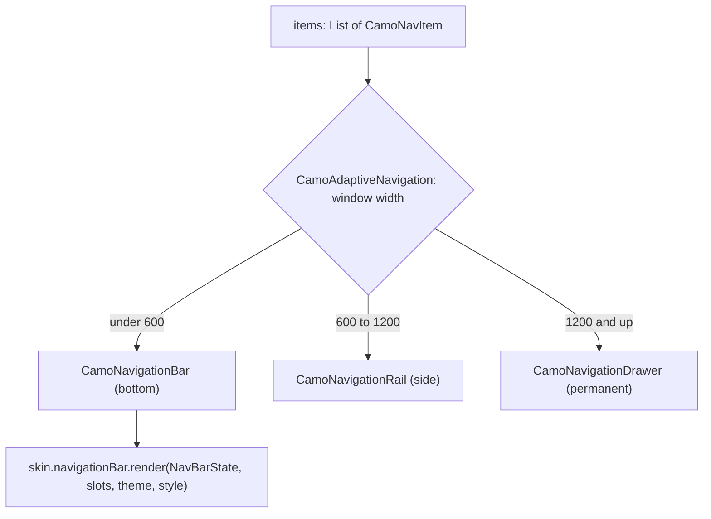
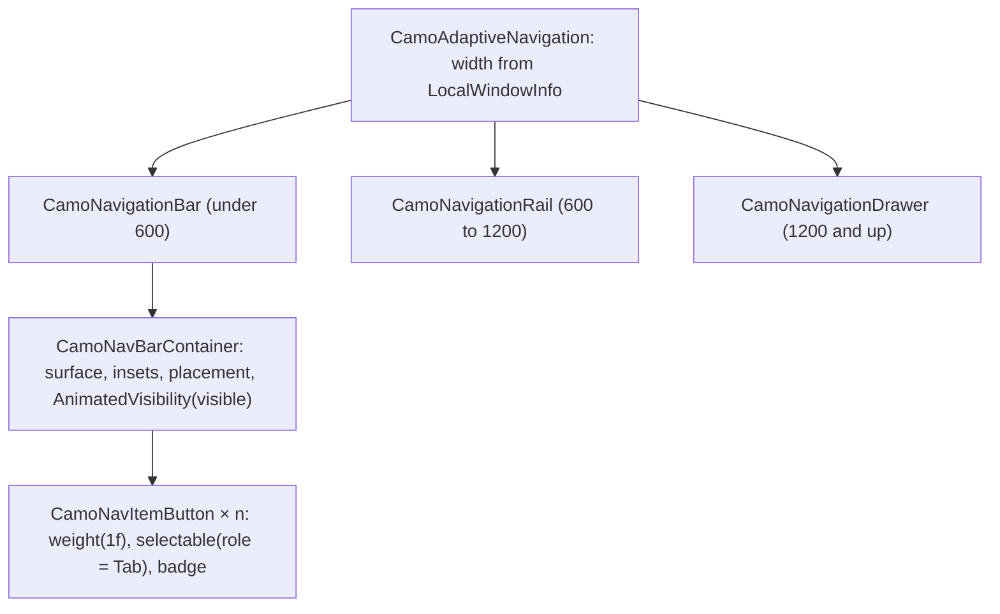
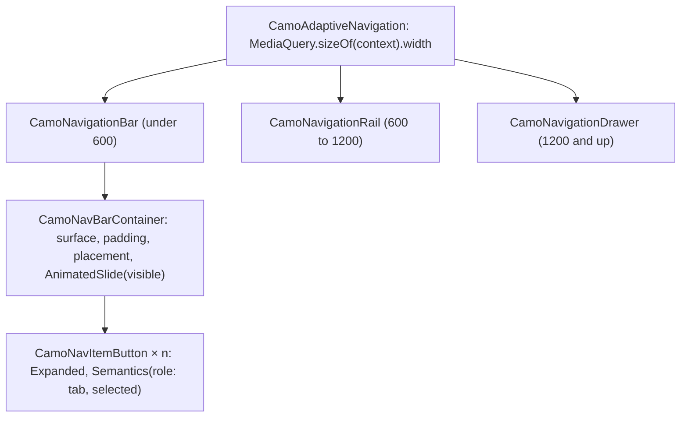

{/* Generated by docs/scripts/sync_vault.py from the Camouflage design notes. Edit the notes and re-run the script; changes made here are overwritten. */}

# CamoNavigationBar

## Concept {#concept}

### 1. Why

The bottom navigation bar switches between the app's **top-level destinations** on phones (Material's navigation bar, Apple's tab bar). This note also defines two things shared by all navigation chrome:
- **`CamoNavItem`**, the item model used by the bar, the rail and the drawer;
- **`CamoAdaptiveNavigation`**, which picks bar, rail or drawer by window width (like Material's navigation suite scaffold).

Navigation chrome shows and reports the selection. **Routing stays with the app's router** (ADR-19): `onSelect` switches the Navigation 3 back stack or the GoRouter branch.

### 2. Shape



**Material mapping preview:** the M3 navigation bar.
- 80 tall (64 in the 2025 flexible version), `surfaceContainer`.
- The active item gets a 64 × 32 pill indicator in `secondaryContainer`, with its icon in `onSecondaryContainer`.
- Labels are `labelMedium`: `onSurface` when active, `onSurfaceVariant` when not.

### 3. API

#### Contract

```kotlin
data class CamoNavItem<T>(
    val value: T,                          // your destination key (e.g. a NavKey or a route name)
    val label: String,
    val icon: Widget,
    val selectedIcon: Widget? = null,      // filled variant when selected
    val badge: Widget? = null,             // a CamoBadge
    val enabled: Boolean = true,
)

fun <T> CamoNavigationBar(
    items: List<CamoNavItem<T>>,           // 3–5
    selected: T,
    onSelect: (T) -> Unit,
    visible: Boolean = true,               // false → slides out (hide on scroll); controlled like everything else
)

// building block (ADR-30): one skin-styled, accessible nav item, for custom bars
fun <T> CamoNavItemButton(item: CamoNavItem<T>, selected: Boolean, onClick: () -> Unit, position: ItemPosition)   // position = index + count, for "2 of 4"
fun CamoNavBarContainer(content: Slot)     // the bar's surface, insets, placement and landmark semantics, without items

// helper: visible = !scrolling down (per platform: LazyListState / ScrollController)
fun rememberHideOnScroll(scrollState): Boolean

fun <T> CamoAdaptiveNavigation(
    items: List<CamoNavItem<T>>,
    selected: T,
    onSelect: (T) -> Unit,
    header: Widget? = null,                // e.g. a FAB or logo for the rail/drawer
    content: Slot,                         // the current destination's screen
)
```

**State → renderer:** `NavBarState(count, selectedIndex, visible, interactions)`. The renderer reads `showLabels` from its style. **Slots:** one `NavItemSlot(icon, selectedIcon?, label, badge?)` per item.

#### Tokens used

- `colors.surfaceContainer`, `secondaryContainer`, `onSecondaryContainer`, `onSurface`, `onSurfaceVariant`
- `typography.labelMedium`, icons 24, `shapes.full` (indicator)
- `motion.durationMedium` (the indicator grows in)

#### Component theme

`theme.components.navigationBar: NavigationBarTheme?`. Every field is nullable in the theme. The skin's `defaults(theme)` fills whatever isn't set (Material defaults shown). See [Theme](/guide/foundations/theme) §3.10.

| Field | Type | Material default | What it's for |
|---|---|---|---|
| `placement` | `Pinned` \| `Floating` | `Pinned` | `Pinned`: edge to edge, on the bottom inset. `Floating`: a detached container with `floatingMargin`, `floatingShape` and elevation, above the bottom inset (ADR-30). |
| `floatingMargin` / `floatingShape` | Padding / Shape | 16 / `shapes.full` | the floating container |
| `hideAnimation` | Duration | `motion.durationMedium` | slide out/in when `visible` changes |
| `indicator` | NavIndicator (`Pill` \| `Line` \| `Dot` \| `Fill` \| `None`) | `Pill` | the style of the selected item's indicator (ADR-28). `Line` = a line on the top edge. Minimal and Cupertino: `None`. The size and shape fields apply to the chosen style. |
| `showLabels` | LabelVisibility (`Always` \| `Selected` \| `Never`) | `Always` | label visibility. An app-wide choice, so it's a theme field with no per-call parameter (ADR-23, like `labelPlacement`). Apple's tab bar always shows labels, so the Cupertino skin's default is `Always`. |
| `height` | Dp | 80 | bar height (plus the bottom inset) |
| `indicatorSize` | Size | 64 × 32 | the active pill |
| `indicatorShape` | Shape | `shapes.full` | pill corners |
| `labelStyle` | CamoTextStyle | `labelMedium` | labels |
| `iconSize` | Dp | 24 | icons |
| `colors` | NavBarColors(container, indicator, selectedIcon, selectedLabel, icon, label) | M3 values above | every color it uses |

`CamoAdaptiveNavigation`'s width breakpoints (600 / 1200) come from `theme.components.navigationBar.adaptiveBreakpoints`, so a brand can change them.

#### Accessibility

- The bar is a navigation landmark. Items are tabs ("Home, tab, 1 of 4, selected"), including the badge text ("Inbox, 3 unread").
- It respects the bottom system inset (the gesture bar).
- Keyboard: Tab reaches the bar, and arrows move between items.

### 4. Build steps

1. `CamoNavItem`, `CamoNavigationBar`, `NavigationBarRenderer`, and the DebugSkin renderer.
2. `CamoAdaptiveNavigation` (width → bar, rail or drawer, with state kept across switches).
3. Sample: a four-destination app (plus a floating, hide-on-scroll variant and the "Expandable nav bar" recipe built from `CamoNavBarContainer` + `CamoNavItemButton`), wired to Navigation 3 (Kotlin) and to a GoRouter `StatefulShellRoute` (Flutter), switching layouts as the window resizes.
4. Tests:
   - selection;
   - announcements with badges;
   - the bottom inset;
   - the adaptive switch at 600 and 1200;
   - selection kept when the layout changes.

**Done when**
- [ ] The sample shows a bar on phones, a rail on tablets and a drawer on desktop, with the same items and selection.

### 5. Edge cases

| Case | Decided behavior |
|---|---|
| More than 5 destinations | Use `CamoAdaptiveNavigation`'s drawer, or move extras into a "More" destination. The bar asserts 3–5 in debug. |
| **Hide on scroll** (settled 2026-09-27) | `visible = rememberHideOnScroll(listState)`: hidden while scrolling down, shown when scrolling up or at the end. The bar slides out, and content under it gets the space. Screen readers keep reaching the bar (hidden bars reappear when focused). |
| **Floating bar** | `NavigationBarTheme.placement = Floating`. Content scrolls under it; `CamoMessengerInsets` and FABs sit above it. |
| **A custom navigation design** (e.g. a bar that drags up into a sheet with a menu) | Not a `CamoNavigationBar` option: build it from **building blocks** (ADR-30). `CamoNavBarContainer` + `CamoNavItemButton`s give the skin's look, the badges and the navigation semantics; the app adds its own layout and gestures (a `CamoSheetFrame` for the expanded part). Recipe in the sample: "Expandable nav bar". |
| The keyboard is open | The bar stays below the keyboard (it doesn't ride up with the IME), per platform convention. |
| Reselecting the current item | `onSelect` fires again. Apps commonly scroll to top, and the docs show the pattern. |

## Implementation {#implementation}

<KotlinOnly>

### 1. Why {#kotlin-1-why}

The bottom bar plus two shared pieces: `CamoNavItem` and `CamoAdaptiveNavigation`. Kotlin adds window-size detection that works on all four targets, system insets, the `Pinned`/`Floating` placement, hiding with `visible` and `rememberHideOnScroll`, and the public building blocks `CamoNavBarContainer` and `CamoNavItemButton` (ADR-30).

### 2. Shape {#kotlin-2-shape}



### 3. API {#kotlin-3-api}

```kotlin
@Immutable public data class CamoNavItem<T>(val value: T, val label: String, val icon: @Composable () -> Unit,
    val selectedIcon: (@Composable () -> Unit)? = null, val badge: (@Composable () -> Unit)? = null, val enabled: Boolean = true)

@Composable
public fun <T> CamoNavigationBar(items: List<CamoNavItem<T>>, selected: T, onSelect: (T) -> Unit,
    modifier: Modifier = Modifier, visible: Boolean = true)

// building blocks (ADR-30)
@Composable public fun CamoNavBarContainer(modifier: Modifier = Modifier, visible: Boolean = true, content: @Composable RowScope.() -> Unit)
@Composable public fun <T> RowScope.CamoNavItemButton(item: CamoNavItem<T>, selected: Boolean, onClick: () -> Unit,
    position: ItemPosition, modifier: Modifier = Modifier)

@Composable public fun rememberHideOnScroll(listState: LazyListState): Boolean
@Composable public fun rememberHideOnScroll(scrollState: ScrollState): Boolean

@Composable
public fun <T> CamoAdaptiveNavigation(items: List<CamoNavItem<T>>, selected: T, onSelect: (T) -> Unit,
    modifier: Modifier = Modifier, header: (@Composable () -> Unit)? = null, content: @Composable () -> Unit)
```

- **Placement:** `Pinned` → full width, `windowInsetsPadding(WindowInsets.navigationBars)` inside the surface so the color runs under the gesture bar. `Floating` → `padding(style.floatingMargin)` plus the navigation-bar inset outside, a `style.floatingShape` surface with elevation; content scrolls underneath.
- **Visibility:** `AnimatedVisibility(visible, enter = slideInVertically { it }, exit = slideOutVertically { it })`. A hidden bar keeps a zero-size semantics anchor: when TalkBack/VoiceOver focus moves to where it was, the bar is shown again (core calls back through `CamoNavBarVisibilityOverride`).
- **Hide on scroll:** `rememberHideOnScroll` compares successive `firstVisibleItemIndex` / `firstVisibleItemScrollOffset` pairs in a `snapshotFlow`: scrolling down hides, scrolling up or reaching the top or end shows. Small jitters under 8 dp are ignored.
- **Items:** `selectable(selected, role = Role.Tab)` with the position; the badge text joins the item's description ("Inbox, tab, 3 unread"). `style.indicator` picks how the renderer draws the selection (`Pill`, `Line` on the top edge, `Dot`, `Fill`, `None`); `style.showLabels` hides unselected or all labels (the label stays in semantics).
- **Adaptive:** width in dp from `LocalWindowInfo.current.containerSize` and `LocalDensity`; thresholds from `style.adaptiveBreakpoints`. Only the chrome changes: `content` stays in the same composition slot (`movableContentOf`), so the destination keeps its state when a window resizes across a breakpoint.

### 4. Build steps {#kotlin-4-build-steps}

1. `CamoNavItem`, `NavigationBarTheme` / `Style` (placement, indicator, showLabels, floating fields), the building blocks, `CamoNavigationBar` built from them, the DebugSkin renderer.
2. `rememberHideOnScroll` (shared with the top bar and FAB), `CamoAdaptiveNavigation`.
3. The sample: four destinations on Navigation 3; a floating hide-on-scroll variant; the "Expandable nav bar" recipe (`CamoNavBarContainer` + `CamoNavItemButton`s + a standalone `CamoSheetFrame` for the expanded menu).
4. UI tests: selection and announcements with badges; insets; hide and show on scroll; the adaptive switch at 600 and 1200 with the content's state kept.

**Done when**
- [ ] The sample shows a bar on phones, a rail on tablets and a drawer on desktop, keeps each destination's state across resizes, and the floating and expandable variants work.

### 5. Edge cases {#kotlin-5-edge-cases}

| Case | Decided behavior |
|---|---|
| Keyboard open | The bar stays below the IME (no `imePadding` on it). |
| Reselecting the current item | `onSelect` fires again (apps scroll to top). |
| Web and desktop | `WindowInsets.navigationBars` is zero; the same code. |

</KotlinOnly>

<DartOnly>

### 1. Why {#dart-1-why}

The bottom bar, `CamoNavItem`, and `CamoAdaptiveNavigation`. Flutter specifics: the bottom padding from `MediaQuery`, `pinned`/`floating` placement, hiding with `visible` and a `CamoHideOnScroll` notifier (core has no hooks dependency), the building blocks `CamoNavBarContainer` / `CamoNavItemButton` (ADR-30), and GoRouter's `StatefulShellRoute` in the example.

### 2. Shape {#dart-2-shape}



### 3. API {#dart-3-api}

```dart
class CamoNavItem<T> {
  const CamoNavItem({required this.value, required this.label, required this.icon, this.selectedIcon, this.badge, this.enabled = true});
}
class CamoNavigationBar<T> extends StatelessWidget {
  const CamoNavigationBar({super.key, required this.items, required this.selected, required this.onChanged, this.visible = true});
}
// building blocks (ADR-30)
class CamoNavBarContainer extends StatelessWidget { const CamoNavBarContainer({super.key, required this.children, this.visible = true}); }
class CamoNavItemButton<T> extends StatelessWidget {
  const CamoNavItemButton({super.key, required this.item, required this.selected, required this.onPressed, required this.position});
}
class CamoHideOnScroll extends ValueNotifier<bool> { CamoHideOnScroll(ScrollController controller); }   // true = visible

class CamoAdaptiveNavigation<T> extends StatelessWidget {
  const CamoAdaptiveNavigation({super.key, required this.items, required this.selected, required this.onChanged, this.header, required this.child});
}
```

- **Placement:** `pinned` → full width, the surface extends under `MediaQuery.paddingOf(context).bottom`; `floating` → margins from `style.floatingMargin`, a `style.floatingShape` surface with elevation, above the bottom inset.
- **Visibility:** `AnimatedSlide(offset: visible ? Offset.zero : const Offset(0, 1))`; when hidden, `ExcludeFocus` and the bar reappears when accessibility focus reaches it (`Semantics(onDidGainAccessibilityFocus: …)`).
- **Hide on scroll:** `CamoHideOnScroll` listens to a `ScrollController`: scrolling down (`userScrollDirection == ScrollDirection.reverse`) hides, up or at an edge shows; used with `ValueListenableBuilder`.
- **Items:** `Semantics(role: SemanticsRole.tab, selected: …)` inside `Semantics(role: SemanticsRole.tabBar)`; badge text via `CamoBadgedBox`; `style.indicator` and `style.showLabels` as in base.
- **Adaptive:** the child keeps its `Element` across layouts because `CamoAdaptiveNavigation` builds the same widget tree position for `child` in all three layouts (a `Row`/`Column` with the child always at the same slot, keyed with a `GlobalKey`).
- **GoRouter example:** `StatefulShellRoute.indexedStack(builder: (context, state, shell) => CamoAdaptiveNavigation(selected: shell.currentIndex, onChanged: shell.goBranch, child: shell, …))`.

### 4. Build steps {#dart-4-build-steps}

1. `CamoNavItem`, theme/style (placement, indicator, showLabels, floating fields), building blocks, the bar built from them, the DebugSkin renderer.
2. `CamoHideOnScroll`, `CamoAdaptiveNavigation`.
3. The example: GoRouter shell with four branches; a floating hide-on-scroll variant; the "Expandable nav bar" recipe (`CamoNavBarContainer` + `CamoNavItemButton`s + a sheet).
4. Widget tests: selection and badge semantics; bottom padding; hide/show on scroll; breakpoints with the branch state kept.

**Done when**
- [ ] The example shows bar, rail and drawer by width with state kept, plus the floating and expandable variants, on all six platforms.

### 5. Edge cases {#dart-5-edge-cases}

| Case | Decided behavior |
|---|---|
| Keyboard open | The bar isn't lifted by `viewInsets` (it stays behind the keyboard). |
| Reselecting | `onChanged` fires again (GoRouter: `goBranch(i, initialLocation: i == current)` pops to the branch root). |

</DartOnly>
