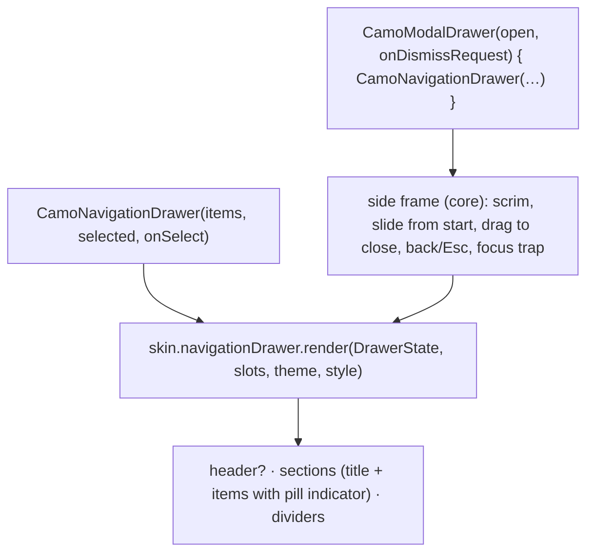
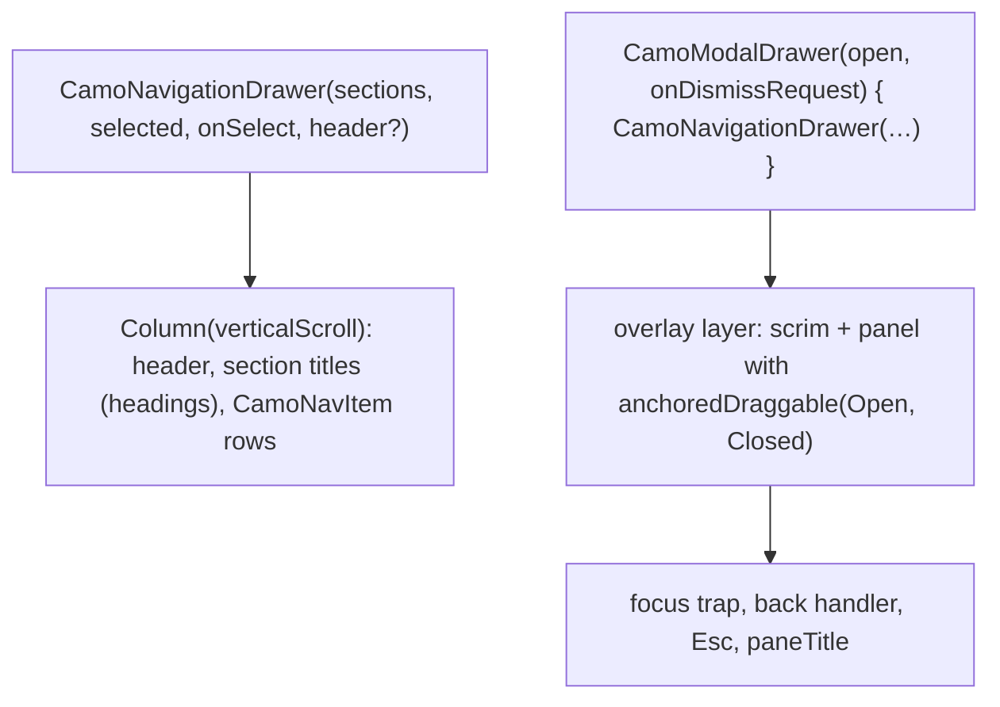
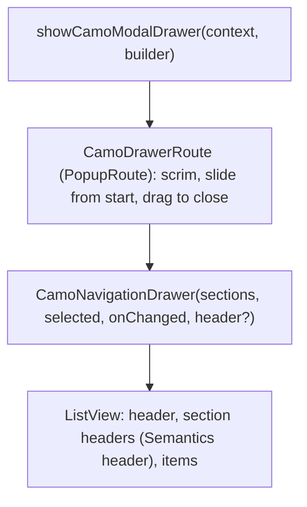

{/* Generated by docs/scripts/sync_vault.py from the Camouflage design notes. Edit the notes and re-run the script; changes made here are overwritten. */}

# CamoNavigationDrawer

## Concept {#concept}

### 1. Why

A navigation drawer lists destinations with full labels, section headers and dividers. It has two modes:
- **permanent**: always visible on wide windows (the desktop sidebar; Apple's sidebar, Fluent's Nav);
- **modal**: slides in from the start edge over the content, with a scrim, on phones when there are too many destinations for a bar.

It uses the same `CamoNavItem` model, and the modal mode reuses the overlay frame machinery, from the side instead of the bottom.

### 2. Shape



**Material mapping preview:** the M3 navigation drawer.
- 360 wide. `surfaceContainerLow` (modal) or `surface` (permanent).
- Items 56 tall, with a full-width `secondaryContainer` pill when active.
- Section titles `titleSmall` in `onSurfaceVariant`.
- The modal drawer has `shapes.large` end corners and a `scrim` at 32%.

### 3. API

#### Contract

```kotlin
fun <T> CamoNavigationDrawer(
    sections: List<CamoNavSection<T>>,     // one untitled section for simple lists
    selected: T,
    onSelect: (T) -> Unit,
    header: Widget? = null,                // app logo, account switcher
)
data class CamoNavSection<T>(val title: String? = null, val items: List<CamoNavItem<T>>)

fun CamoModalDrawer(
    open: Boolean,
    onDismissRequest: () -> Unit,          // scrim tap, back, Esc, drag to the start edge
    content: Slot,                         // a CamoNavigationDrawer
)
```

The modal drawer's visibility is **state** (`open`), not a route: a menu button toggles it, and selecting an item closes it. That's the convention on both platforms. It's layout chrome, not a destination.

**State → renderer:** `DrawerState(modal, selectedKey)`. **Slots:** `header?`, and section titles + `NavItemSlot`s.

#### Tokens used

- `colors.surface`/`surfaceContainerLow`, `secondaryContainer`, `onSecondaryContainer`, `onSurfaceVariant`, `outlineVariant`, `scrim`
- `typography.labelLarge` (items), `titleSmall` (section titles), `shapes.full` (item pill), `shapes.large` (modal corners)
- `motion.durationMedium` + `easingEmphasized` (slide)

#### Component theme

`theme.components.navigationDrawer: NavigationDrawerTheme?`. Every field is nullable in the theme. The skin's `defaults(theme)` fills whatever isn't set (Material defaults shown). See [Theme](/guide/foundations/theme) §3.10.

| Field | Type | Material default | What it's for |
|---|---|---|---|
| `indicator` | NavIndicator (`Pill` \| `Line` \| `Dot` \| `Fill` \| `None`) | `Pill` | the selected item's indicator. `Line` = a start-edge line (Fluent, Carbon); `Fill` = a filled row (Minimal). The size and shape fields apply to the chosen style. |
| `width` | Dp | 360 | drawer width (max 80% of the window on phones) |
| `itemHeight` | Dp | 56 | item rows |
| `itemShape` | Shape | `shapes.full` | active pill |
| `modalShape` | Shape | `shapes.large` (end corners) | modal container |
| `labelStyle` / `sectionTitleStyle` | CamoTextStyle | `labelLarge` / `titleSmall` | texts |
| `scrimAlpha` | Float | 0.32 | modal scrim |
| `colors` | DrawerColors(container, modalContainer, indicator, selectedContent, content, sectionTitle) | M3 values | every color it uses |

#### Accessibility

- A navigation landmark. Section titles are headings. Items are links/tabs with a selected state.
- Modal: announced as a pane ("Navigation"). Focus moves in and is trapped. Back/Esc closes it and returns focus to the menu button.
- It's never drag-only: the scrim, back and Esc also close it.

### 4. Build steps

1. The side frame (reusing the sheet frame's scrim, focus and dismissal logic, horizontally).
2. `CamoNavigationDrawer`, `CamoModalDrawer`, `NavigationDrawerRenderer`, and the DebugSkin renderer.
3. Sample: a permanent drawer on desktop (via `CamoAdaptiveNavigation`), and a modal drawer on phones opened from the top bar's menu button.
4. Tests:
   - open/close by button, scrim, back, Esc and drag;
   - selecting closes the modal drawer;
   - focus restored to the menu button;
   - RTL slides in from the right.

**Done when**
- [ ] Both modes work on every platform, and match the bar and rail's selection in the adaptive sample.

### 5. Edge cases

| Case | Decided behavior |
|---|---|
| An edge-swipe to open (from the screen edge) | Off by default, because it conflicts with system back gestures on Android and iOS. Apps can enable it (`CamoModalDrawer(edgeSwipeToOpen = true)`). |
| Long destination lists | The drawer scrolls. The header stays fixed. |
| Nested destinations (expandable groups) | Later. |

## Implementation {#implementation}

<KotlinOnly>

### 1. Why {#kotlin-1-why}

The drawer has two modes: **permanent** (a side panel on wide windows) and **modal** (slides over the content with a scrim). Kotlin implements the modal one in-layer like the overlay frames: a scrim, a drag-to-close gesture with `anchoredDraggable`, a focus trap, back and Esc handling.

### 2. Shape {#kotlin-2-shape}



### 3. API {#kotlin-3-api}

```kotlin
@Composable
public fun <T> CamoNavigationDrawer(
    sections: List<CamoNavSection<T>>,
    selected: T,
    onSelect: (T) -> Unit,
    modifier: Modifier = Modifier,
    header: (@Composable () -> Unit)? = null,
)

@Composable
public fun CamoModalDrawer(open: Boolean, onDismissRequest: () -> Unit, modifier: Modifier = Modifier, content: @Composable () -> Unit)
```

- **Items:** full-width rows, `selectable(role = Role.Tab)`; `style.indicator` draws `Pill`, `Line` (start edge), `Fill` (Minimal) or `None`. Section titles are headings.
- **Modal drawer:** rendered in the provider's overlay layer (above content, below snackbars). `AnchoredDraggableState` with anchors `Closed = -panelWidth` and `Open = 0` (mirrored in RTL); a fling or a drag past half closes it and calls `onDismissRequest`. The scrim alpha follows the drag fraction.
- **Modality:** the scrim consumes pointer input; focus moves to the first item on open and is trapped inside the panel (`focusGroup` + `focusProperties { exit = { FocusRequester.Cancel } }`); the back handler and Esc call `onDismissRequest`; `semantics { paneTitle = "Navigation" }`.
- **Width:** `min(style.width, 0.8 × window width)` on phones.

### 4. Build steps {#kotlin-4-build-steps}

1. `CamoNavSection`, `NavigationDrawerTheme` / `Style`, `CamoNavigationDrawer`, `CamoModalDrawer`, the DebugSkin renderer.
2. UI tests: permanent selection; modal opens, closes by scrim, back, Esc and drag; focus is trapped and returns to the menu button; RTL slides from the right.

**Done when**
- [ ] The adaptive sample shows a permanent drawer on desktop, and a modal drawer from a top-bar menu button on phones, on all targets.

### 5. Edge cases {#kotlin-5-edge-cases}

| Case | Decided behavior |
|---|---|
| `open` flips while dragging | The state animates to the new target from the current offset. |
| Selecting an item in the modal drawer | The app calls `onSelect` and closes the drawer (the sample shows the pattern: navigate, then `open = false`). |
| Nested destinations (expandable groups) | Later. |

</KotlinOnly>

<DartOnly>

### 1. Why {#dart-1-why}

A permanent side panel on wide windows, and a modal drawer on narrow ones. The modal drawer is a `PopupRoute` like the overlay routes, so it gets the scrim, back handling, focus scope and the page behind staying visible, and it slides with a drag.

### 2. Shape {#dart-2-shape}



### 3. API {#dart-3-api}

```dart
class CamoNavigationDrawer<T> extends StatelessWidget {
  const CamoNavigationDrawer({super.key, required this.sections, required this.selected, required this.onChanged, this.header});
}
Future<void> showCamoModalDrawer({required BuildContext context, required WidgetBuilder builder});
```

- Flutter shape: the base's `CamoModalDrawer(open, onDismissRequest)` becomes a `show` function, the same convention as dialogs and sheets (ADR-19). The page opens it from a menu button; selecting an item pops the route and calls `onChanged`.
- **Route:** `CamoDrawerRoute extends PopupRoute` with `barrierColor` from the scrim, a `SlideTransition` from the start edge (`Directionality`-aware), and a horizontal drag that drives the route's `AnimationController` (fling or past half closes).
- **Items:** `Semantics(button: true, selected: …)`, a list of destinations rather than a tab bar; `style.indicator` (`pill`, `line`, `fill`, `none`).
- **Width:** `min(style.width, 0.8 * MediaQuery.sizeOf(context).width)`.

### 4. Build steps {#dart-4-build-steps}

1. Types, `CamoNavigationDrawer`, `CamoDrawerRoute`, `showCamoModalDrawer`, the DebugSkin renderer.
2. Widget tests: permanent selection; modal opens and closes by scrim, back, Esc and drag; focus returns to the menu button; RTL slides from the right.

**Done when**
- [ ] A permanent drawer on desktop and a modal drawer on phones work on all six platforms.

### 5. Edge cases {#dart-5-edge-cases}

| Case | Decided behavior |
|---|---|
| GoRouter | The route is pushed on the nearest `Navigator` (a `ShellRoute`'s navigator works); no router change. |
| Nested destinations | Later. |

</DartOnly>
