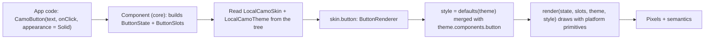
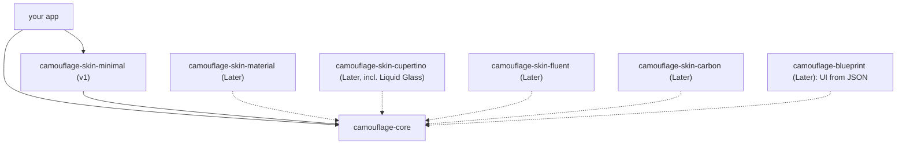

{/* Generated by docs/scripts/sync_vault.py from the Camouflage design notes. Edit the notes and re-run the script; changes made here are overwritten. */}

# Architecture

## 1. Why

This note fixes how the pieces of Camouflage connect before any code exists: which concept owns what, which module depends on which, and the exact path a call like `CamoButton(...)` takes to become pixels. Every later note fills in one box of this picture. If a later note seems to contradict this one, this one wins, or it gets updated with an entry in [Decisions](/guide/project/decisions).

## 2. Shape

### 2.1 Three concepts, three responsibilities

| | Theme | Skin | Component |
|---|---|---|---|
| **Is** | data (immutable values), including optional per-component overrides | behavior (a set of renderers), plus complete per-component defaults | API (a function or widget the app calls) |
| **Knows about** | nothing | Theme | Skin + Theme (through the provider) |
| **Written by** | the app, or generated from Figma | a skin library | `camouflage-core` |
| **Swapped by** | `CamouflageProvider(theme = …)` | `CamouflageProvider(skin = …)` | never swapped |

The dependency direction is one way: **Component → Skin → Theme**. A Theme never knows which skin draws it, so the same brand theme works on Material and, later, Cupertino.

### 2.2 The render path



Step by step, for one button press:
1. The app calls `CamoButton(text = "Save", onClick = save, appearance = Solid, prefixIcon = AppIcon.save())`.
2. The component (in core) packs its inputs into two objects:
   - **`ButtonState`**: the values: `text`, `enabled`, `appearance`, `tone`, the interaction state (pressed/focused/hovered).
   - **`ButtonSlots`**: the widgets: `prefixIcon`, `suffixIcon`.
3. It reads the nearest `CamouflageProvider` above it and gets `skin` and `theme`.
4. It resolves the button's component theme (`style = skin.button.defaults(theme).merge(theme.components.button)`) and calls `skin.button.render(state, slots, theme, style)`.
5. `MinimalSkin`'s `ButtonRenderer` draws a flat container with `theme.colors.primary`, its style's shape (radius 8), and a soft fade on press (the skin's `InteractionFeedback`). It draws the text itself in `labelLarge`, and sets the ambient icon style (18, `onPrimary`) so the `AppIcon` needs no parameters.
6. The component wires up the click callback and semantics (role = button). This is **not** the renderer's job, so every skin is accessible by default.

:::info[Split of duties inside a component]

**Core component** owns behavior that must never differ between skins: the click/value callbacks, the semantics role and label, the enabled check, and the minimum touch target.
**Renderer** owns everything visual and anything structural: layout, colors, shape, animation, press feedback, how text values are drawn, the icon style around icon widgets, and where they go.

:::

### 2.3 Modules



| Module | Contains | Depends on |
|---|---|---|
| `camouflage-core` | `CamoTheme` and its groups, `CamoSkin` plus every renderer interface, `SurfaceTreatment`, `InteractionFeedback`, `CamouflageProvider`, the 11 components | the platform UI toolkit only (Compose foundation / Flutter widgets) |
| `camouflage-skin-minimal` (v1) | `MinimalSkin` (Camouflage's own dialect), its renderers, the Flat surface treatment, Fade feedback, `minimalTheme` | `camouflage-core` |
| `camouflage-skin-material`, `-cupertino`, `-fluent`, `-carbon` (Later) | the other dialects ([Skins](/guide/skins)) | `camouflage-core` |
| Later skins | one module each | `camouflage-core` (a Fluent skin may also reuse Material renderers) |
| `camouflage-storybook`, `camouflage-filesystem`, … (Later, family packages in the same repo, ADR-26) | a component catalog built with Camouflage; a file layer with a browser/picker built with Camouflage. See [Roadmap](/guide/project/roadmap). | both → core (never the reverse) |
| `camouflage-blueprint` (Later) | server-driven UI: builds Camouflage components, forms and `CamoRule`s from JSON through a type registry | `camouflage-core` (never the reverse) |

Dart package names use underscores: `camouflage_core`, `camouflage_skin_minimal`.

**Why skins are separate libraries:**
- An app pays only for the skins it uses: binary size, and no unused dependencies.
- A skin can be versioned and released on its own. A Material fix doesn't force a core release.
- It proves the contract is complete: if `skin-minimal` can be built using **only** core's public API, a third-party or AI-generated skin can be too.

### 2.4 Platforms

Camouflage compiles for every platform its toolkits support (ADR-18). All library code is **common code**. Anything platform-specific goes through `expect`/`actual` (Kotlin) or a platform check with a fallback (Flutter).

| Platform | Kotlin target | Flutter | Platform-specific parts Camouflage needs |
|---|---|---|---|
| Android | `androidTarget` | android | system animation scale (reduced motion); optional `dynamicCamoColors()` (Android 12+, `androidMain` only) |
| iOS | `iosArm64`, `iosSimulatorArm64` | ios | reduced-motion setting; bold-text setting |
| Desktop (Windows, macOS, Linux) | `jvm` | windows, macos, linux | mouse hover and keyboard-first focus (already in the contracts); window resizing |
| Web | `wasmJs` | web | `prefers-reduced-motion` and `prefers-color-scheme`; limited screen-reader support on the canvas; bundle size |

Rules:
1. No platform-only API in `commonMain` / shared Dart code. The build of each target is what enforces it.
2. Every `expect` has an `actual` on **every** target, even if it's a safe fallback (haptics → no-op on web).
3. Optional platform extras (dynamic color) live in platform source sets as **additions**, never as part of the core API.

### 2.5 Surface treatment: the "material" of a design language

Most design languages share a structure: a button is a container with a label. What sets them apart is the **surface**:

| Design language | Surface metaphor | Treatment |
|---|---|---|
| Google, Material Design | paper | opaque fill, elevation expressed as shadow and tonal tint |
| Apple, Liquid Glass (iOS 26+) | glass | translucent, blurs and refracts what is behind it |
| Microsoft, Fluent | acrylic / mica | frosted blur (acrylic) or a wallpaper tint (mica) |

So `SurfaceTreatment` is a separate, reusable part of a skin (see [Skin Contract](/guide/architecture/skin-contract)). This is why a future Fluent skin could reuse most Material renderers and swap only the surface treatment.

## 3. API

This note introduces no new API. It is the map of the API defined elsewhere:

| Name | Kind | Defined in | What it's for |
|---|---|---|---|
| `CamoTheme` | data | [Theme](/guide/foundations/theme) | all token values for one brand in one mode, including optional component themes |
| `CamoComponentThemes`, `ButtonTheme`… | data | [Theme](/guide/foundations/theme) §3.10 + each component note | per-component overrides, merged over skin defaults |
| `CamoSkin` | data of renderers | [Skin Contract](/guide/architecture/skin-contract) | everything needed to draw every component |
| `XRenderer.render(state, slots, theme, style)` + `defaults(theme)` | interface | [Skin Contract](/guide/architecture/skin-contract) | draws one component |
| `SurfaceTreatment`, `InteractionFeedback` | interfaces | [Skin Contract](/guide/architecture/skin-contract) | reusable skin parts |
| `CamouflageProvider(skin, theme, content)` | component | [Provider and Scoping](/guide/architecture/provider-and-scoping) | puts a skin and a theme into the tree |
| `Camouflage.skin`, `Camouflage.theme` | accessors | [Provider and Scoping](/guide/architecture/provider-and-scoping) | read the current skin and theme |
| `CamoText` … `CamoBottomSheet`, `CamoForm` | components | [Components — Overview](/components) | what apps call |
| `MinimalSkin` | skin | [Minimal Skin](/guide/skins/minimal-skin) | the v1 skin (Camouflage's own dialect) |
| `MaterialSkin`, `CupertinoSkin`, `FluentSkin`, `CarbonSkin` | skins | [Skins](/guide/skins) | Later dialects |

**The full render path as pseudocode** (one button):

```kotlin
// camouflage-core
fun CamoButton(text: String, onClick: () -> Unit, appearance: Appearance = Solid, tone: Tone = Default,
               enabled: Boolean = true, prefixIcon: Widget? = null, suffixIcon: Widget? = null) {
    val skin = Camouflage.skin          // nearest provider, fails fast if none
    val theme = Camouflage.theme
    val interaction = rememberInteractionState()          // pressed / focused / hovered
    val state = ButtonState(text, enabled, appearance, tone, interaction.current)
    val slots = ButtonSlots(prefixIcon, suffixIcon)
    val style = skin.button.defaults(theme).merge(theme.components.button)   // theme overrides win
    Clickable(onClick, enabled, role = Button, label = text, minTouchTarget = 48, interaction) {
        skin.button.render(state, slots, theme, style)
    }
}

// camouflage-skin-minimal
object MinimalButtonRenderer : ButtonRenderer {
    override fun defaults(theme: CamoTheme) = ButtonTheme(
        height = 40, shape = theme.shapes.medium, padding = (theme.spacing.l, 0), iconSize = 16, iconGap = theme.spacing.s,
        textStyle = theme.typography.labelLarge, /* colors per appearance, referencing theme.colors … */)
    fun render(state: ButtonState, slots: ButtonSlots, theme: CamoTheme, style: ButtonTheme) {
        val f = theme.colors.family(state.tone)                        // Default → primary (ink) / its container
        val (container, onContainer) = when (state.appearance) {
            Solid -> f.strong to f.onStrong
            Soft -> theme.colors.surfaceContainerHigh to theme.colors.onSurface
            Raised -> theme.colors.surface to theme.colors.onSurface        // + a hairline border, no shadow
            Outline, Ghost, Link -> Transparent to f.strong
        }
        Box(height = style.height, shape = style.shape, color = container, padding = style.padding) {
            ProvideIconStyle(IconStyle(size = style.iconSize, color = onContainer)) {
                Row(gap = style.iconGap) {
                    slots.prefixIcon?.invoke()
                    Text(state.text, style = style.textStyle, color = onContainer)
                    slots.suffixIcon?.invoke()
                }
            }
        }
    }
}
```

## 4. Build steps

This is the M0 skeleton. No component draws anything yet.

1. Create the repository with the module layout from §2.3: `camouflage-core`, `camouflage-skin-minimal`, and a `sample` app. Platform details: [Project Setup](/guide/architecture/project-setup) / [Project Setup](/guide/architecture/project-setup).
2. Make `camouflage-skin-minimal` depend on `camouflage-core`, and `sample` depend on both.
3. Add one empty public type in core (`CamoTheme`) and use it from `skin-minimal` and `sample`, to prove the dependency wiring compiles.
4. Turn on public-API tracking for core (the binary compatibility validator for Kotlin; `dart analyze` with `public_member_api_docs` for Flutter).
5. Set up CI to build all modules on every push.

**Done when**
- [ ] The three modules build in CI.
- [ ] `sample` compiles against both libraries.
- [ ] A change to `skin-minimal` does not require touching `core`, and `core` does not depend on `skin-minimal` (check the dependency graph).

## 5. Edge cases

| Case | Decided behavior |
|---|---|
| The app depends on `camouflage-core` only, with no skin | It compiles. The first `Camo*` component to render fails fast with "No CamouflageProvider found above CamoButton." Core never ships a default skin, because a default would make core visually opinionated. |
| A skin module needs something core doesn't expose | Add it to core's public API (a core change with an ADR). Never let a skin reach into core internals: that breaks the "skins use only public API" guarantee. |
| Circular dependency (a core helper wants a Material helper) | Forbidden. Shared helpers go into core as neutral utilities, or are duplicated inside the skin. |
| A component behavior that looks visual but is really behavior (e.g. minimum touch target) | It belongs to the **component**, so it holds under every skin. |
| **What goes into a core contract** (ADR-23) | Only what **every documented dialect** can render: Minimal, Material, Cupertino, Fluent, Carbon. Check the component's row in each skin note before adding a parameter. Anything one dialect has and others don't (Material's hero icon in dialogs, Carbon's "On/Off" toggle text) stays out of core: the developer composes it in a slot, or the skin offers it as a skin option or component-theme field. |
| **Component vs renderer split** (settled 2026-09-27) | The component owns semantics, input handling, dismissal, focus and results. The renderer owns the look **and the arrangement of the slots it receives**. Example: `CamoDialog` gets `confirm` and `dismiss` as separate slots, so Minimal/Material/Fluent place them end-aligned side by side, Cupertino stacks them when the labels are long, and Carbon makes a full-width row, all without changing the contract. Layout inside `content` belongs to the developer. |
| **How a brand design is built** (ADR-28) | The common case is one brand design on the Minimal skin. Climb the ladder only as far as needed: theme tokens → component-theme fields → a renderer override (your own, or borrowed from another skin when the feedback is "make it behave like Apple's") → a new skin. Layout choices brands often change (label placement, label side, label visibility) are component-theme fields, so most brands never write a renderer. |
| **Imaginative designs** (ADR-30) | When a design goes beyond the component (a floating or hiding nav bar, a nav bar that expands into a menu), use the cheapest level: a theme option, a controlled behavior input (`visible`), the component's public building blocks, or a renderer override. |
| `sample` app location (settled 2026-09-27) | It lives in the same repo, next to the libraries, so every change is checked against it. It doubles as the showcase for recordings. If it outgrows the repo (store builds, several demo apps), extract it then. |
