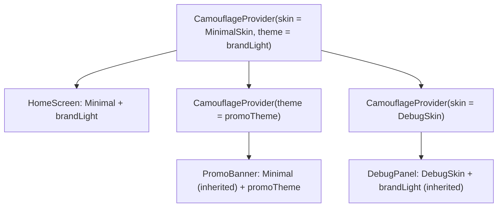
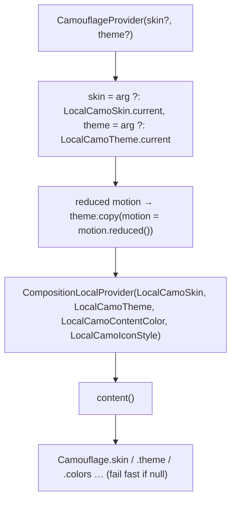
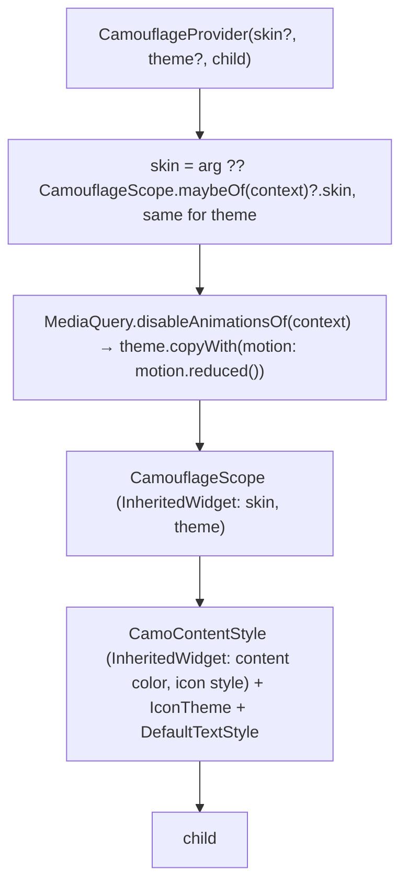

{/* Generated by docs/scripts/sync_vault.py from the Camouflage design notes. Edit the notes and re-run the script; changes made here are overwritten. */}

# Provider and Scoping

## Concept {#concept}

### 1. Why

Components never receive a skin or theme as a parameter. Passing them into every call would bring back the boilerplate Camouflage exists to remove. Instead, `CamouflageProvider` puts a skin and a theme **into the UI tree**, and every `Camo*` component below it reads the nearest one. Because providers can be nested, one app can use several skins or themes (per screen, per section, per platform) and switch them at runtime, without touching component call sites.

### 2. Shape



**Mechanism.** Each platform has a tree-scoped lookup:
- Kotlin: `CompositionLocal`s named `LocalCamoSkin` and `LocalCamoTheme`.
- Flutter: an `InheritedWidget` named `CamouflageScope`.

The provider writes to them, and components read the nearest value above them. The platform notes decide the details: Provider and Scoping / Provider and Scoping.

**Responsibilities of the provider**
- Resolve the effective skin and theme: its own argument, else inherited from the provider above.
- Fail fast if neither exists.
- Apply **system adjustments** to the theme once, at the provider:
  - reduced motion becomes `motion.reduced()`;
  - text scale is left to the platform's text scaler (see §5).
- Reset the **content color** to `theme.colors.onSurface` and the **icon style** to the resolved `icon` component theme (Minimal default: 20, `onSurface`) for its subtree, so text and icons outside any container are readable.

### 3. API

```kotlin
fun CamouflageProvider(
    skin: CamoSkin? = null,        // null → inherit from the provider above
    theme: CamoTheme? = null,      // null → inherit from the provider above
    content: Slot,
)

object Camouflage {
    val skin: CamoSkin             // nearest effective skin, or fail fast
    val theme: CamoTheme           // nearest effective theme (with system adjustments), or fail fast
    val colors: CamoColors         // = theme.colors (shortcut)
    val typography: CamoTypography // = theme.typography
    val shapes: CamoShapes
    val spacing: CamoSpacing
    val elevation: CamoElevation
    val motion: CamoMotion
    val contentColor: Color        // the current content color set by the nearest container
    val iconStyle: IconStyle       // the current icon size + color set by the nearest container
    fun <T : CamoTokenSet<T>> tokens(): T   // the theme's token set of type T (ADR-32), or fail fast naming the missing set
    val skinOrNull: CamoSkin?      // null when there's no provider; never used by Camo* components
    val themeOrNull: CamoTheme?
}
```

| Name | What it's for |
|---|---|
| `CamouflageProvider` | set or override the skin and/or theme for a subtree |
| `Camouflage.skin` / `.theme` | read by core components and, rarely, by app code (a custom chart that wants `colors.primary`) |
| `Camouflage.skinOrNull` / `.themeOrNull` | for family packages that must also work in an app without a provider (Blueprint, Storybook, `camouflage-filesystem`): if the app has a provider, their UI follows its skin and theme; if not, they wrap their UI in their own `CamouflageProvider(MinimalSkin, minimalLight)`. `Camo*` components never use them, so they still fail fast. |
| `Camouflage.colors` … `.motion` | shortcuts so app code reads `Camouflage.colors.primary` instead of `Camouflage.theme.colors.primary` |
| `Camouflage.contentColor`, `Camouflage.iconStyle` | what `CamoText` / `CamoIcon` (and your own icon widgets) use when no color or size is given (set by renderers, see [Skin Contract](/guide/architecture/skin-contract) §2.1) |
| Tree keys `LocalCamoSkin`, `LocalCamoTheme`, `LocalCamoContentColor`, `LocalCamoIconStyle` (Kotlin) / `CamouflageScope` (Flutter) | the storage. Internal, except where a platform needs them public for tests |

#### 3.1 Inheritance rules

| Outer provides | Inner provides | Effective inside inner |
|---|---|---|
| skin A, theme T | nothing | A, T |
| skin A, theme T | theme U | A, **U** |
| skin A, theme T | skin B | **B**, T |
| skin A, theme T | skin B, theme U | B, U |
| nothing (no outer) | skin B only | **fail fast**: no theme anywhere |
| nothing | theme U only | **fail fast**: no skin anywhere |
| nothing | skin B, theme U | B, U |

The error message names what is missing and where:

> `No CamouflageProvider found above CamoButton: missing skin. Wrap your app in CamouflageProvider(skin = …, theme = …).`

#### 3.2 Adaptive root (skin per platform)

```kotlin
val skin = when (currentPlatform) {
    Android, Desktop, Web -> MinimalSkin     // or MaterialSkin / FluentSkin once built (Later)
    iOS -> MinimalSkin                       // or CupertinoSkin once built (Later)
}
CamouflageProvider(skin = skin, theme = if (systemIsDark) brandDark else brandLight) { App() }
```

This is the Flutter-style "adaptive" behavior, but done once at the root instead of with `.adaptive` constructors on every widget.

#### 3.3 Runtime switching

Switching means passing a different value to a provider (from app state):

```kotlin
var dark by state(false)
var skin by state(MinimalSkin)
CamouflageProvider(skin = skin, theme = if (dark) brandDark else brandLight) {
    SettingsScreen(onToggleDark = { dark = !dark }, onPickSkin = { skin = it })
}
```

Every component below re-renders with the new values. Component **state** (text typed, checkbox value, which dialog is open) lives in the app, because components are controlled. Visual-only state inside renderers (a ripple in flight) may reset, and that's acceptable.

### 4. Build steps

1. Create the tree keys (`LocalCamoSkin`, `LocalCamoTheme`, `LocalCamoContentColor`, `LocalCamoIconStyle` / `CamouflageScope`) with **no default value**, so a missing provider is detectable.
2. Implement `CamouflageProvider`:
   1. read the parent values (nullable);
   2. resolve the effective values with the rules in §3.1;
   3. apply reduced motion;
   4. set the content color and icon style;
   5. provide the result.
3. Implement the `Camouflage` accessors with the fail-fast error message.
4. Use `DebugSkin` from [Skin Contract](/guide/architecture/skin-contract) with a sample theme to render one placeholder component under a provider.
5. Tests:
   - each row of the inheritance table;
   - the error text when there is no provider, and when there is only a theme;
   - switching the skin re-renders the child;
   - reduced motion zeroes the durations.

**Done when**
- [ ] All seven inheritance rows are covered by tests and pass.
- [ ] The missing-provider error names the component and the missing half.
- [ ] The sample app switches between `DebugSkin` and a second debug skin at runtime with a button.

### 5. Edge cases

| Case | Decided behavior |
|---|---|
| **No provider at all** | Fail fast on the first component, with the message in §3.1. There is no silent default: a silent default would hide the bug until a designer notices the wrong look. |
| **Partial nested provider** (theme only) | It inherits the skin from above (row 2 of the table). |
| **Switching skin or theme while a text field is focused** | Focus and text survive, because the value lives in the app and focus lives in the platform's focus system, keyed by the component's position in the tree. The skin switch must **not** change the tree position of the input. Platform notes enforce this by keeping the editable text node in the component (core), not in the renderer. |
| **Switching while a dialog is open** | The dialog stays open (it's an overlay entry, independent of the screen's state) and redraws with the new skin. |
| **Dialogs, menus and other overlays** | They render in a separate platform layer (a window/overlay), outside the caller's subtree. In Flutter, `showCamoDialog`/`showCamoBottomSheet` **capture the effective skin and theme at the call site** and re-provide them inside the route. In Compose, the Navigation 3 entry renders inside the `NavDisplay`'s provider tree (see [Overlays](/components/overlays/overlays)). Without this, a dialog opened from a nested promo section would lose the promo theme or crash with "no provider". |
| **Deep nesting** (a provider in every list item) | Allowed, but it costs a lookup and possibly a re-render per provider. Guidance: providers belong at screen or section level. Per-item overrides should use component parameters (`variant`) instead. |
| **Text scaling** | The provider does **not** change typography sizes. The platform text scaler applies to every `CamoText`. Changing sizes at the provider would scale text twice. |
| **Reduced motion** | Applied once here (`theme.copy(motion = motion.reduced())`), so renderers need no checks. |
| **App code reads `Camouflage.colors` outside any provider** | The same fail-fast. |

## Implementation {#implementation}

<KotlinOnly>

### 1. Why {#kotlin-1-why}

Compose's tree-scoped values are **`CompositionLocal`s**. This note maps the provider onto them:
- which locals exist;
- `static` vs dynamic locals, and why;
- how the fail-fast error works;
- where the platform `actual`s (reduced motion) plug in.

It also covers how overlays (dialogs, sheets) see the provider: they're drawn in-layer by core's frames, inside the tree, so no capture step is needed.

### 2. Shape {#kotlin-2-shape}



| Local | Kind | Default | Why this kind |
|---|---|---|---|
| `LocalCamoSkin` | `staticCompositionLocalOf<CamoSkin?>` | `null` | changes rarely (a skin switch). Static locals don't track readers individually, so reads are cheaper. A change recomposes the whole subtree, which a skin switch needs anyway. |
| `LocalCamoTheme` | `staticCompositionLocalOf<CamoTheme?>` | `null` | the same: every component reads it, and it changes rarely (dark mode, brand swap). |
| `LocalCamoContentColor` | `compositionLocalOf<Color>` | `Color.Unspecified` | set by every container, often, and deep. Dynamic tracking recomposes only the readers. |
| `LocalCamoIconStyle` | `compositionLocalOf<IconStyle?>` | `null` | the same as content color |

The locals are `internal`. Apps use `CamouflageProvider` and the `Camouflage` accessors. Skin authors use `ProvideContentStyle` ([Skin Contract](/guide/architecture/skin-contract#implementation)).

### 3. API {#kotlin-3-api}

#### 3.1 `CamouflageProvider` {#kotlin-31-camouflageprovider}

```kotlin
@Composable
public fun CamouflageProvider(
    skin: CamoSkin? = null,
    theme: CamoTheme? = null,
    content: @Composable () -> Unit,
) {
    val effectiveSkin = skin ?: LocalCamoSkin.current
    val baseTheme = theme ?: LocalCamoTheme.current
    val reduceMotion = rememberReducedMotion()                       // expect/actual
    val effectiveTheme = remember(baseTheme, reduceMotion) {
        if (baseTheme != null && reduceMotion) baseTheme.copy(motion = baseTheme.motion.reduced()) else baseTheme
    }
    // the icon component theme resolves straight to an IconStyle (size + color)
    val rootIcon: IconStyle? = effectiveSkin?.let { s -> effectiveTheme?.let { t -> s.icon.defaults(t).merge(t.components.icon) } }
    CompositionLocalProvider(
        LocalCamoSkin provides effectiveSkin,
        LocalCamoTheme provides effectiveTheme,
        LocalCamoContentColor provides (effectiveTheme?.colors?.onSurface ?: Color.Unspecified),
        LocalCamoIconStyle provides rootIcon,
        content = content,
    )
}
```

A provider with **both** missing (no argument and nothing above) doesn't throw itself. It provides `null`, and the first component that reads it throws with its own name. That keeps the error pointing at the component that needs it.

#### 3.2 `Camouflage` accessors {#kotlin-32-camouflage-accessors}

```kotlin
public object Camouflage {
    public val skin: CamoSkin
        @Composable @ReadOnlyComposable get() = LocalCamoSkin.current ?: missing("skin")
    public val theme: CamoTheme
        @Composable @ReadOnlyComposable get() = LocalCamoTheme.current ?: missing("theme")
    public val colors: CamoColors @Composable @ReadOnlyComposable get() = theme.colors
    public val typography: CamoTypography @Composable @ReadOnlyComposable get() = theme.typography
    public val shapes: CamoShapes @Composable @ReadOnlyComposable get() = theme.shapes
    public val spacing: CamoSpacing @Composable @ReadOnlyComposable get() = theme.spacing
    public val elevation: CamoElevation @Composable @ReadOnlyComposable get() = theme.elevation
    public val motion: CamoMotion @Composable @ReadOnlyComposable get() = theme.motion
    public val contentColor: Color @Composable @ReadOnlyComposable get() = LocalCamoContentColor.current
    public val iconStyle: IconStyle @Composable @ReadOnlyComposable get() = LocalCamoIconStyle.current ?: missing("icon style")
    public val skinOrNull: CamoSkin? @Composable @ReadOnlyComposable get() = LocalCamoSkin.current      // optional use only
    public val themeOrNull: CamoTheme? @Composable @ReadOnlyComposable get() = LocalCamoTheme.current
    @Composable @ReadOnlyComposable
    public inline fun <reified T : CamoTokenSet<T>> tokens(): T =
        theme.tokens<T>() ?: missing("token set ${T::class.simpleName}")   // ADR-32
}

// components call the named variant so the message names them:
@Composable @ReadOnlyComposable
internal fun requireSkin(component: String): CamoSkin = LocalCamoSkin.current ?: throw CamouflageMissingProviderException(component, "skin")

public class CamouflageMissingProviderException(component: String, missing: String) : IllegalStateException(
    "No CamouflageProvider found above $component: missing $missing. " +
    "Wrap your app in CamouflageProvider(skin = …, theme = …)."
)
```

#### 3.3 Reduced motion: `expect`/`actual` {#kotlin-33-reduced-motion-expectactual}

```kotlin
// commonMain
@Composable internal expect fun rememberReducedMotion(): Boolean
```

| Target | `actual` |
|---|---|
| android | `Settings.Global.getFloat(contentResolver, ANIMATOR_DURATION_SCALE, 1f) == 0f` (the "Remove animations" setting), read through `LocalContext` |
| ios | `UIAccessibilityIsReduceMotionEnabled()`, re-read on `UIAccessibilityReduceMotionStatusDidChangeNotification` |
| jvm | `false` (desktop OSes don't expose a common setting to the JVM; revisit per-OS later) |
| wasmJs | `window.matchMedia("(prefers-reduced-motion: reduce)").matches`, updated through a `change` listener in a `DisposableEffect` |

#### 3.4 Adaptive root and runtime switching {#kotlin-34-adaptive-root-and-runtime-switching}

```kotlin
@Composable
fun SampleApp() {
    var dark by rememberSaveable { mutableStateOf(false) }
    var brand by rememberSaveable { mutableStateOf(Brand.Default) }
    val theme = animateCamoTheme(brand.theme(dark))                  // optional smooth switch
    CamouflageProvider(skin = MinimalSkin, theme = theme) {
        SettingsScreen(onToggleDark = { dark = !dark }, onBrand = { brand = it })
    }
}
```

Pass `isSystemInDarkTheme()` (common Compose API, works on every target) as the initial `dark` value to follow the system.

### 4. Build steps {#kotlin-4-build-steps}

1. The four locals (`internal`), `IconStyle`, and `CamouflageMissingProviderException`.
2. `CamouflageProvider` with the inheritance rules and the root content color and icon style.
3. `Camouflage` accessors + `requireSkin(component)` / `requireTheme(component)`.
4. `rememberReducedMotion` `expect` + the four `actual`s.
5. `commonTest` with `runComposeUiTest`:
   - each of the seven inheritance rows from Provider and Scoping §3.1;
   - the exception message for "no provider" and "theme only";
   - a skin switch recomposes a child;
   - a standalone `CamoDialogFrame` inside a nested provider reads the nested theme.

**Done when**
- [ ] All seven inheritance rows pass on jvm and iOS simulator.
- [ ] The sample switches skin, theme and dark mode at runtime on all four platforms.
- [ ] Turning on "Remove animations" (Android) or "Reduce Motion" (iOS) makes transitions instant.

### 5. Edge cases {#kotlin-5-edge-cases}

| Case | Decided behavior |
|---|---|
| **Dialogs and sheets** | Core's `CamoDialogFrame`/`CamoSheetFrame` draw in-layer, inside the composition. With Navigation 3 they render inside `NavDisplay`, which sits inside the root provider, so they see the root skin and theme. A screen-local override doesn't reach a separate entry: apply it inside the entry's content ([Overlays](/components/overlays/overlays#implementation) §5). Platform `Popup`s (tooltips later) inherit locals through the parent `CompositionContext`. |
| A `static` local changing | It recomposes everything below that reads *any* part of the subtree. Fine for skin and theme switches (rare, whole-screen changes anyway). Don't put frequently changing values in them. |
| `@ReadOnlyComposable` accessors throwing | Throwing during composition surfaces as a crash with the message, which is what fail-fast wants. It shows in previews too, so wrap previews in a provider. |
| Previews (Android Studio / IntelliJ `@Preview`) | Core ships `CamouflagePreview(skin, theme) { }` (no defaults, so core still has no default skin, ADR-9); `camouflage-skin-minimal` ships `MinimalPreview(dark = false) { }`. Apps use them in their own previews; no extra artifact. |
| Reduced motion changing while the app runs (iOS, web) | The `actual`s listen for changes and recompose. On Android the setting is read on composition, and changing it usually recreates the activity anyway. |
| Text scale | Handled by Compose's `LocalDensity.fontScale`. Camouflage never touches it. |

</KotlinOnly>

<DartOnly>

### 1. Why {#dart-1-why}

Flutter's tree-scoped values are **`InheritedWidget`s**. This note maps the provider onto them:
- the scope classes;
- `of`/`maybeOf` accessors with a fail-fast `FlutterError`;
- reduced motion from `MediaQuery`.

It also covers the one place Flutter needs **more** work than Kotlin: dialogs and other routes are built under the `Navigator`, so a nested provider's values must be **captured and re-provided** (the base note's rule applies literally here).

### 2. Shape {#dart-2-shape}



| InheritedWidget | Holds | `updateShouldNotify` |
|---|---|---|
| `CamouflageScope` | skin, theme | `skin != old.skin \|\| theme != old.theme` (by `==`) |
| `CamoContentStyle` (inherited part) | content color, icon style | color or icon style changed |

Two separate scopes means a content-color change inside a button doesn't rebuild everything that depends on the theme. That's the same reason Kotlin uses a static local for the theme and dynamic locals for content.

### 3. API {#dart-3-api}

```dart
class CamouflageProvider extends StatelessWidget {
  const CamouflageProvider({super.key, this.skin, this.theme, required this.child});
  final CamoSkin? skin;
  final CamoTheme? theme;
  final Widget child;
  @override
  Widget build(BuildContext context) { /* resolve, reduce motion, root icon style, wrap */ }
}

abstract final class Camouflage {
  static CamoSkin skinOf(BuildContext context, {String component = 'widget'});
  static CamoTheme themeOf(BuildContext context, {String component = 'widget'});
  static CamoColors colorsOf(BuildContext context) => themeOf(context).colors;
  static CamoTypography typographyOf(BuildContext context) => themeOf(context).typography;
  // shapesOf, spacingOf, elevationOf, motionOf
  static Color contentColorOf(BuildContext context);
  static CamoIconStyle iconStyleOf(BuildContext context);
  static CamouflageScope? maybeOf(BuildContext context);
  static CamoSkin? maybeSkinOf(BuildContext context);     // base `skinOrNull`: optional use only, never by Camo* widgets
  static CamoTheme? maybeThemeOf(BuildContext context);   // base `themeOrNull`
}
```

**Fail fast:**

```dart
throw FlutterError.fromParts([
  ErrorSummary('No CamouflageProvider found above $component: missing $missing.'),
  ErrorHint('Wrap your app in CamouflageProvider(skin: …, theme: …), usually above WidgetsApp/MaterialApp '
            'so every route (dialogs included) can see it.'),
  ...context.describeMissingAncestor(expectedAncestorType: CamouflageScope),
]);
```

**Reduced motion:** `MediaQuery.disableAnimationsOf(context)`. Flutter maps each platform's setting (Android animator scale, iOS Reduce Motion, web `prefers-reduced-motion`, desktop OS settings where the engine exposes them) into this flag. No platform code is needed, unlike Kotlin's `expect`/`actual`.

**Dark mode:** `MediaQuery.platformBrightnessOf(context)`.

**Capture for routes (dialogs and bottom sheets):**

```dart
Future<T?> showCamoDialog<T>({required BuildContext context, required WidgetBuilder builder, bool dismissible = true}) {
  final scope = CamouflageScope.of(context);            // capture at the call site
  return Navigator.of(context, rootNavigator: true).push(CamoDialogRoute<T>(
    dismissible: dismissible,                            // the scrim is drawn and handled by CamoDialogFrame
    builder: (_) => CamouflageProvider(skin: scope.skin, theme: scope.theme, child: Builder(builder: builder)),
  ));
}
// showCamoBottomSheet does the same with CamoSheetRoute (see 05 - Components/13 - Overlays)
```

**Previews:** core ships `CamouflagePreview(skin:, theme:, child:)` with no defaults (core has no default skin, ADR-9); `camouflage_skin_minimal` ships `MinimalPreview(child:)`. Apps use them in widget previews and golden setups.

### 4. Build steps {#dart-4-build-steps}

1. `CamouflageScope`, `CamoContentStyle`, `Camouflage` accessors, and the `FlutterError`.
2. `CamouflageProvider` with the inheritance rules, reduced motion, and root content style.
3. The capture pattern in a shared `pushCamoRoute` helper (used by `showCamoDialog` and `showCamoBottomSheet`).
4. Widget tests:
   - the seven inheritance rows;
   - the error text (the missing-skin and theme-only cases);
   - a skin switch rebuilds dependents;
   - `MediaQuery(data: MediaQueryData(disableAnimations: true))` → zero durations;
   - a dialog pushed from inside a nested provider sees the nested theme.

**Done when**
- [ ] The inheritance tests pass. The example switches skin, theme and dark mode at runtime on all six platforms.
- [ ] A dialog opened from a nested promo section shows the promo theme.

### 5. Edge cases {#dart-5-edge-cases}

| Case | Decided behavior |
|---|---|
| **`CamouflageApp`** | `CamouflageApp(skin:, theme:, darkTheme:, home:)` and `CamouflageApp.router(skin:, theme:, darkTheme:, routerConfig:)`: a thin `WidgetsApp` with the provider above it, the messenger overlay, `pageRouteBuilder`, the default text style and text direction. Apps can still assemble `WidgetsApp` + `CamouflageProvider` by hand. |
| **Provider placement** | Recommend **above** `WidgetsApp`/`MaterialApp`, so every route inherits it. Nested providers inside pages still need capture for routes (above). Kotlin gets this for free. |
| `updateShouldNotify` cost | `==` on themes is cheap relative to rebuilding. Themes are usually `const`/cached instances, so identity short-circuits it. |
| Hot reload | Themes defined as `const`/top-level finals rebuild on hot reload. That's fine. |
| Text scale | `MediaQuery.textScalerOf`, applied by `Text` automatically. Camouflage never touches it. |
| Reduced motion changing at runtime | `MediaQuery` rebuilds its dependents, so the provider re-resolves. |

</DartOnly>
