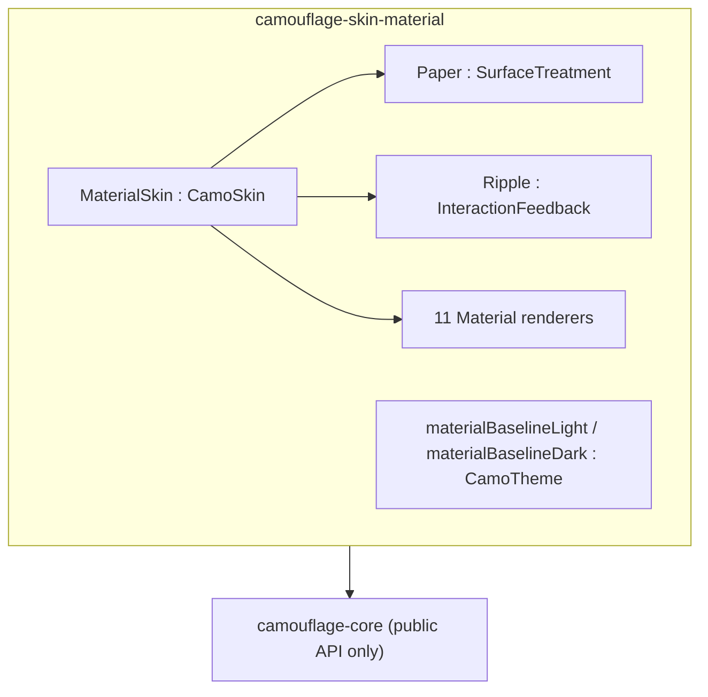
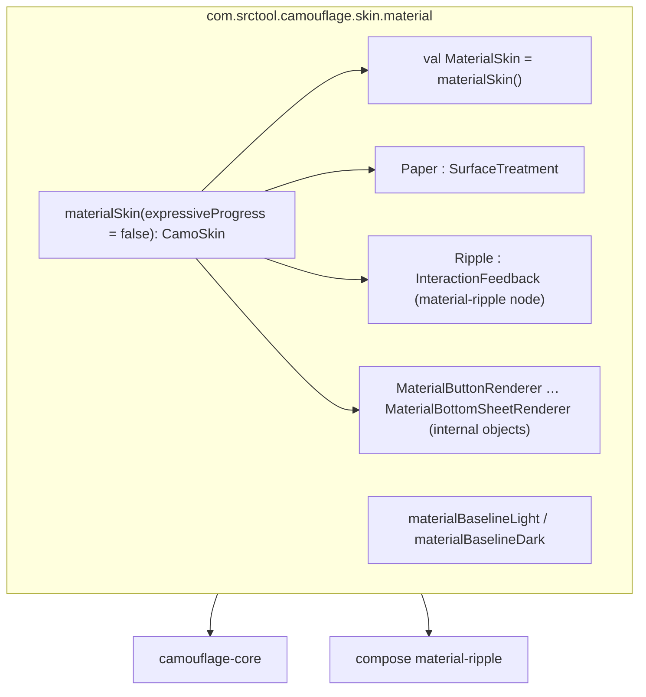
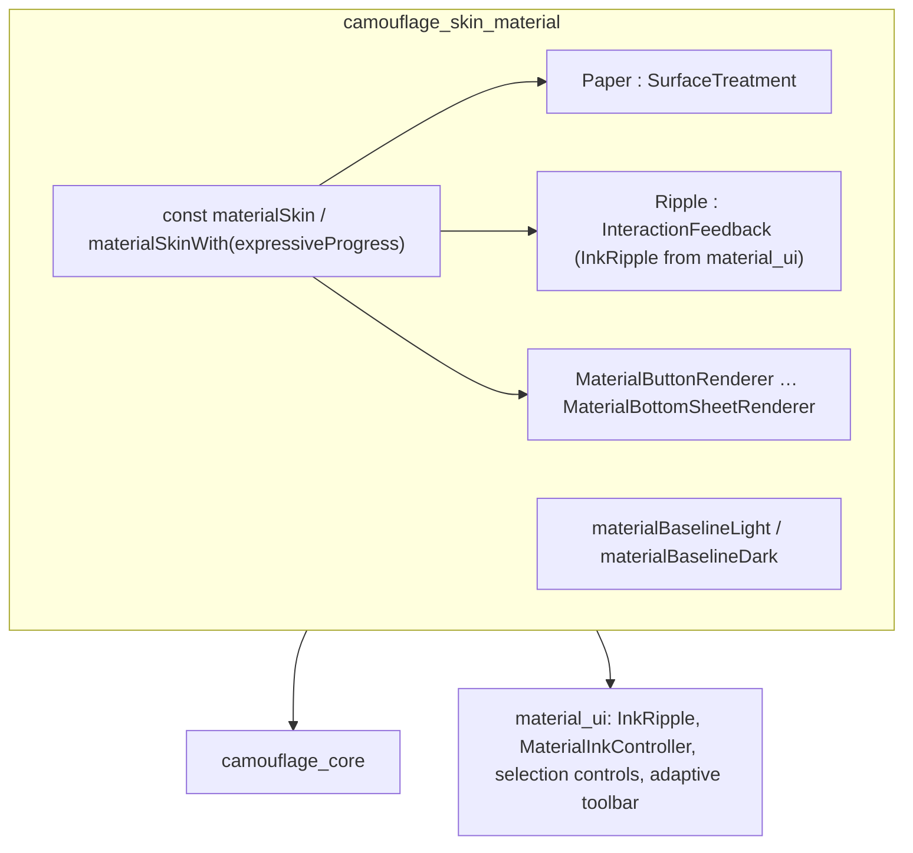

{/* Generated by docs/scripts/sync_vault.py from the Camouflage design notes. Edit the notes and re-run the script; changes made here are overwritten. */}

# Material Skin

## Concept {#concept}

:::info[Milestone: Later]

The v1 skin is [Minimal Skin](/guide/skins/minimal-skin) (ADR-22). This note keeps the full Material 3 dialect documented. It's also the **reference dialect** used by the "Material mapping preview" in the component notes. Shipping it is a separate decision.

:::

### 1. Why

`MaterialSkin` renders Camouflage in the Material Design 3 dialect and serves as the reference mapping for [Skin Contract](/guide/architecture/skin-contract). It draws every component in Material Design 3 style, on the Paper surface treatment with Ripple feedback. It lives in its own module (`camouflage-skin-material`) and uses **only core's public API**. That proves an outside or AI-generated skin can be written the same way. It also ships a **starter theme** (Material baseline), so a new app can run before its Figma theme exists.

### 2. Shape



**Build vs wrap.** Material renderers are built on the platform's **foundation layer** (Compose `foundation`, Flutter `widgets`), **not** by wrapping the toolkit's Material components (`material3.Button`, Flutter `FilledButton`). Those components read `MaterialTheme` / `ThemeData`, not `CamoTheme`, so wrapping them would mean mirroring every token into a second theme system and inheriting its behavior. The platform notes weigh this trade-off in detail.

### 3. API

#### 3.1 Public surface of the module

| Name | What it's for |
|---|---|
| `MaterialSkin` | the skin value to pass to `CamouflageProvider` |
| `MaterialSkin(options)` | the options form, for looks only this dialect draws, e.g. `expressiveProgress = true` (the wavy M3 Expressive indicator). Anything a brand could want on any skin is a component-theme field instead (ADR-28). |
| `Paper` | the surface treatment, reusable by other skins |
| `Ripple` | the feedback, reusable |
| `materialBaselineLight`, `materialBaselineDark` | starter `CamoTheme`s with M3 baseline values |
| `materialTheme(seed: Color? = null, dark: Boolean = false, fontFamily: FontFamily? = null)` | the M3 theme from a seed (null → the baseline colors), with the M3 type scale in `fontFamily` (null → the platform font) |
| `materialColors(seed, dark)` | M3 "tonal spot" colors from a seed: `fromSeed(primary = seed, neutral = seed)` with M3's neutral tones (surface 98, containers 100…90). Core's defaults are Camouflage's grays (ADR-24), so the Material skin brings its own. It also ships M3 shapes (4/8/12/16/28), motion (150/300/500) and the M3 type scale. |

#### 3.2 Paper surface treatment

- The background is the given color, clipped to the shape.
- Separation from the background comes from the **surface level** (`surfaceContainer*` roles), which is how Material 3 now expresses depth.
- Elevation adds a **shadow**:

| Level | Shadow (dp) |
|---|---|
| 0 | 0 |
| 1 | 1 |
| 2 | 3 |
| 3 | 6 |
| 4 | 8 |
| 5 | 12 |

#### 3.3 Ripple feedback

| Interaction | State-layer opacity (of the content color) |
|---|---|
| hovered | 8% |
| focused | 10%, plus a 3dp focus ring in `primary` when focused by keyboard |
| pressed | 10%, plus a bounded ripple from the touch point |

Disabled: the container is `onSurface` at 12% and the content `onSurface` at 38%, for every tone. There's no feedback.

#### 3.4 Component mapping

These values are the renderers' `defaults(theme)`: the complete component themes a brand theme overrides field by field. The full field lists, with these defaults, are in each component note under *Component theme*.

| Component | Material 3 equivalent | Mapping |
|---|---|---|
| CamoText | Text | style as passed. Links in `primary` + underline. |
| CamoIcon | Icon | ambient size and color (24, `onSurface` at the root) |
| CamoSurface | Surface | `SurfaceLevel` → `surface` / `surfaceContainerLowest` … `Highest` |
| CamoCard | Filled / Elevated / Outlined card | `Soft` → `surfaceContainerHighest`, `Raised` → `surfaceContainerLow` + level 1, `Outline` → `surface` + `outlineVariant`, `Solid` → `primary` (Camouflage addition). `shapes.medium`. Status tones → the tone's container colors. |
| CamoButton | Filled / Filled tonal / Elevated / Outlined / Text button | Solid / Soft / Raised / Outline / Ghost; Link = underlined Text style. Height 40, `shapes.full`, padding 24 (16 on a side with an icon), icons 18. |
| CamoIconButton | Filled / Filled tonal / Outlined / Standard icon button | Solid / Soft / Outline / Ghost. 40 container, icon 24. |
| CamoTextField | Outlined text field | height 56, `shapes.extraSmall`, floating label, icons 24 in `onSurfaceVariant` |
| CamoCheckbox | Checkbox | 18 box, 2dp outline, label in `bodyLarge` |
| CamoSwitch | Switch | 52 × 32 track (off: `surfaceContainerHighest`), thumb 16 → 24 (28 pressed) |
| CamoTopBar | Small top app bar | height 64, title at start, `surface` → `surfaceContainer` when scrolled |
| CamoDialog | Basic dialog | `surfaceContainerHigh`, width 280–560, `shapes.extraLarge`, actions end-aligned |
| CamoBottomSheet | Modal bottom sheet | `surfaceContainerLow`, top corners `shapes.extraLarge`, 32 × 4 handle, max width 640 |
| CamoDivider | Divider | 1 dp `outlineVariant`, insets 16 |
| CamoRadio | Radio button | 20 circle, `primary` selected, `onSurfaceVariant` unselected |
| CamoSegmentedControl | Segmented buttons | 40 tall, `outline` border, selected `secondaryContainer` + check |
| CamoSlider | Slider (2024) | 16 track, 4 × 44 handle bar, value label |
| CamoDatePicker | Date pickers (docked / modal) | `style` Calendar, 40 day cells, `primary` selected circle, `primaryContainer` range band |
| CamoTimePicker | Time pickers | `style` Dial, `primaryContainer` for the active part |
| CamoStepper | – | `layout` Inline with outlined icon buttons |
| CamoSearchField | Search bar | 56, `surfaceContainerHigh`, `shapes.full` |
| CamoAccordion | – (lists) | a list-item header with a rotating chevron |
| CamoListItem / Section | Lists | 56 / 72 / 88 rows, `bodyLarge` headline |
| CamoMenu | Menus | `surfaceContainer`, level 2, 48 items, width 112–280 |
| CamoSelect | Exposed dropdown menu | outlined text field + chevron → menu or sheet |
| CamoTooltip | Plain tooltip | `inverseSurface`, `bodySmall`, 24 tall |
| CamoChip | Chips (assist, filter, input, suggestion) | 32 tall, `shapes.small`, outline or tonal |
| CamoBadge | Badges | dot 6 / pill 16, `error` |
| CamoAvatar | (no component; used in lists and chips) | circle, initials `titleMedium`, 24 / 40 / 56 |
| CamoProgress | Progress indicators (2024) | 4 dp bar with gap and stop dot, 48 circle |
| CamoSnackbar | Snackbar | `inverseSurface`, action `inversePrimary` |
| CamoBanner | (M2 banner; not in M3) | soft card per tone with a status icon |
| CamoTabs | Primary / secondary tabs | 48 / 64, 3 dp indicator |
| CamoNavigationBar | Navigation bar | 80, pill indicator 64 × 32 |
| CamoNavigationRail | Navigation rail | 80 wide, pill indicator 56 × 32 |
| CamoNavigationDrawer | Navigation drawer | 360 wide, 56 items, modal with `shapes.large` corners |
| CamoPagedList | (lists + pull to refresh) | M3 pull-to-refresh indicator (a spinner in a raised disc), retry row, centered empty state |
| CamoSkeleton | (none) | shimmer, `surfaceContainerHighest` / `surfaceContainerLow` |
| CamoFab | FAB, extended FAB | 40 / 56 / 96, `primaryContainer`, level 3 |

**Dialect alignment (required, [Design Language](/guide/foundations/design-language) §3.4): Appearance × Tone for buttons** (`f` = the tone's family; Material 3 has no status buttons, so tones are Camouflage's consistent extension):

| Appearance | Material 3 style | `Default` | Status tone `x` |
|---|---|---|---|
| `Solid` | Filled | `primary` / `onPrimary` | `x` / `onX` |
| `Soft` | Filled tonal | `secondaryContainer` / `onSecondaryContainer` | `xContainer` / `onXContainer` |
| `Raised` | Elevated | `surfaceContainerLow` + `primary` content, level 1 | `surfaceContainerLow` + `x` content |
| `Outline` | Outlined | `outline` border, `primary` content | `x` border and content |
| `Ghost` | Text | `primary` content | `x` content |
| `Link` | (none) Text style + underline, no container padding | `primary` content | `x` content |

**Tone:** Default → `primary` family, Error → `error`, Success/Warning/Info → the generated status families. **Level:** `SurfaceLevel` → M3 surface containers (one to one).

#### 3.5 Starter theme: `materialBaselineLight` / `materialBaselineDark`

The brand, surface, line, inverse and error roles are the **M3 baseline scheme** (seed `#6750A4`). Check them against m3.material.io when implementing, and keep them in one file.

| Role | Light | Dark |
|---|---|---|
| primary / onPrimary | `#6750A4` / `#FFFFFF` | `#D0BCFF` / `#381E72` |
| primaryContainer / onPrimaryContainer | `#EADDFF` / `#21005D` | `#4F378B` / `#EADDFF` |
| secondary / onSecondary | `#625B71` / `#FFFFFF` | `#CCC2DC` / `#332D41` |
| secondaryContainer / onSecondaryContainer | `#E8DEF8` / `#1D192B` | `#4A4458` / `#E8DEF8` |
| tertiary / onTertiary | `#7D5260` / `#FFFFFF` | `#EFB8C8` / `#492532` |
| tertiaryContainer / onTertiaryContainer | `#FFD8E4` / `#31111D` | `#633B48` / `#FFD8E4` |
| surface | `#FEF7FF` | `#141218` |
| surfaceContainerLowest / Low | `#FFFFFF` / `#F7F2FA` | `#0F0D13` / `#1D1B20` |
| surfaceContainer | `#F3EDF7` | `#211F26` |
| surfaceContainerHigh / Highest | `#ECE6F0` / `#E6E0E9` | `#2B2930` / `#36343B` |
| onSurface / onSurfaceVariant | `#1D1B20` / `#49454F` | `#E6E0E9` / `#CAC4D0` |
| outline / outlineVariant | `#79747E` / `#CAC4D0` | `#938F99` / `#49454F` |
| error / onError | `#B3261E` / `#FFFFFF` | `#F2B8B5` / `#601410` |
| errorContainer / onErrorContainer | `#F9DEDC` / `#410E0B` | `#8C1D18` / `#F9DEDC` |
| inverseSurface / inverseOnSurface / inversePrimary | `#322F35` / `#F5EFF7` / `#D0BCFF` | `#E6E0E9` / `#322F35` / `#6750A4` |
| scrim | `#000000` | `#000000` |

**Success, warning and info** aren't part of M3. The baseline generates them with `CamoColors.fromSeed` from the default status seeds (green `#2E7D32`, amber `#F9A825`, blue `#0288D1`), using the tone rule in [Theme](/guide/foundations/theme) §3.4. Their generated hex values are written into the baseline file once, and pinned by a snapshot test, so they never shift silently when the color library updates.

Typography: the M3 baseline type scale. **The skin doesn't bundle Roboto** (skins never bundle fonts): the starter theme takes `fontFamily` and defaults to the platform font. Roboto on Android; elsewhere the app adds Roboto for the authentic look (`materialTheme(fontFamily = Roboto)`).

| Role | Size / line height | Weight | Tracking |
|---|---|---|---|
| displayLarge / Medium / Small | 57/64, 45/52, 36/44 | 400 | −0.25, 0, 0 |
| headlineLarge / Medium / Small | 32/40, 28/36, 24/32 | 400 | 0 |
| titleLarge / Medium / Small | 22/28, 16/24, 14/20 | 400, 500, 500 | 0, 0.15, 0.1 |
| bodyLarge / Medium / Small | 16/24, 14/20, 12/16 | 400 | 0.5, 0.25, 0.4 |
| labelLarge / Medium / Small | 14/20, 12/16, 11/16 | 500 | 0.1, 0.5, 0.5 |

### 4. Build steps

1. Implement `Paper` and `Ripple` first. Test them on a bare `CamoSurface` with `DebugSkin.copy(surfaceTreatment = Paper, feedback = Ripple)`.
2. Implement the renderers in checklist order: text → icon → surface → button → iconButton → card → checkbox → switch → textField → topBar → dialog → bottomSheet. M3 ("Hello skin") needs only text, icon, surface and button. The rest land in M5/M6.
3. Assemble `MaterialSkin` and its options. Write a test per renderer that sets every field of its component theme to a distinctive value and checks the rendering uses it (no literal left in a renderer).
4. Add `materialBaselineLight/Dark`. Generate the status families, write them in, and add the snapshot test. `validate()` must return no issues for both.
5. Run the screenshot matrix: each component × light/dark × 100/200% font × LTR/RTL, plus buttons × every tone.
6. Build the M4 demo: the same screen with `materialBaselineLight` and a custom brand theme, switched live.

**Done when**
- [ ] All 39 renderers are implemented, using only core's public API.
- [ ] Baseline themes validate cleanly, and the status colors are pinned by a snapshot.
- [ ] The screenshot matrix is reviewed and recorded as goldens.
- [ ] A custom brand theme visibly rebrands every component without code changes.

### 5. Edge cases

| Case | Decided behavior |
|---|---|
| **Where Camouflage deviates from M3** | M3 has no Link button (Camouflage draws it as an underlined text button) and no Solid card (Camouflage draws it with `primary`). Status tones on buttons and cards are a Camouflage extension; M3 has only `error`. `surfaceBright`/`surfaceDim` and the "fixed" accent roles aren't included. |
| Android 12+ dynamic color | Works through the theme (`dynamicCamoColors()`, in the Kotlin note). The skin doesn't change. |
| Brand theme with poor contrast | The skin draws what the theme says. `validate()` flags it. |
| A renderer overridden by the app (`MaterialSkin.copy(button = X)`) | Other renderers are unaffected. Dialog buttons are the caller's `CamoButton`s, so they use the override too. |
| Material Expressive (the 2025 M3 update: new shapes and motion) | Out of v1. It could arrive as a skin option or a separate skin. |

## Implementation {#implementation}

<KotlinOnly>

:::info[Milestone: Later]

The v1 skin is Minimal ([Minimal Skin](/guide/skins/minimal-skin), ADR-22). This note stays as the complete platform plan for the Material skin, for when you decide to ship it.

:::

### 1. Why {#kotlin-1-why}

`:camouflage-skin-material` implements every renderer in Material 3 style using **only Compose foundation + `material-ripple`**, plus `camouflage-core`'s public API. This note records the build-vs-wrap decision, the ripple wiring, and how the baseline themes are packaged.

### 2. Shape {#kotlin-2-shape}



#### Build on foundation vs wrap `material3` {#kotlin-build-on-foundation-vs-wrap-material3}

| | Build on `foundation` (chosen) | Wrap `material3` components |
|---|---|---|
| Reads `CamoTheme` directly | yes | no: every token must be mirrored into a `MaterialTheme` inside each renderer |
| Component themes (`ButtonStyle.height` …) | every field honored | many fields have no `material3` parameter (a button's exact height, the thumb sizes) |
| Behavior split (core owns click and semantics) | clean: the renderer only draws | fights `material3`, which owns its own click, semantics and `minimumInteractiveComponentSize` |
| Dependency weight | `foundation` + `material-ripple` (small) | the whole `material3` artifact |
| Faithfulness to M3 specs | our job (specs in the base note) | free |
| Effort | higher | lower at first, then higher when fighting the gaps |

Wrapping would make Camouflage a thin Material theme adapter, which is exactly what the project exists to avoid.

### 3. API {#kotlin-3-api}

```kotlin
public val MaterialSkin: CamoSkin = materialSkin()

public fun materialSkin(expressiveProgress: Boolean = false): CamoSkin = CamoSkin(
    name = "material",
    surfaceTreatment = Paper,
    feedback = Ripple,
    text = MaterialTextRenderer, icon = MaterialIconRenderer, surface = MaterialSurfaceRenderer,
    card = MaterialCardRenderer, button = MaterialButtonRenderer, iconButton = MaterialIconButtonRenderer,
    textField = MaterialTextFieldRenderer, checkbox = MaterialCheckboxRenderer,
    switch = MaterialSwitchRenderer,   // thumb icons come from SwitchStyle.showThumbIcons (default true here) topBar = MaterialTopBarRenderer, dialog = MaterialDialogRenderer,
    bottomSheet = MaterialBottomSheetRenderer,
)

public object Paper : SurfaceTreatment {
    override fun modifier(color: Color, shape: Shape, elevation: Dp, theme: CamoTheme): Modifier =
        Modifier.shadow(elevation, shape, clip = false).background(color, shape).clip(shape)
}

public object Ripple : InteractionFeedback {
    override fun indication(contentColor: Color, theme: CamoTheme): Indication = MaterialIndication(contentColor)
}

public val materialBaselineLight: CamoTheme
public val materialBaselineDark: CamoTheme
```

**`MaterialIndication`** (internal) is an `IndicationNodeFactory` whose node delegates to:
1. `createRippleModifierNode(interactionSource, bounded = true, radius = Dp.Unspecified, color = { contentColor }, rippleAlpha = { MaterialRippleAlpha })`, the public low-level API in `material-ripple`, which draws the touch ripple;
2. a **state-layer node** that draws `contentColor` at 8% (hover) or 10% (focus/press) over the bounds;
3. a **focus-ring node** that draws a 3 dp `primary` outline when focus came from the keyboard.

`MaterialRippleAlpha = RippleAlpha(draggedAlpha = 0.16f, focusedAlpha = 0.10f, hoveredAlpha = 0.08f, pressedAlpha = 0.10f)`.

**Baseline theme packaging:**
- `MaterialBaselineColors.kt` holds the M3 hex values from the base note, written out.
- The status families are generated **once** with `CamoColors.fromSeed` and pasted as literals, with a comment naming the seed and the MaterialKolor version.
- `commonTest` has a snapshot test asserting the literals still equal `fromSeed` output. It fails loudly if a library bump changes them, and you decide whether to update.

**Typography:** the M3 type-scale values from the base note as `TextStyle`s with `FontFamily.Default`. Roboto isn't bundled (ADR-33): `materialTheme(fontFamily = …)` takes an app-provided family. On Android, the default is Roboto anyway.

### 4. Build steps {#kotlin-4-build-steps}

1. `Paper`, `MaterialIndication` (ripple + state layer + focus ring), `Ripple`.
2. Renderers in checklist order. M3 needs text, icon, surface, button, iconButton. The rest come in M5/M6.
3. `materialSkin()` / `MaterialSkin`.
4. The baseline themes + the snapshot test.
5. Run `assertRendererAppliesBehavior` (from [Skin Contract](/guide/architecture/skin-contract#implementation) §5) on every clickable renderer.
6. The "no literals" test per renderer: set every `XTheme` field to an odd value (e.g. height 57 dp), and assert the rendered node measures it.
7. Screenshot goldens ([Testing](/guide/delivery/testing)).
8. The M4 demo: a brand theme vs baseline, live-switched.

**Done when**
- [ ] `:camouflage-skin-material` has no `material3` dependency (`./gradlew :camouflage-skin-material:dependencies`).
- [ ] Every renderer passes the behavior and no-literals tests.
- [ ] Goldens are recorded for Android and desktop, and iOS where Roborazzi supports it.

### 5. Edge cases {#kotlin-5-edge-cases}

| Case | Decided behavior |
|---|---|
| `createRippleModifierNode` API changes | It's public but low-level. It's pinned through the Compose Multiplatform version, and the Ripple wrapper is the only file touching it. |
| Ripple on web / iOS | `material-ripple` works on every Compose Multiplatform target. On iOS it looks Material (expected for this skin; a Cupertino skin uses `Opacity`). |
| M3 spec updates (Expressive) | Out of v1 (base note). |
| App overrides a renderer | `MaterialSkin.copy(button = X)`: the other renderers keep reading `Camouflage.skin.feedback`, so feedback stays consistent. |

</KotlinOnly>

<DartOnly>

:::info[Milestone: Later]

The v1 skin is Minimal ([Minimal Skin](/guide/skins/minimal-skin), ADR-22). This note stays as the complete platform plan for the Material skin, for when you decide to ship it.

:::

### 1. Why {#dart-1-why}

`camouflage_skin_material` implements every renderer in Material 3 style. Since Flutter 3.47, Material is the standalone **`material_ui`** package, so this skin is the **only** Camouflage package that depends on it. It uses `material_ui` for the pieces that are genuinely Material *machinery* (ink ripples, text-selection handles, the adaptive text toolbar), and draws the components themselves from `widgets`, so every `CamoTheme` and component-theme value is honored.

### 2. Shape {#dart-2-shape}



#### Build on `widgets` vs wrap `material_ui` components {#dart-build-on-widgets-vs-wrap-material_ui-components}

| | Build on `widgets` + Material machinery (chosen) | Wrap `FilledButton`, `TextField`, … |
|---|---|---|
| Reads `CamoTheme` | directly | needs a `ThemeData` mirror of every token |
| Component themes honored | every field | only what `ButtonStyle`/`InputDecoration` expose |
| Behavior split | core owns gestures, focus, semantics | Material widgets own them, which double-handles |
| Faithful M3 details | our job | free |

It's the same decision as Kotlin (Material Skin). Flutter has an extra advantage: Material's ink and selection machinery are public, reusable parts.

### 3. API {#dart-3-api}

```dart
const CamoSkin materialSkin = CamoSkin(
  name: 'material', surfaceTreatment: Paper(), feedback: Ripple(),
  text: MaterialTextRenderer(), icon: MaterialIconRenderer(), surface: MaterialSurfaceRenderer(),
  card: MaterialCardRenderer(), button: MaterialButtonRenderer(), iconButton: MaterialIconButtonRenderer(),
  textField: MaterialTextFieldRenderer(), checkbox: MaterialCheckboxRenderer(),
  switchRenderer: MaterialSwitchRenderer(), topBar: MaterialTopBarRenderer(), dialog: MaterialDialogRenderer(),
  bottomSheet: MaterialBottomSheetRenderer(),
);
CamoSkin materialSkinWith({bool expressiveProgress = false});   // switch thumb icons: CamoSwitchStyle.showThumbIcons (default true here)

class Paper implements SurfaceTreatment { const Paper(); /* PhysicalShape + ClipRRect + ColoredBox */ }

class Ripple implements InteractionFeedback {
  const Ripple();
  @override
  Widget wrap({required Widget child, required CamoInteractionController controller,
               required Color contentColor, required BorderRadius shape, required CamoTheme theme}) =>
      _MaterialFeedback(controller: controller, color: contentColor, shape: shape, child: child);
}
```

**`_MaterialFeedback`** (a stateful widget):
1. Wraps the child in `Material(type: MaterialType.transparency)`, which provides the `MaterialInkController`.
2. On each `controller.pressDowns` position it creates an `InkRipple(controller: Material.of(context), referenceBox: box, position: pos, color: contentColor.withValues(alpha: 0.10), borderRadius: shape, …)`, and confirms or cancels it on `pressEnds`.
3. Draws the **state layer** (8% hover, 10% focus) with an `AnimatedContainer`, and a 3 px `primary` **focus ring** when `controller.focusedByKeyboard`.

**Text field extras:** `MaterialTextFieldRenderer.selectionControls` returns `materialTextSelectionHandleControls`, and `contextMenuBuilder` returns `AdaptiveTextSelectionToolbar.editableText`, both from `material_ui`.

**Baseline themes:** the M3 hex values, written out. The status families are generated once with `CamoColors.fromSeed` and pasted as literals, with a snapshot test (identical approach to Kotlin, and **the same literal values**, which a cross-platform test fixture compares: one JSON file of the 42 × 2 colors checked by both test suites).

### 4. Build steps {#dart-4-build-steps}

1. `Paper`, `_MaterialFeedback` (ripple + state layer + focus ring), `Ripple`.
2. Renderers in checklist order. M3 needs text, icon, surface, button, iconButton.
3. `materialSkin` / `materialSkinWith`.
4. The baseline themes + the snapshot test against the shared JSON fixture.
5. The "no literals" test per renderer (odd component-theme values are measured in the render tree).
6. Goldens ([Testing](/guide/delivery/testing)).
7. The M4 demo: a brand theme vs baseline, live-switched with `CamoAnimatedTheme`.

**Done when**
- [ ] `camouflage_core` still has no `material_ui` dependency, and only the skin does.
- [ ] The Material baseline colors match Kotlin's (the shared fixture test passes in both repos).
- [ ] Every renderer passes the no-literals test. Goldens are recorded.

### 5. Edge cases {#dart-5-edge-cases}

| Case | Decided behavior |
|---|---|
| `InkRipple` needs a `Material` ancestor | Provided locally by `_MaterialFeedback` (transparent `Material`), so apps never need `MaterialApp`. |
| `material_ui` releasing faster than Flutter | Pin a compatible range, and test against the lowest and highest versions in CI occasionally. |
| iOS look | This skin looks Material on iOS by design. A Cupertino skin (Later) would use `cupertino_ui` machinery the same way. |
| Kotlin/Flutter pixel differences | Expected (different text engines and shadows). The colors, sizes and structure must match the base note. |

</DartOnly>
