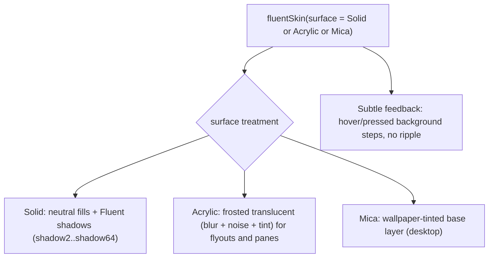

{/* Generated by docs/scripts/sync_vault.py from the Camouflage design notes. Edit the notes and re-run the script; changes made here are overwritten. */}

# Fluent Skin

:::info[Milestone: Later]

Documented now. Whether and when it ships is a separate decision (ADR-22).

:::

## 1. Why

`FluentSkin` renders Camouflage in **Microsoft's Fluent 2** dialect: calm neutral surfaces, 4 px corners, subtle hover states, a brand color used sparingly, and the **Acrylic** and **Mica** materials on Windows. It's the natural dialect for desktop apps (Windows especially) and for enterprise tools. Structurally it's close to Minimal and Material, so it mostly swaps the surface treatment, feedback and proportions, which is the reuse the architecture was designed for.

## 2. Shape



**Interaction feedback: `Subtle`.** Hover and pressed shift the background one or two neutral steps (Fluent's `…Hover` / `…Pressed` tokens). The focus indicator is Fluent's **double stroke** (2 px dark outer + 1 px light inner).

**Surface treatments:**
- `Solid`: the default everywhere.
- `Acrylic`: blur + noise texture + tint, for menus, flyouts and dialogs.
- `Mica`: a wallpaper-tinted window background. It's desktop-only, and falls back to `Solid` elsewhere.

## 3. API

```kotlin
fun fluentSkin(surface: FluentSurface = Solid): CamoSkin      // Solid | Acrylic | Mica
fun fluentTheme(brand: Color = FluentBrandBlue, dark: Boolean = false, fontFamily: FontFamily? = null): CamoTheme
```

**Starter theme:** the Fluent 2 neutral ramp → surfaces (`neutralBackground1..6`), `neutralForeground1..3` → `onSurface`/`onSurfaceVariant`, `neutralStroke1/2` → `outline`/`outlineVariant`, and the brand ramp (from the brand color, Fluent's 16-step ramp) → the `primary` family. Status: `danger`/`success`/`warning` palettes, and `info` from the brand. Typography: **Segoe UI Variable** on Windows, the platform font elsewhere (not bundled; an app may add its own via `fluentTheme(fontFamily = …)`), with Fluent's type ramp (caption1 12, body1 14, subtitle2 16 semibold, subtitle1 20, title3 24, title2 28, title1 32, largeTitle 40, display 68). Values are taken from Fluent's published token set at implementation time.

### 3.1 Dialect alignment

| Appearance | Fluent rendering |
|---|---|
| `Solid` | Primary button: brand fill, white text |
| `Soft` | Default/Secondary button: `neutralBackground1` + `neutralStroke1` border |
| `Raised` | → Soft |
| `Outline` | Outline button: transparent + stroke |
| `Ghost` | Subtle / Transparent button |
| `Link` | Link |

| Tone | Fluent |
|---|---|
| Error / Success / Warning | danger / success / warning palettes |
| Info | brand (Fluent has no separate info palette) |

### 3.2 Component mapping

| Component | Fluent equivalent | Rendering |
|---|---|---|
| CamoButton / IconButton | Button (+ icon-only) | 32 tall (medium), radius 4 |
| CamoFab | – | a circular primary button (guidance: use a command bar instead) |
| CamoTextField | Input + Field | 32 tall, radius 4, **bottom-accent stroke** (brand on focus), label above |
| CamoCheckbox / Switch / Radio | Checkbox / Switch / Radio | 16 box, 40 × 20 switch, brand when on |
| CamoSegmentedControl | – (TabList or ToggleButtons) | toggle-button group |
| CamoSlider | Slider | 4 px rail, 20 thumb with an inner dot |
| CamoDatePicker | DatePicker / Calendar | `style` Calendar in an Acrylic flyout |
| CamoTimePicker | TimePicker | `style` Fields |
| CamoStepper | SpinButton | **`layout` Split** (field with ▲▼) |
| CamoSearchField | SearchBox | Input + search icon + dismiss |
| CamoSelect | Dropdown / Combobox | field + listbox flyout (Acrylic) |
| CamoCard | Card | radius 8, shadow4, `neutralBackground1` |
| CamoAccordion | Accordion | chevron at the start (`indicatorPosition` Start) |
| CamoListItem | List | 40–56 rows, subtle selection |
| CamoChip | Tag / InteractionTag | radius 4 tags, dismissible |
| CamoBadge | Badge / CounterBadge | brand or danger, rounded |
| CamoAvatar | Avatar / Persona | circle, brand-tinted initials, presence badge |
| CamoProgress | ProgressBar / Spinner | 2 px bar, a brand spinner |
| CamoSnackbar | Toast | a bottom-end toast card; `showToneIcon` true |
| CamoBanner | MessageBar | an intent-colored bar with an icon and actions |
| CamoDialog | Dialog | radius 8, shadow64, title 20 semibold, actions end-aligned, optional ✕ (`DialogTheme.showCloseButton`), shown only when `dismissible` |
| CamoBottomSheet | Drawer (bottom) | → an overlay drawer from the bottom, `showHandle` default false |
| CamoMenu | Menu | Acrylic flyout, 32 items, radius 4, `checkPosition` Leading |
| CamoTooltip | Tooltip | neutral or inverted, radius 4 |
| CamoTopBar | (app header) | 48 tall, title start-aligned |
| CamoTabs | TabList | a brand underline indicator, 2 px |
| CamoNavigationBar | – | a bottom bar in Fluent style (for mobile) |
| CamoNavigationRail / Drawer | Nav (collapsed / expanded) | 48 rail, 260 pane, `indicator` Line (a brand start-edge line) |
| CamoPagedList | List | no pull gesture on desktop (refresh from a command); Spinner for loading more |
| CamoSkeleton | Skeleton | shimmer, Fluent's skeleton colors |
| CamoDivider | Divider | 1 px `neutralStroke2` |

## 4. Build steps

1. `Subtle` feedback, the double-stroke focus, and the `Solid` surface with Fluent's shadow ramp.
2. `fluentTheme` from the Fluent token set (brand ramp + neutrals), snapshot-pinned.
3. The renderers. Most proportions differ, but structures stay close to Minimal.
4. `Acrylic` (blur + noise + tint) and `Mica` (desktop wallpaper tint; Windows API interop on JVM desktop, and a solid fallback elsewhere).

**Done when**
- [ ] All 39 renderers with the `Solid` surface. Acrylic menus and dialogs on desktop. Mica on the Windows desktop sample.

## 5. Edge cases

| Case | Decided behavior |
|---|---|
| Mica on non-Windows platforms | Falls back to `Solid` (a documented, silent fallback). |
| Fluent's compact density on desktop vs touch on mobile | Uses a density option via component themes (32 vs 40 heights). |
| High contrast mode (Windows) | Uses the platform's high-contrast colors when the OS reports it. |
