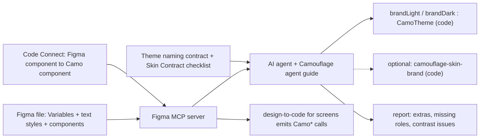

{/* Generated by docs/scripts/sync_vault.py from the Camouflage design notes. Edit the notes and re-run the script; changes made here are overwritten. */}

# Figma and AI

:::info[Milestone: Later]

This note describes the planned Figma integration. v1 needs only the parts marked **v1 requirement**. The rest is built after M7.

:::

## 1. Why

The original problem is "every new Figma file means rebuilding components". Camouflage solves the rebuilding. This note covers the **translating**: turning a Figma design system into a `CamoTheme` (and, when the structure really differs, a `CamoSkin`) with an AI agent that reads Figma through the **Figma MCP server**. No custom generator tool is built. Instead, Camouflage makes itself easy for an agent to target: a strict naming contract, precise contracts, and Code Connect mappings.

## 2. Shape

This path needs the Figma MCP (a paid Figma seat). The paths that work without it (a tokens JSON, the `camo` CLI, Camouflage's own MCP server, a free Figma plugin, Studio) are in [Tooling](/guide/integrations/tooling).

Three pieces, each with its own job:

| Piece | Job | Status |
|---|---|---|
| **Naming contract** | Figma variable paths map one to one onto theme roles | **v1 requirement**: defined in [Theme](/guide/foundations/theme) §3.12 |
| **Agent guide** | step-by-step instructions an agent follows: read Figma → produce a theme or skin → validate → report | Later (a skill file) |
| **Code Connect** | links each Figma component to its `Camo*` component, so when the MCP turns a *screen* into code, it outputs Camouflage calls instead of raw widgets | Later |

## 3. API

### 3.1 Figma MCP tools involved

| Tool | Used for |
|---|---|
| `get_variable_defs` | read Variables (colors, numbers) with their modes → theme values |
| `get_design_context` | read a component or frame's structure and styles → the skin mapping, and screens |
| `get_screenshot` | visual reference, to compare the generated renderer output against the design |
| `get_metadata` | find the component sets, variants and text styles in the file |
| `get_code_connect_map` / `add_code_connect_map` | read and write the Figma → Camouflage component links |

Tool names follow the Figma MCP server at the time of writing. Check them against its current tool list when building this.

### 3.2 Figma file conventions (what the design team is asked to follow)

The designer-facing version of this table, in plain language, is [Figma Conventions](/guide/integrations/figma-conventions).

| Figma thing | Convention | Maps to |
|---|---|---|
| Variable collection `camouflage/color` with modes `Light`, `Dark` (and brand modes) | paths like `primary`, `on-primary` | `CamoColors`, one theme per mode |
| Collections `camouflage/shape`, `/spacing`, `/elevation`, `/motion` | paths like `medium`, `l`, `level2`, `duration-short` | the matching groups |
| Collection `camouflage/component` | paths like `button/height`, `button/radius`, `button/icon-size`, `text-field/border-width` | `components.button.height` … (only what the design changes; unset fields use skin defaults) |
| The same collection, **string and boolean variables** for layout choices (ADR-28/30) | `top-bar/title-align = center`, `dialog/actions-layout = stacked`, `navigation-bar/placement = floating`, `navigation-bar/indicator = line`, `text-field/label-placement = floating`, `snackbar/show-tone-icon = true`, `button/default-appearance = outline` | the enum and Boolean component-theme fields, value for value |
| Text styles `type/body/medium` … | 15 styles | `CamoTypography` |
| any extra collection (`custom/<set>/…`), in the brand's own naming | the brand's vocabulary (`brand/600`, `radius/card`) | a generated token set (`BrandTokens`, ADR-32); roles may alias it |
| Component sets named `Camo/Button` with properties `appearance=solid/soft/raised/outline/ghost/link`, `tone=default/error/success/warning/info`, `state=enabled/disabled` | same names as the contract | Code Connect + skin mapping |

### 3.3 Agent guide (outline of the future skill)

1. **Input:** a Figma file URL and target platforms (Kotlin, Flutter).
2. Read the variables (`get_variable_defs`) for every mode, and the text styles (`get_metadata`).
3. Map each variable using the naming contract. Unknown paths go to a custom token set and are listed in the report. Missing required roles are listed as blocking, and the agent asks the user (it never guesses silently).
4. Generate `brand<Mode>` `CamoTheme` code per platform, following [Theme](/guide/foundations/theme#implementation) / [Theme](/guide/foundations/theme#implementation).
5. Run `validate()` (through a generated test). Report contrast issues with their ratios.
6. For each `Camo/*` component set: compare its structure with the v1 skin's (`MinimalSkin`) mapping (`get_design_context` + `get_screenshot`).
   Each difference lands on the **cheapest level that covers it** (ADR-28, ADR-30), and the report says which:
   1. **theme tokens** (colors, type, shapes);
   2. **component-theme fields**: proportions (`ButtonTheme(height = 48)`) and the layout choices (`titleAlign`, `actionsLayout`, `labelPlacement`, `indicator`, `placement`, …), measured from the component set;
   3. **building blocks** for a one-off design on one screen (a custom header from `CamoTopBarContainer`);
   4. a **renderer override**: generated, or **borrowed from another skin** when the design matches that dialect (`MinimalSkin.copy(tabs = CupertinoSkin.tabs)` for segmented-control tabs);
   5. a **new skin module**, only when many components differ in structure (checklist in [Skin Contract](/guide/architecture/skin-contract) §3.7).
7. Write the Code Connect mappings for each component set.
8. **Output:** theme files, optional renderer or skin code, Code Connect files, and a report (extras, missing roles, contrast issues, overridden renderers).

### 3.4 Code Connect mapping (per component)

For each `Camo/*` component set, one mapping maps Figma properties → contract parameters:

| Figma property | Contract parameter |
|---|---|
| `appearance` property (solid/soft/raised/outline/ghost/link) | `appearance = Solid/…` — **omitted when it equals the theme's `defaultAppearance`** (the parameter is nullable) |
| `tone` property (default/error/success/warning/info) | `tone = Default/Error/Success/Warning/Info` |
| `state=disabled` | `enabled = false` (Flutter: `onPressed: null`) |
| `state=loading` | `loading = true` |
| text layer `label` | `text = "…"` |
| boolean `has prefix icon` + instance swap `prefix icon` | `prefixIcon = AppIcon.<name>()` |
| boolean `has suffix icon` + instance swap `suffix icon` | `suffixIcon = AppIcon.<name>()` |

Code Connect supports Jetpack Compose directly, and other languages through template files. Check Flutter support at build time. If there's none, the Flutter snippet is produced by a template.

## 4. Build steps

1. **v1:** keep the naming contract in [Theme](/guide/foundations/theme) stable, and add a test that parses a sample exported variables JSON into `CamoTheme`. This proves the contract is mechanical.
2. **Later:**
   1. make a demo Figma file that follows §3.2;
   2. write the agent guide as a skill;
   3. run it against the demo file for Kotlin, then Flutter;
   4. add Code Connect mappings for the v1 components (40 notes) and their building blocks;
   5. record the "Figma to Camouflage in one prompt" episode.

**Done when**
- [ ] (v1) Sample variables JSON → `CamoTheme`, with a passing test, and every path mapped by the contract alone.
- [ ] (Later) The agent produces a validated theme from the demo file with no manual edits, and design-to-code on a demo screen emits only `Camo*` components.

## 5. Edge cases

| Case | Decided behavior |
|---|---|
| **An extra variable with no role** | Goes to a custom token set (`custom/…`), keeping its name, and is listed in the report. |
| **A missing required role** (settled 2026-09-27) | Two run modes. **Interactive** (default): the agent asks. **Unattended** (CI): it derives the role (e.g. `onPrimary` from contrast against `primary`) and continues; the report marks every derived value, the output is flagged "needs review", existing theme files are never overwritten, and CI fails until the derived values are accepted. |
| Variables that alias other variables (primitive → semantic) | The agent resolves aliases to final values per mode. Primitives aren't emitted into `CamoTheme`. |
| A Figma file that doesn't follow the conventions | The agent maps what it can by name similarity, lists every guess in the report, and asks for confirmation before writing code. |
| Figma modes beyond light/dark (brand A/B, high contrast) | One `CamoTheme` per mode, named after the mode. |
| A text style using a font not bundled in the app | Reported. The agent doesn't add font files on its own. |
