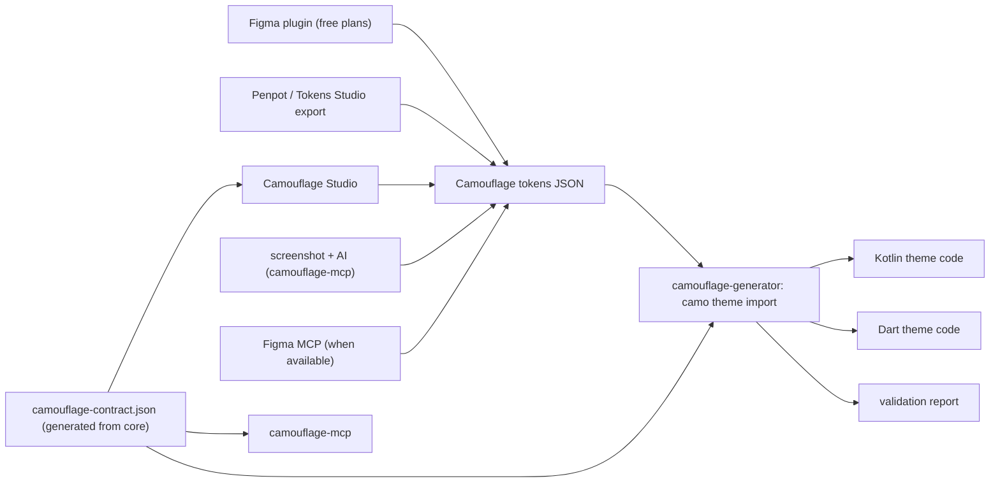

{/* Generated by docs/scripts/sync_vault.py from the Camouflage design notes. Edit the notes and re-run the script; changes made here are overwritten. */}

# Tooling

:::info[Milestone: Later]

None of this is needed for v1. The tokens format and the generator command come first, after M9 (ADR-31).

:::

## 1. Why

The Figma MCP path ([Figma and AI](/guide/integrations/figma-and-ai)) needs a paid Figma seat, and many designers and teams don't have one. Camouflage's tooling must work **without Figma**: from a free Figma plan, Penpot, Tokens Studio, a screenshot, or no design tool at all. The way to do that is one shared file format in the middle, so every source can produce it and every consumer can read it.

## 2. Shape



**`camouflage-contract.json`** is generated from core's code at build time: every component, its parameters, and every component-theme field with its type, allowed values and default per skin. The tools read it, so they never drift from the code.

## 3. API

### 3.1 Camouflage tokens JSON

The [W3C Design Tokens](https://www.designtokens.org) format (`$type`, `$value`, `{alias}` references), with Camouflage's names from the naming contract ([Theme](/guide/foundations/theme) §3.12). One file per mode (`brand.light.tokens.json`, `brand.dark.tokens.json`), plus an optional shared base file.

It covers the **whole theme, component themes included**:

```json
{
  "$schema": "https://srctool.com/camouflage/tokens.schema.json",
  "color": {
    "primary":    { "$type": "color", "$value": "{custom.brand.600}" },
    "on-primary": { "$type": "color", "$value": "#FFFFFF" }
  },
  "shape":   { "medium": { "$type": "dimension", "$value": "8px" } },
  "spacing": { "l":      { "$type": "dimension", "$value": "16px" } },
  "type": {
    "body-medium": { "$type": "typography",
                     "$value": { "fontFamily": "Inter", "fontSize": "14px", "fontWeight": 400, "lineHeight": "20px" } }
  },
  "component": {
    "button":         { "height": { "$type": "dimension", "$value": "48px" },
                        "shape": { "$value": "{shape.medium}" },
                        "default-appearance": { "$type": "string", "$value": "outline" } },
    "text-field":     { "label-placement": { "$type": "string", "$value": "floating" } },
    "dialog":         { "actions-layout": { "$type": "string", "$value": "stacked" },
                        "title-align": { "$type": "string", "$value": "center" } },
    "navigation-bar": { "placement": { "$type": "string", "$value": "floating" },
                        "indicator": { "$type": "string", "$value": "line" } },
    "snackbar":       { "show-tone-icon": { "$type": "boolean", "$value": true } }
  },
  "custom": {
    "brand":  { "50": { "$type": "color", "$value": "#EEF4FF" }, "600": { "$type": "color", "$value": "#0B57D0" } },
    "radius": { "card": { "$type": "dimension", "$value": "20px" } }
  },
  "skin": { "base": "minimal", "borrow": { "tabs": "cupertino" } }
}
```

| Group | Maps to |
|---|---|
| `color`, `shape`, `spacing`, `elevation`, `motion`, `type` | the theme tokens |
| `component.<component>.<field>` | `CamoComponentThemes`: sizes, colors (by role reference, e.g. `{color.primary}`), shapes, text styles, and the layout choices (enums as strings, switches as Booleans). Only the fields a design changes; the rest use the skin's defaults. |
| `custom.<set>.<name>` | a generated, typed token set (`BrandTokens`, ADR-32) in the brand's own naming; roles and component fields may reference it |
| `skin` | the skin choice: a base skin plus borrowed renderers (ADR-28), generated as `val BrandSkin = MinimalSkin.copy(tabs = CupertinoSkin.tabs)` |

- A component field **references roles** (`{color.primary}`, `{shape.medium}`, `{type.label-large}`) when the design does, so changing a role later still flows through.
- Enum and Boolean values are checked against `camouflage-contract.json`: `"actions-layout": "sideways"` is an error with the allowed values listed.

### 3.2 `camouflage-generator`: the `camo` command

The rule-based path (no AI):

```
camo theme import brand.light.tokens.json brand.dark.tokens.json --platform kotlin,flutter --out theme/   # later: web
camo theme validate theme/            # contrast, missing roles, unknown component fields
camo theme export theme/ --tokens     # code → tokens JSON (round trip)
camo lint src/                        # plain Material/Cupertino widgets where a Camo* exists
camo theme import tailwind.config.js  # an existing Tailwind (or Mantine) theme → a custom token set
camo theme export theme/ --tailwind   # a Tailwind preset from the same tokens, for a web team
```

**This is the "define your own theme or skin" path.** From one tokens file, the generator writes a brand module: the token-set classes, the `CamoTheme`s (roles referencing the brand's tokens), the component themes, and the skin (a base skin with borrowed renderers). The output is theme code for each platform (`brandLight`, `brandDark`, including `components = CamoComponentThemes(button = ButtonTheme(height = 48.dp, …), dialog = DialogTheme(actionsLayout = Stacked), …)`) and a report. It's the same `camouflage-generator` family package that generates the `AppIcon` set (ADR-26).

### 3.3 `camouflage-mcp`: Camouflage's own MCP server

For any AI client (Claude Code and others), **no Figma needed**:

| Tool | Does |
|---|---|
| `list_components` / `get_component` | the contract: parameters, slots, building blocks, and the component-theme fields with allowed values |
| `get_theme_schema` | the tokens format and every theme field |
| `import_tokens` | a tokens JSON (or a Tokens Studio / Penpot export) → validated Camouflage tokens |
| `generate_theme` | tokens → Kotlin and Dart theme code (the generator's library) |
| `validate_theme` | the same checks as `camo theme validate` |
| `suggest_from_image` | the client model reads a screenshot or mockup; this tool returns the component catalog and the tokens skeleton to fill, then validates what the model proposes (theme tokens **and** component-theme choices, e.g. "dialog buttons stacked, full width") |
| `lint_code` | finds non-Camouflage widgets and proposes the `Camo*` equivalent |

### 3.4 Figma plugin (in `camouflage-figma-kit`)

Runs on free Figma plans. It exports the tokens JSON from local variables and text styles (the component collection included), and can **scaffold** a new file: the Camouflage collections, the 15 text styles and empty `Camo/…` component sets.

### 3.5 Camouflage Studio

A theme builder for designers and developers: choose the accent, neutral, fonts, sizes and **every component-theme choice**, see all components live, and export.

**What you see is what you get.** The preview must be the real renderer of each target, not a look-alike. So Studio shows one **canvas per target platform**, each running that platform's actual Camouflage and fed the same tokens JSON live:

| Canvas | Runs | Exact for |
|---|---|---|
| Flutter | Camouflage Dart on Flutter web | Dart export |
| Compose | Camouflage Kotlin on Compose Multiplatform `wasmJs` | Kotlin export |
| Web (after the web port exists) | Camouflage Web Components | web export |

- The Studio shell (panels, pickers, export) can be built in any web technology; the canvases are embedded (the same technique as the deferred live docs gallery, ADR-18).
- **Export targets:** tokens JSON, Kotlin, Dart, and later **web** (CSS custom properties plus a typed theme object for the Web Components port), all produced by the `camo` generator, so Studio and the CLI always emit the same code.
- Designers switch skins in the canvas too, to see a brand theme under Minimal, and later Material or Cupertino.

## 4. Build steps

1. The tokens format and its JSON schema, generated from `camouflage-contract.json`.
2. `camo theme import / validate / export` in `camouflage-generator`, with golden tests: tokens → code → tokens round-trips unchanged.
3. `camouflage-mcp` on top of the same library.
4. The Figma plugin (export, then scaffold).
5. Camouflage Studio: the shell, the Flutter and Compose canvases, then the web canvas and web export once a web port exists.

**Done when**
- [ ] A tokens file with theme and component-theme values becomes compiling Kotlin and Dart themes, and exports back to the same file.
- [ ] An AI client with only `camouflage-mcp` turns a screenshot into a validated theme, component themes included.

## 5. Edge cases

| Case | Decided behavior |
|---|---|
| A tokens file with a component field that doesn't exist | An error naming the component's real fields (from the contract). |
| A component field set to a raw color instead of a role | Allowed, with a warning ("not linked to a role; won't follow theme changes"). |
| Fonts in the tokens that the app doesn't have | Reported. The generator never adds font files. |
| Figma plan limits (for example fewer variable modes on free plans) | Missing modes can be separate files; the plugin exports each mode it finds. Plan details are checked at build time. |
| Contract changes between versions | Tokens files carry a `camouflage` version; the generator migrates renamed fields and reports removed ones. |
