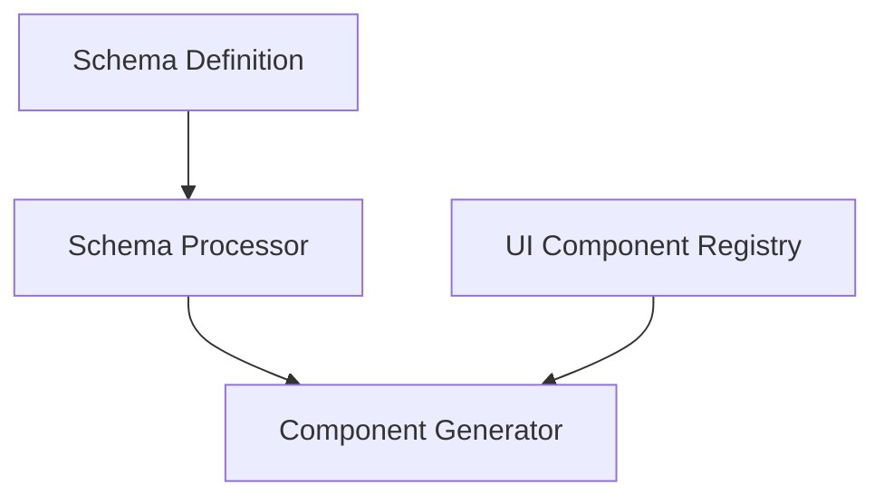

# Camouflage Blueprint Architecture

## Overview

Camouflage Blueprint provides a schema-based UI generation system that enables developers to create complex UI components through configuration rather than code.

## Core Architecture

### Schema Processing Layer

### 1. Schema System
- Schema definition format
- Validation system
- Extension points
- Custom schema support

### 2. Component Generation
- Generation pipeline
- Component composition
- State management
- Event binding

### 3. Integration Layer
- camouflage-ui integration
- Custom component support
- Platform adaptation

## Technical Architecture

### 1. Schema Processing
- Schema parsing
- Validation rules
- Extension mechanism
- Custom validators

### 2. Generation Engine
- Component tree building
- State management injection
- Event handling system
- Performance optimization

### 3. Platform Integration
- Kotlin implementation
  - KMP/CMP integration
  - Platform-specific features
- Flutter implementation
  - Widget generation
  - State management

## Development Guidelines

### 1. Schema Development
- Schema structure
- Validation rules
- Extension patterns
- Best practices

### 2. Component Generation
- Generation patterns
- Performance considerations
- Platform-specific optimizations

### 3. Testing Strategy
- Schema validation testing
- Generated component testing
- Integration testing
