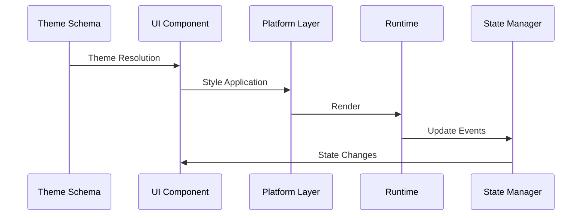
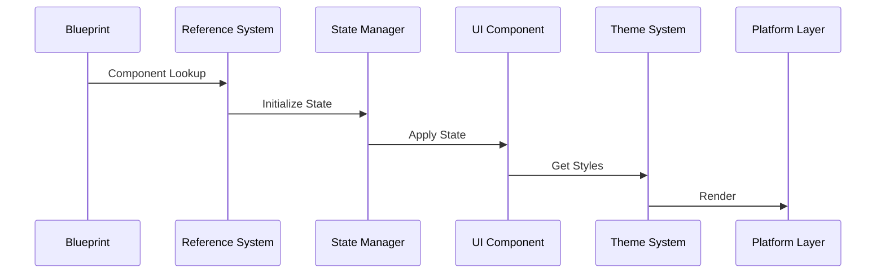

# Camouflage Ecosystem Architecture

## Overview

The Camouflage ecosystem consists of three main packages working together to provide a complete UI development solution:

- **camouflage-ui**: Core UI components and theming system
- **camouflage-blueprint**: Dynamic component composition and state management
- **camouflage-storybook**: Development environment and testing tools

## Package Integration Points

### 1. UI to Blueprint Integration
- Theme system connection points
- Component registration system
- State management bridge
- Platform-specific adaptations

### 2. Blueprint to Storybook Integration
- Component preview system
- State inspection tools
- Theme visualization
- Testing infrastructure

## Core Systems

### 1. Theme System Architecture
- Theme schema format and structure
- Token resolution mechanism
- Component theme mapping
- Platform-specific theme adaptation
- Dark mode implementation
- Dynamic theme updates

### 2. Component Architecture
- Component hierarchy
- Platform bridges (Kotlin/Dart)
- State management system
- Event handling system
- Accessibility implementation
- Performance optimization

### 3. State Management
- State container implementation
- Event propagation system
- State synchronization
- Hot reload support
- Debug tooling

## Platform Implementation

<KotlinOnly>
- Compose Multiplatform integration
- State management system
- Theme adaptation layer
- Native feature bridges
- Build configuration
- Resource management
</KotlinOnly>

<DartOnly>
- Flutter widget system integration
- State management bridge
- Theme system implementation
- Platform feature support
- Build process
- Asset management
</DartOnly>

## Development Tools

### 1. Preview System
- Live reload architecture
- Component rendering
- State inspection
- Theme switching
- Event simulation
- Performance monitoring

### 2. Testing Infrastructure
- Unit testing framework
- Integration testing support
- Visual regression testing
- Accessibility testing
- Performance testing
- Coverage reporting

## Build and Distribution

### 1. Package Management
- Version control
- Dependency management
- Package publishing
- Documentation generation
- Example project distribution

### 2. Configuration Management
- Build configuration
- Platform-specific settings
- Development tools setup
- CI/CD integration
- Quality assurance tools

## Performance Considerations

### 1. Runtime Optimization
- Component lazy loading
- State update batching
- Theme resolution caching
- Memory management
- Event debouncing

### 2. Build Optimization
- Tree shaking
- Code splitting
- Bundle size optimization
- Platform-specific compilation
- Resource optimization

## Security Considerations

### 1. Input Validation
- Theme schema validation
- Component prop validation
- State mutation validation
- Event handling safety

### 2. Platform Security
- Native API usage
- Resource access
- Data handling
- Configuration security

## Future Considerations

### 1. Extensibility Points
- Plugin system architecture
- Custom component support
- Theme extension system
- Tool integration points

### 2. Scalability
- Large-scale application support
- Performance monitoring
- Resource optimization
- State management scaling

## Core Systems

### 1. Theme System
- **Schema Definition**
  - Token management
  - Component theme mapping
  - Platform adaptations
  - Dark mode support

- **Theme Resolution**
  - Token reference system
  - Component-specific theming
  - Dynamic theme updates
  - Platform optimizations

### 2. Component System
- **Reference Architecture**
  - Key-based lookup
  - Type-safe components
  - Platform bridges
  - Custom components

- **State Management**
  - `stateOf` implementation
  - State synchronization
  - Event handling
  - Platform integration

### 3. Development Tools
- **Live Development**
  - Hot reload support
  - State inspection
  - Theme preview
  - Visual testing

## Data Flow

### 1. Theme Flow

### 2. Component Flow

## Cross-Platform Architecture

### 1. Kotlin Implementation
- **Compose Integration**
  - Composable wrappers
  - State management bridges
  - Theme adapters
  - Platform features

- **Multiplatform Support**
  - Common code sharing
  - Platform-specific APIs
  - Resource management
  - Build configuration

### 2. Dart Implementation
- **Flutter Integration**
  - Widget system
  - State management
  - Theme system
  - Platform features

- **Cross-Platform Features**
  - Shared architecture
  - Platform optimization
  - Resource handling
  - Build process

## Development Workflow

### 1. Design System Implementation
- Theme schema creation
- Component theming
- Token management
- Platform adaptation

### 2. Component Development
- Reference system usage
- State management
- Event handling
- Testing strategy

### 3. Application Integration
- Package setup
- Theme configuration
- Component usage
- State management

## Performance Considerations

### 1. Runtime Optimization
- Theme resolution caching
- State updates batching
- Component lazy loading
- Memory management

### 2. Platform Optimization
- Native features usage
- Platform-specific rendering
- Resource optimization
- Bundle size management
   - Define base components in camouflage-ui
   - Create schemas in camouflage-blueprint
   - Document in camouflage-storybook

2. **Integration Flow**
   - Component registration
   - Schema processing
   - Development environment setup

3. **Testing and Validation**
   - Component testing
   - Schema validation
   - Cross-platform verification
