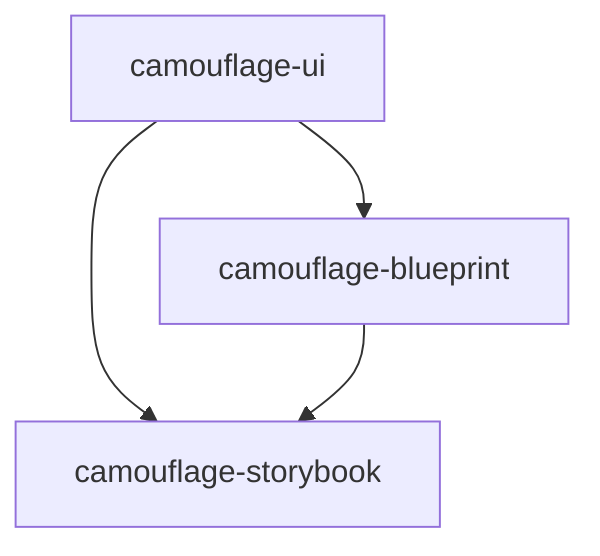

# Camouflage Ecosystem Architecture

This document provides a high-level overview of how the Camouflage ecosystem packages work together to provide a complete UI development solution.

## Ecosystem Overview

## Core Concepts

### 1. Foundation Layer (camouflage-ui)
- Base UI components and design system implementation
- Platform-specific adaptations for Kotlin and Flutter
- Core styling and theming system

### 2. Generation Layer (camouflage-blueprint)
- Schema-based component generation
- Custom component definition system
- High-level component composition

### 3. Development Layer (camouflage-storybook)
- Component development environment
- Testing and documentation tools
- Visual regression testing

## Package Integration

### Cross-Package Communication
- Component registration and discovery
- Schema validation and processing
- State management and data flow

### Platform-Specific Implementation
- Kotlin Multiplatform/Compose Multiplatform approach
- Flutter/Dart implementation strategy
- Platform optimization techniques

## Development Workflow

1. **Component Creation**
   - Define base components in camouflage-ui
   - Create schemas in camouflage-blueprint
   - Document in camouflage-storybook

2. **Integration Flow**
   - Component registration
   - Schema processing
   - Development environment setup

3. **Testing and Validation**
   - Component testing
   - Schema validation
   - Cross-platform verification
