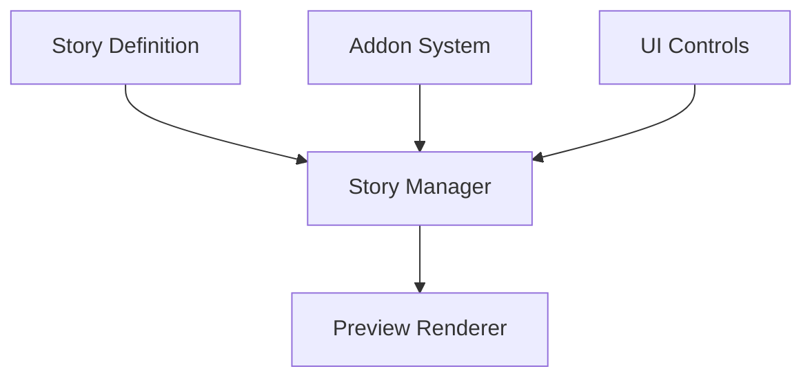

# Camouflage Storybook Architecture

## Overview

Camouflage Storybook provides a native implementation of Storybook.js capabilities for Kotlin and Flutter, offering a powerful development environment for UI components.

## Core Architecture

### Development Environment

### 1. Story System
- Story definition format
- Story collection management
- State management
- Documentation generation

### 2. Preview System
- Component rendering
- State manipulation
- Interactive controls
- Visual testing

### 3. Addon Architecture
- Addon system design
- Core addons
- Custom addon support
- Integration points

## Technical Architecture

### 1. Core Engine
- Story processing
- Component rendering
- State management
- Event handling

### 2. Platform Implementation
- Kotlin implementation
  - KMP/CMP integration
  - Platform-specific features
- Flutter implementation
  - Widget system integration
  - Hot reload support

### 3. Integration Layer
- camouflage-ui integration
- Blueprint integration
- Custom component support

## Development Guidelines

### 1. Story Development
- Story structure
- Documentation patterns
- Testing integration
- Best practices

### 2. Addon Development
- Addon architecture
- Integration patterns
- Testing strategy

### 3. Platform Considerations
- Platform-specific features
- Performance optimization
- Testing approach
