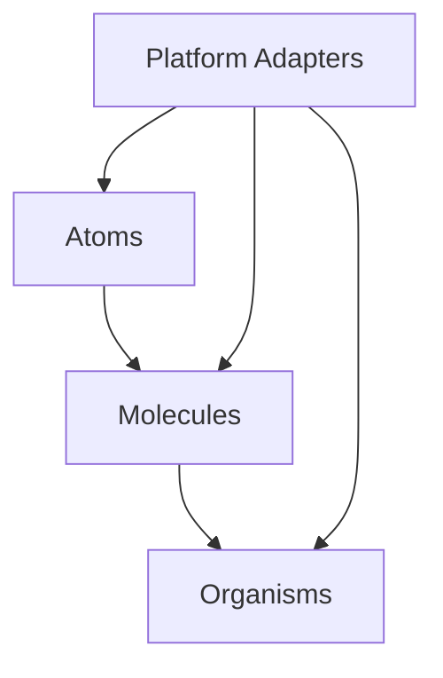

# Camouflage UI Architecture

## Overview

Camouflage UI is built on atomic design principles, providing a foundation of UI components that are platform-agnostic yet optimized for each target platform.

## Core Architecture

### Component Layer

### 1. Base Components
- Atomic level components
- Platform-agnostic definitions
- Core styling system

### 2. Platform Adaptation
- Kotlin Multiplatform implementation
  - Compose Multiplatform integration
  - Android/Desktop/Web targets
- Flutter implementation
  - Widget system integration
  - Cross-platform consistency

### 3. Theming System
- Design token management
- Platform-specific styling
- Theme inheritance

## Component Architecture

### 1. Component Structure
- Props/Parameters design
- State management
- Event handling
- Accessibility integration

### 2. Platform Bridges
- Platform-specific APIs
- Native feature integration
- Performance optimizations

### 3. Testing Architecture
- Unit testing approach
- Integration testing
- Visual regression testing

## Development Guidelines

### 1. Component Development
- Component lifecycle
- State management patterns
- Event handling patterns

### 2. Platform Considerations
- Platform-specific optimizations
- Feature parity management
- Performance guidelines

### 3. Testing Strategy
- Test coverage requirements
- Platform-specific testing
- Integration testing approach
