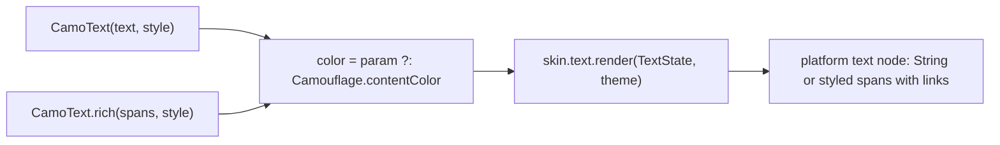
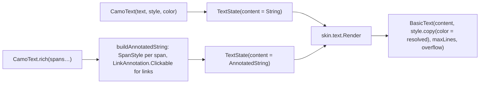
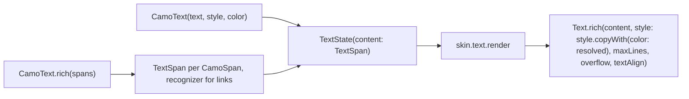

{/* Generated by docs/internal/scripts/sync_vault.py from the Camouflage design notes. Edit the notes and re-run the script; changes made here are overwritten. */}

# CamoText

## Concept {#concept}

### 1. Why

Text is in every other component: a button's text, a dialog's message, a field's error. `CamoText` is where the theme's **text style constants** and the **content color** chosen by the surrounding container turn into real text. It also covers **rich text** (bold words, links inside a sentence), because real screens need "I agree to the **Terms**" and a plain string can't express that.

If `CamoText("Save")` inside a Solid button comes out in `onPrimary` without the caller passing a color, the content-color mechanism works, and every later component relies on it.

### 2. Shape



**Span model.** Rich text is a list of `CamoSpan`s. Each span inherits the base `style` and color and overrides only what it sets. Platforms map spans to their own type:
- Flutter: `Text.rich(TextSpan(children: [...]))`, with a `TapGestureRecognizer` for links.
- Compose: `AnnotatedString` via `buildAnnotatedString { withStyle(SpanStyle(...)) }`, with `LinkAnnotation.Clickable` for links.

**Material mapping preview:**
- Plain text uses the given style.
- Links are drawn in `primary` with an underline.
- Other skins may style links differently (a Cupertino skin might use `primary` with no underline).

See [Material Skin](/guide/skins/material-skin).

### 3. API

#### Contract

```kotlin
fun CamoText(
    text: String,
    style: CamoTextStyle = Camouflage.typography.bodyMedium,
    color: Color? = null,                  // null → Camouflage.contentColor
    maxLines: Int = Unlimited,
    overflow: TextOverflow = Clip,         // Clip | Ellipsis
    textAlign: TextAlign = Start,          // Start | Center | End (start/end mirror in RTL)
)

fun CamoText.rich(
    vararg spans: CamoSpan,
    style: CamoTextStyle = Camouflage.typography.bodyMedium,
    color: Color? = null,
    maxLines: Int = Unlimited,
    overflow: TextOverflow = Clip,
    textAlign: TextAlign = Start,
)

data class CamoSpan(
    val text: String,
    val style: CamoTextStyle? = null,      // null → inherit the base style; e.g. typography.headlineSmall for a big number
    val fontWeight: FontWeight? = null,    // null → inherit (applied on top of style)
    val italic: Boolean? = null,
    val color: Color? = null,
    val underline: Boolean? = null,
    val link: (() -> Unit)? = null,        // non-null → an accessible link, styled by the skin
)
```

| Parameter | What it's for |
|---|---|
| `text` / `spans` | the content. A plain string, or spans for mixed styling and links. |
| `style` | a text style **value**: one of the 15 constants, optionally adjusted with `copy` (`typography.titleMedium.copy(fontWeight = Bold)`) |
| `color` | a color value, usually from `Camouflage.colors` (`Camouflage.colors.success`) |
| `maxLines`, `overflow` | truncation (top-bar title, list rows) |
| `textAlign` | alignment inside the text's own box (a centered empty-state message) |

**State → renderer:** `TextState(content: String or List<CamoSpan>, style, resolvedColor, maxLines, overflow, textAlign)`. **Slots:** none.

#### Tokens used

- `typography.*`, as passed
- `colors.primary` for links (the skin decides)
- the content color when `color` is null

#### Accessibility

- Exposed as static text to screen readers.
- **Each link span is a separate accessible link**: focusable in order, announced as "link", and activated with Enter. Platforms: Compose `LinkAnnotation` does this; Flutter needs `Semantics` per link span (the Flutter note covers it).
- Link targets are hard to hit when inline, so a skin may add vertical padding to link spans. The minimum target (48) can't always be met inline, and WCAG 2.5.8 exempts inline links.
- It must scale with the system font size, and respect the bold-text setting where the platform exposes one.

### 4. Build steps

1. Define `CamoSpan` and the `TextState` content union (a plain string or spans).
2. Implement `CamoText` and `CamoText.rich` in core: resolve the color, build `TextState`, call `Camouflage.skin.text.render`.
3. `DebugSkin` text renderer: plain text, and spans mapped to the platform rich-text type, with links underlined.
4. Sample:
   - all 15 styles in a column, in light and dark;
   - a `copy(fontWeight = Bold)` example;
   - "I agree to the Terms and Privacy Policy" with two links;
   - a success message using `color = Camouflage.colors.success`.
5. Tests:
   - with no `color`, text uses the content color (`onSurface` at the root, `onPrimary` inside a Primary container);
   - `maxLines = 1` + `Ellipsis` truncates;
   - each link is its own focusable link node and fires its callback;
   - a span without overrides inherits the base style.

**Done when**
- [ ] All 15 styles render, and `copy` adjusts one property.
- [ ] Links in a sentence work by touch, keyboard and screen reader.
- [ ] At 200% font scale, text wraps (with `maxLines` unlimited).

### 5. Edge cases

| Case | Decided behavior |
|---|---|
| Font scale 200% | The text grows and wraps. The renderer never fixes the height. |
| RTL string, and mixed-direction text | The platform bidi algorithm. `Start`/`End` alignment mirrors. |
| **A span with its own `style`** (settled 2026-09-27) | The span's style replaces the base style for that span; `fontWeight`, `italic`, `color` and `underline` apply on top. Only style *values* (the 15 roles, optionally `copy`-adjusted), never a bare font size, so sizes stay on the type scale and font scaling applies. The line takes the tallest line height in it, and all spans share one baseline. |
| Empty string | Renders nothing, and keeps its line height so layouts don't jump. |
| A link span inside a clickable parent (a clickable card) | Nested clickables are discouraged (see [CamoCard](/components/containers-and-lists/camo-card)). The link wins inside its own bounds. |
| Very long rich text (a legal page) | Works, but it's not a document renderer. Markdown/HTML rendering is out of scope. |
| A custom font missing a weight | The platform synthesizes bold. |
| `color` with poor contrast on its surface | The app's responsibility. `validate()` checks only the theme's own pairs. |

## Implementation {#implementation}

<KotlinOnly>

### 1. Why {#kotlin-1-why}

`CamoText` is Camouflage's text primitive, built on Compose foundation's `BasicText` (not Material's `Text`, which reads `MaterialTheme`). Rich text maps to Compose's **`AnnotatedString`**, and links map to **`LinkAnnotation.Clickable`**, which Compose makes focusable and accessible for us.

### 2. Shape {#kotlin-2-shape}



### 3. API {#kotlin-3-api}

```kotlin
@Composable
public fun CamoText(
    text: String,
    modifier: Modifier = Modifier,
    style: TextStyle = Camouflage.typography.bodyMedium,
    color: Color = Color.Unspecified,                  // Unspecified → Camouflage.contentColor
    maxLines: Int = Int.MAX_VALUE,
    overflow: TextOverflow = TextOverflow.Clip,
    textAlign: TextAlign = TextAlign.Start,
)

@Composable
public fun CamoText(                                   // the base CamoText.rich: an overload by type
    spans: List<CamoSpan>,
    modifier: Modifier = Modifier,
    style: TextStyle = Camouflage.typography.bodyMedium,
    color: Color = Color.Unspecified,
    maxLines: Int = Int.MAX_VALUE,
    overflow: TextOverflow = TextOverflow.Clip,
    textAlign: TextAlign = TextAlign.Start,
)

@Immutable
public data class CamoSpan(
    val text: String,
    val style: TextStyle? = null,          // → SpanStyle(style.toSpanStyle()), then weight/italic/color on top; line height via ParagraphStyle max
    val fontWeight: FontWeight? = null,
    val italic: Boolean? = null,
    val color: Color = Color.Unspecified,
    val underline: Boolean? = null,
    val link: (() -> Unit)? = null,
)
```

**Span → `AnnotatedString`** (in core, so every skin gets correct links):

```kotlin
internal fun List<CamoSpan>.toAnnotated(linkStyle: TextLinkStyles): AnnotatedString = buildAnnotatedString {
    for (span in this@toAnnotated) {
        val spanStyle = SpanStyle(
            fontWeight = span.fontWeight,
            fontStyle = span.italic?.let { if (it) FontStyle.Italic else FontStyle.Normal },
            color = span.color,
            textDecoration = if (span.underline == true) TextDecoration.Underline else null,
        )
        if (span.link != null) {
            withLink(LinkAnnotation.Clickable(tag = span.text, styles = linkStyle) { span.link.invoke() }) {
                withStyle(spanStyle) { append(span.text) }
            }
        } else withStyle(spanStyle) { append(span.text) }
    }
}
```

The **link style** comes from the skin: `TextRenderer` exposes `fun linkStyles(theme): TextLinkStyles` (Material: `primary` + underline, and a focused/hovered background).

**Why an overload:** Kotlin can't write `CamoText.rich`, and Compose itself overloads by type (`Text(String)` / `Text(AnnotatedString)`). One name is easier to discover and for codegen to target; a `String` and a `List<CamoSpan>` can't be confused.

**Renderer:** `TextState(content: AnnotatedString, style: TextStyle, color: Color, maxLines, overflow, textAlign)`. A plain `String` is wrapped as `AnnotatedString(text)`, so renderers handle one type.

### 4. Build steps {#kotlin-4-build-steps}

1. `CamoSpan` + `toAnnotated()`.
2. Both `CamoText` overloads: resolve the color (`color.takeOrElse { Camouflage.contentColor }`), build `TextState`, call `requireSkin("CamoText").text.Render(...)`.
3. `DebugSkin.text`: `BasicText` with the resolved style.
4. `commonTest` (`runComposeUiTest`):
   - text under a provider has color `onSurface`;
   - inside `ProvideContentStyle(Red, …)` it's red;
   - a spans `CamoText` with two links exposes two link nodes, and `performClick` on the second fires only its callback;
   - `maxLines = 1` gives `TextLayoutResult.hasVisualOverflow`.

**Done when**
- [ ] The 15-style specimen renders in the sample on all four platforms.
- [ ] Links are reachable with Tab on desktop and with a screen reader on Android/iOS.

### 5. Edge cases {#kotlin-5-edge-cases}

| Case | Decided behavior |
|---|---|
| **Base `CamoText.rich` → Kotlin `CamoText(spans = …)`** | An overload. Flutter keeps `CamoText.rich` (a named constructor). |
| `color` type | `Color` with `Unspecified` as "not set" (the Compose idiom) instead of `Color?`, which avoids boxing. |
| Links on web (canvas) | Clicks work. Screen-reader exposure is limited on the web target (ADR-18). |
| Text selection | Not enabled by default. Wrap in `SelectionContainer` at the app level. |
| Font scale | `sp` units follow `LocalDensity.fontScale` on every platform. |

</KotlinOnly>

<DartOnly>

### 1. Why {#dart-1-why}

This is Camouflage's text primitive on Flutter's `Text` (in `widgets`). Rich text maps to **`TextSpan`** trees. Links need a `TapGestureRecognizer` per link span, plus semantics, so they're announced and focusable as links. Core does that once, so every skin gets correct links.

### 2. Shape {#dart-2-shape}



### 3. API {#dart-3-api}

```dart
class CamoText extends StatefulWidget {
  const CamoText(String this.text, {super.key, this.style, this.color, this.maxLines, this.overflow = TextOverflow.clip,
                 this.textAlign = TextAlign.start}) : spans = null;
  const CamoText.rich(List<CamoSpan> this.spans, {super.key, this.style, this.color, this.maxLines,
                 this.overflow = TextOverflow.clip, this.textAlign = TextAlign.start}) : text = null;
  final String? text;
  final List<CamoSpan>? spans;
  final TextStyle? style;           // null → Camouflage.typographyOf(context).bodyMedium
  final Color? color;               // null → Camouflage.contentColorOf(context)
  // …
}

@immutable
class CamoSpan {
  const CamoSpan(this.text, {this.style, this.fontWeight, this.italic, this.color, this.underline, this.onTap});
  final TextStyle? style;   // → TextSpan(style: style.merge(weight/italic/color overrides))
  final String text;
  final FontWeight? fontWeight;
  final bool? italic;
  final Color? color;
  final bool? underline;
  final VoidCallback? onTap;        // base: link
}
```

It's a `StatefulWidget` because the link recognizers must be created once and **disposed** (`TapGestureRecognizer` holds resources). The `State` builds the recognizers in `didUpdateWidget` when spans change, and disposes them in `dispose`.

**Link semantics:** each link span gets its own semantics node through `TextSpan.semanticsLabel` + the recognizer, so screen readers list links separately. Link styling comes from the skin: `CamoTextRenderer.linkStyle(theme)` (Material: `primary` + underline).

### 4. Build steps {#dart-4-build-steps}

1. `CamoSpan`, the span → `TextSpan` conversion with recognizer lifecycle.
2. `CamoText` / `CamoText.rich` + `CamoTextRenderer`, and the DebugSkin renderer.
3. Widget tests:
   - default color is `onSurface`;
   - inside `CamoContentStyle(color: red)` it's red;
   - `tester.tap(find.textContaining('Terms'))` fires only the Terms link (use `tapOnText` / hit-testing the span);
   - `tester.getSemantics` shows link nodes;
   - no recognizer leaks (dispose is called: a test with a mocked recognizer factory).

**Done when**
- [ ] The 15-style specimen and the consent sentence with two links work on all six platforms.

### 5. Edge cases {#dart-5-edge-cases}

| Case | Decided behavior |
|---|---|
| **Named constructor maps directly** | `CamoText.rich` is exactly the base name. Kotlin uses an overload, `CamoText(spans = …)`. |
| Recognizer leaks | Handled by the `State` lifecycle. This is why `CamoText` is stateful even though it looks like it shouldn't be. |
| Text selection | Not on by default. Wrap in `SelectionArea` at the app level. |
| Links on web | Flutter web semantics expose links. Keyboard focus on inline links is platform-dependent. Test at M3. |

</DartOnly>
