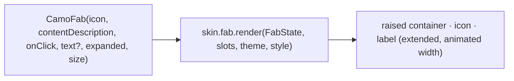
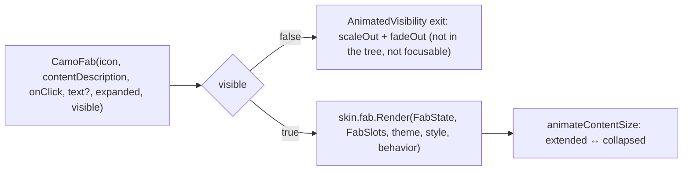
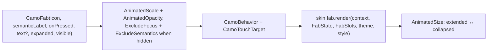

{/* Generated by docs/internal/scripts/sync_vault.py from the Camouflage design notes. Edit the notes and re-run the script; changes made here are overwritten. */}

# CamoFab

## Concept {#concept}

### 1. Why

A floating action button (FAB) holds a screen's single most important action: compose, add, start. It's Material's signature component. Apple doesn't have one, and neither do Fluent or Carbon, so their skins map it to a prominent circular button, or the app puts the action in a toolbar. It can be **extended** (icon + label), and collapse to the icon while scrolling.

### 2. Shape



**Material mapping preview:** M3 FABs.
- Sizes: Small 40, Regular 56, Large 96.
- Container `primaryContainer`, with content `onPrimaryContainer`, at `level3`.
- `shapes.large` (Regular).
- Extended: 56 tall, with a label in `labelLarge`.

### 3. API

#### Contract

```kotlin
fun CamoFab(
    icon: Widget,
    contentDescription: String,          // required; also the label when not extended
    onClick: () -> Unit,
    text: String? = null,                // non-null → extended FAB
    expanded: Boolean = true,            // extended only: false collapses to the icon (e.g. while scrolling)
    visible: Boolean = true,             // false → scales out (hide on scroll, ADR-30)
    appearance: Appearance? = null,   // null → FabTheme.defaultAppearance (skin default: Soft); Soft (primaryContainer) | Solid (primary) | Raised (surface); others fall back to Soft
    tone: Tone = Default,
)
```

Placement is **app layout** (Camouflage has no scaffold): the sample shows bottom-end with 16 padding, lifted above the navigation bar and the messenger's snackbars via `CamoMessengerInsets`.

**State → renderer:** `FabState(extended, expanded, visible, appearance, tone, interaction)`. **Slots:** `FabSlots(icon, text?)`.

#### Tokens used

- the tone family (`container`/`onContainer` for Soft, `strong`/`onStrong` for Solid), `surfaceContainerHigh` (Raised)
- `shapes.large` (Regular), `shapes.medium` (Small), `shapes.extraLarge` (Large)
- `elevation.level3` (resting), `level4` (hover)
- `typography.labelLarge`, `motion.durationMedium` (expand/collapse)

#### Component theme

`theme.components.fab: FabTheme?`. Every field is nullable in the theme. The skin's `defaults(theme)` fills whatever isn't set (Material defaults shown). See [Theme](/guide/foundations/theme) §3.10.

| Field | Type | Material default | What it's for |
|---|---|---|---|
| `defaultAppearance` | Appearance | `Soft` | the appearance used when a call passes none (ADR-28: a brand's default variant) |
| `size` | FabSize (`Small` \| `Regular` \| `Large`) | `Regular` | which size the FAB uses (ADR-23: only Material has three sizes, so it's a theme choice, not a parameter). One screen can switch with a nested `FabTheme`. |
| `sizeSmall / Regular / Large` | Dp | 40 / 56 / 96 | container sizes |
| `extendedHeight` | Dp | 56 | extended height |
| `shapeSmall / Regular / Large` | Shape | `medium` / `large` / `extraLarge` | corners |
| `iconSizeRegular / Large` | Dp | 24 / 36 | icon sizes |
| `elevation` | ElevationLevel | `Level3` | depth |
| `softColors / solidColors / raisedColors` | FabColors(container, content) | M3 values | colors per appearance for `tone = Default` |

#### Accessibility

- Role button, with name = `text` when extended, else `contentDescription`.
- The touch target is at least 48 (a Small FAB gets a margin).
- Collapsing while scrolling doesn't change the accessible name.

### 4. Build steps

1. `CamoFab` (extended width animation, fallbacks), `FabRenderer`, and the DebugSkin renderer.
2. Sample: an inbox with an extended "Compose" FAB that collapses on scroll (a scroll helper like the top bar's), placed above the navigation bar and snackbars.
3. Tests: name when collapsed vs extended; the target size; the expand/collapse animation (golden); tone colors.

**Done when**
- [ ] The inbox sample's FAB collapses and expands on scroll, and stays above the navigation bar and snackbars.

### 5. Edge cases

| Case | Decided behavior |
|---|---|
| Apple / Fluent / Carbon dialects | No FAB in those systems. Their skins render a prominent circular (Carbon: square) button, and design guidance suggests a toolbar action instead. The component stays in core because every skin can draw a reasonable equivalent (ADR-23). Those skins ignore `FabTheme.size` and use their single size. |
| FAB menu (speed dial, M3 2025) | Later. |
| RTL | Placement at bottom-end moves to the left. The icon doesn't mirror unless it's directional. |
| **Hide on scroll** | `visible = rememberHideOnScroll(listState)`, or keep it visible and collapse it with `expanded` instead. A hidden FAB isn't focusable. |

## Implementation {#implementation}

<KotlinOnly>

### 1. Why {#kotlin-1-why}

The FAB brings three Compose-specific pieces: animating between the extended and collapsed widths, hiding and showing with `visible` (ADR-30) while staying unfocusable when hidden, and reading the brand's size from `FabTheme.size` instead of a parameter (ADR-23).

### 2. Shape {#kotlin-2-shape}



### 3. API {#kotlin-3-api}

```kotlin
@Composable
public fun CamoFab(
    icon: @Composable () -> Unit,
    contentDescription: String,
    onClick: () -> Unit,
    modifier: Modifier = Modifier,
    text: String? = null,
    expanded: Boolean = true,
    visible: Boolean = true,
    appearance: Appearance? = null,       // null → FabTheme.defaultAppearance
    tone: Tone = Tone.Default,
    interactionSource: MutableInteractionSource? = null,
)
```

- **Visibility:** `AnimatedVisibility(visible, enter = scaleIn(initialScale = .6f) + fadeIn(), exit = scaleOut(targetScale = .6f) + fadeOut())` with durations from `theme.motion`. When hidden the FAB leaves composition, so it can't be focused or clicked.
- **Extended ↔ collapsed:** the renderer puts the text in `AnimatedVisibility(expanded, enter = expandHorizontally(), exit = shrinkHorizontally())` inside a `Row(Modifier.animateContentSize())`. The accessible name stays `text ?: contentDescription` in both states.
- **Size:** `style.size` (`FabSize.Small | Regular | Large`) picks `sizeSmall/Regular/Large` and the matching shape and icon size. Skins with one size ignore it.
- The behavior modifier: `minimumInteractiveComponentSize()`-equivalent (core's `minimumTouchTarget()`), `clickable(role = Role.Button)`, `semantics { contentDescription = text ?: contentDescription }`.
- Placement is app layout: `Box(Modifier.fillMaxSize()) { … ; CamoFab(…, Modifier.align(Alignment.BottomEnd).padding(16.dp).navigationBarsPadding()) }`.

### 4. Build steps {#kotlin-4-build-steps}

1. `FabTheme` / `FabStyle` (with `size`, `defaultAppearance`), `CamoFab`, the DebugSkin renderer.
2. The inbox sample: an extended "Compose" FAB that collapses while scrolling (`expanded = !listState.isScrollInProgress` or the scroll-direction helper) and a variant that hides with `visible = rememberHideOnScroll(listState)`.
3. `commonTest`: name when collapsed and extended; `visible = false` removes the node; the 48 target on `Small`; tone colors.

**Done when**
- [ ] The inbox FAB collapses, expands, hides and shows smoothly on Android, iOS, desktop and web, and is never focusable while hidden.

### 5. Edge cases {#kotlin-5-edge-cases}

| Case | Decided behavior |
|---|---|
| `visible` toggles quickly while scrolling | `AnimatedVisibility` reverses mid-animation; no queueing. |
| Reduced motion | Enter/exit become instant (the provider's reduced `CamoMotion`). |
| A FAB over the navigation bar and a snackbar | Wrap content in `CamoMessengerInsets(bottom = fabHeight + 16.dp)` so snackbars sit above it. |

</KotlinOnly>

<DartOnly>

### 1. Why {#dart-1-why}

The FAB's Flutter specifics: an animated width change between extended and collapsed, `visible` with a scale transition that also removes it from focus and semantics, and the size read from `CamoFabTheme.size`. Like all Flutter buttons, `onPressed: null` disables it (no `enabled`).

### 2. Shape {#dart-2-shape}



### 3. API {#dart-3-api}

```dart
class CamoFab extends StatefulWidget {
  const CamoFab({super.key, required this.icon, required this.semanticLabel, required this.onPressed,
      this.text, this.expanded = true, this.visible = true, this.appearance, this.tone = Tone.defaultTone, this.focusNode});
  final VoidCallback? onPressed;    // null = disabled
}
```

- **Visibility:** `AnimatedScale(scale: visible ? 1 : 0.6)` + `AnimatedOpacity`, durations from `theme.motion`. When hidden, `IgnorePointer` + `ExcludeFocus` + `ExcludeSemantics`, so it can't be tapped, focused or read.
- **Extended ↔ collapsed:** the renderer wraps the `Row(icon, text)` in `AnimatedSize`, and the text in `AnimatedSwitcher`/`SizeTransition`. The semantic label stays `text ?? semanticLabel`.
- **Size:** `style.size` (`FabSize.small | regular | large`) picks the container size, shape and icon size.
- Placement is the app's: e.g. `Positioned(right: 16, bottom: 16 + MediaQuery.paddingOf(context).bottom, child: CamoFab(…))` in a `Stack` (Camouflage has no `Scaffold`).

### 4. Build steps {#dart-4-build-steps}

1. `CamoFabTheme` / `CamoFabStyle` (with `size`, `defaultAppearance`), the widget, the DebugSkin renderer.
2. The inbox example: collapses with `expanded`, hides with `visible` from a `CamoHideOnScroll(controller)` notifier (core has no hooks dependency).
3. Widget tests: label in both states; hidden → not focusable, no semantics; `onPressed: null` → disabled semantics; the 48 target on `small`.

**Done when**
- [ ] The inbox FAB collapses, expands, hides and shows on every platform, never focusable while hidden.

### 5. Edge cases {#dart-5-edge-cases}

| Case | Decided behavior |
|---|---|
| Reduced motion | Durations are zero from the provider's reduced motion. |
| A FAB above snackbars | `CamoMessengerInsets(bottom: fabHeight + 16)` around the content. |

</DartOnly>
