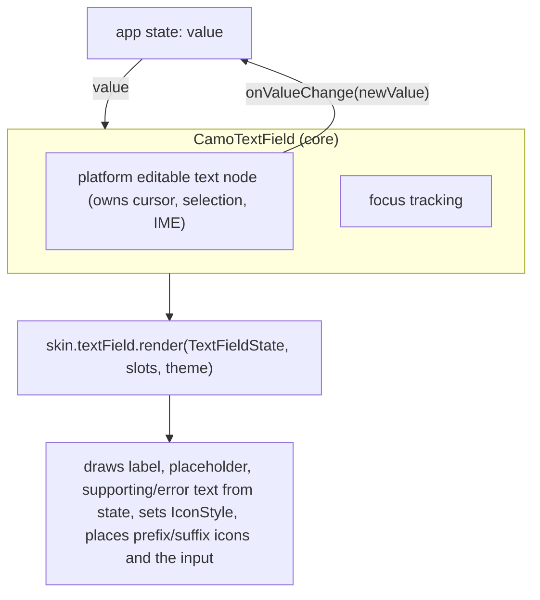
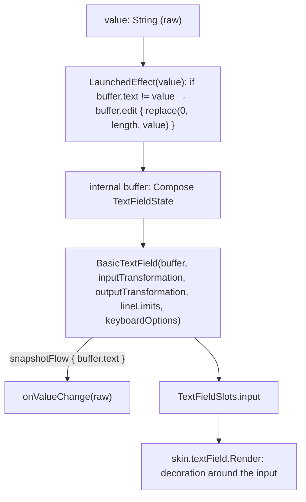
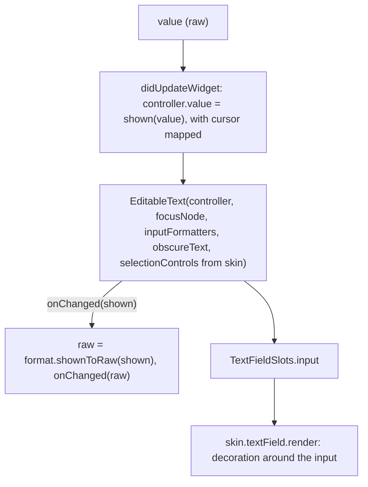

{/* Generated by docs/internal/scripts/sync_vault.py from the Camouflage design notes. Edit the notes and re-run the script; changes made here are overwritten. */}

# CamoTextField

## Concept {#concept}

### 1. Why

The text field is the hardest v1 component. It combines controlled text, focus, the keyboard (IME), error reporting and a lot of visual states, and each design language draws it differently (Material's floating label, iOS's plain rounded field). The key architectural rule proven here: **the editable text node lives in core, not in the renderer.** The skin decorates around it, so switching skins never loses the cursor, selection or keyboard.

### 2. Shape



Value flow (controlled):
1. The user types "a".
2. The platform input reports "a".
3. Core calls `onValueChange("a")`.
4. The app stores it and passes `value = "a"` back.
5. The field shows "a".

If the app **doesn't** update `value`, the field keeps showing the old value, which is how input can be filtered (digits only).

**Material mapping preview:** the Outlined text field.
- The label sits inside and floats to the top border on focus or when non-empty.
- The outline is `outline`, `primary` when focused, and `error` when in error.
- Icons are `onSurfaceVariant` at size 24. The suffix icon turns `error` in the error state.

See [Material Skin](/guide/skins/material-skin).

### 3. API

#### Contract

```kotlin
fun CamoTextField(
    value: String,
    onValueChange: (String) -> Unit,
    label: String? = null,
    placeholder: String? = null,
    supportingText: String? = null,    // helper text below the field
    error: String? = null,             // non-null = error state; replaces supportingText
    prefixIcon: Widget? = null,        // e.g. AppIcon.mail(), decorative
    suffixIcon: Widget? = null,        // e.g. AppIcon.clear(), or a CamoIconButton for an action
    prefixText: String? = null,        // e.g. "+62", "Rp"; never part of value
    suffixText: String? = null,        // e.g. "kg", ".com"
    enabled: Boolean = true,
    singleLine: Boolean = true,
    secure: Boolean = false,           // password: obscured text, no autocorrect, no copy
    onFocusChanged: ((Boolean) -> Unit)? = null,   // for validation timing (OnUnfocus)
    inputFilter: CamoInputFilter? = null,      // blocks or trims input before it reaches onValueChange
    displayFormat: CamoDisplayFormat? = null,  // shows formatting without storing it
)
```

| Parameter | What it's for |
|---|---|
| `value`, `onValueChange` | controlled text |
| `prefixText`, `suffixText` | fixed text inside the field, next to the input ("+62", "kg"). Not part of `value`. Drawn in the placeholder color, and shown only when the field is focused or non-empty, so it never collides with a floating label. Screen readers read it with the value. |
| `label`, `placeholder`, `supportingText`, `error` | text values. The renderer draws them in the skin's styles. |
| `prefixIcon` | a decorative icon widget at the start (mail, search) |
| `suffixIcon` | an icon widget at the end. For an **action** (clear, show password), pass a `CamoIconButton`, which brings its own label and click. |
| `enabled`, `singleLine`, `secure` | behavior flags |
| `onFocusChanged` | reports focus changes. Used by form fields for `OnUnfocus` validation. |

Inside a form, use `CamoTextFormField` ([CamoForm](/components/inputs/camo-form)). It takes the same parameters, minus `value`/`onValueChange`/`error`, plus `key`, `rules`, `onSaved` and `initialValue`.
| `inputFilter` | which input is allowed (digits only, max length). Applied by core **before** `onValueChange`, so the app never sees rejected characters. |
| `displayFormat` | how the raw value is **shown** (`081234567890` shown as `0812-3456-7890`). `value` stays raw. Core maps the cursor between raw and shown text, so it never jumps. |

**Formatting without cursor jumps.** The editable node lives in core (ADR-10), so core sees the old text, the new text and the cursor together. That's why filtering and formatting are parameters handled by core, not something the app does inside `onValueChange` (which is what makes the cursor jump to the end). Each platform maps them to its own cursor-safe mechanism:

| Base | Compose | Flutter |
|---|---|---|
| `inputFilter` | `InputTransformation` (state-based `BasicTextField`) | `TextInputFormatter` in `inputFormatters` |
| `displayFormat` | `OutputTransformation` (or `VisualTransformation` with an `OffsetMapping`) | a formatter that keeps a raw value and maps the selection offset |

```kotlin
interface CamoInputFilter {
    fun filter(old: String, new: String): String          // return the accepted raw text
    companion object {
        fun digitsOnly(maxLength: Int? = null): CamoInputFilter
        fun maxLength(n: Int): CamoInputFilter
        fun pattern(regex: Regex): CamoInputFilter         // allowed characters
    }
}
interface CamoDisplayFormat {
    fun format(raw: String): String                        // what the user sees
    fun rawToShown(offset: Int, raw: String): Int          // cursor mapping
    fun shownToRaw(offset: Int, shown: String): Int
    companion object {
        fun pattern(mask: String): CamoDisplayFormat       // "####-####-####", '#' = one raw char
        fun grouping(separator: Char = '.', size: Int = 3): CamoDisplayFormat   // 1.250.000
        fun decimal(decimals: Int = 2, decimalSeparator: Char = ',', groupSeparator: Char = '.'): CamoDisplayFormat   // 1.250.000,50
    }
}
```

Recipes with `pattern` (no extra built-ins needed): a card number `pattern("#### #### #### ####")` with `digitsOnly(16)`, an expiry `pattern("##/##")` with `digitsOnly(4)`. Brand detection (Amex 4-6-5) is app logic: write your own `CamoDisplayFormat`.

Example (Indonesian phone number):
```kotlin
CamoTextField(value = phoneDigits, onValueChange = { phoneDigits = it }, label = "Phone",
    inputFilter = CamoInputFilter.digitsOnly(maxLength = 13),
    displayFormat = CamoDisplayFormat.pattern("####-####-#####"))
```

Platform extras (added in platform notes): keyboard type and IME action (`KeyboardOptions` / `TextInputType` + `TextInputAction`), `onImeAction`, autofill hints.

**Show-password pattern:**
```kotlin
var hidden by state(true)
CamoTextField(value = pw, onValueChange = setPw, label = "Password", secure = hidden,
    suffixIcon = CamoIconButton(icon = if (hidden) AppIcon.eye() else AppIcon.eyeOff(),
                                contentDescription = if (hidden) "Show password" else "Hide password",
                                onClick = { hidden = !hidden }))
```

**Building block (ADR-30): `CamoFieldFrame`.** The text field's frame (label with its `labelPlacement`, border and focus ring, prefix/suffix icons and texts, supporting and error text) around **any** input:

```kotlin
fun CamoFieldFrame(
    label: String? = null, supportingText: String? = null, error: String? = null,
    prefixIcon: Widget? = null, suffixIcon: Widget? = null,
    focused: Boolean, enabled: Boolean = true, isEmpty: Boolean,   // the frame can't know these about custom content
    content: Slot,                                                  // e.g. six OTP boxes, a country picker + number field
)
```

It's drawn by the same `TextFieldRenderer`, with `content` in the `input` slot, so custom inputs match the brand's text fields exactly. The content provides its own semantics; the frame links `label` and `error` to it.

**State → renderer:** `TextFieldState(value (raw), label?, placeholder?, supportingText?, error?, prefixText?, suffixText?, enabled, focused, singleLine, secure, isEmpty)`.

**Slots:** `TextFieldSlots(prefixIcon?, suffixIcon?, input)`. `input` is the editable node from core, already filtered and showing the formatted text. The renderer **places** it but never recreates it, and never formats. Formatting is behavior, so it stays in core under every skin.

#### Tokens used

| Token | Use |
|---|---|
| `colors.outline` / `primary` / `error` | border: resting / focused / error |
| `colors.onSurface` / `onSurfaceVariant` | input text / label, placeholder, supporting, icons |
| `colors.error` | error text, border, and the suffix icon in error |
| `shapes.extraSmall` | container |
| `typography.bodyLarge` (input), `bodySmall` (supporting/error), `bodyLarge` → `bodySmall` (floating label) | text |
| `spacing.l` horizontal (`spacing.m` next to an icon), `spacing.xs` above supporting text | padding |
| `motion.durationShort` + `easingStandard` | label float, border color change |

#### Component theme

`theme.components.textField: TextFieldTheme?`. Every field is nullable in the theme. The skin's `defaults(theme)` fills whatever isn't set (Material defaults shown). See [Theme](/guide/foundations/theme) §3.10.

| Field | Type | Material default | What it's for |
|---|---|---|---|
| `labelPlacement` | LabelPlacement (`Above` \| `Floating`) | `Floating` | where the label sits: **`Above`** = a static label over the field; **`Floating`** = inside the field, moving to the top edge on focus or when non-empty. Every skin draws both. Its own default is the skin-level fallback (Minimal: `Above`). |
| `height` | Dp | 56 | minimum single-line height |
| `shape` | Shape | `shapes.extraSmall` | container corners |
| `contentPadding` | Padding | horizontal 16 (12 next to an icon) | padding around the input |
| `textStyle` | CamoTextStyle | `typography.bodyLarge` | the typed text |
| `labelStyle / floatingLabelStyle` | CamoTextStyle | `bodyLarge` / `bodySmall` | the label, resting and floated. With `Above`, only `floatingLabelStyle` is used (the label never moves). |
| `supportingTextStyle` | CamoTextStyle | `typography.bodySmall` | supporting and error text |
| `iconSize` | Dp | 24 | the ambient icon size for prefix and suffix |
| `borderWidth / focusedBorderWidth` | Dp | 1 / 2 | outline thickness |
| `colors` | TextFieldColors(container, border, focusedBorder, errorBorder, text, label, placeholder, icon) | transparent, `outline`, `primary`, `error`, `onSurface`, `onSurfaceVariant`, `onSurfaceVariant`, `onSurfaceVariant` | every color the field uses |

#### Accessibility

- The platform text-input role, with the accessible name = `label`. A placeholder is **not** a label: if `label` is null, the placeholder is used as a fallback name, and debug builds warn.
- The error is announced: the field is marked invalid, and the error text is linked as its description and announced when it appears.
- Supporting text is linked as the description.
- `secure` fields are announced as password fields, and their content isn't read out.
- `prefixIcon` is decorative. A `suffixIcon` that is a `CamoIconButton` is a separate focusable element with its own label, reached after the input.
- The whole field height is the touch target. Tapping the label or prefix focuses the input.

### 4. Build steps

1. Core:
   1. keep the platform editable node;
   2. track focus;
   3. build `TextFieldState`;
   4. build the slots (icons plus `input`);
   5. apply semantics (label, error, description);
   6. call `skin.textField.render`.
2. `secure` switches the node into obscured mode, with autocorrect and suggestions off.
3. `DebugSkin` renderer: a bordered box with the label above, then prefix / input / suffix in a row, then supporting or error text below.
4. Implement `inputFilter` and `displayFormat` in core with the platform mechanisms in the table, plus the built-ins (`digitsOnly`, `maxLength`, `pattern`, `grouping`, `decimal`).
5. Sample: a login form with email (`prefixIcon = AppIcon.mail()`, supporting text), password (show-password pattern), a phone field (`digitsOnly` + `pattern("####-####-#####")`), an amount field (`grouping`), a search field with a clear `CamoIconButton`, and one disabled field.
6. Tests:
   - typing calls `onValueChange`;
   - with `digitsOnly`, typing a letter doesn't call `onValueChange`;
   - with the phone pattern, `value` stays raw digits, the field shows dashes, and **typing in the middle keeps the cursor after the typed digit**;
   - deleting a dash position deletes the digit before it;
   - paste of `0812-3456-7890` is filtered to `081234567890`;
   - ignored updates keep the old text;
   - `error` sets invalid semantics and replaces the supporting text;
   - the label is the accessible name;
   - the suffix icon button is focusable with its own label;
   - the prefix icon has no semantics;
   - **switching the skin while focused keeps focus and cursor position**.

**Done when**
- [ ] The login sample works end to end with the keyboard: Next moves focus, Done submits.
- [ ] The show-password toggle works and is announced correctly.
- [ ] The skin switch while typing keeps focus, text and selection.

### 5. Edge cases

| Case | Decided behavior |
|---|---|
| **Skin or theme switched while typing** | Focus, text, selection and the open keyboard survive, because the editable node stays in core at the same tree position. |
| **Label placement resolution** | `labelPlacement` resolves like any component-theme field: the nearest `TextFieldTheme` in the tree wins, else the skin's default. To switch one field, wrap it in a provider with a `TextFieldTheme(labelPlacement = …)`. There's no per-call parameter, so a screen can't drift from its brand by accident. `CamoSelect` and `CamoSearchField` reuse the text-field frame and follow the same setting. |
| `Floating` with no label | Behaves like `Above` with no label: no reserved space. |
| Font scale 200% | The field grows in height. Multi-line fields grow with content. The floating label never overlaps the input. Icons stay 24. |
| RTL, and bidi input | The text direction follows the content. The prefix icon is at the start (right), and the suffix at the end. |
| Very long single-line value | Scrolls horizontally inside the field. It doesn't wrap. |
| `error` and `supportingText` both set | `error` wins, so there's one message at a time. |
| `enabled = false` with a value | The text stays visible (dimmed), isn't focusable, and is announced as disabled. The suffix icon button is disabled too. |
| Formatting (dashes, thousand separators) | Done by `displayFormat` in core, with the cursor mapped, so there's no jump. `value` stays raw. |
| The app changes `value` programmatically while focused (e.g. clears it) | The cursor moves to the end of the new text. Setting the cursor position from the app isn't supported in v1. A state-based overload can add it later without breaking anything. |
| A filter rejects a paste entirely | Nothing changes, and `onValueChange` isn't called. Platform feedback (no sound or vibration) is default. |
| `displayFormat` with `secure = true` | Not allowed. Debug builds assert, because formatting obscured text makes no sense. |
| Password managers / autofill | Platform extras (autofill hints). |
| **Custom inputs** (OTP boxes, a phone field with a country picker, an amount with a currency select) | Built with `CamoFieldFrame` (ADR-30). `CamoSelect` already works this way internally. |

## Implementation {#implementation}

<KotlinOnly>

### 1. Why {#kotlin-1-why}

This is the hardest Kotlin component. It uses Compose foundation's **state-based `BasicTextField(state: TextFieldState)`**, whose `InputTransformation` and `OutputTransformation` implement the base note's `inputFilter` and `displayFormat` **with correct cursor mapping built in**. The public API stays `value: String` (ADR-16). Core keeps an internal text buffer and syncs it with `value`, the same technique Compose's own value-based text field overloads use.

### 2. Shape {#kotlin-2-shape}



- `inputFilter` → an `InputTransformation`, which edits or reverts the change **before** it's committed to the buffer.
- `displayFormat` → an `OutputTransformation`, which inserts separators only in the **displayed** text. Compose maps the cursor across inserted characters automatically, so `CamoDisplayFormat` in Kotlin doesn't need the manual `rawToShown`/`shownToRaw` functions.
- `secure = true` → `BasicSecureTextField` (obscured, no copy, password keyboard).

### 3. API {#kotlin-3-api}

```kotlin
@Composable
public fun CamoTextField(
    value: String,
    onValueChange: (String) -> Unit,
    modifier: Modifier = Modifier,
    label: String? = null,
    placeholder: String? = null,
    supportingText: String? = null,
    error: String? = null,
    prefixIcon: (@Composable () -> Unit)? = null,
    suffixIcon: (@Composable () -> Unit)? = null,
    prefixText: String? = null,
    suffixText: String? = null,
    enabled: Boolean = true,
    singleLine: Boolean = true,
    secure: Boolean = false,
    onFocusChanged: ((Boolean) -> Unit)? = null,
    inputFilter: CamoInputFilter? = null,
    displayFormat: CamoDisplayFormat? = null,
    keyboardOptions: KeyboardOptions = KeyboardOptions.Default,      // platform extra
    onKeyboardAction: KeyboardActionHandler? = null,                 // platform extra (IME action)
    interactionSource: MutableInteractionSource? = null,
)
```

**Filters and formats:**

```kotlin
public fun interface CamoInputFilter {
    public fun filter(old: String, new: String): String            // base contract
}
internal fun CamoInputFilter.toInputTransformation() = InputTransformation {
    val accepted = filter(originalText.toString(), asCharSequence().toString())
    if (accepted != asCharSequence().toString()) replace(0, length, accepted)   // keeps the cursor sane
}

public fun interface CamoDisplayFormat {
    public fun format(raw: String): String                           // base contract, used on Flutter
}
public interface CamoInsertingFormat : CamoDisplayFormat {          // Kotlin fast path
    public fun OutputTransformation.insertInto(buffer: TextFieldBuffer)
}
// built-ins implement CamoInsertingFormat:
//   CamoDisplayFormat.pattern("####-####-#####") inserts '-' at mask positions,
//   CamoDisplayFormat.grouping('.', 3) inserts '.' every 3 digits from the right,
//   CamoDisplayFormat.decimal(2, ',', '.') groups the integer part and keeps at most 2 decimals after ','
```

A custom `CamoDisplayFormat` that only implements `format()` falls back to replacing the displayed text, with the cursor placed at the end of the change. Prefer the inserting form for anything typed mid-string.

**Semantics:**
- The field's root gets `semantics(mergeDescendants = true)`, so the label text the renderer draws merges into the text field's node and is announced as its name.
- Don't set `contentDescription`: on a text field it would replace the typed text in the announcement.
- `error(message)` when `error != null`.
- `password()` when `secure`.

**Label placement.** The renderer reads `style.labelPlacement` (theme tree → the skin's default → `Above`). `Floating` animates the label between the resting position inside the field and the top edge with `animateFloatAsState(if (focused || !isEmpty) 1f else 0f)`, interpolating position and text style (`labelStyle` → `floatingLabelStyle`), and cuts the outline behind it with a `surface`-colored background on the label. `Above` draws the label as a plain `CamoText` over the frame.

**Building block `CamoFieldFrame` (ADR-30):**

```kotlin
@Composable
public fun CamoFieldFrame(
    focused: Boolean,
    isEmpty: Boolean,
    modifier: Modifier = Modifier,
    label: String? = null, supportingText: String? = null, error: String? = null,
    prefixIcon: (@Composable () -> Unit)? = null, suffixIcon: (@Composable () -> Unit)? = null,
    enabled: Boolean = true,
    content: @Composable () -> Unit,        // OTP boxes, a country picker + number field, …
)
```

It calls `skin.textField.Render` with `content` in the `input` slot, so custom inputs share the brand's frame exactly. Semantics: the frame sets `contentDescription = label` and `error(error)` on a merged node around `content`; the content's own editable nodes stay focusable. `CamoSelect` uses it.

### 4. Build steps {#kotlin-4-build-steps}

1. `CamoInputFilter` + built-ins (`digitsOnly`, `maxLength`, `pattern(regex)`) + `toInputTransformation()`.
2. `CamoDisplayFormat` + `CamoInsertingFormat` + built-ins (`pattern`, `grouping`, `decimal`).
3. `CamoTextField`: the buffer, two-way sync, `BasicTextField` / `BasicSecureTextField` as the `input` slot, focus → `onFocusChanged`, semantics, and delegation to `skin.textField.Render`.
4. `DebugSkin.textField`: a bordered column (label, row of prefix/input/suffix, supporting or error).
5. `commonTest` (`runComposeUiTest`):
   - `performTextInput("a")` → `onValueChange("a")`;
   - with `digitsOnly`, `performTextInput("a")` → no callback;
   - phone pattern: value `"08123"` shows `"0812-3"`; placing the cursor after `8` and typing `9` gives raw `"081923"`, and the cursor is right after the `9`;
   - `performTextReplacement("0812-3456-7890")` → raw `"081234567890"`;
   - `error = "x"` → `SemanticsProperties.Error` present;
   - switching the skin while focused keeps `isFocused` and the selection.

**Done when**
- [ ] The login and phone samples work with hardware and on-screen keyboards on Android, iOS, desktop and web.
- [ ] The skin-switch-while-typing test passes.

### 5. Edge cases {#kotlin-5-edge-cases}

| Case | Decided behavior |
|---|---|
| **`value` changed by the app while focused** | The sync `edit` replaces the text, and the cursor goes to the end (base §5). An edit that equals the current buffer text is skipped, so user typing never loops. |
| Sync loop risk | `onValueChange` is emitted from `snapshotFlow { buffer.text }` only when the text differs from the last `value`. There's a test for it. |
| `displayFormat` + `secure` | `require(!(secure && displayFormat != null))`. |
| IME composition (CJK, Indonesian autocorrect underline) | `InputTransformation`s run on committed edits. Composition text shows until committed, so filters don't fight the IME. Test with a CJK keyboard on Android. |
| Web target | Text input on the Compose web canvas uses a hidden HTML input. Autofill and password managers are limited (Beta, ADR-18). |
| iOS | Native text selection handles and the loupe come from Compose Multiplatform (stable since 1.8). |
| `KeyboardOptions` / `KeyboardActionHandler` | Platform extras, passed straight to `BasicTextField`. |
| **Custom inputs** | `CamoFieldFrame` (ADR-30). The app passes `focused` (e.g. `interactionSource.collectIsFocusedAsState()` of any child) and `isEmpty`, which the frame can't know about custom content. |

</KotlinOnly>

<DartOnly>

### 1. Why {#dart-1-why}

Flutter's `TextField` lives in Material. Camouflage core builds on **`EditableText`** (in `widgets`), the engine every Flutter text field uses underneath. That means core owns:
- the `TextEditingController`;
- the focus;
- the `inputFormatters`, which are the Flutter home of the base `inputFilter`;
- a display-format layer that keeps the raw value.

Selection handles and the copy/paste toolbar are visual and platform-styled, so the **skin supplies them**.

### 2. Shape {#dart-2-shape}



- `inputFilter` → a `TextInputFormatter` (`formatEditUpdate(oldValue, newValue)` sees both values **with selection**, so it can keep the cursor correct).
- `displayFormat` → a second `TextInputFormatter` placed **last**. It formats the text and maps the selection using the base `rawToShown`/`shownToRaw` functions. The controller holds the *shown* text, and `onChanged` receives the *raw* value.
- `secure` → `obscureText: true`, `autocorrect: false`, `enableSuggestions: false`.

### 3. API {#dart-3-api}

```dart
class CamoTextField extends StatefulWidget {
  const CamoTextField({super.key, required this.value, required this.onChanged,
      this.label, this.placeholder, this.supportingText, this.error, this.prefixIcon, this.suffixIcon, this.prefixText, this.suffixText,
      this.enabled = true, this.singleLine = true, this.secure = false, this.onFocusChanged,
      this.inputFilter, this.displayFormat,
      this.keyboardType, this.textInputAction, this.onSubmitted, this.autofillHints,   // platform extras
      this.focusNode});
}

abstract interface class CamoInputFilter { String filter(String old, String next); }
abstract interface class CamoDisplayFormat {
  String format(String raw);
  int rawToShown(int offset, String raw);
  int shownToRaw(int offset, String shown);
}
// built-ins: CamoInputFilter.digitsOnly({maxLength}), .maxLength(n), .pattern(RegExp);
//            CamoDisplayFormat.pattern('####-####-#####'), .grouping(separator: '.', size: 3),
//            .decimal(decimals: 2, decimalSeparator: ',', groupSeparator: '.')
```

**Skin-provided text-editing visuals** (`CamoTextFieldRenderer` has two extra members):

```dart
TextSelectionControls selectionControls(BuildContext context);            // handles
EditableTextContextMenuBuilder contextMenuBuilder(BuildContext context);  // copy/paste toolbar
```

- The Minimal skin (v1) returns its own minimal handles (`TextSelectionControls` subclass drawn with `primary`) and the platform-native context menu (`SystemContextMenu` where supported, else a small `CamoMenu`-styled toolbar). A Later Material skin would return `material_ui`'s controls and adaptive toolbar.
- DebugSkin returns `EmptyTextSelectionControls` + the platform-native context menu (`SystemContextMenu`, where supported).

**Label placement:** the renderer reads `style.labelPlacement`. `floating` animates the label with `AnimatedDefaultTextStyle` + `AnimatedAlign` between inside and the top edge, and masks the border behind it; `above` is a plain label.

**Building block `CamoFieldFrame` (ADR-30):**

```dart
class CamoFieldFrame extends StatelessWidget {
  const CamoFieldFrame({super.key, required this.focused, required this.isEmpty, required this.child,
      this.label, this.supportingText, this.error, this.prefixIcon, this.suffixIcon, this.enabled = true});
}
```

It calls `skin.textField.render` with `child` in the `input` slot, so OTP boxes or a country picker + number field share the brand's frame; it links `label` and `error` in semantics around the child.

### 4. Build steps {#dart-4-build-steps}

1. `CamoInputFilter` + built-ins → a `TextInputFormatter` adapter.
2. `CamoDisplayFormat` + built-ins → a selection-mapping formatter + the raw/shown bookkeeping.
3. `CamoTextField` `State`:
   1. the controller and focus node;
   2. sync in `didUpdateWidget`;
   3. `EditableText` as the input slot;
   4. semantics (`Semantics(textField: true, label: label, validationResult: error == null ? valid : invalid)`) + `CamoErrorSemantics`;
   5. `onFocusChanged` from a `FocusNode` listener.
4. DebugSkin renderer + selection members.
5. Widget tests:
   - `enterText('a')` → `onChanged('a')`;
   - `digitsOnly` rejects `'a'`;
   - phone pattern: raw `'08123'` shows `'0812-3'`; `TextEditingValue` with the cursor after `8`, typing `9` → raw `'081923'`, and the cursor after `9`;
   - paste `'0812-3456-7890'` → raw digits;
   - `error` → invalid semantics;
   - switching the skin keeps focus and selection (same `EditableText` element; check `find.byType(EditableText)` keeps its `State`).

**Done when**
- [ ] The login and phone samples work with hardware and soft keyboards on all six platforms.
- [ ] The skin-switch-while-typing test passes.

### 5. Edge cases {#dart-5-edge-cases}

| Case | Decided behavior |
|---|---|
| **Flutter vs Kotlin formatting** | Kotlin's `OutputTransformation` maps the cursor automatically. Flutter needs the base `rawToShown`/`shownToRaw`, which is why they're in the base contract. |
| Keeping the same `EditableText` across skin switches | The `input` widget is created in core with a stable `GlobalObjectKey(this)`. The renderer only positions it, so Flutter reuses the element and state. |
| IME composing region (CJK) | Formatters skip changes while `newValue.composing.isValid`, and format on commit, so they don't break composition. |
| Autofill | `autofillHints` passes through. It's inside an `AutofillGroup` when the app provides one (forms). |
| Web | `EditableText` uses a hidden DOM input, so password managers and autofill work reasonably on Flutter web. |

</DartOnly>
