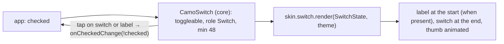
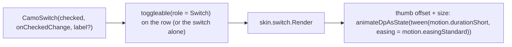
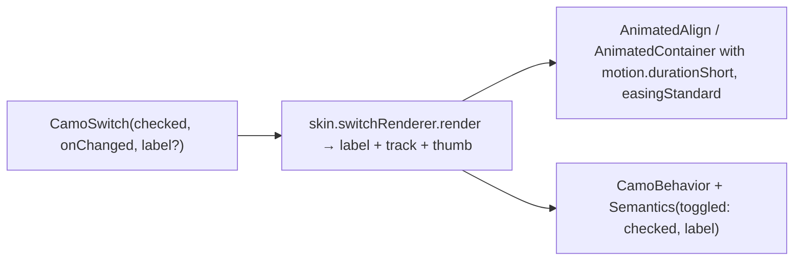

{/* Generated by docs/internal/scripts/sync_vault.py from the Camouflage design notes. Edit the notes and re-run the script; changes made here are overwritten. */}

# CamoSwitch

## Concept {#concept}

### 1. Why

A switch looks like a checkbox in code (a boolean in, a callback out) but means something different. A switch **applies immediately** (Wi-Fi on), while a checkbox **selects for later** (in a form that is submitted). It's also where skins differ most visibly in motion: Material's thumb grows, and an iOS switch slides a white knob. Like the checkbox, it takes an optional `label` value and then builds the whole settings row.

### 2. Shape



**Material mapping preview**

| State | Track | Thumb |
|---|---|---|
| off | `surfaceContainerHighest` fill + `outline` border | `outline`, small (16) |
| on | `primary` | `onPrimary`, large (24) |
| pressed | the same | grows to 28 |
| disabled | `onSurface` at the disabled alphas | the same, dimmed |

With a label, it's a settings row: the label (`bodyLarge`, `onSurface`) at the start and the switch at the end. See [Material Skin](/guide/skins/material-skin).

### 3. API

#### Contract

```kotlin
fun CamoSwitch(
    checked: Boolean,
    onCheckedChange: ((Boolean) -> Unit)?,   // null → display-only
    label: String? = null,                   // non-null → the whole row is the target
    labelSpans: List<CamoSpan>? = null,      // rich label (links, bold); use instead of label
    description: String? = null,             // a second line under the label ("Uses more battery")
    error: String? = null,                   // shown below the row (used by CamoSwitchFormField)
    enabled: Boolean = true,
)
```

**State → renderer:** `SwitchState(checked, label: String or List<CamoSpan>?, description?, error?, enabled, interaction)`. **Slots:** none.

#### Tokens used

- `colors.primary`, `onPrimary`, `surfaceContainerHighest`, `outline`, `onSurface` (label and disabled)
- `shapes.full` for the track and thumb
- track 52 × 32, inside a 48-high target
- `typography.bodyLarge` (label), `spacing.l` between the label and the switch
- `motion.durationShort`, `easingStandard`

#### Component theme

`theme.components.switch: SwitchTheme?`. Every field is nullable in the theme. The skin's `defaults(theme)` fills whatever isn't set (Material defaults shown). See [Theme](/guide/foundations/theme) §3.10.

| Field | Type | Material default | What it's for |
|---|---|---|---|
| `showThumbIcons` | Boolean | false | an icon inside the thumb (a check when on, optionally a cross when off). Any skin can draw it (ADR-28); the Material skin defaults it to true. |
| `thumbIcons` | ThumbIcons(checked: IconSource, unchecked: IconSource?) | the skin's check / none | the brand's own icons for the thumb |
| `trackWidth / trackHeight` | Dp | 52 / 32 | track size |
| `thumbSizeOff / thumbSizeOn / thumbSizePressed` | Dp | 16 / 24 / 28 | thumb sizes per state |
| `labelStyle` | CamoTextStyle | `typography.bodyLarge` | the label |
| `labelPosition` | LabelPosition (`Start` \| `End`) | `Start` (the label before the switch) | which side the label sits on (ADR-28) |
| `labelGap` | Dp | `spacing.l` (16) | space between label and switch |
| `descriptionStyle` | CamoTextStyle | `typography.bodyMedium` in `onSurfaceVariant` | the description line |
| `colors` | SwitchColors(trackOn, trackOff, thumbOn, thumbOff, trackOffBorder, label) | `primary`, `surfaceContainerHighest`, `onPrimary`, `outline`, `outline`, `onSurface` | every color the switch uses |

#### Accessibility

- Role switch, with on/off announced ("Wi-Fi, switch, on"), not "checked".
- With a label: one element, and the whole row is the target.
- Display-only: no semantics of its own.
- Space toggles it.
- The state must be distinguishable **without color** (WCAG 1.4.1): the thumb position and size do this.

### 4. Build steps

1. Core: toggleable wiring (the whole row when labelled), switch role, name = `label`, the 48 target, interaction tracking (including thumb drag → `interaction.dragged`), `skin.switch.render`.
2. `DebugSkin` renderer: the label, then a rectangle with a square on the left or right, with no animation.
3. Sample: a settings list with three labelled switches, one of them disabled.
4. Tests:
   - tapping the label toggles it;
   - dragging the thumb past the middle toggles it; a short drag springs back (RTL: the directions mirror);
   - it's announced as a switch with on/off;
   - display-only has no own semantics;
   - under reduced motion the thumb moves instantly.

**Done when**
- [ ] Settings rows toggle and announce as switches.
- [ ] Under reduced motion the thumb jumps instead of sliding.

### 5. Edge cases

| Case | Decided behavior |
|---|---|
| Dragging the thumb | Supported in v1 (settled 2026-09-27). The component tracks the drag and sets `interaction.dragged`; the renderer draws the thumb following the finger. Releasing past the middle toggles (calls `onCheckedChange`), otherwise it springs back. A tap still toggles. |
| RTL | "On" is the end side. The thumb goes left when on in RTL, and the label moves to the right. |
| Change needs confirmation | The app shows a dialog from `onCheckedChange` and updates `checked` only on confirm. |
| Async toggles (a network call) | The app keeps `checked` unchanged and sets `enabled = false` while pending. |
| Long label at 200% font scale | The label wraps. The switch stays vertically centered at the end. |
| A description under the label ("Uses more battery") | `description` (settled 2026-09-27). It's announced as the element's description. The switch stays vertically centered on the label + description block. |

## Implementation {#implementation}

<KotlinOnly>

### 1. Why {#kotlin-1-why}

It's the same wiring as the checkbox, but with **`Role.Switch`** (so it's announced as on/off) and a thumb animation driven by the theme's motion tokens. A labelled switch is a settings row: the label at the start, the switch at the end.

### 2. Shape {#kotlin-2-shape}



### 3. API {#kotlin-3-api}

```kotlin
@Composable
public fun CamoSwitch(
    checked: Boolean,
    onCheckedChange: ((Boolean) -> Unit)?,
    modifier: Modifier = Modifier,
    label: String? = null,
    labelSpans: List<CamoSpan>? = null,
    description: String? = null,
    error: String? = null,
    enabled: Boolean = true,
    interactionSource: MutableInteractionSource? = null,
)
```

- `SwitchTheme` / `SwitchStyle` follow the base table (track size, three thumb sizes, label style, gap, `SwitchColors`).
- Thumb position: `if (checked) trackWidth - thumbSize - inset else inset`, measured from the **start**, so RTL flips it through `Modifier.offset` in a layout that respects `LocalLayoutDirection` (use `absoluteOffset` never).

**Label side and description:** the row reads `style.labelPosition` (`Start` default | `End`) and orders the label column and the switch accordingly; `description` renders under the label with `style.descriptionStyle` and is merged into the row's single node, which reads "Wi-Fi, switch, on, Uses more battery".

### 4. Build steps {#kotlin-4-build-steps}

1. Types, the component, and the DebugSkin renderer (no animation).
2. `commonTest`:
   - `Role.Switch` is present, and `assertIsOn()` after a tap;
   - under reduced motion (a `CamouflageProvider` in a test that forces `motion.reduced()`), the thumb reaches its end position in the first frame;
   - in RTL, an "on" thumb is on the left.

**Done when**
- [ ] A settings list of switches works and is announced as switches on Android and iOS.

### 5. Edge cases {#kotlin-5-edge-cases}

| Case | Decided behavior |
|---|---|
| **Drag the thumb** (ADR-25) | `Modifier.draggable(orientation = Horizontal, interactionSource = source)` on the thumb: the offset follows the finger (clamped to the track), `DragInteraction` sets `interaction.dragged`, and on stop the switch toggles if the thumb passed the middle, otherwise it animates back. Tap still toggles. |
| Thumb icons | `style.showThumbIcons` draws `style.thumbIcons.checked` (and `unchecked`, if set) inside the thumb with `CamoIcon`. |
| `animateDpAsState` with duration 0 | Snaps immediately, which is correct for reduced motion. |
| Rapid toggles | Each tap animates from the current position (Compose animations are interruptible). |

</KotlinOnly>

<DartOnly>

### 1. Why {#dart-1-why}

It's the same wiring as the checkbox, but with **`Semantics(toggled: …)`**, which screen readers announce as a switch (on/off), and an animated thumb. A labelled switch is a settings row.

### 2. Shape {#dart-2-shape}



### 3. API {#dart-3-api}

```dart
class CamoSwitch extends StatefulWidget {
  const CamoSwitch({super.key, required this.checked, required this.onChanged,
      this.label, this.labelSpans, this.description, this.error, this.enabled = true, this.focusNode});
}
```

- `CamoSwitchTheme` / `CamoSwitchStyle` follow the base table.
- The thumb uses `AlignmentDirectional.centerEnd` / `centerStart`, so RTL mirrors automatically.

**Label side and description:** `style.labelPosition` (`start` default | `end`) orders the label column and the switch; `description` renders under the label with `style.descriptionStyle` and is merged into the row's semantics.

### 4. Build steps {#dart-4-build-steps}

1. Types, the component, and the DebugSkin renderer (no animation).
2. Widget tests:
   - semantics `isToggled`;
   - a tap toggles it through the callback;
   - with `MediaQuery(disableAnimations: true)` the thumb is at its end position after a single `pump()`;
   - in RTL, "on" is on the left.

**Done when**
- [ ] A settings list of switches is announced as switches on Android and iOS.

### 5. Edge cases {#dart-5-edge-cases}

| Case | Decided behavior |
|---|---|
| `AlignmentDirectional` vs `Alignment` | Always directional, so RTL is correct by construction. |
| **Drag the thumb** (ADR-25) | A horizontal drag on the thumb moves it (clamped), sets `controller.dragged`, and on release toggles past the middle or springs back. Tap still toggles. |
| Thumb icons | `style.showThumbIcons` draws `style.thumbIcons` in the thumb. |

</DartOnly>
