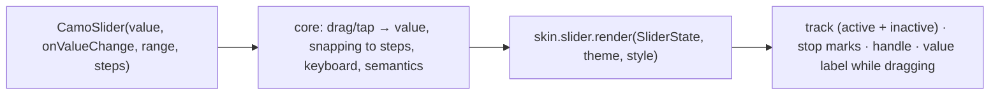
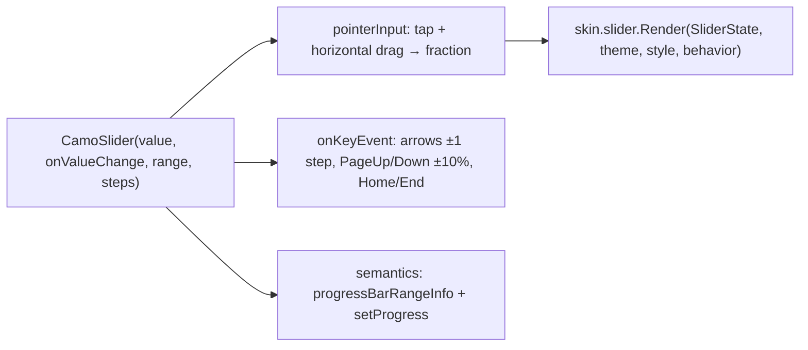
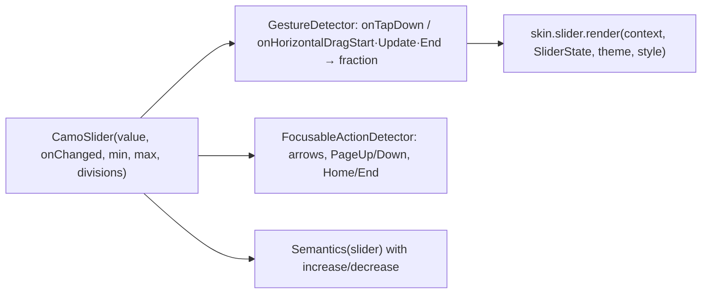

{/* Generated by docs/internal/scripts/sync_vault.py from the Camouflage design notes. Edit the notes and re-run the script; changes made here are overwritten. */}

# CamoSlider

## Concept {#concept}

### 1. Why

A slider picks a value from a continuous or stepped range: volume, brightness, a price filter. It's controlled like every input (value in, change out), and reports when the user **finishes** dragging, so apps can save once instead of on every frame.

### 2. Shape



**Material mapping preview:** the M3 slider (2024 update).
- A 16 dp tall track with rounded ends.
- The active part is `primary`, and the inactive part `secondaryContainer`.
- The handle is a vertical 4 × 44 bar in `primary` that narrows while pressed.
- A value label appears above the handle while dragging.

### 3. API

#### Contract

```kotlin
fun CamoSlider(
    value: Float,
    onValueChange: (Float) -> Unit,
    range: ClosedRange<Float> = 0f..1f,
    steps: Int = 0,                          // 0 = continuous; n = n stops between the ends
    onValueChangeFinished: (() -> Unit)? = null,
    valueLabel: ((Float) -> String)? = null, // text for the drag label and for screen readers
    label: String? = null,                   // accessible name ("Volume")
    enabled: Boolean = true,
)
```

**State → renderer:** `SliderState(fraction: Float, steps, enabled, valueText: String?, interaction)` (dragging is `interaction.dragged`). **Slots:** none.

#### Tokens used

- `colors.primary`, `secondaryContainer`, `onPrimary` (stop marks), `inverseSurface`/`inverseOnSurface` (value label)
- `shapes.full`, `typography.labelLarge` (value label)
- `motion.durationShort` (handle width change)

#### Component theme

`theme.components.slider: SliderTheme?`. Every field is nullable in the theme. The skin's `defaults(theme)` fills whatever isn't set (Material defaults shown). See [Theme](/guide/foundations/theme) §3.10.

| Field | Type | Material default | What it's for |
|---|---|---|---|
| `trackHeight` | Dp | 16 | track thickness |
| `handleSize` | Size | 4 × 44 | handle bar |
| `showStopMarks` | Boolean | true | dots at each step |
| `showValueLabel` | Boolean | true | label above the handle while dragging |
| `colors` | SliderColors(activeTrack, inactiveTrack, handle, stopMark, valueLabel, valueLabelText) | `primary`, `secondaryContainer`, `primary`, `onPrimary`/`onSecondaryContainer`, `inverseSurface`, `inverseOnSurface` | every color it uses |

#### Accessibility

- An adjustable element with name = `label` and value = `valueLabel(value)` (or a percentage).
- Screen-reader swipe up/down (Android), and the adjust gesture (iOS), move one step, or 5% when continuous.
- Keyboard: arrows move one step; Page Up/Down move 10%; Home/End jump to the ends.
- The touch target is the full track height, at least 48, and a tap anywhere on the track jumps to that value.

### 4. Build steps

1. Core:
   1. value ↔ fraction, with snapping to steps;
   2. drag and tap gestures;
   3. keyboard;
   4. semantics (range info, set progress action);
   5. `onValueChangeFinished` on release and after keyboard changes.
2. `SliderRenderer`, and the DebugSkin renderer.
3. Tests:
   - dragging changes the value and snaps to steps;
   - `onValueChangeFinished` fires once per drag;
   - the arrow keys and Home/End;
   - the accessibility value text;
   - RTL: dragging right lowers the value.

**Done when**
- [ ] A volume slider (continuous) and a rating slider (steps = 3) work by touch, mouse, keyboard and screen reader.

### 5. Edge cases

| Case | Decided behavior |
|---|---|
| `value` outside `range` | Clamped for drawing. The app's value isn't changed. |
| RTL | The minimum is on the right. |
| Range slider (two handles) | Not in v1. It's a later `CamoRangeSlider` with the same tokens. |
| Vertical slider | Not in v1. |
| Reduced motion | No handle-width animation. The value label appears instantly. |

## Implementation {#implementation}

<KotlinOnly>

### 1. Why {#kotlin-1-why}

Compose's `Slider` lives in Material, which v1 doesn't depend on. So core builds the slider from foundation pieces: a drag gesture, keyboard steps, progress semantics with a `setProgress` action, and `interaction.dragged` (ADR-25) reported to the renderer.

### 2. Shape {#kotlin-2-shape}



### 3. API {#kotlin-3-api}

```kotlin
@Composable
public fun CamoSlider(
    value: Float,
    onValueChange: (Float) -> Unit,
    modifier: Modifier = Modifier,
    range: ClosedFloatingPointRange<Float> = 0f..1f,
    steps: Int = 0,
    onValueChangeFinished: (() -> Unit)? = null,
    valueLabel: ((Float) -> String)? = null,
    label: String? = null,
    enabled: Boolean = true,
    interactionSource: MutableInteractionSource? = null,
)
```

**Gesture:** `Modifier.pointerInput(range, steps)` with `awaitEachGesture`: a down event jumps the thumb to the touch point, then `horizontalDrag` updates it; a `DragInteraction.Start/Stop` is emitted on the `interactionSource`, so `collectIsDraggedAsState()` feeds `InteractionState.dragged`. On release, `onValueChangeFinished` fires once. The position → value math mirrors in RTL (`LocalLayoutDirection`), and stepped sliders snap with `((f * (steps + 1)).roundToInt() / (steps + 1f))`.

**Keyboard:** `focusable()` + `onKeyEvent`: arrows move one step (or 1% when continuous), PageUp/PageDown 10%, Home/End to the ends; each key press also calls `onValueChangeFinished`.

**Semantics:**
```kotlin
Modifier.semantics {
    contentDescription = label ?: ""
    progressBarRangeInfo = ProgressBarRangeInfo(value, range, steps)
    stateDescription = valueLabel?.invoke(value) ?: ""
    setProgress { target -> onValueChange(target.coerceIn(range)); onValueChangeFinished?.invoke(); true }
}
```
TalkBack's volume keys and VoiceOver's swipe up/down go through `setProgress`.

### 4. Build steps {#kotlin-4-build-steps}

1. `SliderTheme` / `SliderStyle`, `CamoSlider` with the gesture, keys and semantics; the DebugSkin renderer (a line and a square thumb).
2. `commonTest`: drag and tap set values and snap to steps; `onValueChangeFinished` fires once per gesture and per key; RTL inverts; `setProgress` works; `interaction.dragged` is true only while dragging.

**Done when**
- [ ] A volume slider and a stepped price filter work by touch, mouse, keyboard and screen reader, and the value label shows only while dragging (Minimal).

### 5. Edge cases {#kotlin-5-edge-cases}

| Case | Decided behavior |
|---|---|
| Inside a horizontally scrolling container | The slider claims horizontal drags once they pass touch slop; the pager keeps vertical and fling gestures. |
| `value` outside `range` | Drawn clamped; `onValueChange` isn't called for the clamp. |
| Range slider (two thumbs) | Not in v1. |

</KotlinOnly>

<DartOnly>

### 1. Why {#dart-1-why}

Material's `Slider` isn't available in core, so the slider is built on `GestureDetector` (horizontal drag + tap), `FocusableActionDetector` for keys, and `Semantics(slider: true, value, increasedValue, decreasedValue, onIncrease, onDecrease)`, reporting `dragged` through the interaction controller (ADR-25).

### 2. Shape {#dart-2-shape}



### 3. API {#dart-3-api}

```dart
class CamoSlider extends StatefulWidget {
  const CamoSlider({super.key, required this.value, required this.onChanged,   // ValueChanged<double>?; null = disabled
      this.min = 0, this.max = 1, this.divisions, this.onChangeEnd, this.valueLabel, this.semanticLabel, this.focusNode});
}
```

- **Gesture:** the fraction comes from `details.localPosition.dx / width`, inverted when `Directionality.of(context) == TextDirection.rtl`; `divisions` snap it. Drag start/end set `controller.dragged`; `onChangeEnd` fires once on release (and once per key press).
- **Keys:** arrows move one division (or 1%), PageUp/PageDown 10%, Home/End the ends.
- **Semantics:** `Semantics(slider: true, label: semanticLabel, value: valueLabel?.call(value) ?? '${(fraction * 100).round()}%', increasedValue: …, decreasedValue: …, onIncrease: …, onDecrease: …)` for TalkBack volume keys and VoiceOver swipes.
- Naming follows Flutter: `min`/`max`/`divisions`/`onChangeEnd` for the base's `range`/`steps`/`onValueChangeFinished`.

### 4. Build steps {#dart-4-build-steps}

1. `CamoSliderTheme` / `Style`, the widget, the DebugSkin renderer.
2. Widget tests: tap and drag set values and snap; `onChangeEnd` once per gesture; RTL; semantics increase/decrease; `dragged` only while dragging.

**Done when**
- [ ] Volume and a stepped price filter work by touch, mouse, keyboard and screen reader; the value label shows only while dragging (Minimal).

### 5. Edge cases {#dart-5-edge-cases}

| Case | Decided behavior |
|---|---|
| In a horizontally scrolling parent | The drag recognizer competes in the gesture arena and wins after slop. |
| Range slider | Not in v1. |

</DartOnly>
