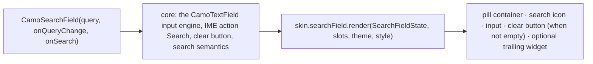
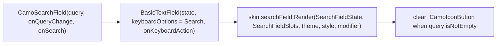
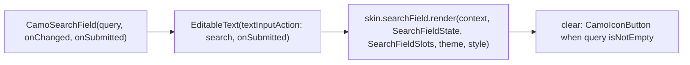

{/* Generated by docs/internal/scripts/sync_vault.py from the Camouflage design notes. Edit the notes and re-run the script; changes made here are overwritten. */}

# CamoSearchField

## Concept {#concept}

### 1. Why

Search is a text field with its own conventions:
- a search icon at the start;
- a clear button that appears when there's text;
- the keyboard's "Search" action;
- often a pill shape in a top bar.

Every app rebuilds this from a text field. `CamoSearchField` packages it, reusing `CamoTextField`'s editable core. Suggestions and results stay the app's content, shown below the field or in a `CamoMenu`.

### 2. Shape



**Material mapping preview:** the M3 search bar.
- 56 tall, `surfaceContainerHigh`, `shapes.full`.
- The leading search icon and the placeholder are `onSurfaceVariant`.
- The trailing slot holds an avatar or an action icon.

### 3. API

#### Contract

```kotlin
fun CamoSearchField(
    query: String,
    onQueryChange: (String) -> Unit,
    onSearch: (String) -> Unit,             // the keyboard's Search action / Enter
    placeholder: String = "Search",
    leading: Widget? = null,                // null → the skin's search icon; pass e.g. a back CamoIconButton when active
    trailing: Widget? = null,               // e.g. a mic or avatar; the clear button is automatic
    enabled: Boolean = true,
    onFocusChanged: ((Boolean) -> Unit)? = null,
)
```

- The **clear button** appears when `query` isn't empty. It calls `onQueryChange("")` and keeps focus.
- **Debouncing is app-side.** Your convention of 500 ms and cancelling in-flight requests belongs to the notifier/ViewModel, not the field.

**State → renderer:** `SearchFieldState(query, placeholder, enabled, focused, isEmpty)`. **Slots:** `SearchFieldSlots(leading?, trailing?, clear?, input)`. The `input` is core's editable node, as in [CamoTextField](/components/inputs/camo-text-field).

#### Tokens used

- `colors.surfaceContainerHigh`, `onSurface`, `onSurfaceVariant`
- `shapes.full`, `typography.bodyLarge`
- icon size 24

#### Component theme

`theme.components.searchField: SearchFieldTheme?`. Every field is nullable in the theme. The skin's `defaults(theme)` fills whatever isn't set (Material defaults shown). See [Theme](/guide/foundations/theme) §3.10.

| Field | Type | Material default | What it's for |
|---|---|---|---|
| `height` | Dp | 56 | field height |
| `shape` | Shape | `shapes.full` | container corners |
| `textStyle` / `placeholderStyle` | CamoTextStyle | `bodyLarge` | input and placeholder |
| `iconSize` | Dp | 24 | leading, trailing and clear icons |
| `colors` | SearchFieldColors(container, text, placeholder, icon) | `surfaceContainerHigh`, `onSurface`, `onSurfaceVariant`, `onSurfaceVariant` | every color it uses |

#### Accessibility

- A text field with a search role/hint and name = `placeholder`. The IME action is "Search".
- The clear button is a `CamoIconButton` labelled "Clear search".
- Results that update while typing should be announced by the app ("12 results") through a polite live region. The docs show the pattern.

### 4. Build steps

1. `CamoSearchField` on top of the text-field input engine (IME action, clear logic, semantics).
2. `SearchFieldRenderer`, and the DebugSkin renderer.
3. Sample: a country search with app-side 500 ms debounce, results in a list below, and a clear button.
4. Tests:
   - typing calls `onQueryChange`;
   - the IME Search action calls `onSearch`;
   - clear resets and keeps focus;
   - the placeholder is the accessible name.

**Done when**
- [ ] The search sample works with software and hardware keyboards on every platform.

### 5. Edge cases

| Case | Decided behavior |
|---|---|
| Expanded full-screen search (M3 "search view") | Not in v1. Compose: navigate to a search route (Navigation 3). Flutter: push a page. The field is reused inside it. |
| Suggestions dropdown | App content, either below the field or in a `CamoMenu` anchored to it. |
| Voice search | The app passes a mic `CamoIconButton` as `trailing`. |

## Implementation {#implementation}

<KotlinOnly>

### 1. Why {#kotlin-1-why}

A search field is a text field with a search keyboard action, an automatic clear button and a search role. Kotlin reuses core's editable node from [CamoTextField](/components/inputs/camo-text-field#implementation) (`BasicTextField` with Compose's `TextFieldState`), and adds the IME action and the clear button.

### 2. Shape {#kotlin-2-shape}



### 3. API {#kotlin-3-api}

```kotlin
@Composable
public fun CamoSearchField(
    query: String,
    onQueryChange: (String) -> Unit,
    onSearch: (String) -> Unit,
    modifier: Modifier = Modifier,
    placeholder: String = "Search",
    leading: (@Composable () -> Unit)? = null,     // null → the skin's search icon
    trailing: (@Composable () -> Unit)? = null,
    enabled: Boolean = true,
    onFocusChanged: ((Boolean) -> Unit)? = null,
    interactionSource: MutableInteractionSource? = null,
)
```

- **Controlled text:** the same two-way sync as `CamoTextField`: an internal `TextFieldState` mirrors `query`; edits call `onQueryChange`; external changes to `query` replace the text and keep the cursor at the end.
- **IME:** `KeyboardOptions(imeAction = ImeAction.Search, keyboardType = KeyboardType.Text, autoCorrectEnabled = false)` and `onKeyboardAction { onSearch(query) }`. On desktop and web, Enter does the same (`onKeyEvent`).
- **Clear:** core builds a `CamoIconButton(contentDescription = "Clear search")` shown when `query.isNotEmpty()`; it calls `onQueryChange("")` and keeps focus in the field.
- **Semantics:** `semantics { contentDescription = placeholder }` when there's no visible label; Compose exposes the field as an editable text; the clear button is a separate focusable node after the input.
- **Debounce** is not in the field: apps (or `CamoAsyncSelect`) debounce `onQueryChange` themselves.

### 4. Build steps {#kotlin-4-build-steps}

1. `SearchFieldTheme` / `Style`, `CamoSearchField`, the DebugSkin renderer.
2. `commonTest`: the search action fires `onSearch`; the clear button appears only with text, clears and keeps focus; external `query` changes update the field; Esc (desktop) clears when non-empty.

**Done when**
- [ ] A search screen with a back button as `leading` searches on the keyboard action on Android and iOS, and on Enter on desktop and web.

### 5. Edge cases {#kotlin-5-edge-cases}

| Case | Decided behavior |
|---|---|
| Esc on desktop | Clears the query when non-empty; otherwise it's passed on (so a dialog or a search overlay can close). |
| IME composition (Chinese, Japanese) | `onQueryChange` receives committed and composing text (Compose's behavior); `onSearch` isn't called during composition. |

</KotlinOnly>

<DartOnly>

### 1. Why {#dart-1-why}

A text field with the search keyboard action, an automatic clear button and search semantics. It reuses core's `EditableText` setup from [CamoTextField](/components/inputs/camo-text-field#implementation).

### 2. Shape {#dart-2-shape}



### 3. API {#dart-3-api}

```dart
class CamoSearchField extends StatefulWidget {
  const CamoSearchField({super.key, required this.query, required this.onChanged, required this.onSubmitted,
      this.placeholder = 'Search', this.leading, this.trailing, this.enabled = true, this.onFocusChanged, this.focusNode});
}
```

- **Controlled text:** an internal `TextEditingController` mirrors `query`; external changes replace the text with the cursor at the end.
- **IME:** `textInputAction: TextInputAction.search`, `autocorrect: false`, `onSubmitted` (Enter on desktop and web).
- **Clear:** `CamoIconButton(semanticLabel: 'Clear search')` shown when not empty; clears and keeps focus.
- **Esc:** a `CallbackShortcuts` entry clears when non-empty, otherwise lets the key bubble (so an overlay can close).
- **Semantics:** `Semantics(textField: true, label: placeholder)` when there's no visible label.

### 4. Build steps {#dart-4-build-steps}

1. Theme/style types, the widget, the DebugSkin renderer.
2. Widget tests: submit calls `onSubmitted`; clear appears only with text and keeps focus; external `query` updates; Esc behavior.

**Done when**
- [ ] A search screen submits by keyboard on mobile and Enter on desktop and web.

### 5. Edge cases {#dart-5-edge-cases}

| Case | Decided behavior |
|---|---|
| Debounce | Not in the field; apps (Riverpod notifiers, 500 ms) or `CamoAsyncSelect` debounce. |
| IME composing text | `onChanged` gets composing text as `EditableText` reports it; `onSubmitted` only on commit. |

</DartOnly>
