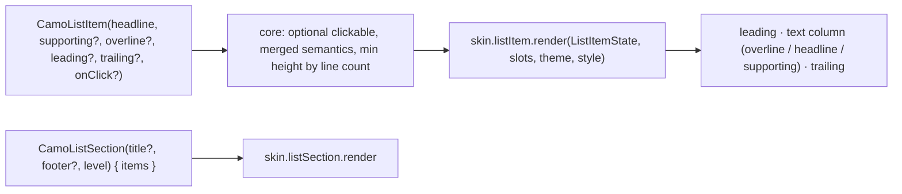
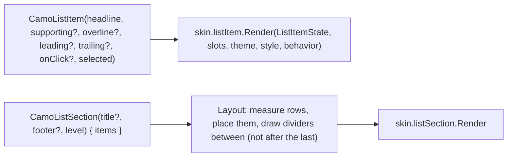
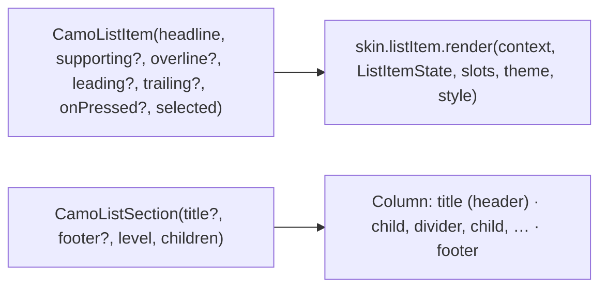

{/* Generated by docs/internal/scripts/sync_vault.py from the Camouflage design notes. Edit the notes and re-run the script; changes made here are overwritten. */}

# CamoListItem

## Concept {#concept}

### 1. Why

List rows are the backbone of settings screens, menus, pickers, contacts and search results. `CamoListItem` is one row with three text lines at most, a leading widget and a trailing widget. `CamoListSection` groups rows under a header, which is how Apple's grouped lists and Material's list headers look. Menus, selects and pickers reuse it, so it comes early in M6.

### 2. Shape



**Material mapping preview:** M3 lists.
- Heights: one line 56, two lines 72, three lines 88.
- Headline `bodyLarge`, `onSurface`. Supporting text `bodyMedium`, `onSurfaceVariant`. Overline `labelSmall`.
- Leading icons 24 in `onSurfaceVariant`, and leading avatars 40.

### 3. API

#### Contract

```kotlin
fun CamoListItem(
    headline: String,
    supporting: String? = null,
    overline: String? = null,
    leading: Widget? = null,          // icon, CamoAvatar, image, or a display-only CamoCheckbox/CamoRadio
    trailing: Widget? = null,         // icon, meta text, CamoSwitch/CamoCheckbox (display-only), chevron
    onClick: (() -> Unit)? = null,    // null → not interactive
    selected: Boolean = false,        // highlights the row (navigation lists, pickers)
    enabled: Boolean = true,
)

fun CamoListSection(
    title: String? = null,
    footer: String? = null,
    level: SurfaceLevel = Surface,    // the section's fill only; inset or edge-to-edge is the skin's choice
    content: Slot,                    // CamoListItems; dividers between rows come from ListItemTheme.dividers
)
```

**Rows with controls (a settings row with a switch):** make the **row** the control. Pass the switch display-only (`CamoSwitch(checked, onCheckedChange = null)`) as `trailing`, and `onClick = { toggle() }`. Core merges them, so the whole row toggles and is announced as a switch. (It's the same pattern as the labelled `CamoSwitch`, which is shorter when the row is just a label and a switch.)

**State → renderer:** `ListItemState(headline, supporting?, overline?, lines, clickable, selected, enabled, interaction)`. **Slots:** `ListItemSlots(leading?, trailing?)`.

#### Tokens used

- `colors.onSurface`, `onSurfaceVariant`, `secondaryContainer` (selected), and `surface*` levels for sections
- `typography.bodyLarge`, `bodyMedium`, `labelSmall`, `titleSmall` (section title)
- `spacing.l` horizontal padding, `spacing.l` between leading and text

#### Component theme

`theme.components.listItem: ListItemTheme?`. Every field is nullable in the theme. The skin's `defaults(theme)` fills whatever isn't set (Material defaults shown). See [Theme](/guide/foundations/theme) §3.10.

| Field | Type | Material default | What it's for |
|---|---|---|---|
| `minHeightOneLine / TwoLines / ThreeLines` | Dp | 56 / 72 / 88 | row heights |
| `contentPadding` | Padding | horizontal 16, vertical 8 | row padding |
| `leadingGap` / `trailingGap` | Dp | 16 / 16 | spacing around the text |
| `headlineStyle / supportingStyle / overlineStyle` | CamoTextStyle | `bodyLarge` / `bodyMedium` / `labelSmall` | texts |
| `iconSize` | Dp | 24 | the ambient icon style for leading and trailing icons |
| `sectionShape` | Shape | `shapes.none` (Material) | Apple dialect: `shapes.medium` for inset grouped sections |
| `dividers` | ListDividers (`None` \| `Full` \| `Inset`) | `None` (Material) | dividers `CamoListSection` draws between its rows (ADR-28: a brand-wide choice). `Inset` starts after the leading slot. Minimal and Cupertino: `Inset`. |
| `colors` | ListItemColors(headline, supporting, overline, icon, selectedContainer) | `onSurface`, `onSurfaceVariant`, `onSurfaceVariant`, `onSurfaceVariant`, `secondaryContainer` | every color it uses |

#### Accessibility

- A clickable row is one merged element (headline, supporting text, trailing state), with role button, or switch/checkbox when the trailing control is the row's toggle.
- A non-clickable row keeps its children's semantics.
- `selected` is announced ("selected").
- The section title is a heading.

### 4. Build steps

1. `CamoListItem` (line count → min height, clickable when `onClick != null`, merged semantics, a toggle role when the trailing is a display-only control).
2. `CamoListSection` (title as a heading, footer, level background, dividers between rows from `ListItemTheme.dividers`).
3. `ListItemRenderer`, `ListSectionRenderer`, and the DebugSkin renderers.
4. Sample: a settings screen (sections, switches, chevrons), a contacts list (avatars), a search results list.
5. Tests:
   - line counts produce the right heights;
   - a switch row toggles from anywhere and is announced as a switch;
   - a non-clickable row isn't focusable;
   - the section title is a heading.

**Done when**
- [ ] The settings sample reads like a native settings screen on Android and iOS (under the Minimal skin; the Cupertino skin later gives it iOS inset-grouped structure).

### 5. Edge cases

| Case | Decided behavior |
|---|---|
| Long headline at 200% font scale | The text wraps. Rows grow past their min height, and leading/trailing align to the first line. |
| A trailing control that is itself interactive (a real `CamoSwitch` with a callback) inside a clickable row | Discouraged (two targets). A debug warning suggests the display-only pattern. |
| Swipe actions (swipe to delete) | Not in v1. |
| Dividers in a section | Drawn by `CamoListSection` between rows, never after the last one. A hand-placed `CamoDivider` still works for one-off separators. Rows in a plain lazy list (no section) get no automatic dividers. |
| Very long lists | The app uses the platform's lazy lists (`LazyColumn`, `ListView.builder`). `CamoListItem` is a plain row, so it works in them. |

## Implementation {#implementation}

<KotlinOnly>

### 1. Why {#kotlin-1-why}

A row with three text lines, a leading and a trailing slot, optional click and selection. The Kotlin specifics are the conditional behavior modifier (like [CamoCard](/components/containers-and-lists/camo-card#implementation)), aligning leading and trailing to the first text line when the row grows, and `CamoListSection` drawing dividers between its rows (`ListItemTheme.dividers`) with a custom `Layout`.

### 2. Shape {#kotlin-2-shape}



### 3. API {#kotlin-3-api}

```kotlin
@Composable
public fun CamoListItem(
    headline: String,
    modifier: Modifier = Modifier,
    supporting: String? = null,
    overline: String? = null,
    leading: (@Composable () -> Unit)? = null,
    trailing: (@Composable () -> Unit)? = null,
    onClick: (() -> Unit)? = null,
    selected: Boolean = false,
    enabled: Boolean = true,
    interactionSource: MutableInteractionSource? = null,
)

@Composable
public fun CamoListSection(
    modifier: Modifier = Modifier,
    title: String? = null,
    footer: String? = null,
    level: SurfaceLevel = SurfaceLevel.Surface,
    content: @Composable () -> Unit,
)
```

- **Behavior:** with `onClick`, `clickable(role = Role.Button)` + `semantics(mergeDescendants = true)`; with `selected = true`, `semantics { selected = true }`; without `onClick`, no role and no focus stop.
- **Slot alignment:** the renderer lays out `leading | texts | trailing` in a `Row`; for one- and two-line rows the slots are centered vertically, for three lines they align to the top of the first text line (`Alignment.Top` + a padding equal to the overline height).
- **Display-only controls in `trailing`:** `CamoSwitch(checked, onCheckedChange = null)` has no semantics of its own, so the merged row announces "Wi-Fi, on". Core reads the trailing control's state through a `CamoToggleInfo` semantics key and appends it to the row's `stateDescription`.
- **Section dividers:** `CamoListSection` uses a `Layout` that measures its children, places them in a column, and draws a line between consecutive children in `drawWithContent`. `Inset` starts after the leading slot width (read from `style.dividerInsetStart`), `Full` spans the width, `None` draws nothing. The section `title` is a heading (`semantics { heading() }`).

### 4. Build steps {#kotlin-4-build-steps}

1. `ListItemTheme` / `Style` (including `dividers`, `sectionShape`), `CamoListItem`, `CamoListSection`, the DebugSkin renderers.
2. The settings sample: sections with switches (display-only trailing), a chevron row, a selected row in a picker.
3. `commonTest`: no role without `onClick`; the merged announcement includes the trailing switch state; dividers appear between rows and not after the last; `Inset` starts after the leading slot; RTL mirrors.

**Done when**
- [ ] The settings sample matches the Minimal skin table in light and dark, and TalkBack/VoiceOver read each row as one element.

### 5. Edge cases {#kotlin-5-edge-cases}

| Case | Decided behavior |
|---|---|
| A real interactive trailing control inside a clickable row | Two targets. A debug warning suggests `onCheckedChange = null` on the control. |
| Items inside a `LazyColumn` (no section) | Plain rows; dividers only via `CamoPagedList` or a hand-placed `CamoDivider`. |
| Very long headline at 200% | Wraps; the slots keep their alignment rule. |

</KotlinOnly>

<DartOnly>

### 1. Why {#dart-1-why}

A row with up to three text lines and leading/trailing widgets, optionally tappable or selected. Flutter specifics: `CamoBehavior` only when `onPressed != null`, merged semantics that include a display-only trailing control's state, and `CamoListSection` taking a `children` list (a platform difference from the base slot) so it can interleave `CamoDivider`s between rows.

### 2. Shape {#dart-2-shape}



### 3. API {#dart-3-api}

```dart
class CamoListItem extends StatefulWidget {
  const CamoListItem({super.key, required this.headline, this.supporting, this.overline, this.leading, this.trailing,
      this.onPressed, this.selected = false, this.enabled = true, this.focusNode});
}
class CamoListSection extends StatelessWidget {
  const CamoListSection({super.key, this.title, this.footer, this.level = SurfaceLevel.surface, required this.children});
}
```

- **Section takes a `children` list** (not a slot), which is the Flutter idiom and makes dividers trivial: core interleaves a `CamoDivider` between children according to `CamoListItemStyle.dividers` (`none | full | inset`; `inset` uses `EdgeInsetsDirectional.only(start: style.dividerInsetStart)`), never after the last.
- **Semantics:** tappable rows are `Semantics(button: true, selected: selected, container: true)` with merged children. A display-only trailing `CamoSwitch(onChanged: null)` contributes `toggled` to the merged node, so it reads "Wi-Fi, on".
- **Alignment:** slots are centered for 1–2 lines and top-aligned (with the overline offset) for 3 lines.
- The section title is `Semantics(header: true)`.

### 4. Build steps {#dart-4-build-steps}

1. Theme/style types (with `dividers`, `sectionShape`), both widgets, the DebugSkin renderers.
2. The settings example.
3. Widget tests: no button semantics without `onPressed`; merged announcement with the trailing switch; dividers between rows, not after the last; inset in RTL.

**Done when**
- [ ] The settings example matches the Minimal table in light and dark, one semantics node per row.

### 5. Edge cases {#dart-5-edge-cases}

| Case | Decided behavior |
|---|---|
| Rows in a `ListView.builder` | Plain rows; dividers via `ListView.separated` or `CamoPagedList`. |
| An interactive trailing control inside a tappable row | A debug assertion suggests `onChanged: null`. |

</DartOnly>
