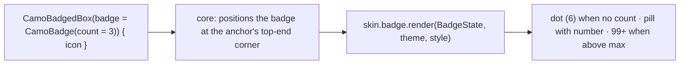
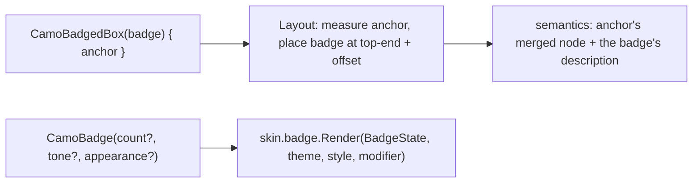
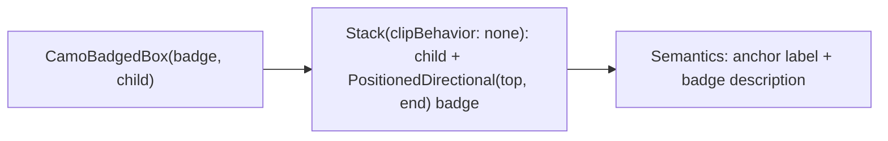

{/* Generated by docs/internal/scripts/sync_vault.py from the Camouflage design notes. Edit the notes and re-run the script; changes made here are overwritten. */}

# CamoBadge

## Concept {#concept}

### 1. Why

A badge marks something with a **count** ("3") or a **dot** (something new), usually on an icon (notifications, a cart) or on a navigation item. It's tiny, but every design system has it, and navigation bars and rails use it.

### 2. Shape



**Material mapping preview:** M3 badges. A small badge is a 6 dp dot. A large badge is 16 tall, `labelSmall`, `error` fill and `onError` text.

### 3. API

#### Contract

```kotlin
fun CamoBadge(
    count: Int? = null,                 // null → dot
    max: Int = 99,                      // above → "99+"
    tone: Tone? = null,                 // null → BadgeTheme.defaultTone (skin default: Error, the attention family)
    appearance: Appearance? = null,   // null → BadgeTheme.defaultAppearance (skin default: Solid); Solid | Soft | Outline
    contentDescription: String? = null, // e.g. "3 unread messages"; defaults to "{count} new" / "New"
)
fun CamoBadgedBox(badge: Widget, content: Slot)   // anchors a badge on an icon or avatar
```

**State → renderer:** `BadgeState(text?, isDot, tone, appearance)`. **Slots:** none.

#### Tokens used

- the tone family (default `error` / `onError`)
- `typography.labelSmall`, `shapes.full`

#### Component theme

`theme.components.badge: BadgeTheme?`. Every field is nullable in the theme. The skin's `defaults(theme)` fills whatever isn't set (Material defaults shown). See [Theme](/guide/foundations/theme) §3.10.

| Field | Type | Material default | What it's for |
|---|---|---|---|
| `defaultAppearance` | Appearance | `Solid` | the appearance used when a call passes none (ADR-28: a brand's default variant) |
| `dotSize` | Dp | 6 | dot badge |
| `height` / `minWidth` | Dp | 16 / 16 | count badge |
| `textStyle` | CamoTextStyle | `labelSmall` | count text |
| `offset` | Offset | (−4, 4) from the top-end | position on the anchor |
| `defaultTone` | Tone | `Error` | the tone when a call passes none (ADR-28: a brand whose badges are, say, Info sets it once) |

#### Accessibility

- The badge merges into its anchor's description: "Notifications, 3 unread", using `contentDescription`.
- It's never focusable on its own.
- Count changes are not announced automatically (that would be noisy). Apps announce important changes themselves.

### 4. Build steps

1. `CamoBadge`, `CamoBadgedBox` (top-end positioning, mirrored in RTL), and `BadgeRenderer`.
2. Tests: dot vs count; "99+"; the merged description on a `CamoIconButton`; the position mirrors in RTL.

**Done when**
- [ ] A notification icon button with a count badge, and a navigation item with a dot, render and announce correctly.

### 5. Edge cases

| Case | Decided behavior |
|---|---|
| `count = 0` | The badge isn't shown. Apps normally hide it; core also renders nothing for 0. |
| Negative counts | Treated as 0. |
| Font scale 200% | The count text grows, and the pill widens. The dot doesn't scale. |

## Implementation {#implementation}

<KotlinOnly>

### 1. Why {#kotlin-1-why}

A badge is a small dot or count anchored to an icon or avatar. Kotlin needs a custom `Layout` for `CamoBadgedBox` (place the badge at the anchor's top-end corner with the theme offset, mirrored in RTL) and a way to add the badge's text to the anchor's announcement.

### 2. Shape {#kotlin-2-shape}



### 3. API {#kotlin-3-api}

```kotlin
@Composable
public fun CamoBadge(
    modifier: Modifier = Modifier,
    count: Int? = null,
    max: Int = 99,
    tone: Tone? = null,               // null → BadgeTheme.defaultTone
    appearance: Appearance? = null,
    contentDescription: String? = null,
)

@Composable
public fun CamoBadgedBox(badge: @Composable () -> Unit, modifier: Modifier = Modifier, content: @Composable () -> Unit)
```

- **Text:** `count > max` → `"$max+"`; `count == 0` renders nothing (a zero count isn't a badge).
- **Layout:** `Layout(content = { content(); badge() })` measures the anchor, then places the badge so its center sits at the anchor's top-end corner plus `style.offset`; `placeRelative` mirrors it in RTL. The badge doesn't change the anchor's size.
- **Semantics:** `CamoBadge` itself is `clearAndSetSemantics {}`; it publishes its description (`contentDescription ?: "$count new"` / `"New"`) to `CamoBadgedBox`, which adds it to the anchor with `semantics { stateDescription = … }`. On a nav item the result reads "Inbox, tab, 3 unread".

### 4. Build steps {#kotlin-4-build-steps}

1. `BadgeTheme` / `Style` (with `defaultTone`), `CamoBadge`, `CamoBadgedBox`, the DebugSkin renderer.
2. `commonTest`: dot vs count vs `99+`; zero hides; the position in LTR and RTL; the anchor's announcement includes the badge.

**Done when**
- [ ] Badges on an icon button, an avatar and a navigation item announce correctly and sit at the right corner in both directions.

### 5. Edge cases {#kotlin-5-edge-cases}

| Case | Decided behavior |
|---|---|
| Badge larger than the anchor | Allowed; it overflows (not clipped). Parents that clip need padding. |
| Count changes | Animated with `AnimatedContent` (reduced motion: instant). |

</KotlinOnly>

<DartOnly>

### 1. Why {#dart-1-why}

A dot or count anchored to an icon or avatar. In Flutter, `CamoBadgedBox` is a `Stack` with `clipBehavior: Clip.none` and a `PositionedDirectional` badge, and the badge's text joins the anchor's semantics.

### 2. Shape {#dart-2-shape}



### 3. API {#dart-3-api}

```dart
class CamoBadge extends StatelessWidget {
  const CamoBadge({super.key, this.count, this.max = 99, this.tone, this.appearance, this.semanticLabel});
}
class CamoBadgedBox extends StatelessWidget {
  const CamoBadgedBox({super.key, required this.badge, required this.child});
}
```

- `count > max` → `'$max+'`; `count == 0` → nothing.
- **Position:** `PositionedDirectional(top: style.offset.dy, end: style.offset.dx)` translated so the badge's center sits on the corner; RTL mirrors via `Directional`.
- **Semantics:** the badge itself is `ExcludeSemantics`; `CamoBadgedBox` wraps the child in `Semantics(hint: badgeDescription)` merged into the anchor, so a nav item reads "Inbox, tab, 3 unread".
- `tone: null` → `CamoBadgeStyle.defaultTone`.

### 4. Build steps {#dart-4-build-steps}

1. Types, both widgets, the DebugSkin renderer.
2. Widget tests: dot, count, `99+`, zero hidden; position in LTR and RTL; the anchor's semantics include the badge.

**Done when**
- [ ] Badges on an icon button, an avatar and a nav item announce and position correctly.

### 5. Edge cases {#dart-5-edge-cases}

| Case | Decided behavior |
|---|---|
| Count changes | `AnimatedSwitcher` with a scale transition; instant under reduced motion. |

</DartOnly>
