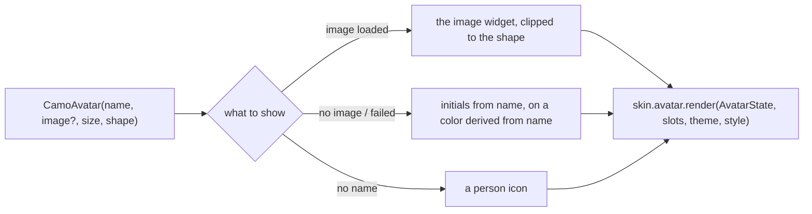
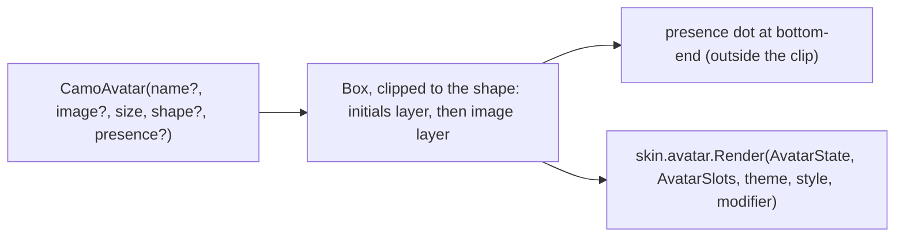
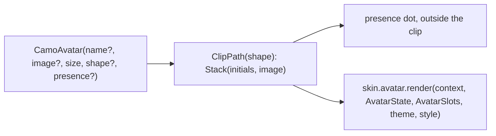

{/* Generated by docs/internal/scripts/sync_vault.py from the Camouflage design notes. Edit the notes and re-run the script; changes made here are overwritten. */}

# CamoAvatar

## Concept {#concept}

### 1. Why

Avatars represent a person or entity with a photo, initials or an icon, in lists, top bars, chips and comments. Fluent has Avatar and Persona. Material and Apple don't have a named component but use avatars everywhere. Getting the fallbacks right (a broken image shows initials, and initials get a stable color) is exactly the boilerplate apps repeat.

### 2. Shape



**Material mapping preview:** there's no M3 component. The Material skin draws:
- a circle;
- initials in `titleMedium`;
- a background picked from the brand/tone containers by a hash of the name;
- sizes S 24, M 40, L 56.

### 3. API

#### Contract

```kotlin
fun CamoAvatar(
    name: String? = null,                  // used for initials, color and the accessible name
    image: Widget? = null,                 // the app's image widget (Coil/Kamel AsyncImage, Flutter Image), loaded by the app
    size: AvatarSize = Medium,             // Small | Medium | Large (or a custom Dp via the theme)
    shape: AvatarShape? = null,            // null → AvatarTheme.shape; Circle | Rounded | Square
    presence: Presence? = null,            // Online | Away | Busy | Offline → a small status dot
)
fun CamoAvatarGroup(avatars: List<Widget>, max: Int = 3)   // overlapping stack with "+N"
```

**The image is a widget** (the same rule as icons, ADR-12): the app passes its own image-loading widget. Core doesn't depend on an image library. If the image fails or is null, the initials show.

**State → renderer:** `AvatarState(initials?, colorSeed, size, shape, presence?)`. **Slots:** `AvatarSlots(image?)`.

#### Tokens used

- brand/status container colors for the initials background, and their on-colors
- `typography.labelLarge` (S), `titleMedium` (M), `titleLarge` (L)
- `shapes.full` (Circle), `AvatarTheme.roundedShape` (Rounded, default `shapes.small`), `shapes.none` (Square)
- `success`/`warning`/`error`/`outline` for the presence dot

#### Component theme

`theme.components.avatar: AvatarTheme?`. Every field is nullable in the theme. The skin's `defaults(theme)` fills whatever isn't set (Material defaults shown). See [Theme](/guide/foundations/theme) §3.10.

| Field | Type | Material default | What it's for |
|---|---|---|---|
| `shape` | AvatarShape | `Circle` | the avatar shape for the whole brand (ADR-28; Carbon: `Square`) |
| `roundedShape` | Shape | `shapes.small` | corners of `Rounded` avatars |
| `sizeSmall / sizeMedium / sizeLarge` | Dp | 24 / 40 / 56 | sizes |
| `initialsPalette` | List of color pairs | the 5 container families (primary, secondary, tertiary, info, success) | backgrounds picked by a stable hash of `name` |
| `presenceSize` | Dp | 10 | status dot |
| `groupOverlap` | Dp | 8 | overlap in groups |

#### Accessibility

- The accessible name is `name` ("Dwiki Riyadi"), plus the presence ("online") when set. With no name, it's decorative.
- In lists, the avatar merges into the row (the row already says the name, so the avatar is decorative there, which the list item handles).

### 4. Build steps

1. Initials extraction (first letters of the first and last words; handles single words and emoji safely), a stable color hash, the presence dot.
2. `CamoAvatar`, `CamoAvatarGroup`, and the renderers.
3. Tests: "Dwiki Riyadi" → "DR"; the same name always gets the same color; a failed image shows the initials; "+2" for 5 avatars with max 3.

**Done when**
- [ ] A contacts list with photos, initials and presence renders identically on every platform.

### 5. Edge cases

| Case | Decided behavior |
|---|---|
| Names in non-Latin scripts (CJK, Arabic) | The first grapheme of the name. No two-letter split for scripts without word spaces. |
| Emoji or empty names | The icon fallback. |
| Image loading state | The initials show until the image widget reports success. The app's image widget decides the placeholder behavior. |

## Implementation {#implementation}

<KotlinOnly>

### 1. Why {#kotlin-1-why}

Avatars show an image, or initials when there's no image or it fails. Core doesn't depend on an image library (ADR-12), so the app passes its own image composable (Coil 3's `AsyncImage` is multiplatform). Kotlin's trick for the fallback: **draw the initials underneath and the image on top**, so a missing or failed image simply leaves the initials visible.

### 2. Shape {#kotlin-2-shape}



### 3. API {#kotlin-3-api}

```kotlin
@Composable
public fun CamoAvatar(
    modifier: Modifier = Modifier,
    name: String? = null,
    image: (@Composable () -> Unit)? = null,   // e.g. { AsyncImage(url, contentDescription = null, contentScale = ContentScale.Crop) }
    size: AvatarSize = AvatarSize.Medium,
    shape: AvatarShape? = null,                // null → AvatarTheme.shape
    presence: Presence? = null,
)

@Composable public fun CamoAvatarGroup(avatars: List<@Composable () -> Unit>, modifier: Modifier = Modifier, max: Int = 3)
```

- **Initials:** the first grapheme of the first and last words of `name` (`"Dwiki Riyadi"` → "DR"), uppercased with the locale. Graphemes, not chars, so emoji and combined characters stay whole (a small `BreakIterator`-free splitter in core, since `java.text` isn't in common code).
- **Color:** picked from `style.initialsPalette` by a stable FNV-1a hash of `name`, the same on every platform (not `String.hashCode()`, which isn't guaranteed identical across Kotlin targets).
- **Clipping:** `Modifier.clip(shape)` on the stack; the presence dot is placed outside the clip with a `surface`-colored ring.
- **Semantics:** the avatar is one node with `contentDescription = name` (plus presence, "Dwiki Riyadi, online"); the image composable's own description is cleared.
- **Group:** a `Row` with negative spacing `-style.groupOverlap`, each avatar with a ring, and a "+N" avatar for the rest.

### 4. Build steps {#kotlin-4-build-steps}

1. `AvatarTheme` / `Style` (with `shape`, `roundedShape`), `CamoAvatar`, `CamoAvatarGroup`, the DebugSkin renderer.
2. `commonTest`: initials for one word, two words, emoji names; the same color for the same name on JVM and native tests; a null image shows initials; presence in the description; the "+N" count.

**Done when**
- [ ] A contact list with photos, broken URLs and no photos looks right in every shape, and each row announces the person once.

### 5. Edge cases {#kotlin-5-edge-cases}

| Case | Decided behavior |
|---|---|
| Image loading slowly | Initials show until the image paints over them (no flicker to blank). |
| No `name` and no image | A generic person icon from the skin. |
| Transparent PNG | Initials show through; apps with transparent logos set a background in their image composable. |

</KotlinOnly>

<DartOnly>

### 1. Why {#dart-1-why}

An avatar with an app-supplied image widget (for example `Image.network` or `CachedNetworkImage`), falling back to initials. The Flutter trick is the same as Kotlin's: a `Stack` with the initials underneath and the image on top, so a failing image (with an `errorBuilder` returning `SizedBox.shrink()`) leaves the initials visible.

### 2. Shape {#dart-2-shape}



### 3. API {#dart-3-api}

```dart
class CamoAvatar extends StatelessWidget {
  const CamoAvatar({super.key, this.name, this.image, this.size = AvatarSize.medium, this.shape, this.presence});
  final Widget? image;     // e.g. Image.network(url, fit: BoxFit.cover, errorBuilder: (_, __, ___) => const SizedBox.shrink())
}
class CamoAvatarGroup extends StatelessWidget { const CamoAvatarGroup({super.key, required this.avatars, this.max = 3}); }
```

- **Initials:** first and last words' first **grapheme** via `characters` (`name.characters.first`), uppercased.
- **Color:** the same FNV-1a hash as Kotlin over the UTF-8 bytes of `name`, so a person gets the same color on both platforms.
- **Semantics:** `Semantics(image: true, label: '$name${presence != null ? ', ${presence.label}' : ''}')` with the image's own semantics excluded.
- **Group:** a `Stack` of `Positioned` avatars offset by `size - style.groupOverlap`, plus a "+N" avatar.
- `shape: null` → `CamoAvatarStyle.shape`.

### 4. Build steps {#dart-4-build-steps}

1. Types, both widgets, the DebugSkin renderer.
2. Widget tests: initials for one word, two words, emoji; a null or failing image shows initials; the same color as a Kotlin test vector; presence in the label.

**Done when**
- [ ] A contact list with photos, broken URLs and no photos renders correctly in every shape.

### 5. Edge cases {#dart-5-edge-cases}

| Case | Decided behavior |
|---|---|
| Image still loading | Initials show until the image paints. |
| No name, no image | The skin's generic person icon. |

</DartOnly>
