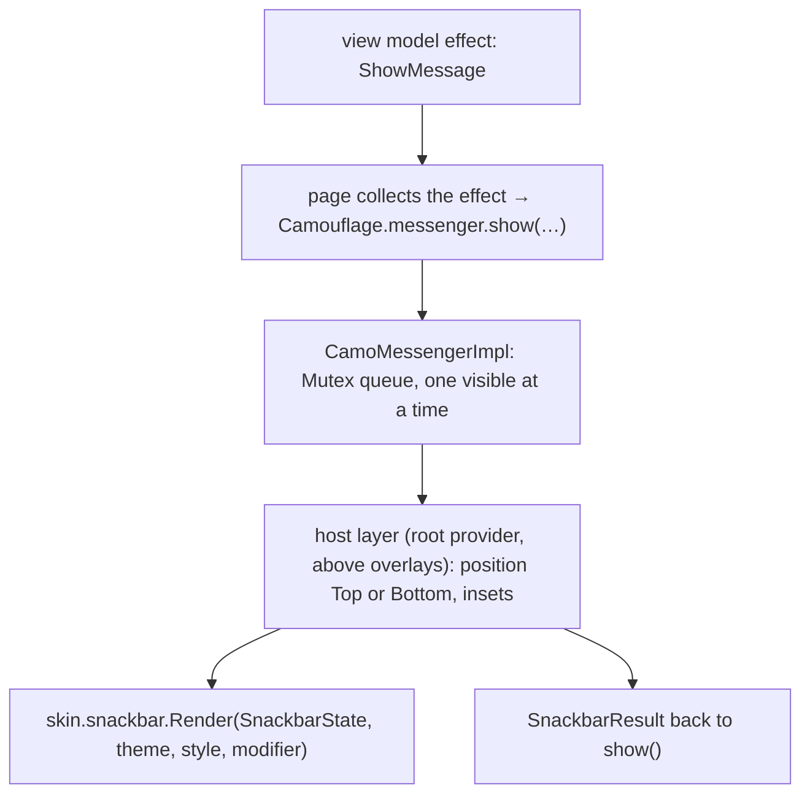
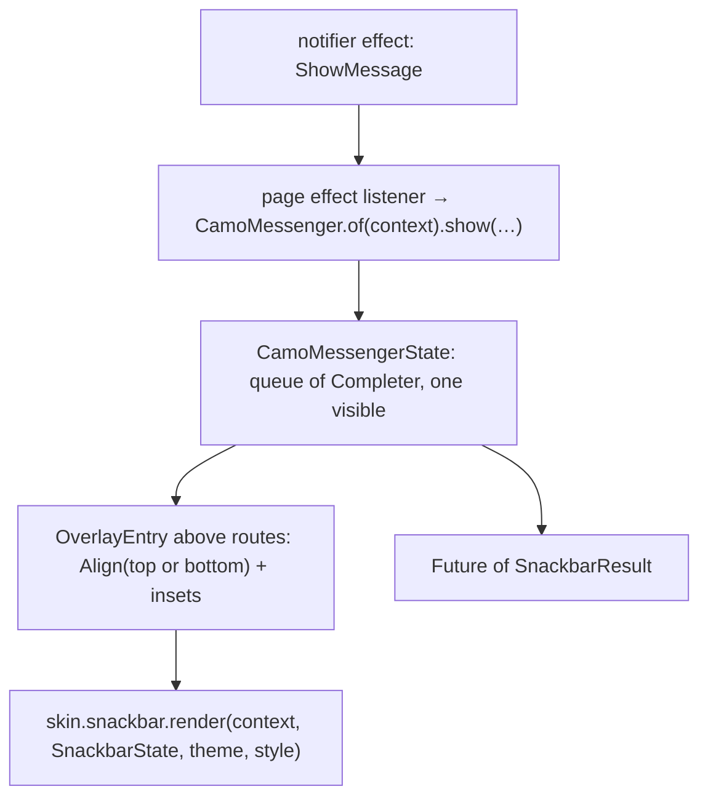

{/* Generated by docs/internal/scripts/sync_vault.py from the Camouflage design notes. Edit the notes and re-run the script; changes made here are overwritten. */}

# CamoSnackbar

## Concept {#concept}

### 1. Why

A snackbar (toast) is a brief message at the bottom of the screen, optionally with one action: "Message archived · Undo". It's **shown**, not placed, from anywhere in the app, and messages queue one after another. In Flutter that's `ScaffoldMessenger`, which lives in Material. In Compose it's `SnackbarHostState`, which also lives in Material. Camouflage needs its own small **messenger**, installed once by the root provider, so snackbars work with any skin.

### 2. Shape

```mermaid
flowchart TB
    Root["root CamouflageProvider installs CamoMessenger (a layer above the app content)"] --> Q["queue: one snackbar at a time"]
    Any["any screen: messenger.show(\"Message archived\", action = \"Undo\")"] --> Q
    Q --> R["skin.snackbar.render(SnackbarState, slots, theme, style)"]
    Q -- "action tapped / timeout / swipe" --> Res["result: ActionPerformed | Dismissed"]
```

**Material mapping preview:** the M3 snackbar.
- `inverseSurface` container, `inverseOnSurface` text in `bodyMedium`.
- The action in `inversePrimary`.
- `shapes.extraSmall`, 48 min height, 16 from the bottom edge.

### 3. API

#### Contract

```kotlin
interface CamoMessenger {
    suspend fun show(                       // Dart: Future<SnackbarResult> show(…)
        message: String,
        action: String? = null,
        tone: Tone = Default,               // Error → error-tinted snackbar
        duration: SnackbarDuration = Auto,  // Short 4 s | Long 10 s | Indefinite | Auto (Short, or Long with an action)
        withDismiss: Boolean? = null,       // an ✕ button; null → SnackbarTheme.showDismiss
    ): SnackbarResult                       // ActionPerformed | Dismissed
    fun dismissCurrent()
}
// access: Camouflage.messenger (Kotlin) / CamoMessenger.of(context) (Flutter)

fun CamoMessengerInsets(bottom: Dp = 0.dp, top: Dp = 0.dp, content: Slot)   // keeps snackbars clear of a bottom bar or FAB (Bottom) or a top bar (Top)
```

**State → renderer:** `SnackbarState(message, action?, tone, withDismiss, showToneIcon, position)`. **Slots:** none (the action and ✕ are core-built buttons that the renderer places).

#### Tokens used

- `colors.inverseSurface`, `inverseOnSurface`, `inversePrimary`, and the tone family for `Error`/`Success`/…
- `typography.bodyMedium`, `labelLarge` (action), `shapes.extraSmall`, `elevation.level3`
- `motion.durationMedium` (slide + fade)

#### Component theme

`theme.components.snackbar: SnackbarTheme?`. Every field is nullable in the theme. The skin's `defaults(theme)` fills whatever isn't set (Material defaults shown). See [Theme](/guide/foundations/theme) §3.10.

| Field | Type | Material default | What it's for |
|---|---|---|---|
| `shape` | Shape | `shapes.extraSmall` | corners |
| `maxWidth` | Dp | 560 | centered on wide windows |
| `margin` | Padding | 16 | distance from the edges |
| `position` | `Bottom` \| `Top` | `Bottom` | where snackbars appear, on every window size (ADR-28: a brand choice) |
| `showDismiss` | Boolean | false | an ✕ on every snackbar when a call passes no `withDismiss` |
| `showToneIcon` | Boolean | false | a leading status icon for `Error` / `Success` / `Warning` / `Info` (the same default icons as `CamoBanner`) |
| `durationShort / Long` | Duration | 4 s / 10 s | timing |
| `colors` | SnackbarColors(container, text, action) | `inverseSurface`, `inverseOnSurface`, `inversePrimary` | colors for `tone = Default` |

#### Accessibility

- It's announced politely when shown (a live region). `Error` tone uses an assertive announcement.
- **When a screen reader is on**, durations follow the platform's recommended accessibility timeout, or stay until dismissed with an action. Users must have time to reach the action (WCAG 2.2.1).
- The action is reachable by keyboard (a focus shortcut on desktop is Later). A swipe or the ✕ dismisses it.

### 4. Build steps

1. `CamoMessenger` (queue, timers paused while pressed or hovered), installed by the root provider, and `CamoMessengerInsets`.
2. `SnackbarRenderer`, and the DebugSkin renderer.
3. Sample: archive with Undo, an error with Retry, and several queued messages.
4. Tests:
   - `show` returns `ActionPerformed` when the action is tapped;
   - timeout → `Dismissed`;
   - messages queue in order;
   - the insets lift it above a navigation bar; with `position = Top` it sits below the status bar and `top` inset;
   - `withDismiss = null` follows `showDismiss`; `showToneIcon` draws the tone's icon;
   - the screen-reader timeout rule.

**Done when**
- [ ] Undo and Retry flows work from a ViewModel/notifier effect, on every platform.

### 5. Edge cases

| Case | Decided behavior |
|---|---|
| Showing from a ViewModel/notifier | Through your Effect pattern: the screen collects the effect and calls `messenger.show(…)`, then sends the result back as an event. |
| A dialog or sheet is open | The snackbar appears above the scrim (the messenger layer is above overlays), so it's not hidden. |
| Many rapid messages | Queued. `dismissCurrent()` lets an app replace an outdated message. |
| **`position = Top`** (settled 2026-09-27) | Below the status bar and cutouts, plus `CamoMessengerInsets(top)` (e.g. below a top bar). It enters from the top and is dismissed by swiping up. Queue and timing are the same as bottom. |
| Tone icons | With `showToneIcon`, the icon is decorative (the tone is already in the announcement for `Error`). Custom icons per tone come from `BannerTheme`'s tone icons, so banners and snackbars match. |
| Snackbars on desktop and web | Bottom-start (Material desktop convention) on wide windows. It's a skin decision via `position` and alignment. |

## Implementation {#implementation}

<KotlinOnly>

### 1. Why {#kotlin-1-why}

Snackbars are shown **imperatively** (`show()` returns the result), unlike every other component. Kotlin implements `CamoMessenger` as a suspending queue owned by the root `CamouflageProvider`, with a host layer above overlays. Material's `SnackbarHostState` isn't used (no Material in v1).

### 2. Shape {#kotlin-2-shape}



### 3. API {#kotlin-3-api}

```kotlin
public interface CamoMessenger {
    public suspend fun show(
        message: String,
        action: String? = null,
        tone: Tone = Tone.Default,
        duration: SnackbarDuration = SnackbarDuration.Auto,
        withDismiss: Boolean? = null,          // null → SnackbarTheme.showDismiss
    ): SnackbarResult
    public fun dismissCurrent()
}

public val Camouflage.messenger: CamoMessenger @Composable get() = LocalCamoMessenger.current

@Composable public fun CamoMessengerInsets(bottom: Dp = 0.dp, top: Dp = 0.dp, content: @Composable () -> Unit)
```

- **Queue:** `show` acquires a `Mutex`, publishes the current message as state, and waits in `suspendCancellableCoroutine` for the action, dismiss or timeout. Cancelling the calling coroutine (the page leaves) removes that message.
- **Timeouts:** `Short` 4 s, `Long` 10 s, `Auto` picks by action; the value is passed through `LocalAccessibilityManager.current?.calculateRecommendedTimeoutMillis(ms, containsIcons, containsText, containsControls = action != null)`, so screen-reader users get longer (or indefinite) time. Timers pause while pressed or hovered.
- **Host:** `Box` aligned `BottomCenter` or `TopCenter` per `style.position`, padded by system insets plus the nearest `CamoMessengerInsets`; `widthIn(max = style.maxWidth)`. Enter/exit slide from the chosen edge. Swipe to dismiss uses `anchoredDraggable` horizontally (and up for `Top`).
- **Announcements:** the snackbar node has `liveRegion = LiveRegionMode.Polite` (`Assertive` for `Tone.Error`).
- **Tone icon:** when `style.showToneIcon`, the renderer draws `BannerTheme.toneIcons` for the tone.

**From the page/event/effect pattern:**
```kotlin
LaunchedEffect(Unit) {
    viewModel.effects.collect { effect ->
        if (effect is ArchiveEffect.ShowUndo) {
            val result = messenger.show("Archived", action = "Undo")
            if (result == SnackbarResult.ActionPerformed) viewModel.onEvent(ArchiveEvent.UndoTapped(effect.id))
        }
    }
}
```

### 4. Build steps {#kotlin-4-build-steps}

1. `CamoMessenger` + `CamoMessengerImpl`, `LocalCamoMessenger`, the host layer installed by the root provider, `CamoMessengerInsets`.
2. `SnackbarTheme` / `Style`, the DebugSkin renderer.
3. `commonTest` (with a test clock): results for action, dismiss and timeout; queue order; cancellation removes a queued message; the accessibility timeout multiplier; the position and insets.

**Done when**
- [ ] Archive-with-Undo and error-with-Retry flows work from view model effects on all targets, at the bottom and with `position = Top`.

### 5. Edge cases {#kotlin-5-edge-cases}

| Case | Decided behavior |
|---|---|
| Rotation while a snackbar is visible (Android) | The message is lost with its coroutine; the effect pattern re-emits only if the app wants. Documented. |
| Nested providers | Only the root provider installs the messenger; nested providers reuse it, so snackbars don't stack per section. |
| A dialog is open | The host layer is above the overlay layer, so the snackbar stays visible. |

</KotlinOnly>

<DartOnly>

### 1. Why {#dart-1-why}

Snackbars are shown imperatively and return a result. `ScaffoldMessenger` is Material, so core implements `CamoMessenger`: a queue owned by the root `CamouflageProvider`, drawn in an `Overlay` entry above routes, found with `CamoMessenger.of(context)`.

### 2. Shape {#dart-2-shape}



### 3. API {#dart-3-api}

```dart
abstract class CamoMessenger {
  static CamoMessenger of(BuildContext context);
  Future<SnackbarResult> show(String message, {String? action, Tone tone = Tone.defaultTone,
      SnackbarDuration duration = SnackbarDuration.auto, bool? withDismiss});
  void dismissCurrent();
}
class CamoMessengerInsets extends StatelessWidget {
  const CamoMessengerInsets({super.key, this.bottom = 0, this.top = 0, required this.child});
}
```

- **Queue:** each `show` adds a `Completer<SnackbarResult>`; one is visible at a time; `dismissCurrent` completes it with `dismissed`.
- **Timeouts:** 4 s / 10 s / auto; when `MediaQuery.accessibleNavigationOf(context)` is true (a screen reader is on), messages with an action stay until handled, and others get double time.
- **Host:** an `OverlayEntry` inserted by the root provider into the root `Overlay`, above all routes (so snackbars show over dialogs and sheets). It's aligned by `style.position` and padded by `MediaQuery.paddingOf` plus the nearest `CamoMessengerInsets`. Swipe to dismiss is a `Dismissible` (widgets library).
- **Announcements:** `SemanticsService.announce(message, Directionality.of(context))`, with `Semantics(liveRegion: true)` on the snackbar.
- **Tone icon:** `style.showToneIcon` draws `CamoBannerStyle.toneIcons`.

**From your page/event/effect pattern:**
```dart
useEffect(() {
  final sub = notifier.effects.listen((effect) async {
    if (effect is ArchiveUndoShown) {
      final result = await CamoMessenger.of(context).show('Archived', action: 'Undo');
      if (result == SnackbarResult.actionPerformed) notifier.onEvent(ArchiveUndoRequested(effect.id));
    }
  });
  return sub.cancel;
}, const []);
```

### 4. Build steps {#dart-4-build-steps}

1. `CamoMessenger`, the overlay host in the root provider, `CamoMessengerInsets`.
2. Theme/style types, the DebugSkin renderer.
3. Widget tests with `fakeAsync`: action, dismiss and timeout results; queue order; top and bottom positions; screen-reader timing.

**Done when**
- [ ] Undo and Retry flows work from notifier effects on all six platforms, bottom and top.

### 5. Edge cases {#dart-5-edge-cases}

| Case | Decided behavior |
|---|---|
| The page is disposed while a message waits | Its future still completes (`dismissed`) when the message times out; the page's listener is already cancelled. |
| Nested providers | Only the root installs the messenger. |

</DartOnly>
