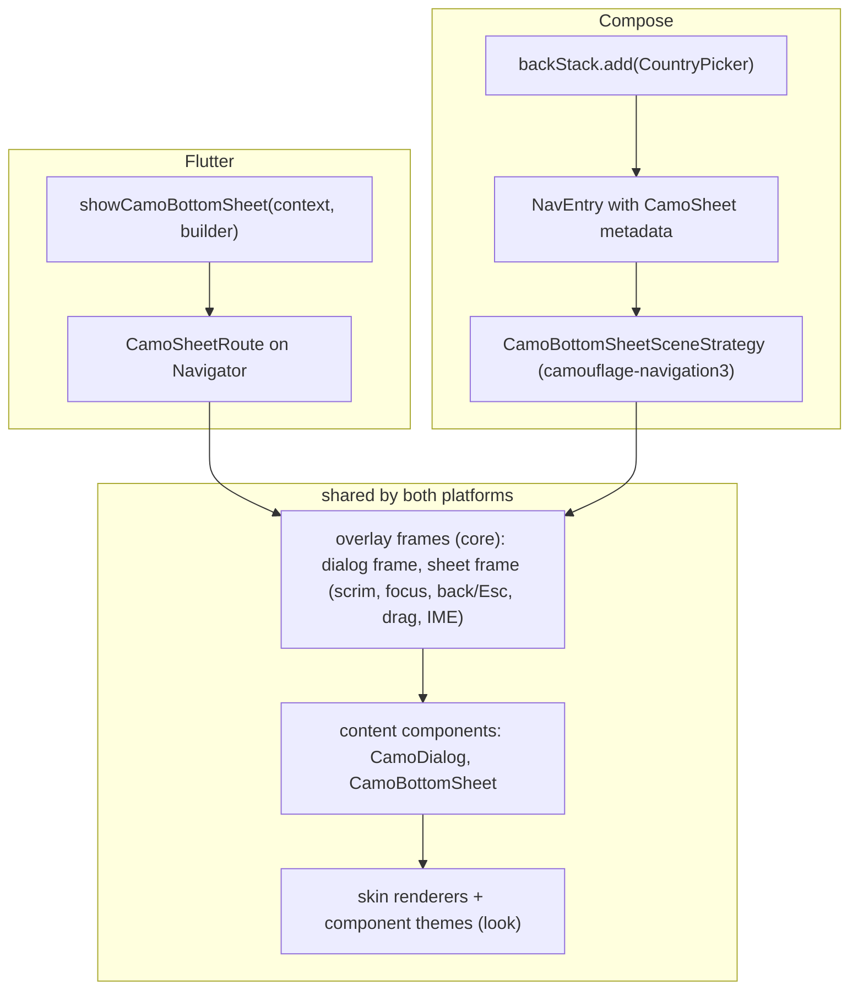
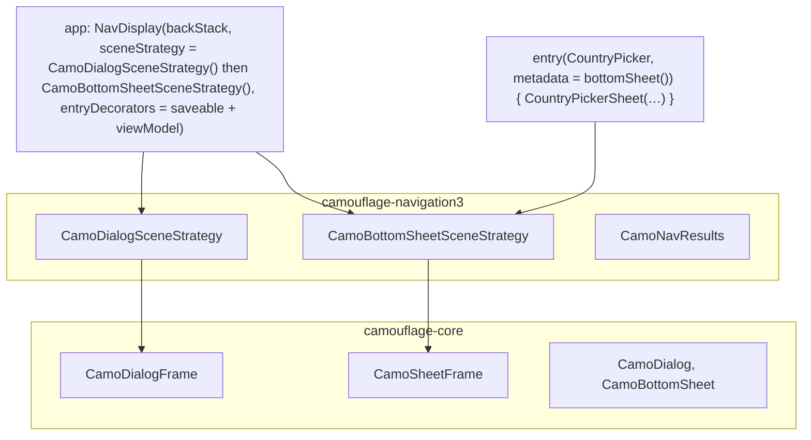
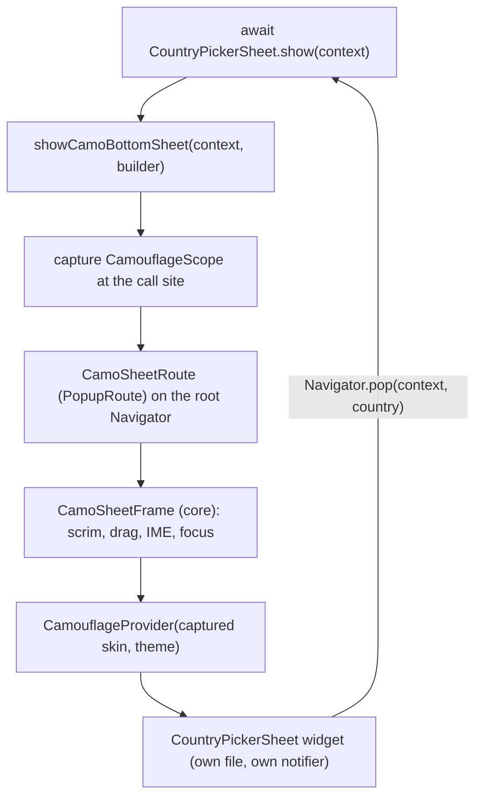

{/* Generated by docs/internal/scripts/sync_vault.py from the Camouflage design notes. Edit the notes and re-run the script; changes made here are overwritten. */}

# Overlays

## Concept {#concept}

### 1. Why

Dialogs and bottom sheets should be written **like small pages in their own files**: their own content, their own state (and ViewModel/notifier), a typed result. Screens should stay free of dialog flags and hoisted sheet state.

Camouflage is a **peer of Material**, not a framework of its own. So, like Material, it plugs overlays into **each platform's own navigator** instead of inventing an overlay system (ADR-19):

| Platform | The navigator | How an overlay is opened | Why it feels like a page |
|---|---|---|---|
| **Flutter** | `Navigator` (and GoRouter on top of it) | **`show`**: `showCamoDialog` / `showCamoBottomSheet` push a Camouflage route and return `Future<T?>`, exactly like `material_ui`'s `showDialog` | a route has its own lifecycle, so `autoDispose` providers inside it dispose when it closes |
| **Compose** | **Navigation 3** back stack | **register** the dialog/sheet as a route (an entry with Camouflage scene metadata), then add its key to the back stack | each entry gets its own `ViewModelStore` (Nav3 entry decorator), is restorable, and is deep-linkable |

Both platforms share the same **content components** (`CamoDialog`, `CamoBottomSheet`), the same **frames** (scrim, focus trap, drag, keyboard avoidance, drawn by the skin), and the same dismissal rules.

### 2. Shape



**Layering**

| Layer | Lives in | Contains |
|---|---|---|
| Frames | core | `CamoDialogFrame`, `CamoSheetFrame`: the modal behavior around content. Usable **standalone** (declaratively, like Material's `ModalBottomSheet`) in apps with no navigator integration. |
| Content components | core | `CamoDialog`, `CamoBottomSheet` |
| Navigator integration | Flutter: core (routes are part of Flutter's `widgets`); Compose: the **`camouflage-navigation3`** artifact | Flutter: `CamoDialogRoute`, `CamoSheetRoute`, `showCamoDialog`, `showCamoBottomSheet`. Compose: `CamoDialogSceneStrategy`, `CamoBottomSheetSceneStrategy`, metadata helpers, result passing. |

Core never contains a router. Compose's Navigation 3 integration is an official, separately published artifact, the same way Material ships `adaptive-navigation3`.

### 3. API

#### 3.0 Stacking: what's visible behind an overlay

An overlay is **stacked on top of the current page**, and **the page stays visible behind the scrim**, dimmed but not hidden. That's the same as Material's `showModalBottomSheet`.

```
┌──────────────────────────┐
│  Home page (still drawn) │  ← visible, dimmed, can't be tapped
│░░░░░░░░ scrim ░░░░░░░░░░░│  ← colors.scrim × scrimAlpha; tap = dismissal request
│┌────────────────────────┐│
││ Choose country     ═══ ││  ← the overlay (top of the stack)
│└────────────────────────┘│
└──────────────────────────┘
```

**Why:** Camouflage's overlay routes/scenes are **non-opaque**. A normal page is opaque, so the navigator stops drawing what's below it. A non-opaque entry makes the navigator (Flutter `Navigator`, also under GoRouter) or the scene (Navigation 3) keep drawing the entries below.

| The page behind | Behavior |
|---|---|
| Rendering | still drawn, unchanged (scroll position, running animations) |
| Touch | blocked by the scrim, where a tap is a dismissal request |
| Keyboard focus | trapped in the overlay |
| Screen readers | the page behind is hidden. Only the overlay is announced. |
| State | kept, not rebuilt or disposed. Closing the overlay reveals it as it was. |

**Several overlays** (a dialog from a sheet): everything below stays visible. By default each overlay brings its own scrim, so layers get progressively darker (Material's default). The design team can switch to a single scrim with the component-theme option `stackedScrim = TopOnly` (dialog and sheet themes).

**Only overlays are see-through.** If a full page was pushed on top of Home, a sheet opened from it shows *that* page behind, not Home.

#### 3.1 Frames (core, both platforms)

```kotlin
fun CamoDialogFrame(onDismissRequest: () -> Unit, dismissible: Boolean = true, content: Slot)
fun CamoSheetFrame(onDismissRequest: () -> Unit, dismissible: Boolean = true, dragToDismiss: Boolean = true,
                   content: Slot)
```

A frame is visible while it's in the tree. It draws the scrim and container area, traps focus, handles back/Esc/drag as **dismissal requests** (`onDismissRequest`), avoids the keyboard, and captures nothing: it's composed where the navigator places it.

#### 3.2 Flutter: `show`

```dart
Future<T?> showCamoDialog<T>({required BuildContext context, required WidgetBuilder builder, bool dismissible = true});
Future<T?> showCamoBottomSheet<T>({required BuildContext context, required WidgetBuilder builder,
                                   bool dismissible = true, bool dragToDismiss = true});
// inside: Navigator.pop(context, result) closes with a result; dismissal pops with null
```

The one-file pattern: the overlay widget owns a `static Future<T?> show(BuildContext context)`.

**Also as GoRouter routes, without modifying GoRouter:** `CamoSheetPage` / `CamoDialogPage` are `Page` classes that create the same Camouflage routes, so a `GoRoute` can declare a sheet (`pageBuilder: (_, __) => CamoSheetPage(child: …)`). `await context.push<T>('/…')` then returns its result. Same transitions, same frame. See Overlays.

#### 3.3 Compose: register as a route (camouflage-navigation3)

```kotlin
// 1. keys
@Serializable data object CountryPicker : NavKey

// 2. register the entry with Camouflage sheet metadata
entry<CountryPicker>(metadata = CamoBottomSheetSceneStrategy.bottomSheet()) {
    CountryPickerSheet(onPick = { results.set(CountryPicker, it); backStack.removeLastOrNull() })
}

// 3. NavDisplay with Camouflage scene strategies
NavDisplay(backStack, sceneStrategy = CamoDialogSceneStrategy<NavKey>() then CamoBottomSheetSceneStrategy<NavKey>(), …)

// 4. open it
backStack.add(CountryPicker)
```

Results come back through `CamoNavResults` (following the Nav3 "returning results" recipe):
- **`backStack.showForResult<T>(key, results)`**: a suspend convenience that adds the key and awaits the result. Flutter-like, for normal flows.
- **`results.consume<T>(key) { … }`**: delivered once, even after process death. Use it where the result must survive the app being killed while the overlay is open.

#### 3.4 Dismissal (both)

Scrim tap, back, Esc and drag are **dismissal requests**:
- Flutter pops the route with `null`.
- Compose calls `onDismissRequest`, which the scene maps to "remove this entry from the back stack".

To veto (while saving, or to ask "discard changes?"), content uses `PopScope` (Flutter) or `OnDismissRequest { … }` (Compose), or the overlay is shown/registered with `dismissible = false`.

### 4. Build steps

1. Frames in core (dialog, then sheet): scrim, focus trap, back/Esc, drag, IME insets, max size, dismissal requests, and screen-reader modality.
2. The content components `CamoDialog` and `CamoBottomSheet` ([CamoDialog](/components/overlays/camo-dialog), [CamoBottomSheet](/components/overlays/camo-bottom-sheet)).
3. Flutter: `CamoDialogRoute`, `CamoSheetRoute` (`PopupRoute`s using the frames), and the two `show` functions.
4. Compose: the `camouflage-navigation3` artifact with the two scene strategies, metadata helpers, `OnDismissRequest` integration, and `CamoNavResults`.
5. Samples: the same `CountryPickerSheet` (own ViewModel/notifier) and `DeleteItemDialog` on both platforms.
6. Tests:
   - results round-trip;
   - dismissal returns `null` / removes the entry;
   - a veto keeps it open;
   - the entry's ViewModel/notifier is disposed on close;
   - stacked overlays close LIFO;
   - a nested-provider theme is visible inside (Flutter: capture; Compose: the scene renders inside the provider tree).

**Done when**
- [ ] Flutter: `await CountryPickerSheet.show(context)` returns a typed result.
- [ ] Compose: `backStack.add(CountryPicker)` shows a Camouflage-styled sheet whose ViewModel is cleared when it closes, and the result reaches the caller.
- [ ] Both look identical for the same skin and theme.

### 5. Edge cases

| Case | Decided behavior |
|---|---|
| **Process death** | Compose: back-stack entries are restorable, so an open sheet comes back (with its saveable state). Flutter: routes pushed with `show` aren't restored by default (the same as `material_ui`'s `showDialog`). Use restorable routes later if needed. |
| **An app without Navigation 3 (Compose)** | Use the frames directly, declaratively: `if (showSheet) CamoSheetFrame(onDismissRequest = { showSheet = false }) { CamoBottomSheet(…) }`, the same as Material's `ModalBottomSheet`. |
| **Nested provider theme** | Flutter: `show` captures the skin and theme at the call site (routes are built under the `Navigator`). Compose: the `NavDisplay` sits inside the app's provider tree, and a screen-local theme override must be applied inside the entry's content. Documented. |
| Deep links to a sheet | Compose: natural (it's a key). Flutter: a GoRouter page that opens `showCamoBottomSheet`, or a GoRouter `pageBuilder` returning a `CamoSheetPage`, a later addition. |
| Snackbars, menus, tooltips | Later overlay kinds, following the same per-platform integration. |

## Implementation {#implementation}

<KotlinOnly>

### 1. Why {#kotlin-1-why}

In Compose, Camouflage dialogs and bottom sheets are **Navigation 3 routes**. You register an entry with Camouflage dialog or sheet metadata, then add its key to the back stack. That's how Material integrates with Navigation 3 too (scene strategies), and it gives each overlay a real page lifecycle for free:
- its own `ViewModelStore` (from Nav3's ViewModel entry decorator), cleared when the entry is popped;
- saveable state, restorable after process death;
- deep-link support, because an overlay is just a key.

Core provides the **frames**: the modal behavior, usable standalone like Material's `ModalBottomSheet`. The **`camouflage-navigation3`** artifact turns them into scene strategies.

### 2. Shape {#kotlin-2-shape}



**How a scene strategy works:** `NavDisplay` asks each strategy, in order, whether it can show the top entries. `CamoBottomSheetSceneStrategy` claims the top entry if its metadata carries the Camouflage sheet marker. It returns an **overlay scene**: Navigation 3 keeps rendering the entries underneath (the previous page stays visible behind the scrim, and `NavDisplay`'s page transition isn't applied to it), and the sheet entry is drawn inside `CamoSheetFrame`. When the frame requests dismissal, the scene's `onBack` removes the entry from the back stack.

**Stacking** follows the base rules (Overlays §3.0): the page behind stays visible, dimmed, blocked for touch, focus and screen readers, and its state is kept. Each overlay adds a scrim unless `stackedScrim = TopOnly`.

### 3. API {#kotlin-3-api}

#### 3.1 Frames (core) {#kotlin-31-frames-core}

```kotlin
@Composable public fun CamoDialogFrame(
    onDismissRequest: () -> Unit, dismissible: Boolean = true, content: @Composable () -> Unit)

@Composable public fun CamoSheetFrame(
    onDismissRequest: () -> Unit, dismissible: Boolean = true, dragToDismiss: Boolean = true,
    content: @Composable () -> Unit)

/** Inside frame content: veto dismissal requests (scrim, back, Esc, drag). Return true to allow. */
@Composable public fun OnDismissRequest(onRequest: () -> Boolean)
```

The frames are drawn **in-layer** (a full-size `Box` over the content, not a platform `Dialog` window), so they:
- look identical on all four targets;
- need no Android window-dim workaround;
- let future Glass skins blur what's behind them.

Modality is implemented in the frame:
- the scrim consumes pointer input;
- focus moves in and is trapped (`FocusRequester` + a `focusGroup` with `focusProperties` exit handling);
- `paneTitle` semantics are set;
- a multiplatform back handler is registered (Compose Multiplatform's `BackHandler`, or the `NavigationEventHandler` API, whichever is stable at M6);
- Esc is handled via `onKeyEvent`.

**Standalone use (no Navigation 3):**

```kotlin
var showPicker by rememberSaveable { mutableStateOf(false) }
if (showPicker) CamoSheetFrame(onDismissRequest = { showPicker = false }) {
    CamoBottomSheet(title = "Choose country") { CountryList(onPick = { pick(it); showPicker = false }) }
}
```

#### 3.2 Navigation 3 integration (`camouflage-navigation3`) {#kotlin-32-navigation-3-integration-camouflage-navigation3}

```kotlin
public class CamoDialogSceneStrategy<T : Any> : SceneStrategy<T> {
    public companion object { public fun dialog(dismissible: Boolean = true): Map<String, Any> }
}
public class CamoBottomSheetSceneStrategy<T : Any> : SceneStrategy<T> {
    public companion object { public fun bottomSheet(dismissible: Boolean = true, dragToDismiss: Boolean = true): Map<String, Any> }
}

/** Result passing between an overlay entry and its caller (Nav3 "returning results" recipe). */
@Stable public class CamoNavResults {
    public fun <T> set(key: Any, value: T)
    @Composable public fun <T> consume(key: Any, onResult: (T) -> Unit)   // delivered once, then cleared
}
@Composable public fun rememberCamoNavResults(): CamoNavResults               // saveable

/** Flutter-like convenience: add the key and await its result (null if dismissed). */
public suspend fun <T> NavBackStack<NavKey>.showForResult(key: NavKey, results: CamoNavResults): T?
```

**`showForResult` vs `consume`:**

| | `showForResult` | `consume` |
|---|---|---|
| Reads like | `val c = backStack.showForResult<Country>(CountryPicker, results)` | `results.consume<Country>(CountryPicker) { … }` |
| Use for | normal flows (most cases) | results that must arrive even after **process death** while the overlay was open (a long form in a sheet) |
| How | registers a one-shot listener in `results`, adds the key, suspends until `set` or until the entry is popped without a result (then `null`) | the same store, observed by a composable |

Both use the same store, so moving a flow from one to the other is a one-line change.

**The full picture (the sample):**

```kotlin
@Serializable data object CountryPicker : NavKey

@Composable
fun AppNav() {
    val backStack = rememberNavBackStack(Home)
    val results = rememberCamoNavResults()
    NavDisplay(
        backStack = backStack,
        onBack = { backStack.removeLastOrNull() },
        sceneStrategy = CamoDialogSceneStrategy<NavKey>() then CamoBottomSheetSceneStrategy<NavKey>(),
        entryDecorators = listOf(rememberSaveableStateHolderNavEntryDecorator(), rememberViewModelStoreNavEntryDecorator()),
        entryProvider = entryProvider {
            entry<Home> { HomeScreen(onPickCountry = { backStack.add(CountryPicker) }, results = results) }
            entry<CountryPicker>(metadata = CamoBottomSheetSceneStrategy.bottomSheet()) {
                CountryPickerSheet(onPick = { results.set(CountryPicker, it); backStack.removeLastOrNull() })
            }
        },
    )
}

// CountryPickerSheet.kt: the sheet in its own file, with its own ViewModel (scoped to the entry)
@Composable
fun CountryPickerSheet(onPick: (Country) -> Unit, vm: CountryPickerViewModel = viewModel { CountryPickerViewModel() }) {
    val state by vm.state.collectAsStateWithLifecycle()
    CamoBottomSheet(title = "Choose country") { CountryList(state.countries, onPick) }
}

// HomeScreen: receive the result (either way)
scope.launch { backStack.showForResult<Country>(CountryPicker, results)?.let { viewModel.onEvent(HomeEvent.CountryPicked(it)) } }
// or, for process-death safety:
results.consume<Country>(CountryPicker) { viewModel.onEvent(HomeEvent.CountryPicked(it)) }
```

With your conventions:
- the Home ViewModel emits an Effect (`OpenCountryPicker`);
- the screen maps it to `backStack.add(CountryPicker)`;
- the result goes back into `onEvent`.

### 4. Build steps {#kotlin-4-build-steps}

1. `CamoDialogFrame` and `CamoSheetFrame` in core (modality, back/Esc, drag, IME insets, `OnDismissRequest`).
2. The `:camouflage-navigation3` module (KMP, all four targets), depending on core and JetBrains' multiplatform Navigation 3 artifacts. Add it to the BOM.
3. `CamoDialogSceneStrategy` / `CamoBottomSheetSceneStrategy` (overlay scenes that keep the previous content visible) and the metadata helpers.
4. `CamoNavResults` (saveable, consume-once).
5. The sample `AppNav` above + `DeleteItem` dialog.
6. Tests (`runComposeUiTest` with a real `NavDisplay`):
   - adding the key shows the sheet over Home;
   - the picked value reaches Home once;
   - a scrim click / back pops the entry;
   - `OnDismissRequest { false }` keeps it;
   - the entry's ViewModel `onCleared` runs after the pop;
   - `StateRestorationTester` restores an open sheet.

**Done when**
- [ ] `backStack.add(CountryPicker)` opens a Camouflage sheet on all four targets, and its result reaches Home.
- [ ] The sheet's ViewModel is cleared when it closes. An open sheet survives state restoration.

### 5. Edge cases {#kotlin-5-edge-cases}

| Case | Decided behavior |
|---|---|
| **Kotlin vs Flutter** | Compose registers routes, and Flutter uses `show` (ADR-19). The content components and frames are identical. |
| Nested provider theme | The entry renders inside `NavDisplay`, which sits inside the app's root provider. A screen-local override (a promo section) doesn't reach an entry. Apply it inside the entry's content: `CamouflageProvider(theme = promo) { CamoDialog(…) }`. |
| Two overlays stacked (a dialog from a sheet) | Two entries on top of each other. Both strategies claim the top entry only, and the previous overlay scene stays visible beneath. |
| Rotation without `configChanges` | The back stack and entries are saveable, so the open sheet comes back after recreation (better than the standalone frame, whose `rememberSaveable` flag also restores). |
| Navigation 3 API changes | They're isolated in `camouflage-navigation3`. Core and apps using standalone frames aren't affected. |
| **Navigation 3 isn't mandatory** | The standalone frames work with any router, or none. `camouflage-navigation3` only adds "register sheets and dialogs as routes". |
| **Navigation 2 (NavHost + graph)** | Registering sheets as graph destinations needs custom `Navigator`s plus `camoDialog { }` / `camoBottomSheet { }` builders (the approach of Google's `material-navigation` for Material's `bottomSheet { }`). It's a possible later `camouflage-navigation2` add-on if a Navigation 2 app needs it. Until then, use the standalone frames. |
| Other routers (Voyager, Decompose) | The standalone frames. |

</KotlinOnly>

<DartOnly>

### 1. Why {#dart-1-why}

In Flutter, Camouflage opens dialogs and sheets exactly the way `material_ui` does: **`show` functions that push a route onto the app's `Navigator`** and return `Future<T?>`. Because they're routes:
- they work with plain `Navigator` and with GoRouter (which drives a `Navigator`);
- they get back-button handling;
- anything scoped to the route (an `autoDispose` Riverpod provider, a hook) is disposed when it closes, the "feels like a page" lifecycle.

This is the Flutter side of ADR-19. Compose registers Navigation 3 routes instead (Overlays).

### 2. Shape {#dart-2-shape}



### 3. API {#dart-3-api}

```dart
Future<T?> showCamoDialog<T>({
  required BuildContext context, required WidgetBuilder builder,
  bool dismissible = true, bool useRootNavigator = true,
});
Future<T?> showCamoBottomSheet<T>({
  required BuildContext context, required WidgetBuilder builder,
  bool dismissible = true, bool dragToDismiss = true, bool useRootNavigator = true,
});

class CamoDialogRoute<T> extends PopupRoute<T> { /* barrier handled by CamoDialogFrame, not the route */ }
class CamoSheetRoute<T> extends PopupRoute<T> { /* its AnimationController drives the enter/exit + drag */ }

// frames (core), also usable outside routes
class CamoDialogFrame extends StatelessWidget { const CamoDialogFrame({super.key, required this.onDismissRequest, this.dismissible = true, required this.child}); }
class CamoSheetFrame extends StatefulWidget { const CamoSheetFrame({super.key, required this.onDismissRequest, this.dismissible = true, this.dragToDismiss = true, required this.child}); }
```

- The routes set `barrierColor: null` and `barrierDismissible: false`. The **frame** draws the scrim (theme color × `scrimAlpha`) and turns taps into a dismissal request (`Navigator.maybePop`), so the look is the skin's and the behavior matches Compose.
- **Veto:** content wraps itself in `PopScope(canPop: !saving, …)`. Scrim, back, Esc and drag all go through `maybePop`, so one `PopScope` covers them.
- `useRootNavigator: true` (the default, like Material) makes sheets and dialogs cover bottom navigation bars and GoRouter shell routes.

#### Route-style overlays with GoRouter (no GoRouter changes) {#dart-route-style-overlays-with-gorouter-no-gorouter-changes}

A `GoRoute` may return any `Page` from `pageBuilder`. Camouflage ships two tiny `Page` classes whose `createRoute` returns the **same** `CamoSheetRoute` / `CamoDialogRoute` that the `show` functions push:

```dart
class CamoSheetPage<T> extends Page<T> {
  const CamoSheetPage({super.key, required this.child, this.dismissible = true, this.dragToDismiss = true});
  final Widget child; final bool dismissible, dragToDismiss;
  @override
  Route<T> createRoute(BuildContext context) => CamoSheetRoute<T>(settings: this, dismissible: dismissible,
      dragToDismiss: dragToDismiss, builder: (_) => child);
}
// CamoDialogPage<T> is the same with CamoDialogRoute.
```

```dart
final rootNavigatorKey = GlobalKey<NavigatorState>();

GoRoute(path: '/home', builder: (_, __) => const HomePage(), routes: [
  GoRoute(path: 'country-picker', parentNavigatorKey: rootNavigatorKey,        // covers a ShellRoute's nav bar
          pageBuilder: (_, __) => const CamoSheetPage(child: CountryPickerSheet())),
]),

// anywhere:
final country = await context.push<Country>('/home/country-picker');           // go_router returns the pop result
// inside the sheet: context.pop(country)
```

**Two rules for route-style overlays:**
1. Declare the overlay **as a sub-route of the page it covers** (`/home/country-picker`). Then a deep link or `context.go(...)` builds Home underneath first, and the sheet slides up over it.
2. Inside a `ShellRoute`, set **`parentNavigatorKey: rootNavigatorKey`** so the sheet covers the bottom navigation bar (the `useRootNavigator: true` equivalent).

**Transitions are identical in both styles.** The route class is the same, so:
- enter/exit (sheet: slide up with `motion.durationMedium` + `easingEmphasized`, down with `durationShort`; dialog: fade + scale);
- the scrim fade and the drag all come from Camouflage, not from GoRouter (no `CustomTransitionPage` needed);
- reduced motion makes them instant.

**Stacking:** the routes are **non-opaque** popup routes, so the navigator keeps drawing the page below. It stays visible behind the scrim (dimmed, blocked for touch/focus/screen readers, state kept). See Overlays §3.0.

**The one-file pattern (yours):**

```dart
class CountryPickerSheet extends HookConsumerWidget {
  const CountryPickerSheet({super.key});
  static Future<Country?> show(BuildContext context) =>
      showCamoBottomSheet<Country>(context: context, builder: (_) => const CountryPickerSheet());

  @override
  Widget build(BuildContext context, WidgetRef ref) {
    final state = ref.watch(countryPickerNotifierProvider);           // autoDispose: disposed with the route
    return CamoBottomSheet(title: 'Choose country',
        child: CountryList(state.countries, onPick: (c) => Navigator.pop(context, c)));
  }
}
// screen / page: final country = await CountryPickerSheet.show(context);
```

### 4. Build steps {#dart-4-build-steps}

1. `CamoDialogFrame`, `CamoSheetFrame` (scrim, `FocusScope` trap, Esc via `DismissIntent`, drag with the route's controller, `MediaQuery.viewInsetsOf` for the IME).
2. `CamoDialogRoute`, `CamoSheetRoute` (non-opaque), `showCamoDialog`, `showCamoBottomSheet` with provider capture, and `CamoSheetPage` / `CamoDialogPage` for GoRouter.
3. The samples: `CountryPickerSheet` (own `autoDispose` notifier) and `DeleteItemDialog`, the same content as the Kotlin sample.
4. Widget tests:
   - `await show` returns the popped value;
   - a scrim tap / `handlePopRoute()` returns `null`;
   - `PopScope(canPop: false)` keeps it open;
   - an `autoDispose` provider in the sheet is disposed after it closes;
   - a nested-provider theme appears inside;
   - it works under a GoRouter `ShellRoute` (covers the shell);
   - `await context.push('/home/country-picker')` returns the popped value;
   - `context.go('/home/country-picker')` from a cold start shows Home behind the sheet;
   - the page behind is still painted (a golden) and excluded from semantics.

**Done when**
- [ ] `await CountryPickerSheet.show(context)` works on all six platforms, with plain `Navigator` and with GoRouter.

### 5. Edge cases {#dart-5-edge-cases}

| Case | Decided behavior |
|---|---|
| **Flutter vs Compose** | Flutter `show`s routes, and Compose registers Navigation 3 entries. The content, frames and look are shared (ADR-19). |
| Process death | `show`-pushed routes aren't restored (the same as `material_ui`). `restorableShowCamoBottomSheet` could come later with `RestorableRouteFuture`. |
| GoRouter deep link to a sheet | Declare it with `CamoSheetPage` as a sub-route of the page it covers (above). |
| `showDialog` from `material_ui` with a `CamoDialog` inside | Works only if the provider is above the app's navigator, and gets Material's frame. Use `showCamoDialog`. |

</DartOnly>
