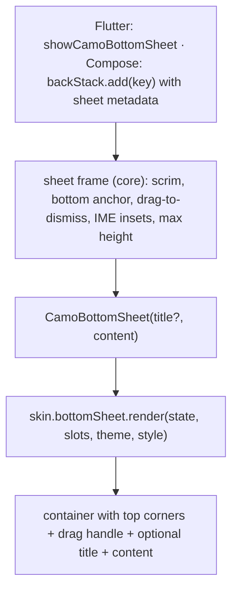
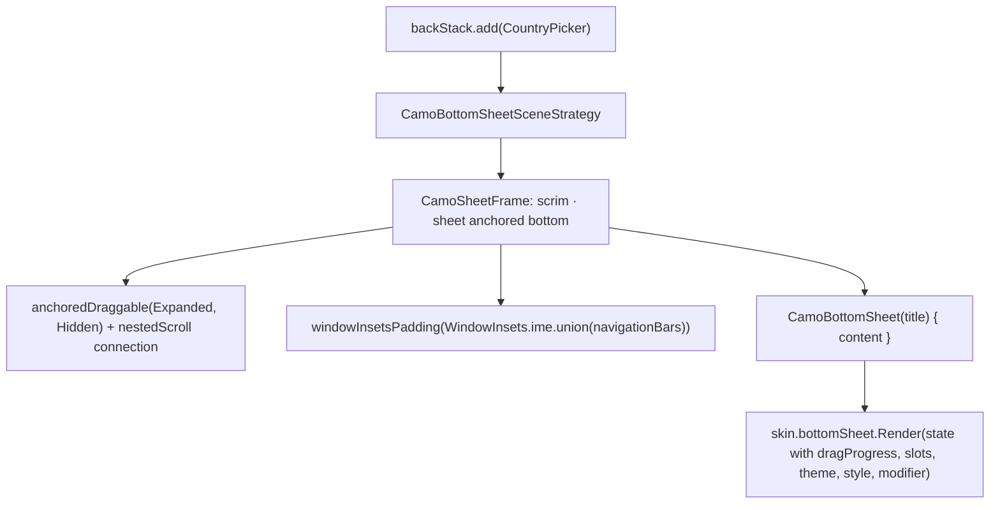
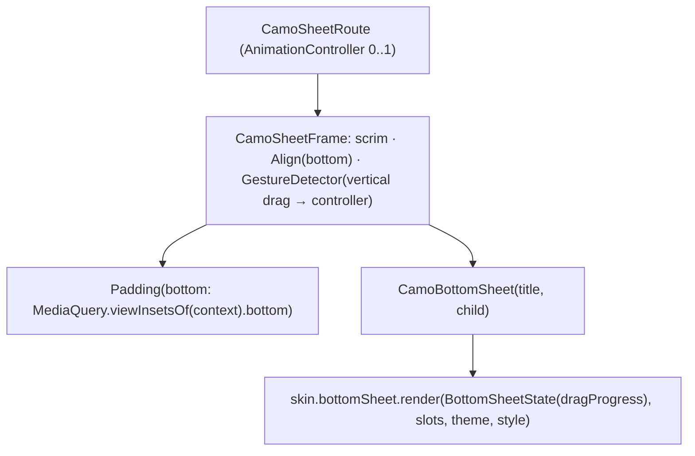

{/* Generated by docs/internal/scripts/sync_vault.py from the Camouflage design notes. Edit the notes and re-run the script; changes made here are overwritten. */}

# CamoBottomSheet

## Concept {#concept}

### 1. Why

Bottom sheets are the most common overlay on mobile: pickers, filters, confirmation actions, short forms. `CamoBottomSheet` is the **content component** you put inside a sheet, opened through the platform's navigator: `showCamoBottomSheet` in Flutter, a registered Navigation 3 entry with sheet metadata in Compose (see [Overlays](/components/overlays/overlays)). The **sheet frame** (scrim, anchoring to the bottom, drag, keyboard avoidance) comes from core. The **look** (corners, handle, colors) belongs to the skin. Your content only describes what's inside.

### 2. Shape



**Split of duties**

| Core (frame + component) | Skin (renderer) |
|---|---|
| show/close, scrim tap, back, drag gesture with velocity threshold, IME insets, max height (90% of the window), focus, semantics | container color and shape, handle look, title placement, content padding |

**Material mapping preview:** the M3 modal bottom sheet.
- Container: `surfaceContainerLow`, top corners `shapes.extraLarge`, elevation `level1`.
- Drag handle: 32 × 4 in `onSurfaceVariant` (40% alpha), 22 from the top.
- Title (when given): `titleLarge`.
- Scrim: `scrim` at 32%.

### 3. API

#### Contract

```kotlin
fun CamoBottomSheet(
    title: String? = null,
    content: Slot,                        // layout content: a list, a form, actions
)
```

**State → renderer:** `BottomSheetState(title?, dragProgress: Float, dismissible, onDismissRequest)`. `dragProgress` goes from 0 (resting) to 1 (dragged fully down), so skins can fade or scale while dragging. **Slots:** `BottomSheetSlots(content)`.

#### Tokens used

- `colors.surfaceContainerLow`, `onSurface`, `onSurfaceVariant`, `scrim`
- `shapes.extraLarge` (top corners only)
- `typography.titleLarge`
- `spacing.l` side padding, `spacing.xl` bottom padding (plus the navigation-bar inset)
- `motion.durationMedium` + `easingEmphasized` for enter, `durationShort` for exit

#### Component theme

`theme.components.bottomSheet: BottomSheetTheme?`. Every field is nullable in the theme. The skin's `defaults(theme)` fills whatever isn't set (Material defaults shown). See [Theme](/guide/foundations/theme) §3.10.

| Field | Type | Material default | What it's for |
|---|---|---|---|
| `shape` | Shape (top corners) | `shapes.extraLarge` | container corners |
| `maxWidth` | Dp | 640 | on tablets and desktop the sheet doesn't stretch edge to edge |
| `contentPadding` | Padding | horizontal 16, bottom 24 | inside padding |
| `showHandle` | Boolean | true | whether the drag handle is drawn (ADR-23: Fluent and Carbon present sheets as drawers without a handle, so it's a skin default, not a parameter). Drag-to-dismiss works either way. |
| `handleSize` | Size | 32 × 4 | drag handle |
| `handleColor` | Color | `onSurfaceVariant` at 40% | drag handle |
| `titleStyle` | CamoTextStyle | `typography.titleLarge` | title |
| `titleAlign` | `Start` \| `Center` | `Start` | title alignment in the header (ADR-28) |
| `showCloseButton` | Boolean | false | a ✕ at the end of the header, shown only when `dismissible`; it closes like back (ADR-25). Brands often use it instead of the handle. |
| `containerColor` | Color | `surfaceContainerLow` | background |
| `scrimAlpha` | Float | 0.32 | scrim opacity over `colors.scrim` |
| `widePresentation` | `Sheet` \| `Centered` | `Sheet` (Material: stays a bottom sheet, capped at `maxWidth`) | how the sheet is presented on wide windows (tablet, desktop). `Centered` shows it as a centered card, the Apple iPad style. A design-team choice. |
| `stackedScrim` | `Each` \| `TopOnly` | `Each` | when opened above another overlay: add its own scrim (darker) or share one |

#### Accessibility

- It's announced as a modal pane with its title (or "Sheet"). Focus moves into it on open and returns to the opener on close.
- **Dragging must never be the only way to close it**: scrim tap, back/Esc, and (for screen-reader users) a "Dismiss" accessibility action are always available when the overlay is dismissible.
- The drag handle is decorative for screen readers. The dismiss action covers it.

### 4. Build steps

1. The sheet frame in core: bottom anchor, scrim, drag with a velocity/distance threshold, IME and navigation-bar insets, max height and max width.
2. `CamoBottomSheet` + `BottomSheetRenderer` (DebugSkin: a rectangle with a handle bar).
3. The sample: a country picker sheet in its own file (with its own ViewModel/notifier), and a filter sheet with a small form. Flutter opens it with `show`; Compose registers it as an entry.
4. Tests:
   - the caller receives the picked value;
   - a scrim tap, back and a fast drag down each return `null`;
   - a slow small drag springs back;
   - a text field inside stays above the keyboard;
   - the screen-reader dismiss action closes it;
   - `dismissible = false` ignores all of those.

**Done when**
- [ ] The country picker opens with one line and returns a typed result on all platforms.
- [ ] Drag, scrim, back and screen-reader dismissal all work, and all respect `dismissible`.

### 5. Edge cases

| Case | Decided behavior |
|---|---|
| Content taller than the max height | The content scrolls inside the sheet. Dragging down while the content is scrolled to the top drags the sheet (nested scroll). |
| Tablet / desktop | Decided by `widePresentation`. Material's default (`Sheet`): stays a bottom sheet, centered horizontally and capped at 640, which is what Material 3 does on both platforms. `Centered`: a centered card, like iPadOS form sheets (a future Cupertino skin's default). |
| Expanding "half → full" sheets | Not in v1 (single height, wrapping the content up to the max). |
| Non-modal (persistent) sheets | Not in v1. They're a layout component, not an overlay. |
| **Header** (settled 2026-09-27) | Built from `title`, `titleAlign`, `showCloseButton` and `showHandle`: handle only; handle + title; title + ✕; or nothing. No per-call header parameters. |
| Keyboard open + drag | Dragging first hides the keyboard, then drags the sheet. |

## Implementation {#implementation}

<KotlinOnly>

### 1. Why {#kotlin-1-why}

This is the content component for sheets. In Compose a sheet is a Navigation 3 entry registered with `CamoBottomSheetSceneStrategy.bottomSheet()` metadata (or a standalone `CamoSheetFrame`). The **frame** does the hard parts:
- the drag (`AnchoredDraggableState`, with velocity and position thresholds);
- nested scrolling, so a scrolled list doesn't fight the sheet;
- IME insets;
- the max height and width.

The renderer only draws the container, the handle and the title.

### 2. Shape {#kotlin-2-shape}



### 3. API {#kotlin-3-api}

```kotlin
@Composable
public fun CamoBottomSheet(
    modifier: Modifier = Modifier,
    title: String? = null,
    content: @Composable ColumnScope.() -> Unit,
)
```

- `BottomSheetTheme` / `BottomSheetStyle` follow the base table.
- `dragProgress` comes from the frame's `AnchoredDraggableState` through a `LocalSheetDrag` the frame provides, so `CamoBottomSheet` stays a plain content composable.
- Enter and exit animate between the `Hidden` and `Expanded` anchors with `tween(motion.durationMedium, easing = motion.easingEmphasized)`. When the entry is popped, the scene plays the exit animation before removing the content.
- Dismissal threshold: past 50% of the height, or a downward fling faster than 1000 dp/s, is a dismissal request. `OnDismissRequest` can veto it, and the sheet springs back.
- Accessibility: the frame adds `semantics { paneTitle = title ?: "Sheet"; dismiss { requestDismiss(); true } }`.

**Header (ADR-28):** built from `title`, `style.titleAlign`, `style.showCloseButton` and `style.showHandle`: the handle (if shown) on top, then a `Row` with the title (start or centered) and, when `state.dismissible`, the close button at the end, calling `state.onDismissRequest`. With no title, no handle and no close button, there's no header at all.

### 4. Build steps {#kotlin-4-build-steps}

1. The drag, nested scroll, insets and max size inside `CamoSheetFrame`.
2. `CamoBottomSheet`, `BottomSheetTheme`/`Style`, `BottomSheetRenderer`, and the DebugSkin renderer.
3. The sample: `CountryPickerSheet` in its own file with its own ViewModel (registered as an entry), and `FilterSheet` with a small form.
4. `commonTest`:
   - the result reaches the caller;
   - `swipeDown()` on the handle pops the entry;
   - a small swipe springs back;
   - `performSemanticsAction(SemanticsActions.Dismiss)` pops it;
   - `dismissible = false` ignores all of these;
   - with the IME open (Android device test), the focused field stays visible.

**Done when**
- [ ] The country picker opens with `backStack.add(CountryPicker)` on all four targets. Drag, scrim, back, Esc and screen-reader dismissal work.

### 5. Edge cases {#kotlin-5-edge-cases}

| Case | Decided behavior |
|---|---|
| A `LazyColumn` inside the sheet | The frame's `nestedScroll` connection lets the list scroll first, and drags the sheet only when the list is at the top. |
| Exit animation vs popped entry | The scene keeps rendering the popped entry until the exit animation ends (Nav3 scenes support animated removal). |
| Desktop and web | Scrim click and Esc close it. A mouse drag on the handle works. |
| Wide windows | `style.widePresentation`: `Sheet` (default: a bottom sheet, centered horizontally, capped at `maxWidth` 640) or `Centered` (a centered card with all four corners rounded; the frame switches alignment and the enter animation becomes fade + scale). "Wide" means the window width is at least 600 dp (the Material medium window-size class). |

</KotlinOnly>

<DartOnly>

### 1. Why {#dart-1-why}

This is the content component for sheets opened with `showCamoBottomSheet`. The route and `CamoSheetFrame` ([Overlays](/components/overlays/overlays#implementation)) handle the modal parts:
- the drag, driven by the route's `AnimationController`;
- scroll coordination;
- the keyboard (`viewInsets`);
- the max size.

The renderer draws the container, the handle and the title.

### 2. Shape {#dart-2-shape}



### 3. API {#dart-3-api}

```dart
class CamoBottomSheet extends StatelessWidget {
  const CamoBottomSheet({super.key, this.title, required this.child});
}
```

- `CamoBottomSheetTheme` / `CamoBottomSheetStyle` follow the base table.
- `dragProgress` = `1 - route.animation.value` while dragging, provided to `CamoBottomSheet` via a small `InheritedWidget` from the frame.
- Dismissal: a drag past 50% of the height, or a downward fling faster than 1000 px/s, calls `Navigator.maybePop` (so a `PopScope` veto springs it back).
- Scroll coordination: the frame listens to `ScrollNotification`s from the content. When a list is at the top and the user keeps dragging down, the overscroll becomes a sheet drag.
- Accessibility: `Semantics(scopesRoute: true, namesRoute: true, label: title ?? 'Sheet')`, and a custom dismiss action (`CustomSemanticsAction(label: 'Dismiss')`) calling `maybePop`.

**Header (ADR-28):** built from `title`, `style.titleAlign`, `style.showCloseButton` and `style.showHandle`; the close button shows only when `state.dismissible` and calls `state.onDismissRequest`.

### 4. Build steps {#dart-4-build-steps}

1. Drag, fling, scroll-to-drag handoff, IME padding and max size in `CamoSheetFrame` / `CamoSheetRoute`.
2. `CamoBottomSheet`, the theme/style, `CamoBottomSheetRenderer`, and the DebugSkin renderer.
3. Samples: `CountryPickerSheet`, `FilterSheet` (a form inside a sheet, using `CamoForm`).
4. Widget tests:
   - `tester.fling(handle, Offset(0, 400), 2000)` closes with `null`;
   - a small drag springs back;
   - a list scrolled to the top then dragged closes the sheet;
   - the text field stays visible with `viewInsets.bottom = 300`;
   - the semantics dismiss action closes it;
   - `dismissible: false` ignores all of these.

**Done when**
- [ ] The country picker and the filter sheet work on all six platforms, matching the Kotlin samples visually for the same skin and theme.

### 5. Edge cases {#dart-5-edge-cases}

| Case | Decided behavior |
|---|---|
| Desktop and web | Scrim click and Esc close it. A mouse drag on the handle works. |
| Wide windows | `style.widePresentation`: `sheet` (default, a bottom sheet capped at 640) or `centered` (a centered card; the route's transition becomes fade + scale). "Wide" means `MediaQuery.sizeOf(context).width >= 600`. |
| A `CamoForm` inside a sheet | The form's controller belongs to the sheet's page (hook/notifier), so it's disposed with the route. |

</DartOnly>
