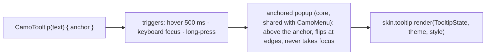
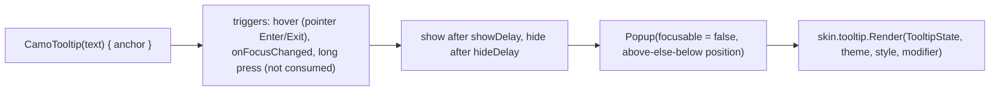
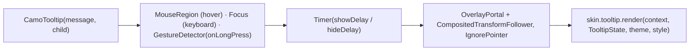

{/* Generated by docs/internal/scripts/sync_vault.py from the Camouflage design notes. Edit the notes and re-run the script; changes made here are overwritten. */}

# CamoTooltip

## Concept {#concept}

### 1. Why

A tooltip shows a short text label for an element that has no visible text, typically an icon button, when the user hovers (mouse), focuses (keyboard) or long-presses (touch). Desktop and web users expect them. They also settle an earlier open question: **`CamoIconButton` gets a `tooltip` parameter on both platforms**, built on this component.

### 2. Shape



**Material mapping preview:** the M3 plain tooltip. `inverseSurface` container, `inverseOnSurface` text in `bodySmall`, `shapes.extraSmall`, height 24, 8 dp from the anchor. Rich tooltips are Later.

### 3. API

#### Contract

```kotlin
fun CamoTooltip(
    text: String,
    content: Slot,                         // the anchor
    enabled: Boolean = true,
)

// shortcut on icon buttons (both platforms):
fun CamoIconButton(…, tooltip: String? = null)   // null → no tooltip; commonly = contentDescription
```

**State → renderer:** `TooltipState(text, visible)`. **Slots:** none. Core owns the triggers, timing and positioning.

#### Tokens used

- `colors.inverseSurface`, `inverseOnSurface`
- `typography.bodySmall`, `shapes.extraSmall`
- `motion.durationShort` (fade)

#### Component theme

`theme.components.tooltip: TooltipTheme?`. Every field is nullable in the theme. The skin's `defaults(theme)` fills whatever isn't set (Material defaults shown). See [Theme](/guide/foundations/theme) §3.10.

| Field | Type | Material default | What it's for |
|---|---|---|---|
| `shape` | Shape | `shapes.extraSmall` | container corners |
| `padding` | Padding | horizontal 8, vertical 4 | inner padding |
| `offset` | Dp | 8 | gap from the anchor |
| `textStyle` | CamoTextStyle | `bodySmall` | text |
| `showDelay` / `hideDelay` | Duration | 500 ms / 1500 ms (touch) | timing |
| `maxWidth` | Dp | 200 | text wraps beyond this |
| `colors` | TooltipColors(container, text) | `inverseSurface`, `inverseOnSurface` | every color it uses |

#### Accessibility

- The tooltip text becomes the anchor's **description** (not its name), so screen readers announce it without showing the popup.
- It never takes focus. Esc hides it (WCAG 1.4.13: dismissible, hoverable, persistent).
- The pointer can move onto the tooltip without it disappearing (hoverable).

### 4. Build steps

1. Triggers and timing (hover delay, focus, long-press), sharing the anchored popup with `CamoMenu`.
2. `CamoTooltip`, `TooltipRenderer`, the DebugSkin renderer, and the `tooltip` parameter on `CamoIconButton`.
3. Tests:
   - it shows after the hover delay and on keyboard focus;
   - long-press shows it on touch;
   - Esc hides it;
   - the description is exposed;
   - it flips below at the top edge.

**Done when**
- [ ] Top-bar icon buttons show tooltips on desktop and web hover and on keyboard focus, and on long-press on phones.

### 5. Edge cases

| Case | Decided behavior |
|---|---|
| Tooltip on a disabled element | Shown on hover (explains why it's disabled). No focus trigger, because disabled elements aren't focusable. |
| Tooltip text equal to the anchor's label | Not announced twice. Core skips the description when it equals the name. |
| Rich tooltips (title + actions) | Later (`CamoRichTooltip`, a `CamoPopover`-like component). |

## Implementation {#implementation}

<KotlinOnly>

### 1. Why {#kotlin-1-why}

A tooltip needs three triggers (hover, keyboard focus, long-press), timing, and a popup positioned above its anchor, without stealing clicks. Material 3's `TooltipBox` isn't used; core builds it on the same popup plumbing as [CamoMenu](/components/overlays/camo-menu#implementation), with a non-focusable popup.

### 2. Shape {#kotlin-2-shape}



### 3. API {#kotlin-3-api}

```kotlin
@Composable
public fun CamoTooltip(text: String, modifier: Modifier = Modifier, enabled: Boolean = true, content: @Composable () -> Unit)
```

`CamoIconButton(tooltip = …)` wraps itself in `CamoTooltip`.

- **Hover:** `pointerInput` with `awaitPointerEventScope` reading `PointerEventType.Enter/Exit` (desktop, web, Android with a mouse, iPad pointer).
- **Focus:** `onFocusChanged { if (it.isFocused && lastInputWasKeyboard) show() }`, so tapping doesn't show it but Tab does.
- **Long press:** `awaitEachGesture { awaitFirstDown(requireUnconsumed = false); … }` detects a long press **without consuming** events, so the anchor's click still works; release doesn't trigger the click after a long press (the anchor's clickable already cancels on long press).
- **Popup:** `PopupProperties(focusable = false, dismissOnClickOutside = false)`; positioned centered above the anchor with `style.offset`, below if there's no room.
- **Semantics:** Compose has no tooltip property, so core does two things when `text` differs from the anchor's label: it labels the long-press action (`semantics { onLongClick(label = text) { … } }`), which TalkBack reads as a hint, and it marks the visible popup text as a polite live region, so it's announced once when shown. When `text` equals the label, it adds nothing (no double reading).

### 4. Build steps {#kotlin-4-build-steps}

1. The trigger modifier, timers, the popup; `TooltipTheme` / `Style`; the DebugSkin renderer.
2. UI tests: hover shows after the delay and hides on exit; Tab shows, tapping doesn't; long press shows without firing the click; no duplicate announcement when text equals the label.

**Done when**
- [ ] Icon-button tooltips work with mouse, keyboard and touch on all targets.

### 5. Edge cases {#kotlin-5-edge-cases}

| Case | Decided behavior |
|---|---|
| Disabled anchor | Hover still shows it (explains why it's disabled); no focus trigger. |
| Anchor scrolls away while shown | The tooltip hides. |

</KotlinOnly>

<DartOnly>

### 1. Why {#dart-1-why}

Material's `Tooltip` isn't in core. `CamoTooltip` is an `OverlayPortal` with hover, keyboard-focus and long-press triggers, timing, and a position above the anchor, and it doesn't steal taps.

### 2. Shape {#dart-2-shape}



### 3. API {#dart-3-api}

```dart
class CamoTooltip extends StatefulWidget {
  const CamoTooltip({super.key, required this.message, required this.child, this.enabled = true});
}
```

`CamoIconButton(tooltip: …)` wraps itself in it.

- **Hover:** `MouseRegion(onEnter, onExit)`.
- **Keyboard focus only:** `FocusManager.instance.highlightMode == FocusHighlightMode.traditional` when the child gains focus, so taps don't show it but Tab does.
- **Long press:** `GestureDetector(onLongPress: show)` with `behavior: HitTestBehavior.translucent`; the child's tap still works on a normal tap.
- **Popup:** `OverlayPortal` + `CompositedTransformTarget`/`Follower`, above the anchor (below if no room), inside `IgnorePointer`.
- **Semantics:** `Semantics(tooltip: message)` on the anchor when `message` differs from the anchor's label (Flutter reads tooltips natively), nothing when equal.

### 4. Build steps {#dart-4-build-steps}

1. The widget, theme/style, the DebugSkin renderer.
2. Widget tests: hover shows after the delay and hides; Tab shows, tap doesn't; long press shows without firing the tap; semantics tooltip only when different from the label.

**Done when**
- [ ] Icon-button tooltips work with mouse, keyboard and touch on every platform.

### 5. Edge cases {#dart-5-edge-cases}

| Case | Decided behavior |
|---|---|
| Disabled anchor | Hover shows it; no focus trigger. |
| Anchor scrolled away | The follower hides when the target leaves the viewport. |

</DartOnly>
